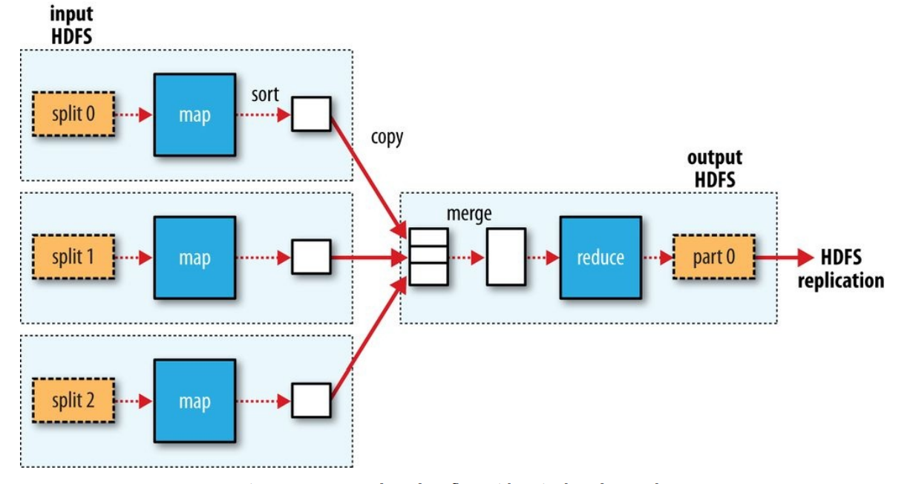
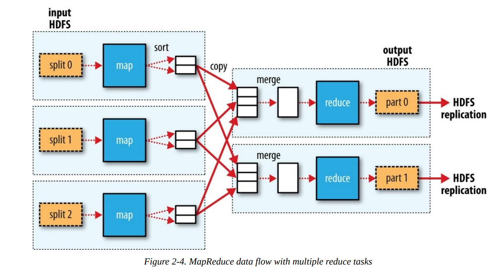

# MapReduce

Run Java MapReduce ,we need three things \`一个MapReduce任务需要三个部分`

- a map function:`repersented by the mapper class ,which declares an abstract map() method`
- a reduce function
- some code to run the job

`Mapper for the maximum temperature example`

```java
// page 46
import java.io.IOException;
import org.apache.hadoop.io.IntWritable;
import org.apache.hadoop.io.LongWritable;
import org.apache.hadoop.io.Text;
import org.apache.hadoop.mapreduce.Mapper;
public class MaxTemperatureMapper
    extends Mapper<LongWritable, Text, Text, IntWritable> {
  private static final int MISSING = 9999;
  @Override
  public void map(LongWritable key, Text value, Context context)
    throws IOException, InterruptedException {
    String line = value.toString();
    String year = line.substring(15, 19);
    int airTemperature;
    if (line.charAt(87) == '+') { // parseInt doesn't like leading plus signs
    airTemperature = Integer.parseInt(line.substring(88, 92));
    } else {
    airTemperature = Integer.parseInt(line.substring(87, 92));
    }
    String quality = line.substring(92, 93);
    if (airTemperature != MISSING && quality.matches("[01459]")) {
    context.write(new Text(year), new IntWritable(airTemperature));
  }
 }
}

```

- The  mapper class is a generic type,with four formal type parameters that specify the `input key`,`input value`,`output key`,and `output value type` of the map function;
- Mapper类,四个参数

- Rather than using built-in Java types , Hadoop provides its own set of basic types that are optimized for network serialization.
- Hadoop 提供了一套面向`网络序列化?`优化的数据类型
  - These are found in the org.apache.hadoop.io package.
  - LongWritable => Java Long
  - Text => Java String
  - IntWritable =>Java Integer
  - `etc`

`Reducer for the maximum temperature example`

```java
import java.io.IOException;
import org.apache.hadoop.io.IntWritable;
import org.apache.hadoop.io.Text;
import org.apache.hadoop.mapreduce.Reducer;
public class MaxTemperatureReducer
extends Reducer<Text, IntWritable, Text, IntWritable> {
@Override
public void reduce(Text key, Iterable<IntWritable> values, Context context)
throws IOException, InterruptedException {
int maxValue = Integer.MIN_VALUE;
for (IntWritable value : values) {
maxValue = Math.max(maxValue, value.get());
}
context.write(key, new IntWritable(maxValue));
}
}
```

- Again, four formal type parameters are used to specify the input and output types,this time for the reduce function.
- `The input types of the redcue function must match the output types of the map function`

`Application to find the maximum temperature in the weather dataset`

```java
import org.apache.hadoop.fs.Path;
import org.apache.hadoop.io.IntWritable;
import org.apache.hadoop.io.Text;
import org.apache.hadoop.mapreduce.Job;
import org.apache.hadoop.mapreduce.lib.input.FileInputFormat;
import org.apache.hadoop.mapreduce.lib.output.FileOutputFormat;
public class MaxTemperature {
public static void main(String[] args) throws Exception {
if (args.length != 2) {
System.err.println("Usage: MaxTemperature <input path> <output path>");
System.exit(-1);
}
Job job = new Job();
//A job object forms the specification of the job and gice you control over how the job is run
job.setJarByClass(MaxTemperature.class);
//When we run this job on a Hadoop clouster,we will package the code into a JAE file.
//Rather than explicitly specifying the name of the JAE file ,we can pass a class in the Job's set JarByClass() method,which Hadoop will use to locate the relevant JAR fils by looking for the JAE file containing thie class.
job.setJobName("Max temperature");
FileInputFormat.addInputPath(job, new Path(args[0]));
//the path can be a single file , a directory or a file pattern
//addInputPath() can be called more than once to use input from multiple paths
// addInputPath() 可以多次调用,添加多个输入路径
FileOutputFormat.setOutputPath(job, new Path(args[1]));
//The directory shouldn't exist before running the job because Hadoop will complain and not run the job
//The precaution is to prevent data loss => id can be annoying to accidentally overwrite the output of a long job with that of another
job.setMapperClass(MaxTemperatureMapper.class);
job.setReducerClass(MaxTemperatureReducer.class);
//specify the map and redcuce types to use via the SetMapperClass() and setReducerClass() methods
job.setOutputKeyClass(Text.class);
job.setOutputValueClass(IntWritable.class);
//These two class control the output types for the reduce function ,and must match what the Redcue class produces.
//The map output types default to the same types,so they do not need to be set if the mapper produces same types as the reducer.
//However,if they are different, the map output types must be set using the SetMapOutputKeyClass() and setMapOutputValueClass() methods.
System.exit(job.waitForCompletion(true) ? 0 : 1);
//The waitForCompletion() method on Job submits the job and waits for it to finish.
//The single argument to the method is a flag indicating whether verbose output is generated.
// True => the job writes information about its progress to the console
//The return value of the waitForCompletion() method is a Boolean indication success(true) or failure(false)
}
}
```

- A test run
```bash
% export HADOOP_CLASSPATH=hadoop-examples.jar
% hadoop MaxTemperature input/ncdc/sample.txt output
```

```bash
14/09/16 09:48:39 WARN util.NativeCodeLoader: Unable to load native-hadoop
library for your platform… using builtin-java classes where applicable
14/09/16 09:48:40 WARN mapreduce.JobSubmitter: Hadoop command-line option
parsing not performed. Implement the Tool interface and execute your application
with ToolRunner to remedy this.
14/09/16 09:48:40 INFO input.FileInputFormat: Total input paths to process : 1
14/09/16 09:48:40 INFO mapreduce.JobSubmitter: number of splits:1
14/09/16 09:48:40 INFO mapreduce.JobSubmitter: Submitting tokens for job:
job_local26392882_0001
14/09/16 09:48:40 INFO mapreduce.Job: The url to track the job:
http://localhost:8080/
14/09/16 09:48:40 INFO mapreduce.Job: Running job: job_local26392882_0001
14/09/16 09:48:40 INFO mapred.LocalJobRunner: OutputCommitter set in config null
14/09/16 09:48:40 INFO mapred.LocalJobRunner: OutputCommitter is
org.apache.hadoop.mapreduce.lib.output.FileOutputCommitter
14/09/16 09:48:40 INFO mapred.LocalJobRunner: Waiting for map tasks
14/09/16 09:48:40 INFO mapred.LocalJobRunner: Starting task:
attempt_local26392882_0001_m_000000_0
14/09/16 09:48:40 INFO mapred.Task: Using ResourceCalculatorProcessTree : null
14/09/16 09:48:40 INFO mapred.LocalJobRunner:
14/09/16 09:48:40 INFO mapred.Task: Task:attempt_local26392882_0001_m_000000_0
is done. And is in the process of committing
14/09/16 09:48:40 INFO mapred.LocalJobRunner: map
14/09/16 09:48:40 INFO mapred.Task: Task 'attempt_local26392882_0001_m_000000_0'
done.
14/09/16 09:48:40 INFO mapred.LocalJobRunner: Finishing task:
attempt_local26392882_0001_m_000000_0
14/09/16 09:48:40 INFO mapred.LocalJobRunner: map task executor complete.
14/09/16 09:48:40 INFO mapred.LocalJobRunner: Waiting for reduce tasks
14/09/16 09:48:40 INFO mapred.LocalJobRunner: Starting task:
attempt_local26392882_0001_r_000000_0
14/09/16 09:48:40 INFO mapred.Task: Using ResourceCalculatorProcessTree : null
14/09/16 09:48:40 INFO mapred.LocalJobRunner: 1 / 1 copied.
14/09/16 09:48:40 INFO mapred.Merger: Merging 1 sorted segments
14/09/16 09:48:40 INFO mapred.Merger: Down to the last merge-pass, with 1
segments left of total size: 50 bytes
14/09/16 09:48:40 INFO mapred.Merger: Merging 1 sorted segments
14/09/16 09:48:40 INFO mapred.Merger: Down to the last merge-pass, with 1
segments left of total size: 50 bytes
14/09/16 09:48:40 INFO mapred.LocalJobRunner: 1 / 1 copied.
14/09/16 09:48:40 INFO mapred.Task: Task:attempt_local26392882_0001_r_000000_0
is done. And is in the process of committing
14/09/16 09:48:40 INFO mapred.LocalJobRunner: 1 / 1 copied.
14/09/16 09:48:40 INFO mapred.Task: Task attempt_local26392882_0001_r_000000_0
is allowed to commit now
14/09/16 09:48:40 INFO output.FileOutputCommitter: Saved output of task
'attempt…local26392882_0001_r_000000_0' to file:/Users/tom/book-workspace/
hadoop-book/output/_temporary/0/task_local26392882_0001_r_000000
14/09/16 09:48:40 INFO mapred.LocalJobRunner: reduce > reduce
14/09/16 09:48:40 INFO mapred.Task: Task 'attempt_local26392882_0001_r_000000_0'
www.it-ebooks.info
done.
14/09/16 09:48:40 INFO mapred.LocalJobRunner: Finishing task:
attempt_local26392882_0001_r_000000_0
14/09/16 09:48:40 INFO mapred.LocalJobRunner: reduce task executor complete.
14/09/16 09:48:41 INFO mapreduce.Job: Job job_local26392882_0001 running in uber
mode : false
14/09/16 09:48:41 INFO mapreduce.Job: map 100% reduce 100%
14/09/16 09:48:41 INFO mapreduce.Job: Job job_local26392882_0001 completed
successfully
14/09/16 09:48:41 INFO mapreduce.Job: Counters: 30
File System Counters
FILE: Number of bytes read=377168
FILE: Number of bytes written=828464
FILE: Number of read operations=0
FILE: Number of large read operations=0
FILE: Number of write operations=0
Map-Reduce Framework
Map input records=5
Map output records=5
Map output bytes=45
Map output materialized bytes=61
Input split bytes=129
Combine input records=0
Combine output records=0
Reduce input groups=2
Reduce shuffle bytes=61
Reduce input records=5
Reduce output records=2
Spilled Records=10
Shuffled Maps =1
Failed Shuffles=0
Merged Map outputs=1
GC time elapsed (ms)=39
Total committed heap usage (bytes)=226754560
File Input Format Counters
Bytes Read=529
File Output Format Counters
Bytes Written=29
```

When the hadoop command is invoked with a `classname as the first argument`,it lunches a `Java virtual machine(JVM)` to run the class.The hadoop command adds the Hadoop libraries(and their dependencies) to the classpath and picks up the Hadoop configuration,too.\
`Hadoop命令通过:将类名作为第一个参数,启动一个JVM执行这个class. Hadoop命令会添加Hadoop的库与依赖,读取Hadoop的参数`

To add the application classes to the classpath,we've defined an environment variable called HADOOP_CLASSPATH,which the hadoop script picks up.\
`我们需要设置一个名为HADOOP_CLASSPATH的环境变量,提供给Hadoop`

- The output form running the job provides some useful information.
  - job ID: `job_local26392882_0001`
  - Map task ID:`attempt_local26392882_0001_m_000000_0`
  - Reduce task ID:`attempt_local26392882_0001_r_000000_0`
- The last section of the output,titled"Counters",shows the statistics that Hadoop geneerates for each job it runs.`They are very useful for checking whether the amount of data processed is what you expected`
- The output was written to the output directory,which contains one output file per reducer.The job had a single reducer,so we find a single file,named `part-r-00000`

- Scaling Out
- 横向扩充
  - Data Flow \ `数据流`
    - MapReduce job =>input data + MapReduce program + configuration information.
    - `一个MapReduce任务: 输入数据 + MapReduce程序 + 配置信息`
    - Hadoop runs the job by divding it into tasks:map tasks and reduce tasks.
    - `Hadoop把任务成为:Map和Reduce两部分`
    - The tasks are using YARN and run on nodes in the cluster.If a task fails,it will be automatically rescheduled to run on a different noed.
    - `Yarn负责分配资源,如看过某个工作失败了,会启动在其他节点执行`
  - Data FLow details
    - `Hadoop divides the input to a MapReduce job into fixed-size pieces called input splits,or just splits.`
    - `1.Hadoop把输入分为多个splits`
    - `Hadoop creates one map task for each split,which runs the user-defined map function for each record in the split`
    - `2.每个splits对应一个map工作`
      - Hadoop trying to make the processing is better load balanced when the splits are small,since a faster machine will be able to process,proportionally more splits over the course of the job than a slower machine.
      - `会有可能有的map完成的快,有的慢`
      - For most jobs,a good split size tends to be the size of an HDFS block,which is 128MB by default.
      - `对于大多数任务,split大小和HDFS块大小一样`
  - Hadoop does its best to run the map task on a node where the input data resides in HDFS,because it doesn't use valuable cluster bandwidth.=>`data locality optimization`
    - than in the same rack
    - 存储数据的节点如果在忙,就找同一机架上的节点
    - than an off-rack node
    - 最末选择,使用不同机架的节点
    - That's why the optimal split size is the same as the block size:`it is the largest size of input that can be guaranteed to be stored on a single node.`If the split spanned tow blocks,it would be unlikely that any HDFS node stored both blocks,so some of the split would have to be transferred across the network to be the node running the map task.
  - `Map tasks writes their output to the local disk,not to HDFS.Why is this?`
  - 为何Map tasks的输出存放在本地磁盘而不是HDFS上?
    - Map output is intermediate output:it's processed by reduce tasks to produce the final output,and once the job is complete,the map output can be thrown away.
    - `Map task输出是个临时输出`
    - If the node running the map task fails before the map output has been consumed by the reduce task, then Hadoop will automatically rerun the map task on another node to re-create the map output.
    - `如果任务失败了,hadoop是会自动在别的地方重启任务的`
  - Reduce tasks don't have the advantage of `data locality`;the input to a single redcue task is normally the output from all mappers.
    - the sorted map outputs have to be transferred across the network to the node where the reduce task is running, where they are `merged` and then `passed`to the user-defined reduce function. The `output of the reduce is normally stored in HDFS for reliability`

  

  - The number of reduce tasks is not governed by the size of the input,but instead is `specified independently`
  - Reduce task 的数量不是由输入数据量决定,而是`指定的`
    - In The Default MapReduce Job,you will see how to choose the number of redcue tasks for a given job.
  - When there are multiple reducers, the map tasks partition their output, each creating one partition for each reduce task. There can be many keys (and their associated values) in each partition, but the records for any given key are all in a single partition. The partitioning can be controlled by a user-defined partitioning function, but normally `the default partitioner — which buckets keys using a hash function — works very well`
  - `存在多个reducers的时候,map 把他的输出分配个每个reducer,每个输出部分包含很多键值对,但是某个特定的键其来自任何map task的数据一定会分配个同一个reducer的`
  - data flow between map and reduce tasks is colloquially known as “the shuffle,” as each reduce task is fed by many map tasks
  - map 和reduce 之间的数据流被称作 shuffle `洗牌`

  

  - Finally, it’s also possible to `have zero reduce tasks`. This can be appropriate when you don’t need the shuffle because the processing can be carried out entirely in parallel (a few examples are discussed in NLineInputFormat). In this case, the only off-node data transfer is when the map tasks write to HDFS

## Combiner Functions

`组合程序=>为了减少带宽使用,在可以的情况下,可以先对Map的结果做一次小范围Reduce(单个Map结果集内),然后再做真正的Reduce`

Many MapReduce jobs are limited by the bandwidth available on the cluster, so it pays to minimize the data transferred between map and reduce tasks. Hadoop allows the user to specify a combiner function to be run on the map output, and the combiner function’s output forms the input to the reduce function. Because the combiner function is an optimization, Hadoop does not provide a guarantee of how many times it will call it for a particular map output record, if at all. In other words, calling the combiner function zero, one, or many times should produce the same output from the reducer.\
`由于带宽限制,希望能减少map与reduce之间的数据传说,所以在map最后先执行一次reduce功能,但是combiner function 是否执行,执行次数,都是hadoop决定的,不过这些都不影响最终输出`

The contract for the combiner function constrains the type of function that may be used. This is best illustrated with an example. Suppose that for the maximum temperature example, readings for the year 1950 were processed by two maps (because they were in different splits). \
Imagine the first map produced the output:

```txt
(1950, 0)
(1950, 20)
(1950, 10)
```

and the second produced:

```bash
(1950, 25)
(1950, 15)
```

The reduce function would be called with a list of all the values:

```txt
(1950, [0, 20, 10, 25, 15])
```

with output:

```txt
(1950, 25)
```

since 25 is the maximum value in the list. We could use a combiner function that, just like the reduce function, finds the maximum temperature for each map output. The reduce function would then be called with:

```txt
(1950, [20, 25])
```

and would produce the same output as before. More succinctly, we may express the
function calls on the temperature values in this case as follows:

```txt
max(0, 20, 10, 25, 15) = max(max(0, 20, 10), max(25, 15)) = max(20, 25) = 25
```

Not all functions possess this property.\
For example, if we were calculating mean temperatures, we couldn’t use the mean as our combiner function, because:

```txt
mean(0, 20, 10, 25, 15) = 14
```

but:

```
mean(mean(0, 20, 10), mean(25, 15)) = mean(10, 20) = 15
```

`The combiner function doesn’t replace the reduce function`. (How could it? The reduce
function is still needed to process records with the same key from different maps.) `But it can help cut down the amount of data shuffled between the mappers and the reducers`, and for this reason alone it is always worth considering whether you can use a combiner function in your MapReduce job.

### Specifying a combiner function

```java
public class MaxTemperatureWithCombiner {
  public static void main(String[] args) throws Exception {
    if (args.length != 2) {
      System.err.println("Usage: MaxTemperatureWithCombiner <input path> " + "<output path>");
      System.exit(-1);
    }
    Job job = new Job();
    job.setJarByClass(MaxTemperatureWithCombiner.class);
    job.setJobName("Max temperature");
    FileInputFormat.addInputPath(job, new Path(args[0]));
    FileOutputFormat.setOutputPath(job, new Path(args[1]));
    job.setMapperClass(MaxTemperatureMapper.class);
    job.setCombinerClass(MaxTemperatureReducer.class);
    //这个例子中,CombinerClass 和 Reducer是一样的,直接复用就可以了
    job.setReducerClass(MaxTemperatureReducer.class);
    job.setOutputKeyClass(Text.class);
    job.setOutputValueClass(IntWritable.class);
    System.exit(job.waitForCompletion(true) ? 0 : 1);
  }
}

```

## Hadoop Streaming PAGE 59

Hadoop provides an API to MapReduce that allows you to write your map and reduce functions in languages other than Java. Hadoop Streaming uses `Unix standard streams` as the interface between Hadoop and your program, so you can use any language that can read standard input and write to standard output to write your MapReduce program

`本身这里讲了很多流处理的内容,不过是用Ruby写的,大概理解思路,不过没具体看代码`

The hadoop command doesn’t support a Streaming option; instead, you specify the Streaming JAR file along with the jar option. Options to the Streaming program specify the input and output paths and the map and reduce scripts. This is what it looks like:

```bash
% hadoop jar $HADOOP_HOME/share/hadoop/tools/lib/hadoop-streaming-*.jar \
-input input/ncdc/sample.txt \
-output output \
-mapper ch02-mr-intro/src/main/ruby/max_temperature_map.rb \
-reducer ch02-mr-intro/src/main/ruby/max_temperature_reduce.rb
```
