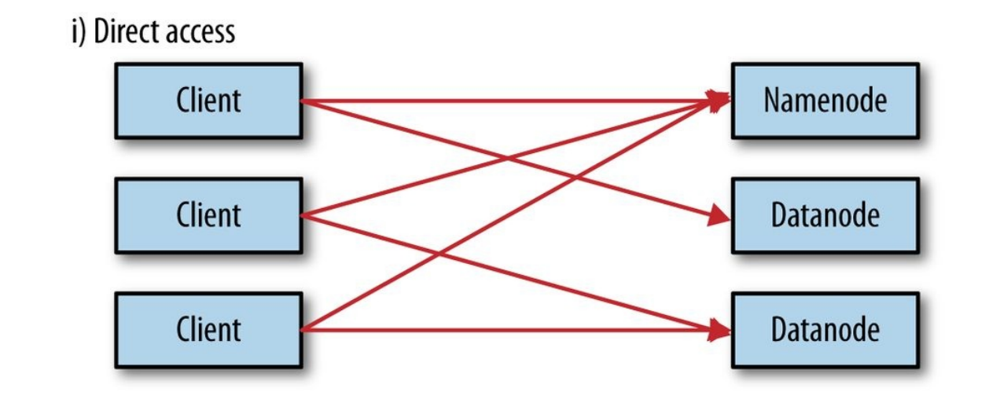
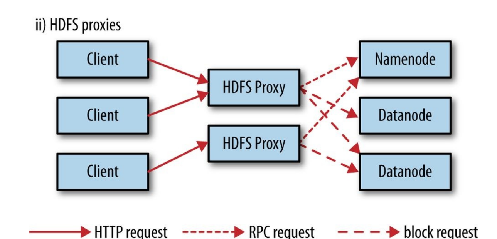

# The hadoop Distributed Filesystem

## The Design of HDFS

- `HDFS is a filesystem designed for storing very large files with streaming data access patterns, running on clusters of commodity hardware.`
- `hdfs=》 设计用于存储超大文件，以集群运行，提供数据流的接口`

  - Very large files:petabytes of data
  - Streaming data access:HDFS is built around the idea that the most efficient data processing pattern[模式] is a `write once, read-many-times pattern`. A dataset is typically generated or copied from source, and then various analyses are performed on that dataset over time. Each analysis will involve a large proportion[比例], if not all, of the dataset, so the time to read the whole dataset is more important than the latency[潜在因素] in reading the first record.`数据特性：一次写入，多次读取=》 根据这个特点，读取数据用时更要被注意`
  - Commodity hardware:Hadoop doesn’t require expensive, highly reliable hardware `hadoop使用的设备更普通一些`
- These are areas where HDFS is not a good fit today:
  - `Low-latency data access`
  - `Lots of small files`:As a rule of thumb, `each file, directory, and block takes about 150 bytes`. So, for example, if you had one million files, each taking one block, you would need at least 300 MB of memory.
  - `Multiple writers, arbitrary file modifications`:Files in HDFS may be written to by a single writer. Writes are always made at the end of the file, in append-only fashion. `There is no support for multiple writers or for modifications at arbitrary offsets in the file`. (These might be supported in the future, but they are likely to be `relatively inefficient`.)
- HDFS不擅长的领域
  - 低延迟
  - 众多小文件
  - 多权限[文件读写]

### HDFS Comcepts/HDFS 中的一些概念

- Blocks/块\
  A disk has a block size, which is the minimum amount of data that it can read or write.Filesystem blocks are typically a few kilobytes in size, whereas disk blocks are normally 512 bytes.`HDFS, too, has the concept of a block, but it is a much larger unit — 128 MB by default.`Like in a filesystem for a single disk, files in HDFS are broken into block-sized chunks, which are stored as independent units.\
  `hdfs中块的概念，默认128MB`
  - a file can be larger than any single disk in the network.
  - making the unit of abstraction a block rather than a file simplifies the storage subsystem
  - 为什么用块这个概念，而不是简单的存储
    - `simplifying storage management`:because blocks are a fixed size, it is easy to calculate how many can be stored on a given disk
    - 因为块大小固定，可以简单的计算从磁盘能放多少块
    - `eliminating metadata concerns`:because blocks are just chunks of data to be stored, file metadata such as permissions information does not need to be stored with the blocks, so another system can handle metadata separately
    - `消除元数据问题，hadoop不用管这些权限，其他系统各自组织自己的权限`
    - `blocks fit well with replication for providing fault tolerance and availability`
    - `提高容错力`

Like its disk filesystem cousin, HDFS’s fsck command understands blocks. For example,
running:

`！！！ 查看 某个文件由哪些 块组成的 ！！！`

```bash
% hdfs fsck / -files -blocks
```

will list the blocks that make up each file in the filesystem.

- NameNodes and Datanodes \ 名称节点 数据节点

An HDFS cluster has two types of nodes operating in a master−worker pattern: `a namenode (the master) and a number of datanodes (workers)`

- `Namenode:`\
 The namenode `manages the filesystem namespace`. It maintains the `filesystem tree` and the `metadata` for all the files and directories in the tree. This information is `stored persistently` on the local disk in the form of two files: `the namespace image and the edit log`. The namenode also knows the datanodes on which all the blocks for a given file are located; however, it does not store block locations persistently, because this information is `reconstructed from datanodes when the system starts`.\
 `NN管理文件系统命名空间=》文件树+metadata =》这部分信息被存在本地磁盘上： namespace image + edit log。 NN同时知道  某个文件的某个块  在某个节点上。但是它 不 固定 记录块的具体位置，因为这部分信息会在系统启动的时候重新架构`
- `Datanodes:`\
 Datanodes are the workhorses of the filesystem. They store and retrieve blocks when they are told to (by clients or the namenode), and they report back to the namenode periodically with lists of blocks that they are storing.\
 `DN是文件系统的工作节点，存储，检索 块，周期性报告自己的块存储情况`
- Hadoop provides two mechanisms for back up namenode/`两种处理namenode节点失败的方式`
  - The first way is to back up the files that make up the persistent state of the filesystem metadata.Hadoop can be configured so that the namenode writes its persistent state to multiple filesystems. These writes are synchronous and atomic. The usual configuration choice is to write to local disk as well as a remote NFS mount.
  - It is also possible to run a secondary namenode, which despite its name `does not act as a namenode`. Its main role is to `periodically merge the namespace image with the edit log to prevent the edit log from becoming too large`. The secondary namenode usually runs on a separate physical machine because it requires plenty of CPU and as much memory as the namenode to perform the merge. It `keeps a copy of the merged namespace image`, which can be used in the event of the namenode failing. However, the state of the secondary namenode `lags` that of the primary, so in the event of total failure of the primary, data loss is almost certain. `The usual course of action in this case is to copy the namenode’s metadata files that are on NFS to the secondary and run it as the new primary`. (Note that it is possible to run a hot standby namenode instead of a secondary, as discussed in `HDFS High Availability`.) See The filesystem image and edit log for more details.
- `Block Caching`\
  `把经常被访问的块放入内存`\
  Normally a datanode reads blocks from disk, but for frequently accessed files the blocks may be explicitly cached in the datanode’s memory, `in an off-heap block cache`. By default, a block is cached in only one datanode’s memory, although the number is configurable on a per-file basis. `Job schedulers (for MapReduce, Spark, and other frameworks) can take advantage of cached blocks by running tasks on the datanode where a block is cached`, for increased read performance. A small `lookup table` used in a join is a good candidate for caching, for example. Users or applications instruct the namenode which files to cache (and for how long) by `adding a cache directive to a cache pool`. Cache pools are an administrative grouping for managing cache permissions and resource usage.
- `HDFS Federation`/HDFS 联邦?/多个NameNode分担内存压力\
  - The namenode keeps a reference to every file and block in the filesystem in memory, which means that on very large clusters with many files, memory becomes the limiting factor for scaling (see How Much Memory Does a Namenode Need?). HDFS federation, introduced in the 2.x release series, allows a cluster to scale by adding namenodes, each of which manages a portion of the filesystem namespace. For example, one namenode might manage all the files rooted under /user, say, and a second namenode might handle files under /share.
  - each namenode manages a namespace volume, which is made up of the metadata for the namespace, and a block pool containing all the blocks for the files in the namespace.
  - Namespace volumes are independent of each other, which means namenodes do not communicate with one another, and furthermore the failure of one namenode does not affect the availability of the namespaces managed by other namenodes.
  - Block pool storage is not partitioned, however, so datanodes register with each namenode in the cluster and store blocks from multiple block pools.
  - To access a federated HDFS cluster, clients use client-side mount tables to map file paths to namenodes. This is managed in configuration using ViewFileSystem and the viewfs:// URIs.
- `HDFS High Availability`/`高可用`

```txt
To recover from a failed namenode in this situation, an administrator starts a new primary namenode with one of the filesystem metadata replicas and configures datanodes and clients to use this new namenode. The new namenode is not able to serve requests until it has
(i) loaded its namespace image into memory
(ii) replayed its edit log
(iii) received enough block reports from the datanodes to leave safe mode.
On large clusters with many files and blocks, the time it takes for a namenode to start from cold can be 30 minutes or more.
```

- `Hadoop 2 remedied this situation by adding support for HDFS high availability (HA)`. \
  `Hadoop 2种引入了 HA(HDFS)`
- In this implementation, there are a pair of namenodes in an `active-standby configuration`. In the event of the failure of the active namenode, the standby takes over its duties to continue servicing client requests `without a significant interruption`.
- A few architectural[建筑学上的] changes are needed to allow this to happen:
  - `The namenodes must use highly available shared storage to share the edit log`. When a standby namenode comes up, it reads up to the end of the shared edit log to synchronize its state with the active namenode, and then continues to read new entries as they are written by the active namenode.
  - `Datanodes must send block reports to both namenodes` because the block mappings are stored in a namenode’s memory, and not on disk.
  - `Clients must be configured to handle namenode failover`, using a mechanism that is transparent to users. The secondary namenode’s role is subsumed by the standby, which takes periodic checkpoints of the active namenode’s namespace.
  - There are two choices for the highly available shared storage: `an NFS filer`, or a `quorum journal manager (QJM)`.
    - `The QJM is a dedicated HDFS implementation`, designed for the sole purpose of providing a highly available edit log, and is the recommended choice for most HDFS installations.
    - `The QJM runs as a group of journal nodes`, and each edit must be written to a majority of the journal nodes. Typically, there are three journal nodes, so the system can tolerate the loss of one of them. `This arrangement is similar to the way ZooKeeper works`, although it is important to realize that the `QJM implementation does not use ZooKeeper`. (Note, however, that HDFS HA does `use ZooKeeper for electing the active namenode`, as explained in the next section.) If the active namenode fails, the standby can take over very quickly (in a few tens of seconds) because it has the latest state available in memory: `both the latest edit log entries and an up-to-date block mapping.` The actual observed failover time will be longer in practice (around a minute or so), because the system needs to be conservative in deciding that the active namenode has failed. In the unlikely event of the standby being down when the active fails, the administrator can still start the standby from cold. This is no worse than the non-HA case, and from an operational point of view it’s an improvement, because the process is a standard operational procedure built into Hadoop.
- `Failover and fencing`\
  The transition from the active namenode to the standby is managed by a new entity in the system called the `failover controller`. There are various failover controllers, but the default implementation uses ZooKeeper to ensure that only one namenode is active. Each namenode runs a lightweight failover controller process whose job it is to monitor its namenode for failures (using a simple heartbeating mechanism) and trigger a failover should a namenode fail./`在这里讨论了许多内容,如脑裂现象之类的/PGAE 70/此处没做详细记录`

### The Command-Line Interface PAGE 70

%	hadoop	fs	-copyFromLocal	input/docs/quangle.txt	\
		hdfs://localhost/user/tom/quangle.txt

可以省略 路径 使用 默认值

%	hadoop	fs	-copyFromLocal	input/docs/quangle.txt	/user/tom/quangle.txt

ghth	column	is	the	name	of	the	file	or	directory.

```note
       FILE	PERMISSIONS	IN	HDFS \ HDFS 中的文件权限
HDFS	has	a	permissions	model	for	files	and	directories	that	is	much	like	the	POSIX	model.	There	are	three	types	of
permission:	the	read	permission	( r ),	the	write	permission	( w ),	and	the	execute	permission	( x ).	The	read	permission	is
required	to	read	files	or	list	the	contents	of	a	directory.	The	write	permission	is	required	to	write	a	file	or,	for	a
directory,	to	create	or	delete	files	or	directories	in	it.	The	execute	permission	is	ignored	for	a	file	because	you	can’t
execute	a	file	on	HDFS	(unlike	POSIX),	and	for	a	directory	this	permission	is	required	to	access	its	children.
Each	file	and	directory	has	an	owner,	a	group,	and	a	mode.	The	mode	is	made	up	of	the	permissions	for	the	user	who
is	the	owner,	the	permissions	for	the	users	who	are	members	of	the	group,	and	the	permissions	for	users	who	are
neither	the	owners	nor	members	of	the	group.

hdfs中的权限模型跟posix差不多。 三种权限 读 r 写 x 执行 x。

By	default,	Hadoop	runs	with	security	disabled,	which	means	that	a	client’s	identity	is	not	authenticated.	Because
clients	are	remote,	it	is	possible	for	a	client	to	become	an	arbitrary	user	simply	by	creating	an	account	of	that	name	on
the	remote	system.	This	is	not	possible	if	security	is	turned	on;	see	Security.	Either	way,	it	is	worthwhile	having
permissions	enabled	(as	they	are	by	default;	see	the	 dfs.permissions.enabled 	property)	to	avoid	accidental
modification	or	deletion	of	substantial	parts	of	the	filesystem,	either	by	users	or	by	automated	tools	or	programs.
When	permissions	checking	is	enabled,	the	owner	permissions	are	checked	if	the	client’s	username	matches	the
owner,	and	the	group	permissions	are	checked	if	the	client	is	a	member	of	the	group;	otherwise,	the	other	permissions
are	checked.

默认情况是不启用安全检测的。 因为客户端不在本地，所以用户只要随意在本地创建一个用户就获得了相应的权限。     如果安全模式开启，就不能这样了。无论怎样，最好开启权限防止出现权限问题。 当权限检测开启，会检测 开启客户端的用户名 是否 和 文件拥有着一样。 

There	is	a	concept	of	a	superuser,	which	is	the	identity	of	the	namenode	process.	Permissions	checks	are	not
performed	for	the	superuser.

这里还有一个 超级用户 概念， NAMENODE 拥有超级用户权限
```

### Hadoop Filesystems PAGE 73

`hadoop有一个抽象的文件系统概念,HDFS只是其中的一个实现`

Hadoop has an abstract notion of filesystems, of which HDFS is just one implementation.
The Java abstract class org.apache.hadoop.fs.FileSystem represents the client interface
to a filesystem in Hadoop, and there are several concrete implementations.\
`Hadoop的java类 org.apache.hadoop.fs.FileSystem 代表一种访问hadoop的方式`

The main ones that ship with Hadoop are described in Table blow.\
`主要的与hadoop交互的方法如下:`

| Filesystem | URI scheme | Java implementation (all under org.apache.hadoop) | Description
|-|-|-|-
|Local |file |fs.LocalFileSystem |A filesystem for a locally connected disk with client-side checksums. UseRawLocalFileSystem for a localfilesystem with no checksums. SeeLocalFileSystem.`通过hadoop链接本地文件系统`
|HDFS |hdfs |hdfs.DistributedFileSystem |Hadoop’s distributed filesystem. HDFS is designed to work efficiently in conjunction with MapReduce.`Hadoop亲生的分布式文件系统`
|WebHDFS |webhdfs |hdfs.web.WebHdfsFileSystem |A filesystem providing authenticated read/write access to HDFS over HTTP. See HTTP.`通过HTTP访问HDFS`
|Secure WebHDFS |swebhdfs |hdfs.web.SWebHdfsFileSystem |The HTTPS version of WebHDFS.
|HAR |har |fs.HarFileSystem |A filesystem layered on another filesystem for archiving files. Hadoop Archives are used for packing lots of files in HDFS into a single archive file to reduce the namenode’s memory usage. Use the hadoop archive command to create HAR files.
|View |viewfs |viewfs.ViewFileSystem |A client-side mount table for other Hadoop filesystems. Commonly used to create mount points for federated namenodes (see HDFS Federation).
|FTP |ftp |fs.ftp.FTPFileSystem |A filesystem backed by an FTP server.
|S3 |s3a |fs.s3a.S3AFileSystem |A filesystem backed by Amazon S3. Replaces the older s3n (S3 native) implementation.
|Azure |wasb |fs.azure.NativeAzureFileSystem |A filesystem backed by Microsoft Azure.
|Swift |swift |fs.swift.snative.SwiftNativeFileSystem |A filesystem backed by OpenStack Swift.

- Interfaces\
 Hadoop is written in Java, so most Hadoop filesystem interactions are mediated throughthe Java API. The filesystem shell, for example, is a Java application that uses the JavaFileSystem class to provide filesystem operations. The other filesystem interfaces are discussed briefly in this section. These interfaces are most commonly used with HDFS,since the other filesystems in Hadoop typically have existing tools to access theunderlying filesystem (FTP clients for FTP, S3 tools for S3, etc.), but many of them willwork with any Hadoop filesystem.

- HTTP\
 By exposing its filesystem interface as a Java API, Hadoop makes it awkward for nonJava applications to access HDFS. `The HTTP REST API` exposed by the `WebHDFS protocol` makes it easier for other languages to interact with HDFS. Note that the HTTP interface is slower than the native Java client, so should be avoided for very large data transfers if possible.`
  - There are two ways of accessing HDFS over HTTP: directly, where the HDFS daemons serve HTTP requests to clients; and via a proxy (or proxies), which accesses HDFS on the client’s behalf using the usual DistributedFileSystem API. The two ways are illustrated in Figure 3-1`[page 75]`. Both use the WebHDFS protocol.
  - In the first case, the `embedded web servers in the namenode and datanodes act as WebHDFS endpoints`. (WebHDFS is enabled by default, since `dfs.webhdfs.enabled` is set to true.) File metadata operations are handled by the namenode, while file read (and write) operations are sent first to the namenode, which sends an HTTP redirect to the client indicating the datanode to stream file data from (or to).

  - The second way of accessing HDFS `over HTTP relies` on one or more standalone `proxy server`s. (The proxies are stateless, so they can run behind a standard load balancer.) All traffic to the cluster passes through the proxy, so the client never accesses the namenode or datanode directly. This allows for stricter firewall and bandwidth-limiting policies to be put in place. `It’s common to use a proxy for transfers between Hadoop clusters located in different data centers, or when accessing a Hadoop cluster running in the cloud from an external network.`
    - Direct access\
  
    - HDFS proxies\
  
  - The `HttpFS proxy` exposes the same HTTP (and HTTPS) interface as WebHDFS, so clients can access `both using webhdfs (or swebhdfs) URIs`. The HttpFS proxy is started independently of the namenode and datanode daemons, using the `httpfs.sh` script, and by default listens on a different port number `(14000)`.

- C / Hadoop提供 C 函数库 `libhdfs` page:76/简要介绍

- NFS \
  It is possible to mount HDFS on a local client’s filesystem using `Hadoop’s NFSv3 gateway`. You can then use `Unix utilities` (such as ls and cat) to interact with the filesystem, upload files, and in general use `POSIX libraries` to access the filesystem from any programming language. Appending to a file works, but random modifications of a file do not, since `HDFS can only write to the end of a file`. Consult the Hadoop documentation for how to configure and run the NFS gateway and connect to it from a client.
- FUSE \
  Filesystem in Userspace (FUSE) allows filesystems that are implemented in user space to be integrated as Unix filesystems. Hadoop’s Fuse-DFS contrib module allows HDFS (or any Hadoop filesystem) to be mounted as a standard local filesystem. Fuse-DFS is implemented in C using libhdfs as the interface to HDFS. At the time of writing, `the Hadoop NFS gateway is the more robust solution` to mounting HDFS,so should be preferred over Fuse-DFS.

## The Java Interface PAGE 77-86

insert into Employee (Id, Salary) values ('1', '100');
insert into Employee (Id, Salary) values ('2', '200');
insert into Employee (Id, Salary) values ('3', '300');