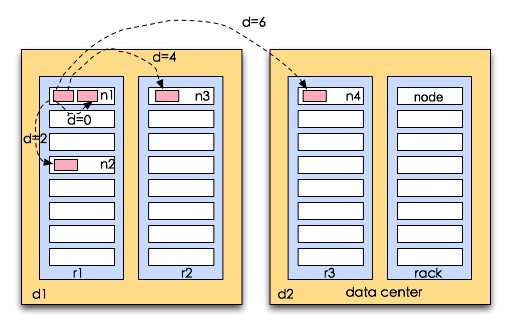
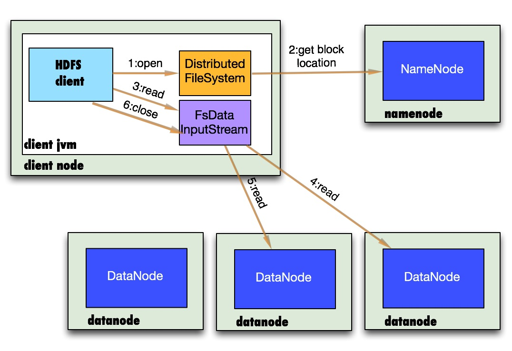
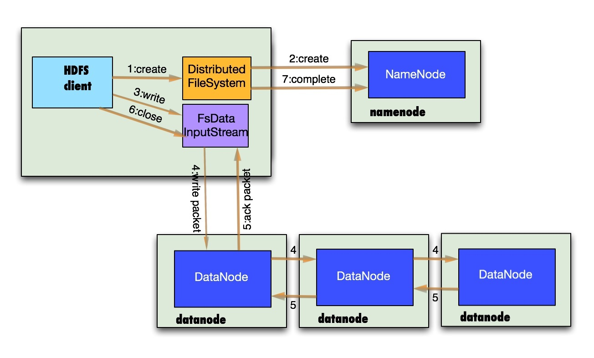

# HDFS 数据流

## 拓扑距离

计算两个节点间的间距，采用最近距离的节点进行操作，如果你对数据结构比较熟悉的话，可以看出这里是距离测量算法的一个实例。
如果用数据结构表示的话，这里可以表示为tree，两个节点的距离计算就是寻找公共祖先的计算。
在现实情况下比较典型的情景如下，
tree结构的节点由数据中心data center，这里表示为d1，d2，机架rack，这里表示为r1，r2，r3，还有服务器节点node，这里表示为n1，n2，n3，n4
1.distance(d1/r1/n1,d1/r1/n1)=0 （相同节点）
2.distance(d1/r1/n1,d1/r1/n2)=2 （相同机架不同节点）
3.distance(d1/r1/n1,d1/r2/n3)=4 （相同数据中心不同机架）
4.distance(d1/r1/n1,d2/r3/n4)=6 （不同数据中心）

## 副本存放

先来定义一下，namenode节点选择一个datanode节点去存储block副本得过程就叫做副本存放，这个过程的策略其实就是在可靠性和读写带宽间得权衡。那么我们来看两个极端现象：\
1.把所有的副本存放在同一个节点上，写带宽是保证了，但是这个可靠性是完全假的，一旦这个节点挂掉，数据就全没了，而且跨机架的读带宽也很低。\
2.所有副本打散在不同的节点上，可靠性提高了，但是带宽有成了问题。\
即使在同一个数据中心也有很多种副本存放方案，0.17.0版本中提供了一个相对较为均衡的方案，1.x之后副本存放方案已经是可选的了。\
我们来讲下hadoop默认的方案：\

- 1.把第一副本放在和客户端同一个节点上，如果客户端不在集群中，那么就会随即选一个节点存放。
- 2.第二个副本会在和第一个副本不同的机架上随机选一个
- 3.第三个副本会在第二个副本相同的机架上随机选一个不同的节点
- 4.剩余的副本就完全随机节点了。

如果重复因子是3的话，就会形成下图这样的网络拓扑：

可以看出这个方案比较合理：\
1.可靠性：block存储在两个机架上\
2.写带宽：写操作仅仅穿过一个网络交换机\
3.读操作：选择其中得一个机架去读\
4.block分布在整个集群上。

## 读文件解析

- 1.首先调用`FileSystem对象的open方法`，其实是一个DistributedFileSystem的实例
- 2.`DistributedFileSystem`通过`rpc`获得文件的第一批个block的locations，同一block按照重复数会返回多个locations，这些locations按照hadoop拓扑结构排序，`距离客户端近的排在前面`.
- 3.前两步会返回一个`FSDataInputStream`对象，该对象会被封装成DFSInputStream对象，DFSInputStream可以方便的管理datanode和namenode数据流。客户端调用read方法，DFSInputStream最会找出离客户端最近的datanode并连接（参考第一小节）。
- 4.数据从datanode源源不断的流向客户端。
- 5.如果第一块的数据读完了，就会关闭指向第一块的datanode连接，接着读取下一块。这些操作对客户端来说是透明的，客户端的角度看来只是读一个持续不断的流。
- 6.如果第一批block都读完了，`DFSInputStream就会去namenode拿下一批blocks的location`，然后继续读，如果所有的块都读完，这时就会关闭掉所有的流。

如果在读数据的时候，DFSInputStream和datanode的通讯发生异常，就会`尝试正在读的block的排第二近的datanode`,并且会记录哪个datanode发生错误，剩余的blocks读的时候就会直接`跳过该datanode`。DFSInputStream也会检查block数据校验和，如果发现一个坏的block,就会先报告到namenode节点，然后DFSInputStream在其他的datanode上读该block的镜像

该设计的方向就是客户端直接连接datanode来检索数据并且namenode来负责为每一个block提供最优的datanode，namenode仅仅处理block location的请求，这些信息都加载在namenode的内存中，hdfs通过datanode集群可以承受大量客户端的并发访问。

## 写文件解析

- 1.客户端通过调用`DistributedFileSystem的create`方法创建新文件
- 2.`DistributedFileSystem通过RPC调用namenode去创建一个没有blocks关联的新文件`，创建前，namenode会做各种校验，比如文件是否存在，客户端有无权限去创建等。如果校验通过，namenode就会记录下新文件，否则就会抛出IO异常.
- 3.前两步结束后会返回`FSDataOutputStream`的对象，象读文件的时候相似，FSDataOutputStream被封装成`DFSOutputStream.DFSOutputStream`可以协调namenode和datanode。客户端开始写数据到DFSOutputStream,DFSOutputStream会把数据`切成一个个小packet`，然后`排成队列data quene`。
- 4.DataStreamer会去处理接受data quene，他先`问询namenode这个新的block最适合存储的在哪几个datanode里`（参考第二小节），比如重复数是3，那么就找到3个最适合的datanode，把他们排成一个`pipeline`.DataStreamer`把packet按队列输出到管道的第一个datanode中，第一个datanode又把packet输出到第二个datanode中，以此类推。
- 5.DFSOutputStream还有一个对列叫`ack quene`，也是有packet组成，等待datanode的收到响应，当`pipeline中的所有datanode都表示已经收到`的时候，这时akc quene才会把对应的packet包移除掉.如果在写的过程中某个datanode发生错误，会采取以下几步：
  - 1)pipeline被关闭掉；
  - 2)为了防止防止丢包ack quene里的packet会同步到data quene里；
  - 3)把产生错误的datanode上当前在写但未完成的block删掉；
  - 4）block剩下的部分被写到剩下的两个正常的datanode中；
  - 5）namenode找到`另外的datanode`去创建这个块的复制。当然，这些操作对客户端来说是无感知的。
- 6.客户端完成写数据后调用close方法关闭写入流
- 7.DataStreamer把剩余得包都刷到pipeline里然后等待ack信息，收到最后一个ack后，通知datanode把文件标示为已完成。

另外要注意得一点，客户端执行write操作后，写完得block才是可见的，正在写的block对客户端是不可见的，只有调用sync方法，客户端才确保该文件被写操作已经全部完成，当客户端调用close方法时会默认调用sync方法。是否需要手动调用取决你根据程序需要在数据健壮性和吞吐率之间的权衡。