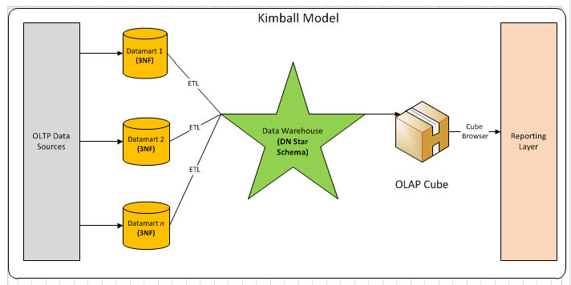
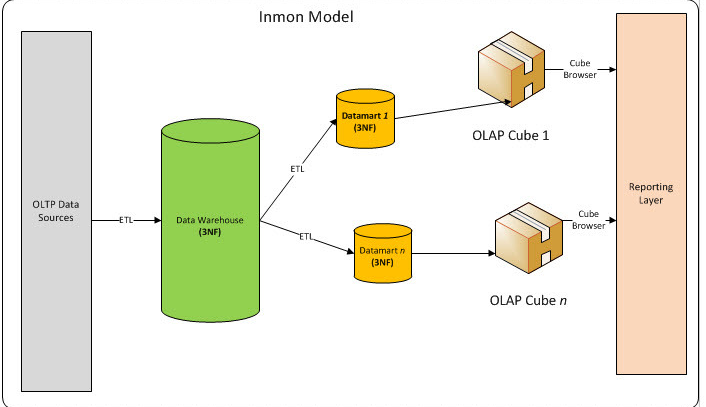

# Kimball & Inmon

## 概述

>毛主席曾经说：实践若不以革命理论为指南，就会变成盲目的实践。

Kimball和Inmon是两种主流的数据仓库方法论，分别由 Ralph Kimbal大神 和 Bill Inmon大神提出，在实际数据仓库建设中，业界往往会相互借鉴使用两种开发模式。本文将详细介绍 Kimball 和 Inmon 理论在实际数据仓库建设中的应用与对比,通过数据仓库理论武装数据仓库实践。

## 什么是Kimball

- 概念

Kimball 模式从流程上看是是自底向上的，即从数据集市到数据仓库再到数据源(先有数据集市再有数据仓库)的一种敏捷开发方法。对于Kimball模式，数据源往往是给定的若干个数据库表，数据较为稳定但是数据之间的关联关系比较复杂，需要从这些OLTP中产生的事务型数据结构抽取出分析型数据结构，再放入数据集市中方便下一步的BI与决策支持。

- 流程

通常，Kimball都是以最终任务为导向。首先，在得到数据后需要先做数据的探索，尝试将数据按照目标先拆分出不同的表需求。其次，在明确数据依赖后将各个任务再通过ETL由Stage层转化到DM层。这里DM层数据则由若干个事实表和维度表组成。接着，在完成DM层的事实表维度表拆分后，数据集市一方面可以直接向BI环节输出数据了，另一方面可以先DW层输出数据，方便后续的多维分析。

Kimball往往意味着快速交付、敏捷迭代，不会对数据仓库架构做过多复杂的设计，在变换莫测的互联网行业，这种架构方式逐渐成为一种主流范式。

## 什么是Inmon

- 概念

Inmon 模式从流程上看是自顶向下的，即从数据源到数据仓库再到数据集市的（先有数据仓库再有数据市场）一种瀑布流开发方法。对于Inmon模式，数据源往往是异构的，比如从自行定义的爬虫数据就是较为典型的一种，数据源是根据最终目标自行定制的。这里主要的数据处理工作集中在对异构数据的清洗，包括数据类型检验，数据值范围检验以及其他一些复杂规则。在这种场景下，数据无法从stage层直接输出到dm层，必须先通过ETL将数据的格式清洗后放入dw层，再从dw层选择需要的数据组合输出到dm层。在Inmon模式中，并不强调事实表和维度表的概念，因为数据源变化的可能性较大，需要更加强调数据的清洗工作，从中抽取实体-关系。

- 流程

通常，Inmon都是以数据源头为导向。首先，需要探索性地去获取尽量符合预期的数据，尝试将数据按照预期划分为不同的表需求。其次，明确数据的清洗规则后将各个任务通过ETL由Stage层转化到DW层，这里DW层通常涉及到较多的UDF开发，将数据抽象为实体-关系模型。接着，在完成DW的数据治理之后，可以将数据输出到数据集市中做基本的数据组合。最后，将数据集市中的数据输出到BI系统中去辅助具体业务。

- 特征对比

- 特性

|特性	|Kimball	|Inmon
|-|-|-
|数据摄取	|yes	|yes
|stage	|yes	|yes
|ETL	|yes	|yes
|数据集市	|yes	|yes
|商业需求	|yes	|yes
|数据时间属性	|yes	|yes
|数据仓库优先	|no	|yes
|事实维度拆分	|yes|	no
|关系表维护	|no	|yes
|处理导向	|yes	|no
|数据模型泛化	|no	|yes
|精心设计	|no	|yes
|缓慢变化维	|yes|	no
|连续变化维	|no	|yes
- 优劣比较

|特性	|Kimball|	Inmon
|-|-|-
|时间	|快速交付	|路漫漫其修远兮
|开发难度	|小	|大
|维护难度	|大	|小
|技能要求	|入门级	|专家级
|数据要求	|特定业务	|企业级

## 具体例子

相信一通理论之后可能还是能困惑，现在举一个具体的例子。

- 数据

股票交易为例：

（OLTP）原始数据包含了如下几张事务表：(真实场景字段设计更为复杂，此处已经简化)

- 交易记录表：记录用户下单情况

|交易记录ID	|用户ID	|交易ID	|交易单号	|标的CODE	|出价	|现价	|方向	|手数	|创建时间	|修改时间	|状态	|备注	|类型
|-|-|-|-|-|-|-|-|-|-|-|-|-|-
|1	|1	|1	|MR123456	|A123456	 |9.0	|9.5	|买	|100	|2016-10-10 10:58:00	|2016-10-10 10:58:00	|未成交	|NULL	|创业板
|2	|1	|1	|MR123456	|A123456	 |9.0	|8.9	|买	|200	|2016-10-10 11:00:00	|2016-10-10 11:00:10	|已成交	|NULL	|创业板
|3	|1	|2	|MR123457	|A123456	 |10.1|	10.2	|卖	|200	|2016-10-10 14:00:00	|2016-10-10 14:00:30	|已成交	|NULL	|创业板

- 成交日志表：记录用户下单且成交的情况

|成交日志ID	|用户ID	|外部单号	|交易记录ID	|标的CODE	|方向	|手数	|成交价格	|创建时间	|修改时间	|状态	|备注	|类型
|-|-|-|-|-|-|-|-|-|-|-|-|-
|1	|1	|MR123456	|2	|A123456	|买	|200	|8.9	|2016-10-10 11:00:10	|2016-10-10 11:00:10	|正常	|NULL	|创业板
|2	|1	|MR123456	|3	|A123456	|卖	|200	|10.1	|2016-10-10 14:00:30	|2016-10-10 14:00:30	|正常	|NULL	|创业板

- 用户信息表

|用户ID	|别名|	姓名	|联系方式	|性别	|身份号码	|资产账户ID	|是否开通创业板	|风险评级	|资产余额	|创建时间	|修改时间	用户类型	资产类型
|-|-|-|-|-|-|-|-|-|-|-|-
|1	|FinanceR	|张三	|1234567890	|女	|12345567890X	|SA123213	|是	|高	|12321312.00	|2015-10-10 14:00:00	|2016-10-10 14:00:00	|A	|现金账户

## 对比

如果是 Inmon 模式，我们需要将数据库拆分成 用户实体表、成交日志实体表、用户与成交日志关系表等多个子模块。
如果是 Kimball 模式，我们则需要将数据库拆分成 用户维度表、用户资产事实表、成交事实表。在Kimball模式中，我们不需要单独维护关系表，因为关系已经冗余在维度表和事实表中。

- Inmon 模式：

用户实体表

|用户ID	|别名	|姓名	|联系方式	|性别	|身份号码	|是否开通创业板	|风险评级	|资产余额	|创建时间	|修改时间	|用户类型	|资产类型
|-|-|-|-|-|-|-|-|-|-|-|-|-
|1	|FinanceR	|张三	|1234567890	|女	|12345567890X	|是	|高	|12321312.00	2|015-10-10 14:00:00	|2016-10-10 14:00:00	|A	|现金账户

- 成交关系表

|成交ID	|用户ID
|-|-
|1	|1
|2	|1

- 用户资产关系表

|资产ID	|用户ID
|-|-
|SA123213	|1

- Kimball 模式

用户维度表

|用户ID	|别名	|姓名	|联系方式	|性别	|身份号码	|是否创业板	|风险评级ID	|创建时间	|修改时间	|用户类型ID	|资产ID
|-|-|-|-|-|-|-|-|-|-|-|-|-
|1	|FinanceR	|张三	|1234567890	|女	|SA123213	|1	|1	|2015-10-10 14:00:00	2|016-10-10 14:00:00	|1	|SA123213

可以看到这里的用户维度表不包含业务交易信息，变化相对缓慢（静态）
而风险评级、用户类型也需要由风险评级维度表、用户类型维度表来维护

- 用户资产事实表

|资产ID	|用户ID	|账户余额	|资产类型	|创建时间	|修改时间
|-|-|-|-|-|-
|SA123213	|1	|12321312.00	|现金账户	|2016-10-10 14:00:00	|2016-10-10 |14:00:00

这里的用户资产事实表通常数据是由用户资产交易日志产生的，因为日志存在只插入，不更新的特点（快速增加、最细粒度）

## 总结
对于大多数互联网公司由于需求的快速变化，处心积虑设计（Inmon）实体-关系的设计哲学似乎并不能满足快速迭代的业务需要。所以，更多场景下趋向于使用（Kimball）维度-事实的设计哲学反而可以更快地完成任务。
数据仓库建设通常以日为粒度，将OLTP数据变化的不情况增量同步到数据仓库中。
在数据仓库的实际工作中，80%的时间会花费在任务调度、数据清洗和业务梳理上，只有20%的时间会投入到数据挖掘上。

参考资料
Inmon vs. Kimball: Which approach is suitable for your data warehouse?
Inmon vs. Kimball: Which approach is suitable for your data warehouse?
Wikipedia: Datawarehouse
Bill Inmon: Kimball methodology ignores the value of textual data
OLAP和OLTP的区别
The Data Warehouse Toolkit