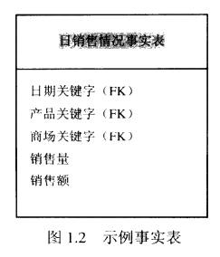
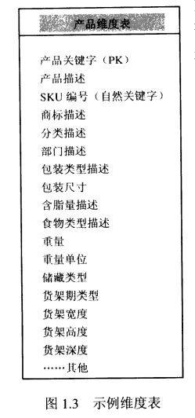

# 维度建模初步

## 1.4 维度建模词汇

- 事实表

事实表是维度模型的基本表,存放有大量的业务性能度量值.应力图将从一个业务处理过程的道德度量值数据存放在单个数据中心.由于度量值数据压倒性的成为任何数据中心的最大部分,因此避免在企业范围内不同地方存储其拷贝.

术语"事实"代表一个业务度量值.可以设想一个作为例子的情形:在市场中观察商品销售情况,记录下每个商店,每种商品,每天的销售数量和销售额.在各个维度(日期+产品+商店)的焦点处就可以得到一个度量值.维度值的列表给出事实表的粒度定义,并确定出度量值的取值范围是什么.

`事实表的一行对应一个度量值,一个度量值就是事实表的一行.事实表的所有度量值必须具有相同的粒度`

最有用的事实是诸如`销售额`这样的数组类型与可做加法的事实.

`度量事实理论上讲可以是文本形式的,不过很少出现.`

`设计者应努力将文本度量值转换成维度,维度能够与其他文本维度属性更有效的关联起来,并且消耗少得多的空间.`

`不能用代表什么也没发生的零值来填充事实表`

事实表粒度都归属三类之一

- 事务
- 周期快照
- 累计快照

其中,事务粒度事实表是最常见的.

所有事实表有两个或者两个以上的关键字(如PK标记的部分)=>例如,`销售事实表`中`产品关键字`,总是匹配产品维度表的一个特定"产品"关键字.

事实表本身通常也有由外关键字子集组成的自己的主关键字,这个关键字通常称做复合或者链接关键字.维度模型中每个事实表都有一个复合关键字,反过来,具有一个复合关键字的表也是一个事实表.

`换句话说,在唯独模型中,每个表示多对多关系的表都是事实表,而其他所有的表都是维度表`

- 维度表

维度表是事实表不可分割的伴侣.维度表包含业务的文字描述.

在一个合理的唯独模型中,维度表有许多列或者属性,这些属性给出维度表的行所进行的描述.对维度表来说,包含50到100个属性的情形并不少见.维度表倾向于将行数做的相当少(少于100万行),而列数做得特别大.每个维度用单一的主关键字(PK)进行定义,主关键字是确保同与之相关联的任何事实表之间存在引用完整性的基础.

维度表是查询约束条件,成组与报表标签生辰的基本来源.在查询与报表请求中,属性用by这个单词进行标识.例如一个客户要按照星期与商标来产看销售额,那么星期与商标必须是可用的维度属性.

维度表属性在数据仓库中承担着一个重大的角色.由于他们实际上是令所有人感兴趣的约束条件与报表标签的来源,因此成为`使数据仓库变得易学易用的关键`,数据仓库的能力,直接与维度属性的质量和深度成正比.
- 1
  - 提供详细的业务用语
  - 属性列值的给定
  - 保证属性列值的质量

`最好的属性是文本的和离散的`.属性应该是真正的文字而不应是一些编码简写符号.对产品维度来说,典型的属性应该包括一个短描述,一个长描述,一个商标名,一个分类名,包装类型,尺寸以及大量其他特征信息.尽管尺寸是数字型的,仍要作为维度属性(它是个确定的离散值).

有时候在设计数据库时并不能很确定,从数据生产源析取的一个数字型数据字段,到底是应该作为事实,还是维度属性看待.通常可以这样决定:`看字段是一个含有许多的取值并参与运算的度量值(事实),还是一个多少变化不多,并参与作为约束条件的离散值(维属性)`

应该通过更为详细的文本属性取代编码,力求最大限度地减少编码在维度表中的使用.如果用户已经进行过如何使用操作编码方面的培训,这种情况尚可接受,但是往后就应该最大限度的减少用户对负载计算机屏幕上用于编码解释的那些小注释的依赖.应该将操作编码按标准解译成可用的维度属性,以便使数据仓库的查询与报表方面的标签属性达到一致.不要试图将解译内容隐藏在报表生成应用中,这样一来,会出现不一致.

维度表时常描述业务中的层次关系.

在给出的示例产品维度中,产品先划分为商标,然后是分类.产品维度的每行都存放有与产品相关的商标和分类.=>可以看到,存放的层次描述信息显得很荣誉,不过也是基于容易使用和查询性能方面的考虑才这样做的.

`不要受仅仅存储商标编码,并为其建立一个单独的商标查询表的固有想法所限制,这种形式称为雪花.维度表一般是很不规范化的,通常也非常小.`既然维度表一般在空间商都显得比事实表小,通过规范化或者雪花化来提高存储效率对于整个仓库来说起不了多大作用.

- 事实与维度融合

理解事实与维度表之后,现在考虑将两个组块融合到唯独模型中.

下图,由数字型度量值组成的事实表链接到一组填满属性描述的为表上.这个星型特征结构通常被叫做星形连接方案.

其中用到的维度方案,应该注意的第一件事就是`简明性欲对称性`.