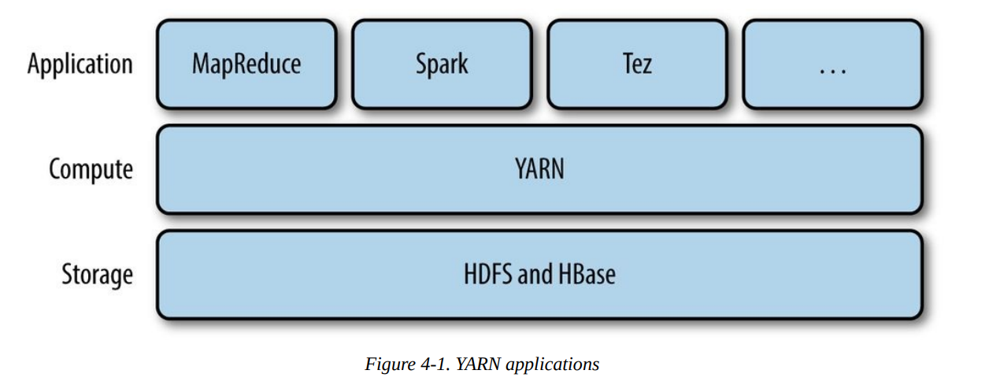
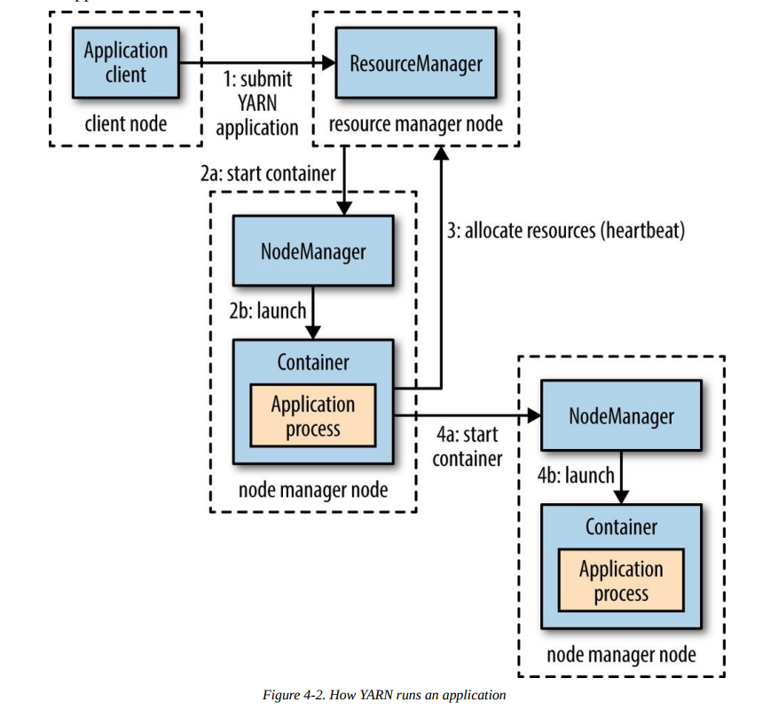
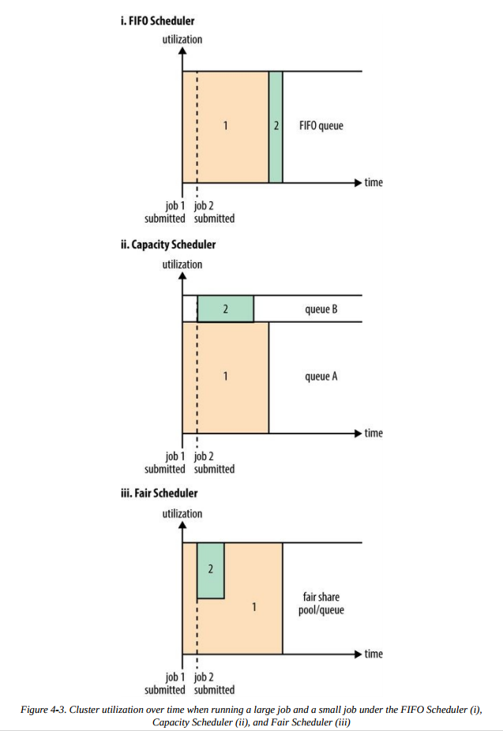
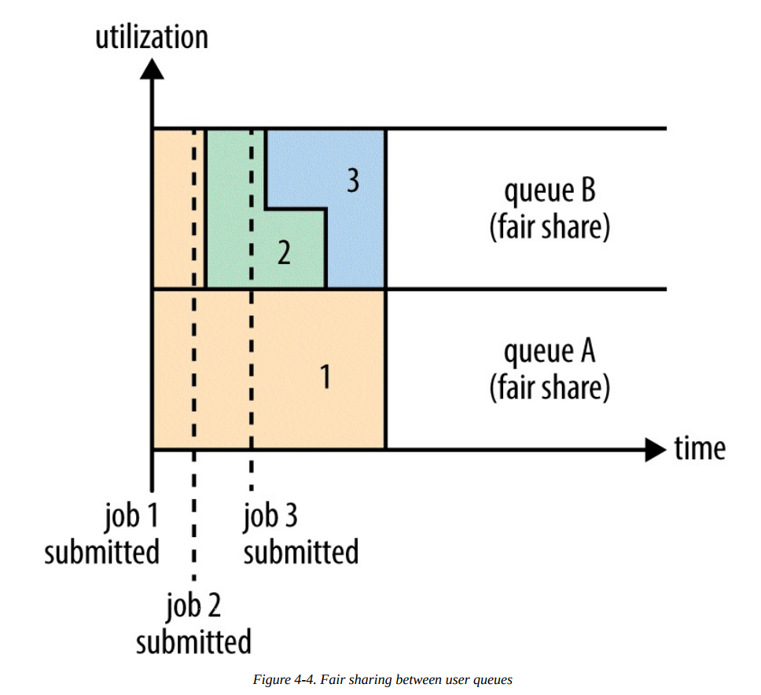

# YARN

`Apache YARN (Yet Another Resource Negotiator) is Hadoop’s cluster resource management system. YARN was introduced in Hadoop 2 to improve the MapReduce implementation, but it is general enough to support other distributed computing paradigms as well.`

YARN provides APIs for requesting and working with cluster resources, but these APIs are not typically used directly by user code. `Instead, users write to higher-level APIs provided by distributed computing frameworks, which themselves are built on YARN and hide the resource management details from the user`. The situation is illustrated in Figure 4-1, which shows some distributed computing frameworks (MapReduce, Spark, and so on) running as YARN applications on the cluster compute layer (YARN) and the cluster storage layer (HDFS and HBase).

- `李:Yarn提供API,用以分配资源给各种请求和工作.但是这些API并没有被用户直接使用,而是给那些构建在Yarn上的其他组件,比如MapReduce,Spark之类的.`



`There is also a layer of applications that build on the frameworks shown in Figure 4-1`. `Pig`, `Hive`, and `Crunch` are all examples of processing frameworks that run on MapReduce, Spark, or Tez (or on all three), and don’t interact with YARN directly.
This chapter walks through the features in YARN and provides a basis for understanding later chapters in Part IV that cover Hadoop’s distributed processing frameworks.

- `李:在上图这些组件(MapReduce,Spark)之上,还有一层应用,比如Pig,Hive,Crunch这些,并不直接与Yarn交互`

## Anatomy of a YARN Application Run/ YARN运行机制解析

- YARN provides its core services via two types of long-running daemon:
  - 1-A: a `resource manager (one per cluster)` to manage the use of resources across the cluster
  - 1-B: `node managers` running on `all the nodes` in the cluster to launch and `monitor containers`
  - 2: . A container executes an `application-specific process` with a `constrained` set of resources (memory, CPU, and so on). Depending on how YARN is configured (see YARN),a container may be `a Unix process or a Linux cgroup`. Figure 4-2 illustrates how YARN runs an application.
- `李`:Yarn通过两个后台程序来提供他的核心服务
  - Resource Manager:每个集群一个,用来管理整个集群的资源
  - Node Manager:每个节点一个,用来管理容器
  - Containers:每个容器使用设定的资源,来执行某个特定的程序



To run an application on YARN, a client contacts the `resource manager` and `asks it` to run an `application master process` (step 1 in Figure 4-2). The `resource manager` then `finds` a node manager that can launch the application master in `a container` (steps 2a and 2b).Precisely what the application master does once it is running depends on the application. It could simply run a computation in the container it is running in and return the result to the client. Or it could request more containers from the resource managers (step 3), and use them to run a distributed computation (steps 4a and 4b). The latter is what the MapReduce YARN application does, which we’ll look at in more detail in Anatomy of a MapReduce Job Run.

- 1.客户端向RM申请启动一个AM进程
- 2.RM在NM中找一个可以为AM提供Container的节点
- 3.AM启动后执行的工作取决于具体的程序
  - 可能就是在这个Container中进行一些运算,然后返回给客户端
  - 也可能从RM申请更多Container来进行分布式匀速

Notice from Figure 4-2 that YARN itself does not provide any way for the parts of the application (client, master, process) to communicate with one another. Most nontrivial YARN applications use some form of remote communication (such as Hadoop’s RPC layer) to pass status updates and results back to the client, but these are specific to the application./`YARN本身不向程序的任何部分(client,master,process)提供相互之间的通信.有些很特殊的YARN应用使用一些远程通信来向客户端更新状态或者返回结果,不过这些都是程序本身自定义的.`

### `Resource Requests` \ 资源请求

`YARN has a flexible model for making resource requests`. A request for a set of containers can express the amount of `computer resources` required for each container (memory and CPU), as well as `locality constraints` for the containers in that request.\
`Yarn的一个资源请求中,可以设定一组container,每个container请求不同数量的cpu和内存还有本地化要求.`

`Locality is critical` in ensuring that distributed data processing algorithms use the cluster bandwidth efficiently,so YARN allows an application to specify locality constraints for the containers it is requesting. Locality constraints can be used to request a container on a specific node or rack, or anywhere on the cluster (off-rack).

Sometimes the locality constraint cannot be met, in which case either no allocation is made or, optionally, the constraint can be loosened. For example, if a specific node was requested but it is not possible to start a container on it (because other containers are running on it), then YARN will try to start a container on a node in the `same rack`, or, if that’s not possible, on any node in the cluster./`'本地化'无法满足的时候,YARN也会按先安排在统一机架进行资源分配,而不是拒绝请求或随机安排.`

In the common case of launching a container to process an HDFS block (to run a map task in MapReduce, say), the application will request a container on one of the nodes hosting the block’s three replicas, or on a node in one of the racks hosting the replicas, or, failing that, on any node in the cluster.

A YARN application can `make resource requests at any time while it is running`.

- For example
  - ① an application can make all of its requests up front
  - ② or it can take a more dynamic approach whereby it requests more resources dynamically to meet the changing needs of the application.

- `Spark takes the first approach, starting a fixed number of executors on the cluster` (see Spark on YARN).\
- MapReduce, on the other hand, has two phases:
  - the map task containers are requested up front, but the reduce task containers are not started until later. Also, if any tasks fail, additional containers will be requested so the failed tasks can be rerun.

### `Application Lifespan`

The lifespan of a YARN application can vary dramatically: from a short-lived application of a few seconds to a long-running application that runs for days or even months. Rather  than look at how long the application runs for, it’s useful to `categorize applications in terms of how they map to the jobs that users run`.

- The simplest case is `one application per user job`, which is the approach that MapReduce takes.
- The second model is to run `one application per workflow` or `user session of (possibly unrelated) jobs`. This approach can be more efficient than the first, since containers can be reused between jobs, and there is also the potential to cache intermediate data between jobs. Spark is an example that uses this model.
- The third model is a `long-running application` that is `shared by different users`. Such an application often acts in some kind of coordination role. For example, Apache Slider has a long-running application master for launching other applications on the cluster. This approach is also used by Impala (see SQL-on-Hadoop Alternatives) to provide a proxy application that the Impala daemons communicate with to request cluster resources. The “always on” application master means that users have `very low-latency responses to their queries` since the overhead of starting a new application master is avoided.

### Building YARN Applications 这里没有详细看

Writing a YARN application from scratch is fairly involved, but `in many cases is not necessary, as it is often possible to use an existing application that fits the bill`. For example, if you are interested in running a directed acyclic graph (DAG) of jobs, then `Spark or Tez` is appropriate; or for stream processing, `Spark, Samza, or Storm works`./`自己写AM的难度比较大,目前YARN上运行稳定的计算框架MR,Spark,Tez是优先选择.另外Apache Slider是一种解决办法.` http://slider.incubator.apache.org/

There are a couple of projects that simplify the process of building a YARN application. `Apache Slider`, mentioned earlier, makes it possible to run existing distributed applications on YARN. Users can run their own instances of an application (such as HBase) on a cluster, independently of other users, which means that different users can run different versions of the same application. Slider provides controls to change the number of nodes an application is running on, and to suspend then resume a running application.

`Apache Twill` is similar to Slider, but in addition provides a simple programming model for developing distributed applications on YARN. Twill allows you to define cluster processes as an extension of a Java Runnable, then runs them in YARN containers on the cluster. Twill also provides support for, among other things, real-time logging (log events from runnables are streamed back to the client) and command messages (sent from the client to runnables).

In cases where none of these options are sufficient — such as an application that has complex scheduling requirements — then `the distributed shell application` that is a part of the YARN project itself serves as an example of how to write a YARN application. It demonstrates how to use YARN’s client APIs to handle communication between the client or application master and the YARN daemons./如果现有的选择都不能满足需求,可以参考YARN的`分布式shell`(作为自己编写AM程序的范例)

### YARN Compared to MapReduce 1

### Scheduling in YARN / YARN中的调度程序

In an ideal world, the requests that a YARN application makes would be granted immediately. In the real world, however, resources are limited, and on a busy cluster, an application will often need to wait to have some of its requests fulfilled. I`t is the job of the YARN scheduler to allocate resources to applications according to some defined policy`. Scheduling in general is a difficult problem and there is no one “best” policy, which is why YARN provides a choice of schedulers and configurable policies. We look at these next.

- Scheduler Options/几种调度器/FIFO/Capacity/Fair

Three schedulers are available in YARN: `the FIFO, Capacity, and Fair Schedulers`. The FIFO Scheduler `places applications in a queue` and runs them `in the order of submission` (first in, first out). Requests for the first application in the queue are allocated first; once its requests have been satisfied, the next application in the queue is served, and so on.\
FIFO调度器->队列先进先出原则

The FIFO Scheduler has the merit of being simple to understand and not needing any configuration, but it’s `not suitable for shared clusters`/`FIFO调度器不适合共享集群`. Large applications will use all the resources in a cluster, so each application has to wait its turn. On a shared cluster it is `better to use the Capacity Scheduler or the Fair Scheduler`. Both of these allow longrunning jobs to complete in a timely manner, while still allowing users who are running concurrent smaller ad hoc queries to get results back in a reasonable time./`共享集群模式下,使用Capacity或者Fair更优`

The difference between schedulers is illustrated in Figure 4-3, which shows that under the FIFO Scheduler (i) the small job is blocked until the large job completes.

With the `Capacity Scheduler` (ii in Figure 4-3), a separate dedicated queue allows the small job to start as soon as it is submitted, although this is at the cost of overall cluster utilization since the queue capacity is reserved for jobs in that queue. This means that the large job finishes later than when using the FIFO Scheduler./Capacity在集群资源中预留了一块用来让小的需求能够随时执行,但是同时也会导致另一个队列中的大应用比平时多消耗一些时间

With the `Fair Scheduler` (iii in Figure 4-3), there is no need to reserve a set amount of capacity, since it will `dynamically balance resources between all running jobs`. Just after the first (large) job starts, it is the only job running, so it gets all the resources in the cluster. When the second (small) job starts, it is allocated half of the cluster resources so that each job is using its fair share of resources./Fair中,动态平均分配资源,唯一应用使用全部,再有新的工作就两者各占一半

Note that there is a lag between the time the second job starts and when it receives its fair share, since it has to wait for resources to free up as containers used by the first job complete. After the small job completes and no longer requires resources, the large job goes back to `using the full cluster capacity again`. The overall effect is both high cluster utilization and timely small job completion./Fair模式,第二个job需要等一会才能获得资源,因为需要第一个job释放才行.某个应用结束之后,空出的资源会重新分配

Figure 4-3 contrasts the basic operation of the three schedulers. In the next two sections, we examine some of the more advanced configuration options for the Capacity and Fair Schedulers.



- `Capacity Scheduler Configuration`/`Capacity调度器配置`
  - `The Capacity Scheduler allows sharing of a Hadoop cluster along organizational lines`, whereby each organization is allocated a certain capacity of the overall cluster.\
  Capacity使用多个规定好资源占用量的'生产线'
  - Each organization is set up with a `dedicated queue` that is configured to use `a given fraction of the cluster capacity`.\
  每个'生产线'有一个专用队列来使用分配好的资源
  - `Queues may be further divided in hierarchical fashion`, allowing each organization to share its cluster allowance between different groups of users within the organization.\
  队列可能会用分层的方式进一步细分
  - `Within a queue, applications are scheduled using FIFO scheduling.`\
  队列中,使用FIFO模式

As we saw in Figure 4-3, a single job does not use more resources than its queue’s capacity. However, if there is more than one job in the queue and there are idle resources available, then the Capacity Scheduler may allocate the spare resources to jobs in the queue, even if that causes the queue’s capacity to be exceeded. This behavior is known as `queue elasticity.`\
如果一个队列的资源没有用完,并且其他有布置一个job在运行,Capacity允许把剩余资源分配出去,即使这会造成另一个队列资源一处.这种行为称作`弹性队列`

In normal operation, the Capacity Scheduler does not preempt containers by forcibly killing them, so if a queue is under capacity due to lack of demand, and then demand increases, the queue will only return to capacity as resources are released from other queues as containers complete. `It is possible to mitigate this by configuring queues with a maximum capacity so that they don’t eat into other queues’ capacities too much`. This is at the cost of queue elasticity, of course, so a reasonable trade-off should be found by trial and error.\
不管是给出剩余空间,还是要回分配出去的空间,Capacity都不会强制结束对资源的占用,而是等待他们自动释放.`可以给队列设置资源上限,防止它占用其他队列过多资源.`这会造成队列弹性下降,所以需要通过尝试来找到合理的配置.

Imagine a queue hierarchy that looks like this:

```bash
root
├── prod
└── dev
    ├── eng
    └── science
```

The listing in Example 4-1 shows a sample Capacity Scheduler configuration file, called
`capacity-scheduler.xml`, for this hierarchy. `It defines two queues under the root queue`,
prod and dev, which have 40% and 60% of the capacity, respectively. Notice that a
particular queue is configured by setting configuration properties of the form
`yarn.scheduler.capacity`.`<queue-path>.<sub-property>`, where `<queue-path>` is the
hierarchical (dotted) path of the queue, such as `root.prod`.

Example 4-1. A basic configuration file for the `Capacity Scheduler`

```xml
<?xml version="1.0"?>
<configuration>
<property>
<name>yarn.scheduler.capacity.root.queues</name>
<value>prod,dev</value>
</property>
<property>
<name>yarn.scheduler.capacity.root.dev.queues</name>
<value>eng,science</value>
</property>
<property>
<name>yarn.scheduler.capacity.root.prod.capacity</name>
<value>40</value>
</property>
<property>
<name>yarn.scheduler.capacity.root.dev.capacity</name>
<value>60</value>
</property>
<property>
<name>yarn.scheduler.capacity.root.dev.maximum-capacity</name>
www.it-ebooks.info
<value>75</value>
</property>
<property>
<name>yarn.scheduler.capacity.root.dev.eng.capacity</name>
<value>50</value>
</property>
<property>
<name>yarn.scheduler.capacity.root.dev.science.capacity</name>
<value>50</value>
</property>
</configuration>
```

As you can see, `the dev queue is further divided into eng and science queues of equal capacity`. So that the dev queue does not use up all the cluster resources when the prod queue is idle, it has its maximum capacity set to 75%. In other words, the prod queue always has 25% of the cluster available for immediate use. Since no maximum capacities have been set for other queues, it’s possible for jobs in the eng or science queues to use all of the dev queue’s capacity (up to 75% of the cluster), or indeed for the prod queue to use the entire cluster.

Beyond configuring queue hierarchies and capacities, there are settings to control the `maximum number of resources` a `single user` or `application` can be allocated,  `how many applications can be running` at any one time, and ACLs(`Access Control List`) on queues. See the reference page for details.

- Queue placement/`Capacity Scheduler模式下的队列指定`

The way that you specify which queue an application is placed in is specific to the application. For example, in MapReduce, you set the property `mapreduce.job.queuename` to the name of `the queue you want to use`. If the queue does not exist, then you’ll get an error at submission time. If no queue is specified, applications will be placed in a queue called default./`如果指定的queue不存在,会报错,如果没有指定,会被放入default中`

```txt
WARNING/Capacity Scheduler模式下quene名称必须指定为quene中最低层的某个名字,全名是不被识别的

For the Capacity Scheduler, the queue name should be the last part of the hierarchical name since the full hierarchical name is not recognized. So, for the preceding example configuration, prod and eng are OK, but root.dev.eng and dev.eng do not work.
```

- `Fair Scheduler Configuration`

The Fair Scheduler attempts to allocate resources so that `all running applications get the same share of resources`. Figure 4-3 showed how fair sharing works for applications in the same queue; however, fair sharing actually works between queues, too, as we’ll see next.

```txt
NOTE
The terms queue and pool are used interchangeably in the context of the Fair Scheduler.
```

To understand how resources are shared between queues, `imagine two users A and B`, each with their own queue (Figure 4-4).

- A starts a job, and it is allocated all the resources available since there is no demand from B.
- Then B starts a job while A’s job is still running, and after a while each job is using half of the resources, in the way we saw earlier.
- Now if B starts a second job while the other jobs are still running, it will share its resources with B’s other job, so each of B’s jobs will have one-fourth of the resources
- while A’s will continue to have half. The result is that resources are shared fairly between users.

Figure 4-4. Fair sharing between user queues



- Enabling the Fair Scheduler

The scheduler in use is determined by the setting of `yarn.resourcemanager.scheduler.class`. The `Capacity Scheduler is used by default` (although the Fair Scheduler is the default in some Hadoop distributions, such as `CDH`), but this can be changed by setting `yarn.resourcemanager.scheduler.class` in `yarnsite.xml` to the fully qualified classname of the scheduler, `org.apache.hadoop.yarn.server.resourcemanager.scheduler.fair.FairScheduler`.\
通常默认设置是Capacity.可以调整为Fair`(CDH默认是Fair)`

- Queue configuration

The Fair Scheduler is configured using an allocation file named `fair-scheduler.xml` that is `loaded from the classpath`. (The name can be changed by setting the property y`arn.scheduler.fair.allocation.file`.) In the absence of an allocation file, the Fair Scheduler operates as described earlier: `each application is placed in a queue named after the user and queues are created dynamically when users submit their first applications`.

Per-queue configuration is specified in the allocation file. This allows configuration of hierarchical queues like those supported by the Capacity Scheduler. For example, we can define prod and dev queues like we did for the Capacity Scheduler using the allocation file in Example 4-2.
Example 4-2. An allocation file for the Fair Scheduler

```xml
<?xml version="1.0"?>
<allocations>
<defaultQueueSchedulingPolicy>fair</defaultQueueSchedulingPolicy>
<queue name="prod">
<weight>40</weight>
<schedulingPolicy>fifo</schedulingPolicy>
</queue>
<queue name="dev">
<weight>60</weight>
<queue name="eng" />
<queue name="science" />
</queue>
<queuePlacementPolicy>
<rule name="specified" create="false" />
<rule name="primaryGroup" create="false" />
<rule name="default" queue="dev.eng" />
</queuePlacementPolicy>
</allocations>
```

The queue hierarchy is defined using nested queue elements. A`ll queues are children of the root queue`, even if not actually nested in a root queue element. Here we subdivide the dev queue into a queue called eng and another called science.

`Queues can have weights`, which are used in the fair share calculation. In this example, the cluster allocation is considered fair when it is divided into a 40:60 proportion between prod and dev. The eng and science queues do not have weights specified, so they are divided evenly. `Weights are not quite the same as percentages`, even though the example uses numbers that add up to 100 for the sake of simplicity. We could have specified weights of 2 and 3 for the prod and dev queues to achieve the same queue weighting.

```txt
NOTE
When setting weights, remember to consider the default queue and dynamically created queues (such as queues named after users). These are not specified in the allocation file, but still have weight 1.
```

- `配置权重的时候要考虑默认队列和自动创建的对立(queues named after user)`

`Queues can have different scheduling policies`. The default policy for queues can be set in the top-level `defaultQueueSchedulingPolicy` element; `if it is omitted, fair scheduling is used`. Despite its name, the Fair Scheduler also supports a FIFO (fifo) policy on queues, as well as `Dominant Resource Fairness (drf)`, described later in the chapter.

- The policy for a particular queue can be overridden using the `schedulingPolicy element` for that queue.
- 某个特定queue的策略可以通过schedulingPolicy重写

In this case, the prod queue uses FIFO scheduling since we want each production job to run serially and complete in the shortest possible amount of time. Note that fair sharing is still used to divide resources between the prod and dev queues, as well as between (and within) the eng and science queues.

Although not shown in this allocation file, queues can be configured with `minimum and maximum` resources, and a maximum number of running applications. (See the reference page for details.) The minimum resources setting is `not a hard limit`, but rather is used by the scheduler to `prioritize` resource allocations. If two queues are below their fair share, then the one that is furthest below its minimum is allocated resources first. The minimum resource setting is also used for preemption, discussed momentarily.

- Queue placement

The Fair Scheduler uses a rules-based system to determine which queue an application is placed in. In Example 4-2, the `queuePlacementPolicy` element contains a list of rules, each of which is tried in turn until a match occurs.\Fair模式下,Queue会按照既定的规则逐个尝试安排,知道有一种情况匹配.

- The first rule, specified, places an application in the queue it specified;
- if none is specified, or if the specified queue doesn’t exist, then the rule doesn’t match and the next rule is tried.
- The `primaryGroup` rule tries to place an application in a queue with the name of the user’s primary Unix group;
- if there is no such queue, rather than creating it, the next rule is tried. The default rule is a catch-all and always places the application in the dev.eng queue.

The queuePlacementPolicy can be omitted entirely, in which case the `default behavior` is
as if it had been specified with the following:

```xml
<queuePlacementPolicy>
<rule name="specified" />
<rule name="user" />
</queuePlacementPolicy>
```

`In other words, unless the queue is explicitly specified, the user’s name is used for the queue, creating it if necessary.`

queuePlacementPolicy可以不进行任何配置,这种情况下,系统会默认用用户名创建queue

Another simple queue placement policy is one where all applications are placed in the same (default) queue. This allows resources to be shared fairly between applications, rather than users. The definition is equivalent to this:

```xml
<queuePlacementPolicy>
<rule name="default" />
</queuePlacementPolicy>
```

It’s also possible to set this policy without using an allocation file, by setting `yarn.scheduler.fair.user-as-default-queue` to `false` so that applications will be placed in the default queue rather than a per-user queue. In addition, `yarn.scheduler.fair.allow-undeclared-pools` should be set to `false` so that users can’t create queues on the fly.

- `Preemption/fair支持强制回收`

When a job is submitted to an empty queue on a busy cluster, the job cannot start until resources free up from jobs that are already running on the cluster. To make the time taken for a job to start more predictable, the `Fair Scheduler supports preemption`.

Preemption allows the scheduler to kill containers for queues that are running with more than their fair share of resources so that the resources can be allocated to a queue that is under its fair share. Note that `preemption reduces overall cluster efficiency`, since the `terminated` containers need to be `reexecuted`.

Preemption is enabled globally by setting `yarn.scheduler.fair.preemption` to `true`. There are two relevant preemption `timeout settings`: one for minimum share and one for fair share, both specified in seconds. By default, the timeouts are not set, so you need to set at least one to allow containers to be preempted.

If a queue waits for as long as its minimum share preemption timeout without receiving its minimum guaranteed share, then the scheduler may preempt other containers. The default timeout is set for all queues via the `defaultMinSharePreemptionTimeout` top-level element in the allocation file, and on a `per-queue basis` by setting the `minSharePreemptionTimeout` element for a queue.

Likewise, if a queue remains below `half of its fair share` for as long as the fair share preemption timeout, then the scheduler may preempt other containers. The default timeout is set for all queues via the `defaultFairSharePreemptionTimeout` top-level element in the allocation file, and on a per-queue basis by setting `fairSharePreemptionTimeout` on a queue. The threshold may also be changed from its default of 0.5 by setting `defaultFairSharePreemptionThreshold` and `fairSharePreemptionThreshold` (perqueue).

- Delay Scheduling

All the YARN schedulers try to honor locality requests. On a busy cluster, if an application requests a particular node, there is a good chance that other containers are running on it at the time of the request. The obvious course of action is to immediately loosen the locality requirement and allocate a container on the same rack. However, it has been observed in practice that `waiting a short time` (no more than a few seconds) can dramatically increase the chances of being allocated a container on the requested node, and therefore increase the efficiency of the cluster. `This feature is called delay scheduling`, and it is `supported by both the Capacity Scheduler and the Fair Scheduler.`

Every node manager in a YARN cluster periodically sends a heartbeat request to the resource manager — by default, one per second. Heartbeats carry information about the node manager’s `running containers` and the `resources available` for new containers, so each heartbeat is a potential scheduling opportunity for an application to run a container. When using delay scheduling, the scheduler doesn’t simply use the first scheduling opportunity it receives, but waits for up to a given `maximum number of scheduling opportunities` to occur before loosening the `locality constraint` and taking the next scheduling opportunity.

For the Capacity Scheduler, delay scheduling is configured by setting `yarn.scheduler.capacity.node-locality-delay` to a positive integer representing the number of scheduling opportunities that it is prepared to miss before loosening the node constraint to match any node in the same rack.

The Fair Scheduler also uses the number of scheduling opportunities to determine the delay, although it is expressed as a proportion of the cluster size. For example, setting `yarn.scheduler.fair.locality.threshold.node` to 0.5 means that the scheduler should wait until half of the nodes in the cluster have presented scheduling opportunities before accepting another node in the same rack. There is a corresponding property, `yarn.scheduler.fair.locality.threshold.rack`, for setting the threshold before another rack is accepted instead of the one requested.

- Dominant Resource Fairness/主导资源公平性/以用户申请的主要资源作为分配度量

When there is only a single resource type being scheduled, such as memory, then the concept of capacity or fairness is easy to determine. If two users are running applications, you can measure the amount of memory that each is using to compare the two applications. However, when there are multiple resource types in play, things get more complicated. If one user’s application requires lots of CPU but little memory and the other’s requires little CPU and lots of memory, how are these two applications compared? The way that the schedulers in YARN address this problem is to `look at each user’s dominant resource and use it as a measure of the cluster usage`. This approach is called Dominant Resource Fairness, or `DRF` for short. The idea is best illustrated with a simple example.

Imagine a cluster with a total of 100 CPUs and 10 TB of memory. Application A requests containers of (2 CPUs, 300 GB), and application B requests containers of (6 CPUs, 100 GB). A’s request is (2%, 3%) of the cluster, so memory is dominant since its proportion (3%) is larger than CPU’s (2%). B’s request is (6%, 1%), so CPU is dominant. Since B’s container requests are twice as big in the dominant resource (6% versus 3%), it will be allocated half as many containers under fair sharing.

`By default DRF is not used`, so during resource calculations, `only memory is considered and CPU is ignored`. The Capacity Scheduler can be configured to use DRF by setting `yarn.scheduler.capacity.resource-calculator` to `org.apache.hadoop.yarn.util.resource.DominantResourceCalculator` in `capacityscheduler.xml`.

For the Fair Scheduler, DRF can be enabled by setting the top-level element `defaultQueueSchedulingPolicy` in the allocation file to `drf`.

### Further Reading

This chapter has given a short overview of YARN. For more detail, see Apache Hadoop YARN by Arun C. Murthy et al. (Addison-Wesley, 2014). https://yarn-book.com/