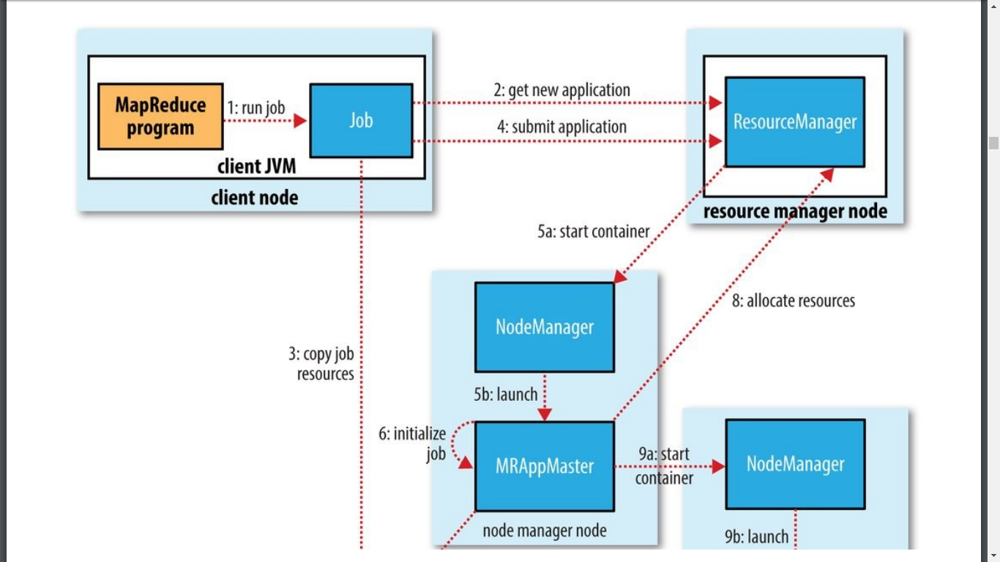
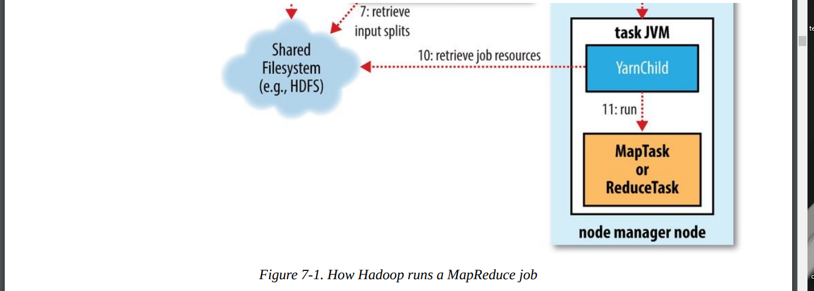
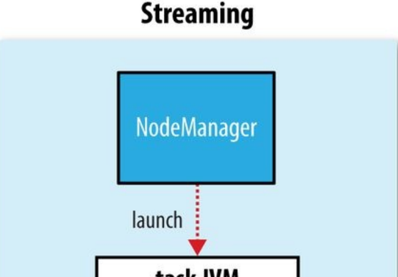
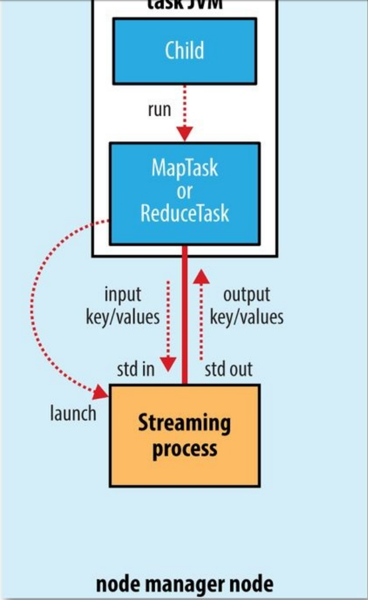
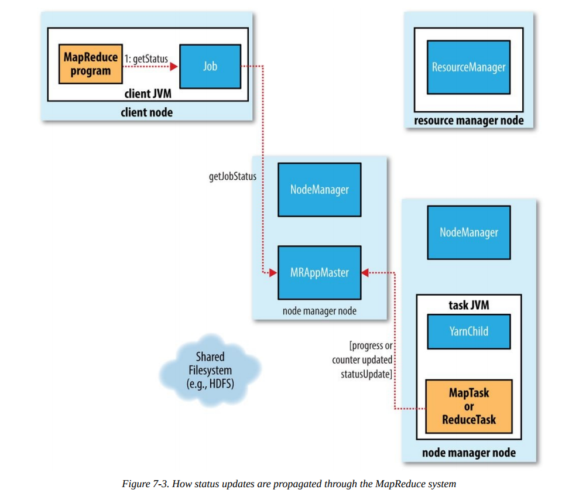
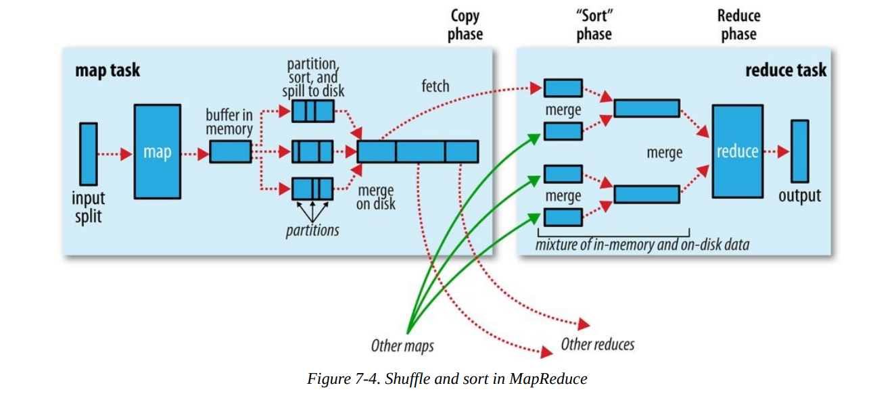
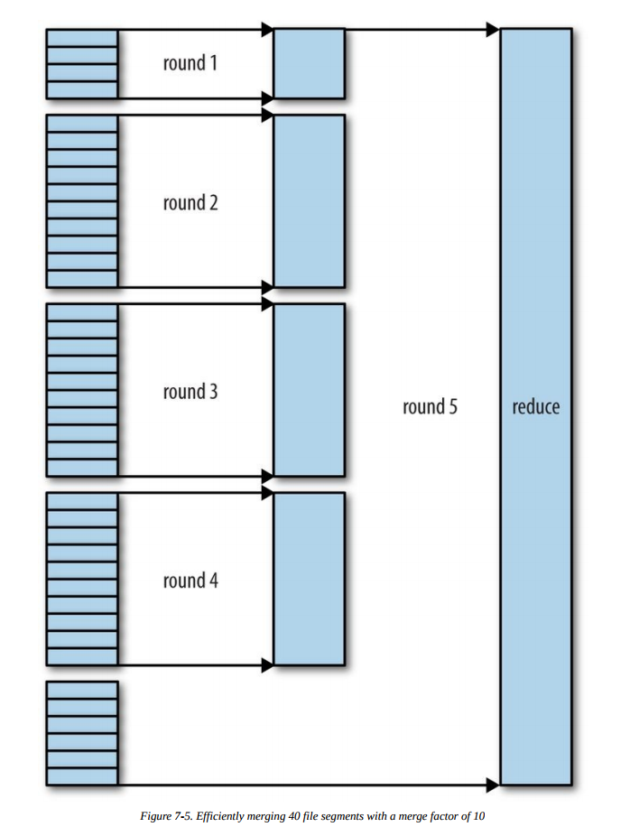

# Chapter 7. How MapReduce Works

In this chapter, we look at how MapReduce in Hadoop works in detail. This knowledge
provides a good foundation for writing more advanced MapReduce programs, which we
will cover in the following two chapter

## Anatomy of a MapReduce Job Run

You can run a MapReduce job with a single method call: submit() on a Job object (you
can also call waitForCompletion(), which submits the job if it hasn’t been submitted
already, then waits for it to finish).
[51] This method call conceals a great deal of processing
behind the scenes. This section uncovers the steps Hadoop takes to run a job.
The whole process is illustrated in Figure 7-1. At the highest level, there are five
independent entities[52]:\
`这个方法封装了很多内容在里面,本章节会解读Hadoop运行一个job的完整过程`

- The client, which submits the MapReduce job.\
    `客户端用于提交MapReduce job`
- The YARN resource manager, which coordinates the allocation of compute resources on the cluster.\
    `RM,协调集群资源`
- The YARN node managers, which launch and monitor the compute containers on machines in the cluster.\
    `NM,创建并监控容器`
- The MapReduce application master, which coordinates the tasks running the MapReduce job. The application master and the MapReduce tasks run in containers that are scheduled by the resource manager and managed by the node managers.\
    `AM,协调job中的task. AM和JOB都是由RM调配NM管理`
- The distributed filesystem (normally HDFS, covered in Chapter 3), which is used for sharing job files between the other entities.\
    `分布式系统,用于job中文件共享`




## Job Submission \ 任务提交

The submit() method on Job creates an internal JobSubmitter instance and calls
submitJobInternal() on it (step 1 in Figure 7-1). Having submitted the job,
waitForCompletion() polls the job’s progress once per second and reports the progress to
the console if it has changed since the last report. When the job completes successfully,
the job counters are displayed. Otherwise, the error that caused the job to fail is logged to
the console.\
`任务在提交之初,创建了一个内部的'任务提交员',并且在其上调用submitJobInternal(),体质之后,waitForCompletion()会每秒拉去任务进展信息,如果有变化就报告给console.任务成功完成,会展示任务计数器(job counters),否则会把错误信息报告给console`

The job submission process implemented by JobSubmitter does the following:\
`JobSubmitter执行的提交任务流程如下`

- Asks the resource manager for a new application ID, used for the MapReduce job ID (step 2).\
    `向RM申请一个APPID给任务用`
- Checks the output specification of the job. For example, if the output directory has not been specified or it already exists, the job is not submitted and an error is thrown to the MapReduce program.\
    `检查输出路径,如果已存在或者没指定,都会报错`
- Computes the input splits for the job. If the splits cannot be computed (because the input paths don’t exist, for example), the job is not submitted and an error is thrown to the MapReduce program.\
    `计算splits数量,如果没法计算(比如输入路径不存在),报错`
- Copies the resources needed to run the job, including the job JAR file, the configuration file, and the computed input splits, to the shared filesystem in a directory named after the job ID (step 3). The job JAR is copied with a high replication factor (controlled by the `mapreduce.client.submit.file.replication` property, which defaults to 10) so that there are lots of copies across the cluster for the node managers to access when they run tasks for the job.\
    `拷贝任务需要的资源(包括执行任务的jar包,配置文件,计算好的输入数据库)到文件系统中一个以任务ID命名的文件路径中,任务JAR文件会复制很多份,以便NM在执行task的之后可以拿到`
- Submits the job by calling submitApplication() on the resource manager (step 4).\
    `在RM上,调用submitApplication()提交任务`

## Job Initialization \ 任务初始化

When the resource manager receives a call to its submitApplication() method, it hands
off the request to the YARN scheduler. The scheduler allocates a container, and the
resource manager then launches the application master’s process there, under the node
manager’s management (steps 5a and 5b).\
`RM收到submitApplication()提交的任务,把请求转交给 YARN scheduler,schelduler会分配一个container给RM,让它在那里启动一个AM(这个container或者说AM实在某个NM的管理下的)`

The application master for MapReduce jobs is a Java application whose main class is
MRAppMaster. It initializes the job by creating a number of bookkeeping objects to keep
track of the job’s progress, as it will receive progress and completion reports from the
tasks (step 6). Next, it retrieves the input splits computed in the client from the shared
filesystem (step 7). It then creates a map task object for each split, as well as a number of
reduce task objects determined by the `mapreduce.job.reduces` property (set by the
setNumReduceTasks() method on Job). Tasks are given IDs at this point.\
`AM是一个Java应用,主类名MRAppMaster.他会初始化任务=>创建许多bookkeeping objects来跟踪任务进程(task会把自己的情况报告上来).之后,拿到splits,给每个split启动一个map task,同时启动几个reduce task.所有的task会在启动时赋予ID`

The application master must decide how to run the tasks that make up the MapReduce job.
If the job is small, the application master may choose to run the tasks in the same JVM as
itself. This happens when it judges that the overhead of allocating and running tasks in
new containers outweighs the gain to be had in running them in parallel, compared to
running them sequentially on one node. Such a job is said to be `uberized`, or run as an uber
task.\
`AM需要确定如何执行MR job.如果是个小任务,AM可能会在一个JVM里面执行多个task(如果AM判定在一个节点串行完成所有任务比在多处并行完成多个任务开销更优)`

What qualifies as a small job? By default, a small job is one that has less than 10 mappers,
only one reducer, and an input size that is less than the size of one HDFS block. (Note that
these values may be changed for a job by setting `mapreduce.job.ubertask.maxmaps`,
`mapreduce.job.ubertask.maxreduces`, and `mapreduce.job.ubertask.maxbytes`.) Uber
tasks must be enabled explicitly (for an individual job, or across the cluster) by setting
`mapreduce.job.ubertask.enable` to true.\
`怎么样判断一个任务是个小任务:10个mapper一下,只有一个 reducer.输入大小小于要给HDFS块大小(这些参数可改变),同时设置了参数准许ubertask执行`

Finally, before any tasks can be run, the application master calls the setupJob() method
on the OutputCommitter. For FileOutputCommitter, which is the default, it will create
the final output directory for the job and the temporary working space for the task output.
The commit protocol is described in more detail in Output Committers.\
`最后,在开始执行之前,AM在OutputCommitter上调用setupJob(),对于FileOutputCommitter(默认情况下),他会创建输出目录和临时工作目录,更多细节查看[...]`

##　Task Assignment　＼　工作分配

If the job does not qualify for running as an uber task, then the application master requests
containers for all the map and reduce tasks in the job from the resource manager (step 8).
Requests for map tasks are made first and with a higher priority than those for reduce
tasks, since all the map tasks must complete before the sort phase of the reduce can start
(see Shuffle and Sort). Requests for reduce tasks are not made until 5% of map tasks have
completed (see Reduce slow start).＼
`如果不作为uber task,那么AM会为所有的Map,Reduce tasks 请求container. Map的请求会被优先满足=>因为map全都需要在reduce开始sort之前完成.所以reduce的请求会在5%的map tasks完成之后才发出(?满足)`

Reduce tasks can run anywhere in the cluster, but requests for map tasks have data locality
constraints that the scheduler tries to honor (see Resource Requests). In the optimal case,
the task is data local — that is, running on the same node that the split resides on.
Alternatively, the task may be rack local: on the same rack, but not the same node, as the
split. Some tasks are neither data local nor rack local and retrieve their data from a
different rack than the one they are running on. For a particular job run, you can determine
the number of tasks that ran at each locality level by looking at the job’s counters (see
Table 9-6).\
`Reduce tasks可以在集群任何位置执行,但是map tasks有数据本地化约束.scheduler会尽量满足其需求`

Requests also specify memory requirements and CPUs for tasks. By default, each map and
reduce task is allocated 1,024 MB of memory and one virtual core. The values are
configurable on a per-job basis (subject to minimum and maximum values described in
Memory settings in YARN and MapReduce) via the following properties:
`mapreduce.map.memory.mb`, `mapreduce.reduce.memory.mb`, `mapreduce.map.cpu.vcores`
and `mapreduce.reduce.cpu.vcores`.\
`需求中有关于内存和cpu的设置,默认每个map , reduce task 1G内存,1 个core.切所有 task都可以独立设置这些参数`

##　Task Execution \ 执行

Once a task has been assigned resources for a container on a particular node by the
resource manager’s scheduler, the application master starts the container by contacting the
node manager (steps 9a and 9b). The task is executed by a Java application whose main
class is YarnChild. Before it can run the task, it localizes the resources that the task needs,
including the job configuration and JAR file, and any files from the distributed cache (step
10; see Distributed Cache). Finally, it runs the map or reduce task (step 11).
The YarnChild runs in a dedicated JVM, so that any bugs in the user-defined map and
reduce functions (or even in YarnChild) don’t affect the node manager — by causing it to
crash or hang, for example.\
`当RM-S配置好container 的资源后,AM会联系NM开启container. task会被一个住方法为YarnChild的JavaApplication执行.在开始运行task之前,他会本地化(下载)task所需的资源(配置文件,jar包,分布式缓存中的文件),最后开始这个task,因为YarnChild是一个独立的JVM,所以map/reduce 程序中甚至YarnChild自身的bug不会影响NM`

Each task can perform setup and commit actions, which are run in the same JVM as the
task itself and are determined by the OutputCommitter for the job (see Output
Committers). For file-based jobs, the commit action moves the task output from a
temporary location to its final location. The commit protocol ensures that when
speculative execution is enabled (see Speculative Execution), only one of the duplicate
tasks is committed and the other is aborted.\
`每个task都可以执行 设置和提交的操作,这些操作在task的JVM中运行,由job的OutputCommitter来决定.对于文件基础的job,commit动作会把task的输出从临时位置挪到最终位置.提交策略保证如果开启'推测机制','双重任务'只有一个能够commit,另一个会遗弃`

### Streaming \ 让用户可以用各种语言写MapReduce

Streaming runs special map and reduce tasks for the purpose of launching the user-supplied
executable and communicating with it (Figure 7-2).\
`Streaming运行特殊的map和reduce task=>为了运行用户提供的可执行文件并与之通信`

The Streaming task communicates with the process (which may be written in any
language) using standard input and output streams. During execution of the task, the Java
process passes input key-value pairs to the external process, which runs it through the
user-defined map or reduce function and passes the output key-value pairs back to the Java
process. From the node manager’s point of view, it is as if the child process ran the map or
reduce code itself.\
`Streaming task通过标准输入输出与process通信(这个process可以史任何语言编写的),在task执行过程中,Java process为 external process提供键值对,external process会在用户定义的map reduce function中使用键值对,然后把输出键值对穿回去给Java process. 从NM的角度看,仿佛值map/reduce子进程在自我运行`



`Figure 7-2. The relationship of the Streaming executable to the node manager and the task container`

## Progress and Status Updates

MapReduce jobs are long-running batch jobs, taking anything from tens of seconds to
hours to run. Because this can be a significant length of time, it’s important for the user to
get feedback on how the job is progressing. A job and each of its tasks have a status,
which includes such things as the state of the job or task (e.g., running, successfully
completed, failed), the progress of maps and reduces, the values of the job’s counters, and
a status message or description (which may be set by user code). These statuses change
over the course of the job, so how do they get communicated back to the client?\
`MR job耗时一般比较长.所以用户需要了解job进程.job和task都有其状态(运行,成功,完成,失败),进程,job的counters,状态信息,描述(可能是用户自定义的)`

When a task is running, it keeps track of its progress (i.e., the proportion of the task
completed). For map tasks, this is the proportion of the input that has been processed. For
reduce tasks, it’s a little more complex, but the system can still estimate the proportion of
the reduce input processed. It does this by dividing the total progress into three parts,
corresponding to the three phases of the shuffle (see Shuffle and Sort). For example, if the
task has run the reducer on half its input, the task’s progress is 5/6, since it has completed
the copy and sort phases (1/3 each) and is halfway through the reduce phase (1/6).\
`当task运行时,它时刻监控着自己的紧张.对于map task,可以看到已处理的输入数据的比例.对应reduce tasks有点复杂,不过也能估算其输入的处理进度=>把工作分成三个阶段,每段三分之一,每个阶段可以根据处理情况再分`

```note
WHAT CONSTITUTES PROGRESS IN MAPREDUCE?
Progress is not always measurable, but nevertheless, it tells Hadoop that a task is doing something. For example, a
task writing output records is making progress, even when it cannot be expressed as a percentage of the total number
that will be written (because the latter figure may not be known, even by the task producing the output).
Progress reporting is important, as Hadoop will not fail a task that’s making progress. All of the following operations
constitute progress:
Reading an input record (in a mapper or reducer) 读取数据
Writing an output record (in a mapper or reducer) 输出数据
Setting the status description (via Reporter’s or TaskAttemptContext’s setStatus() method)
Incrementing a counter (using Reporter’s incrCounter() method or Counter’s increment() method)
Calling Reporter’s or TaskAttemptContext’s progress() method
```

Tasks also have a set of counters that count various events as the task runs (we saw an
example in A test run), which are either built into the framework, such as the number of
map output records written, or defined by users.\
`任务同事有一组计数器,记录task执行过程中的各种活动,他们被嵌入框架中,记录比如map输入记录数,有些计数器也可以是自定义的`

As the map or reduce task runs, the child process communicates with its parent application
master through the umbilical interface. The task reports its progress and status (including
counters) back to its application master, which has an aggregate view of the job, every
three seconds over the umbilical interface.\
`map/reduce运行时,child process与他的父Application master通过umbilical interface 通信.task报告进度和状态(还有counter),AM每三秒通过umbilical interface做一次全局统计`

The resource manager web UI displays all the running applications with links to the web
UIs of their respective application masters, each of which displays further details on the
MapReduce job, including its progress.\
`RM web UI展示所有运行中的application,链接到每个独立的AM的UI界面中,那里有更多细节信息`

During the course of the job, the client receives the latest status by polling the application master every second (the interval is set via `mapreduce.client.progressmonitor.pollinterval`). Clients can also use Job’s getStatus() method to obtain a JobStatus instance, which contains all of the status information for the job.\
`客户端每秒从AM获取任务状态,或者通过 Job的 getStatus()方法,获取一个JobStatus对象,其中包含所有job状态信息`

The process is illustrated in Figure 7-3.



## Job Completion \任务完成

When the application master receives a notification that the last task for a job is complete,
it changes the status for the job to “successful.” Then, when the Job polls for status, it
learns that the job has completed successfully, so it prints a message to tell the user and
then returns from the waitForCompletion() method. Job statistics and counters are
printed to the console at this point.\
`任务完成,返回成功信息,从waitForCompletion()方法中返回.把job 分析和计数器信息打印到console`

The application master also sends an HTTP job notification if it is configured to do so.
This can be configured by clients wishing to receive callbacks, via the
`mapreduce.job.end-notification.url` property.\
`还能向HTTP发送成功信息`

Finally, on job completion, the application master and the task containers clean up their
working state (so intermediate output is deleted), and the OutputCommitter’s
commitJob() method is called. Job information is archived by the job history server to
enable later interrogation by users if desired.

## Failures \ 失败

In the real world, user code is buggy, processes crash, and machines fail. One of the major
benefits of using Hadoop is its ability to handle such failures and allow your job to
complete successfully. We need to consider the failure of any of the following entities: the
task, the application master, the node manager, and the resource manager.

### Task Failure

Consider first the case of the task failing. The most common occurrence of this failure is
when user code in the map or reduce task throws a runtime exception. If this happens, the
task JVM reports the error back to its parent application master before it exits. The error
ultimately makes it into the user logs. The application master marks the task attempt as
failed, and frees up the container so its resources are available for another task.\
`task failing最常发生的是runtime exception.如果出现,taskJvm向他的AM报告,错误写入日志.AM把task标记为失败,然后释放container`

For Streaming tasks, if the Streaming process exits with a nonzero exit code, it is marked
as failed. This behavior is governed by the stream.non.zero.exit.is.failure property
(the default is true).\
`对于streaming task,如果streaming process 非0退出,则会被标记为失败`

Another failure mode is the sudden exit of the task JVM — perhaps there is a JVM bug
that causes the JVM to exit for a particular set of circumstances exposed by the
MapReduce user code. In this case, the node manager notices that the process has exited
and informs the application master so it can mark the attempt as failed.\
`还有就是task JVM意外退出.NM会注意到进程推出,并通知AM让AM将之标记为失败`

Hanging tasks are dealt with differently. The application master notices that it hasn’t
received a progress update for a while and proceeds to mark the task as failed. The task
JVM process will be killed automatically after this period.
[53] The timeout period after
which tasks are considered failed is normally 10 minutes and can be configured on a perjob
basis (or a cluster basis) by setting the mapreduce.task.timeout property to a value
in milliseconds.\
`挂起tasks有不同的处理方式.AM注意到有一段时间没有收到progress update,同时也没有收到task的失败信息.task JVM会被自动杀死.通常10分钟会被认为超时`

Setting the timeout to a value of zero disables the timeout, so long-running tasks are never
marked as failed. In this case, a hanging task will never free up its container, and over time
there may be cluster slowdown as a result. This approach should therefore be avoided, and
making sure that a task is reporting progress periodically should suffice (see What
Constitutes Progress in MapReduce?).\
`如果参数被设为零,task就不会被标记为失败,挂起的task就无法释放container,久而久之集群会被拖慢.所以这种行为不要发生`

When the application master is notified of a task attempt that has failed, it will reschedule
execution of the task. The application master will try to avoid rescheduling the task on a
node manager where it has previously failed. Furthermore, if a task fails four times, it will
not be retried again. This value is configurable. The maximum number of attempts to run a
task is controlled by the `mapreduce.map.maxattempts` property for map tasks and
`mapreduce.reduce.maxattempts` for reduce tasks. By default, if any task fails four times
(or whatever the maximum number of attempts is configured to), the whole job fails.\
`AM发现task失败之后,会重新安排task,并且避免把task安排到之前失败的节点上.除此之外四次失败(默认)之后就不会再充实`

For some applications, it is undesirable to abort the job if a few tasks fail, as it may be
possible to use the results of the job despite some failures. In this case, the maximum
percentage of tasks that are allowed to fail without triggering job failure can be set for the
job. Map tasks and reduce tasks are controlled independently, using the
`mapreduce.map.failures.maxpercent` and `mapreduce.reduce.failures.maxpercent`
properties.\
`对于一些job,一些task失败了没啥问题,这种情况下,可以设置参数,允许一定比例的失败`

A task attempt may also be killed, which is different from it failing. A task attempt may be
killed because it is a speculative duplicate (for more information on this topic, see
Speculative Execution), or because the node manager it was running on failed and the
application master marked all the task attempts running on it as killed. Killed task attempts
do not count against the number of attempts to run the task (as set by
`mapreduce.map.maxattempts` and `mapreduce.reduce.maxattempts`), because it wasn’t
the task’s fault that an attempt was killed.\
`task attempt也可能被杀掉,这不同于失败.有可能因为它是个二重身,或者因为NM挂了,AM把其上所有task都标记为失败.杀掉task attempt不计入task attempt次数,因为杀掉的原因不是task本身造成的`

Users may also kill or fail task attempts using the web UI or the command line (type
mapred job to see the options). Jobs may be killed by the same mechanisms.\
`用户也可以手动KILL`

## Application Master Failure

Just like MapReduce tasks are given several attempts to succeed (in the face of hardware
or network failures), applications in YARN are retried in the event of failure. The
maximum number of attempts to run a MapReduce application master is controlled by the
`mapreduce.am.max-attempts` property. The default value is 2, so if a MapReduce
application master fails twice it will not be tried again and the job will fail.\
`和 MR task的情况一样,AM也被给予几次重试的机会`

YARN imposes a limit for the maximum number of attempts for any YARN application
master running on the cluster, and individual applications may not exceed this limit. The
limit is set by `yarn.resourcemanager.am.max-attempts` and defaults to 2, so if you want
to increase the number of MapReduce application master attempts, you will have to
increase the YARN setting on the cluster, too.\
`YARN规定AM可以重试2次(默认)`

The way recovery works is as follows. An application master sends periodic heartbeats to
the resource manager, and in the event of application master failure, the resource manager
will detect the failure and start a new instance of the master running in a new container
(managed by a node manager). In the case of the MapReduce application master, it will
use the job history to recover the state of the tasks that were already run by the (failed)
application so they don’t have to be rerun. Recovery is enabled by default, but can be
disabled by setting `yarn.app.mapreduce.am.job.recovery.enable` to false.\
`恢复工作如下:AM周期性发送心跳给RM,如果AM挂了,RM会注意到,并且在新的container里面重启AM.这时,新AM会通过job history来恢复已经运行的task的状态,避免重复运行.默认情况下这个恢复功能是开启的`

The MapReduce client polls the application master for progress reports, but if its
application master fails, the client needs to locate the new instance. During job
initialization, the client asks the resource manager for the application master’s address,
and then caches it so it doesn’t overload the resource manager with a request every time it
needs to poll the application master. If the application master fails, however, the client will
experience a timeout when it issues a status update, at which point the client will go back
to the resource manager to ask for the new application master’s address. This process is
transparent to the user.\
`MR client从AM获取进度报告,如果AM挂了,client需要定位新的AM,在job初始化的时候,client从RM获得AM地址并存下来,这样可以减轻RM的负担.如果AM挂了,client在发觉超时后会想RM询问新的AM地址,这个过程对user透明`

## Node Manager Failure

If a node manager fails by crashing or running very slowly, it will stop sending heartbeats
to the resource manager (or send them very infrequently). The resource manager will
notice a node manager that has stopped sending heartbeats if it hasn’t received one for 10
minutes (this is configured, in milliseconds, via the
yarn.resourcemanager.nm.liveness-monitor.expiry-interval-ms property) and
remove it from its pool of nodes to schedule containers on.\
`如果NM挂了或者性能很差,他不再像RM发送心跳或者心跳乱了.RM会察觉到,超过一定时间,这个NM会被除名(不会向他分配task了)`

Any task or application master running on the failed node manager will be recovered
using the mechanisms described in the previous two sections. In addition, the application
master arranges for map tasks that were run and completed successfully on the failed node
manager to be rerun if they belong to incomplete jobs, since their intermediate output
residing on the failed node manager’s local filesystem may not be accessible to the reduce
task.\
`在其上的所有task或者AM会用之前提到的方式恢复.除此之外,那些已经在挂掉的NM上成功执行的task也会被安排重新执行,因为他们的中间结果可能拿不到了`

Node managers may be blacklisted if the number of failures for the application is high,
even if the node manager itself has not failed. Blacklisting is done by the application
master, and for MapReduce the application master will try to reschedule tasks on different
nodes if more than three tasks fail on a node manager. The user may set the threshold with
the `mapreduce.job.maxtaskfailures.per.tracker` job property.\
`如果失败太多NM会被列入黑名单,及时NM自己没挂掉.黑名单是AM管理的,AM发现在一个NM上失败了三次就不会在给他安排任务了`

```note
NOTE
Note that the resource manager does not do blacklisting across applications (at the time of writing), so tasks from new jobs may be scheduled on bad nodes even if they have been blacklisted by an application master running an earlier job.
注意
RM不会设置跨AM的黑名单
```

### Resource Manager Failure \ RM挂了

Failure of the resource manager is serious, because without it, neither jobs nor task
containers can be launched. In the default configuration, the resource manager is a single
point of failure, since in the (unlikely) event of machine failure, all running jobs fail —
and can’t be recovered.\
`RM挂了,事就大了,啥都干不了了`

To achieve high availability (HA), it is necessary to run a pair of resource managers in an
active-standby configuration. If the active resource manager fails, then the standby can
take over without a significant interruption to the client.\
`为了实现HA,就要准备一个热备用.`

Information about all the running applications is stored in a highly available state store
(backed by ZooKeeper or HDFS), so that the standby can recover the core state of the
failed active resource manager. Node manager information is not stored in the state store
since it can be reconstructed relatively quickly by the new resource manager as the node
managers send their first heartbeats. (Note also that tasks are not part of the resource
manager’s state, since they are managed by the application master. Thus, the amount of
state to be stored is therefore much more manageable than that of the jobtracker in
MapReduce 1.)\
`app信息放在一个共享位置(zk或者kdfs),这样备胎可以从中获取state store.NM信息不会存在state store中,因为这些信息可以通过NM的心跳信息在新的RM中快速重建.task因为是AM管理的,所以也不再state store里存相关信息=>MR1 就因为jobtracker导致信息太多(乱)`

When the new resource manager starts, it reads the application information from the state
store, then restarts the application masters for all the applications running on the cluster.
This does not count as a failed application attempt (so it does not count against
yarn.resourcemanager.am.max-attempts), since the application did not fail due to an
error in the application code, but was forcibly killed by the system. In practice, the
application master restart is not an issue for MapReduce applications since they recover
the work done by completed tasks (as we saw in Application Master Failure).\
`新RM启动后,从state store读取信息,重启所有AM.此次重启不会被记入AM失败次数(李:意思是RM挂了,AM也跟着全都挂了),实际上,AM重启对于 MR app来说不是问题,因为已经完成的task所做的工作是会被恢复的(找回的)`

The transition of a resource manager from standby to active is handled by a failover
controller. The default failover controller is an automatic one, which uses ZooKeeper
leader election to ensure that there is only a single active resource manager at one time.
Unlike in HDFS HA (see HDFS High Availability), the failover controller does not have
to be a standalone process, and is embedded in the resource manager by default for ease of
configuration. It is also possible to configure manual failover, but this is not
recommended.\
`failover controller来控制备胎转正,默认的failover controller是自动化的,使用zk投票工嗯那个,保证只有一个RM在互动状态.与HDFS的HA不同,failover controller不一定是独立的进程,它默认是RM的嵌入程序,这样容易配置`

Clients and node managers must be configured to handle resource manager failover, since
there are now two possible resource managers to communicate with. They try connecting
to each resource manager in a round-robin fashion until they find the active one. If the
active fails, then they will retry until the standby becomes active.\
`客户端和NM必须支持RM失败=>找到哪个RM是活动的=>轮询`

## !! Shuffle and Sort \ 洗牌 与 排序

MapReduce makes the guarantee that the input to every reducer is sorted by key. The
process by which the system performs the sort — and transfers the map outputs to the
reducers as inputs — is known as the shuffle.[54] In this section, we look at how the shuffle
works, as a basic understanding will be helpful should you need to optimize a MapReduce
program. The shuffle is an area of the codebase where refinements and improvements are
continually being made, so the following description necessarily conceals many details. In
many ways, the shuffle is the heart of MapReduce and is where the “magic” happens.\
`Map 保证交给 reduce的数据是根据key排序过的=>sort ; sort之后的数据发给reduce => shuffle ;理解整个过程,有助于优化MR. shuffle也是基础代码库中需要不断优化的内容`

### The Map Side

When the map function starts producing output, it is not simply written to disk. The
process is more involved, and takes advantage of buffering writes in memory and doing
some presorting for efficiency reasons. Figure 7-4 shows what happens.\
`当map开始产生输出的时候,并不是简单的写入磁盘,为了处理效率高,在数据在内存中的时候,有许多骚操作`



Each map task has a circular memory buffer that it writes the output to. The buffer is 100
MB by default (the size can be tuned by changing the `mapreduce.task.io.sort.mb`
property). When the contents of the buffer reach a certain threshold size
(mapreduce.map.sort.spill.percent, which has the default value 0.80, or 80%), a
background thread will start to spill the contents to disk. Map outputs will continue to be
written to the buffer while the spill takes place, but if the buffer fills up during this time,
the map will block until the spill is complete. Spills are written in round-robin fashion to
the directories specified by the `mapreduce.cluster.local.dir` property, in a job-specific
subdirectory.\
`每个map task有一个循环利用的内存缓冲空间用来写入输出,默认大小100MB,当缓存空间中的内容到了一定比例,后台进程会把内容写入磁盘.Map 的输出在buffer入盘的时候还是持续写入,如果buffer满了,map会停止直到 写磁盘步骤完成.spill以循环的方式写到指定本地文件目录的一个特定子目录下`

Before it writes to disk, the thread first divides the data into partitions corresponding to the
reducers that they will ultimately be sent to. Within each partition, the background thread
performs an in-memory sort by key, and if there is a combiner function, it is run on the
output of the sort. Running the combiner function makes for a more compact map output,
so there is less data to write to local disk and to transfer to the reducer.\
`写入磁盘之前,线程会把数据按照目的地(目标)区分成块,每一块会在内存中按照key排序,如果有combiner function,会对排序完成的数据执行combine.`

Each time the memory buffer reaches the spill threshold, a new spill file is created, so after
the map task has written its last output record, there could be several spill files. Before the
task is finished, the spill files are merged into a single partitioned and sorted output file.
The configuration property `mapreduce.task.io.sort.factor` controls the maximum
number of streams to merge at once; the default is 10.\
`每当内存缓冲区达到限制,会创建一个新的spill,所以当map task完成所有输出会有多个spill文件.task完成之前,这些spill文件会被=>合并=>分类(按照输出对象)=>排序(按照key).默认情况最多同时 10个stream来执行merge`

If there are at least three spill files (set by the mapreduce.map.combine.minspills
property), the combiner is run again before the output file is written. Recall that combiners
may be run repeatedly over the input without affecting the final result. If there are only
one or two spills, the potential reduction in map output size is not worth the overhead in
invoking the combiner, so it is not run again for this map output.\
`如果有有三个以上的spill文件,还会再次运行conbiner.如果只有一两个spill就不执行了,不值得`

It is often a good idea to compress the map output as it is written to disk, because doing so
makes it faster to write to disk, saves disk space, and reduces the amount of data to
transfer to the reducer. By default, the output is not compressed, but it is easy to enable
this by setting `mapreduce.map.output.compress` to true. The compression library to use
is specified by `mapreduce.map.output.compress.codec`; see Compression for more on
compression formats.\
`建议map的输出写磁盘的时候压缩,默认不压缩,改下参数就行了`

The output file’s partitions are made available to the reducers over HTTP. The maximum
number of worker threads used to serve the file partitions is controlled by the
`mapreduce.shuffle.max.threads` property; this setting is per node manager, not per map
task. The default of 0 sets the maximum number of threads to twice the number of
processors on the machine.\
`这些数据文件通过http给reducer,每个NM默认设置10个线程用以支持这个服务`

### The Reduce Side

Let’s turn now to the reduce part of the process. The map output file is sitting on the local
disk of the machine that ran the map task (note that although map outputs always get
written to local disk, reduce outputs may not be), but now it is needed by the machine that
is about to run the reduce task for the partition. Moreover, the reduce task needs the map
output for its particular partition from several map tasks across the cluster. The map tasks
may finish at different times, so the reduce task starts copying their outputs as soon as
each completes. This is known as the copy phase of the reduce task. The reduce task has a
small number of copier threads so that it can fetch map outputs in parallel. The default is
five threads, but this number can be changed by setting the
`mapreduce.reduce.shuffle.parallelcopies` property.\
`map的输出文件是写在本地磁盘的,但是现在redcue task需要这些partition.并且,一个reduce task需要数个map的指定的输出partition. 本身Map完成也有先后顺序,所以reduce task在每个map 完成的时候就开始 复制数据.这就是 copy phase,reduce有几个复制线程,能够并行从map那边那数据.默认是5个`

```note
NOTE \ 每一轮merge的文件数量也是有学问题的=>为了减少最终写入磁盘的文件
The number of files merged in each round is actually more subtle than this example suggests. The goal is to merge the
minimum number of files to get to the merge factor for the final round. So if there were 40 files, the merge would not
merge 10 files in each of the four rounds to get 4 files. Instead, the first round would merge only 4 files, and the
subsequent three rounds would merge the full 10 files. The 4 merged files and the 6 (as yet unmerged) files make a
total of 10 files for the final round. The process is illustrated in Figure 7-5.
Note that this does not change the number of rounds; it’s just an optimization to minimize the amount of data that is
written to disk, since the final round always merges directly into the reduce.
```



During the reduce phase, the reduce function is invoked for each key in the sorted output.
The output of this phase is written directly to the output filesystem, typically HDFS. In the
case of HDFS, because the node manager is also running a datanode, the first block replica
will be written to the local disk.\
`reduce阶段,对每个key使用reduce function.这个阶段的output直接写入例如:HDFS之类的目标位置.因为NM节点同事运行datanode,第一个复制块会被写入本地磁盘???????`

### Configuration Tuning \ 配置调整

We are now in a better position to understand how to tune the shuffle to improve
MapReduce performance. The relevant settings, which can be used on a per-job basis
(except where noted), are summarized in Tables 7-1 and 7-2, along with the defaults,
which are good for general-purpose jobs.\
`下面两个表中整理了所有相关参数`

The general principle is to give the shuffle as much memory as possible. However, there is
a trade-off, in that you need to make sure that your map and reduce functions get enough
memory to operate. This is why it is best to write your map and reduce functions to use as
little memory as possible — certainly they should not use an unbounded amount of
memory (avoid accumulating values in a map, for example).\
`核心:给shuffle内存!`\
`当然这也是需要权衡的,因为map,reduce也需要内存=>尽可能少,尽可能有节制`

The amount of memory given to the JVMs in which the map and reduce tasks run is set by
the `mapred.child.java.opts` property. You should try to make this as large as possible
for the amount of memory on your task nodes; the discussion in Memory settings in
YARN and MapReduce goes through the constraints to consider.\
`map/reduce的JVM占用内存参数设置的越大越好,Yarn和MapReduce内存设置限制????`

On the map side, the best performance can be obtained by avoiding multiple spills to disk;
one is optimal. If you can estimate the size of your map outputs, you can set the
`mapreduce.task.io.sort.*` properties appropriately to minimize the number of spills. In
particular, you should `increase mapreduce.task.io.sort.mb` if you can. There is a
MapReduce counter (SPILLED_RECORDS; see Counters) that counts the total number of
records that were spilled to disk over the course of a job, which can be useful for tuning.
Note that the counter includes both map- and reduce-side spills.\
`从map的角度,最好只有要给spill写入磁盘,估计map输出的小,设置mapreduce.task.io.sort.*相关的属性可以最小化spill的数量,尽量增大increase mapreduce.task.io.sort.mb.这里有一个counter记录spill中写入磁盘的记录的数量=>这个可以作为优化的参考条件(注意! 这个counter 统计 map redcue两边的spill)`

On the reduce side, the best performance is obtained when the intermediate data can reside
entirely in memory. This does not happen by default, since for the general case all the
memory is reserved for the reduce function. But if your reduce function has light memory
requirements, setting mapreduce.reduce.merge.inmem.threshold to 0 and
`mapreduce.reduce.input.buffer.percent` to 1.0 (or a lower value; see Table 7-2) may
bring a performance boost.\
`从reduce角度,如果拿到的中间数据能够全部存在内存中最好了,如果内存够大,同时配置正确,就能这样做,默认不是`

In April 2008, Hadoop won the general-purpose terabyte sort benchmark (as discussed in
A Brief History of Apache Hadoop), and one of the optimizations used was keeping the
intermediate data in memory on the reduce side.

More generally, Hadoop uses a buffer size of 4 KB by default, which is low, so you should
increase this across the cluster (by setting `io.file.buffer.size`; see also Other Hadoop
Properties).\
`Hadoop默认buffer size 4KB有点小,要增加`

`Table 7-1. Map-side tuning properties`
|Property name |Type |Default value |Description
|-|-|-|-
|mapreduce.task.io.sort.mb |int |100 |The size, in megabytes, of the memory buffer to use while sorting map output.
|mapreduce.map.sort.spill.percent |float |0.80 |The threshold usage proportion for both the map output memory buffer and the record boundaries index to start the process of spilling to disk.
|mapreduce.task.io.sort.factor |int |10 |The maximum number of streams to merge at once when sorting files. This property is also used in the reduce. It’s fairly common to increase this to 100.
|mapreduce.map.combine.minspills |int |3 |The minimum number of spill files needed for the combiner to run (if a combiner is specified).
|mapreduce.map.output.compress |boolean |false |Whether to compress map outputs. |mapreduce.map.output.compress.codec |Class |name |org.apache.hadoop.io.compress.DefaultCodec The compression codec to use for map outputs.
|mapreduce.shuffle.max.threads |int |0 |The number of worker threads per node manager for serving the map outputs to reducers. This is a clusterwide setting and cannot be set by individual jobs. 0 means use the Netty default of twice the number of available processors.

`Table 7-2. Reduce-side tuning properties`

|Property name |Type |Default value |Description
|-|-|-|-
|mapreduce.reduce.shuffle.parallelcopies |int |5 |The number of threads used to copy map outputs to the reducer.
|mapreduce.reduce.shuffle.maxfetchfailures |int |10 |The number of times a reducer tries to fetch a map output before reporting the error.
|mapreduce.task.io.sort.factor |int |10 |The maximum number of streams to merge at once when sorting files. This property is also used in the map.
|mapreduce.reduce.shuffle.input.buffer.percent |float |0.70 |The proportion of total heap size to be allocated to the map outputs buffer during the copy phase of the shuffle.
|mapreduce.reduce.shuffle.merge.percent |float |0.66 |The threshold usage proportion for the map outputs buffer (defined by mapred.job.shuffle.input.buffer.percent) for starting the process of merging the outputs and spilling to disk.
|mapreduce.reduce.merge.inmem.threshold |int |1000 |The threshold number of map outputs for starting the process of merging the outputs and spilling to disk. A value of 0 or less means there is no threshold, and the spill behavior is governed solely by mapreduce.reduce.shuffle.merge.percent.
|mapreduce.reduce.input.buffer.percent |float |0.0 |The proportion of total heap size to be used for retaining map outputs in memory during the reduce. For the reduce phase to begin, the size of map outputs in memory must be no more than this size. By default, all map outputs are merged to disk before the reduce begins, to give the reducers as much memory as possible. However, if your reducers require less memory, this value may be increased to minimize the number of trips to disk.

## <font color="pink">Task Execution</font>

We saw how the MapReduce system executes tasks in the context of the overall job at the
beginning of this chapter, in Anatomy of a MapReduce Job Run. In this section, we’ll look
at some more controls that MapReduce users have over task execution.

### The Task Execution Environment

Hadoop provides information to a map or reduce task about the environment in which it is
running. For example, a map task can discover the name of the file it is processing (see
File information in the mapper), and a map or reduce task can find out the attempt number
of the task. The properties in Table 7-3 can be accessed from the job’s configuration,
obtained in the old MapReduce API by providing an `implementation` of the `configure()`
method for Mapper or Reducer, where the configuration is passed in as an argument. In the
new API, these properties can be accessed from the context object passed to all methods
of the Mapper or Reducer.

Table 7-3. Task environment properties

|Property name |Type |Description |Example
|-|-|-|-
|mapreduce.job.id |String |The job ID (see Job, Task, and Task Attempt IDs for a description of the format) |job_200811201130_0004
|mapreduce.task.id |String |The task ID |task_200811201130_0004_m_000003
|mapreduce.task.attempt.id |String |The task attempt ID |attempt_200811201130_0004_m_000003_0
|mapreduce.task.partition |int |The index of the task within the job |3
|mapreduce.task.ismap |boolean |Whether this task is a map task |true

### Streaming environment variables

Hadoop sets job configuration parameters as environment variables for Streaming
programs. However, it replaces nonalphanumeric(非文数字符) characters with underscores to make
sure they are valid names. The following Python expression illustrates how you can
retrieve the value of the `mapreduce.job.id` property from within a Python Streaming
script:\
`对于streaming来说,hadoop的配置参数成了streaming的环境变量,其中的非文数字符都被替换成了下划线(. => _)`

`os.environ["mapreduce_job_id"]`

You can also set environment variables for the Streaming processes launched by
MapReduce by supplying the `-cmdenv` option to the Streaming launcher program (once for
each variable you wish to set). For example, the following sets the `MAGIC_PARAMETER`
environment variable:

`-cmdenv MAGIC_PARAMETER=abracadabra`

### Speculative Execution \ 推测执行

The MapReduce model is to break jobs into tasks and run the tasks in parallel to make the
overall job execution time smaller than it would be if the tasks ran sequentially. This
makes the job execution time sensitive to slow-running tasks, as it takes only one slow
task to make the whole job take significantly longer than it would have done otherwise.
When a job consists of hundreds or thousands of tasks, the possibility of a few straggling
tasks is very real.\
`map reduce之类的任务有很多,有几个拖拉的task很厂家`

Tasks may be slow for various reasons, including hardware degradation or software
misconfiguration, but the causes may be hard to detect because the tasks still complete
successfully, albeit after a longer time than expected. Hadoop doesn’t try to diagnose and
fix slow-running tasks; instead, it tries to detect when a task is running slower than
expected and launches another equivalent task as a backup. This is termed speculative
execution of tasks.\
`很多原因曹诚task很慢,硬件差,配置不合理,但是因为task还是可以成功完成,所以很难发现到底哪里出了问题.hadoop不会尝试解决这些问题,而是再开启一个同样的任务(speculative execution \ 推测执行)`

It’s important to understand that speculative execution does not work by launching two
duplicate tasks at about the same time so they can race each other. This would be wasteful
of cluster resources. Rather, the scheduler tracks the progress of all tasks of the same type
(map and reduce) in a job, and only launches speculative duplicates for the small
proportion that are running significantly slower than the average. When a task completes
successfully, any duplicate tasks that are running are killed since they are no longer
needed. So, if the original task completes before the speculative task, the speculative task
is killed; on the other hand, if the speculative task finishes first, the original is killed.\
`speculation execution 并不是同时开启两个一样的task,这样太浪费了. 实际情况是,很多task一起开启了,但是有个别(少部分)比平均情况慢了许多.这时候就给这个别的很面的节点开个二重身,两个之中有一个完成,就把另一个杀了`

Speculative execution is an optimization, and not a feature to make jobs run more reliably.
If there are bugs that sometimes cause a task to hang or slow down, relying on speculative
execution to avoid these problems is unwise and won’t work reliably, since the same bugs
are likely to affect the speculative task. You should fix the bug so that the task doesn’t
hang or slow down.\
`推测执行是个优化选项,并不是可靠性设置.如果是因为bug导致偶尔出现挂起或缓慢,推测执行对此无能为力.`

Speculative execution is turned on by default. It can be enabled or disabled independently
for map tasks and reduce tasks, on a cluster-wide basis, or on a per-job basis. The relevant
properties are shown in Table 7-4.\
`推测执行默认开启`

Table 7-4. Speculative execution properties

|Property name |Type |Default value
|-|-|-
|mapreduce.map.speculative |boolean |true
|mapreduce.reduce.speculative |boolean |true
|yarn.app.mapreduce.am.job.speculator.class |Class |org.apache.hadoop.mapreduce.v2.app.speculate.DefaultSpeculator
|yarn.app.mapreduce.am.job.task.estimator.class |Class |org.apache.hadoop.mapreduce.v2.app.speculate.LegacyTaskRuntimeEstimator

Why would you ever want to turn speculative execution off? The goal of speculative
execution is to reduce job execution time, but this comes at the cost of cluster efficiency.
On a busy cluster, speculative execution can reduce overall throughput, since redundant
tasks are being executed in an attempt to bring down the execution time for a single job.
For this reason, some cluster administrators prefer to turn it off on the cluster and have
users explicitly turn it on for individual jobs. This was especially relevant for older
versions of Hadoop, when speculative execution could be overly aggressive in scheduling
speculative tasks.\
`不使用推测执行的原因:1.降低效率 2.降低生产能力 =>特定的job不开启,需要的开启`

There is a good case for turning off speculative execution for reduce tasks, since any
duplicate reduce tasks have to fetch the same map outputs as the original task, and this can
significantly increase network traffic on the cluster.\
`有一个重要的原因: 两个同样的reduce会从同一个map拿数据,造成网络繁忙`

Another reason for turning off speculative execution is for nonidempotent tasks(非幂等任务=> 不是每次执行都产生相同结果 叫做非幂等). However,
in many cases it is possible to write tasks to be idempotent and use an OutputCommitter to
promote the output to its final location when the task succeeds. This technique is
explained in more detail in the next section.\
`非幂等任务也关闭推测执行,不过多数情况,都会写成幂等task`

```note
李:关于幂等
在实际应用中一般针对于接口进行幂等性设计。举个栗子，在系统中，调用方A调用系统B的接口进行用户的扣费操作时，由于网络不稳定，A重试了N次该请求，那么不管B是否接收到多少次请求，都应该保证只会扣除该用户一次费用。
```

### Output Committers \ 输出提交者

Hadoop MapReduce uses a commit protocol to ensure that jobs and tasks either succeed or
fail cleanly. The behavior is implemented by the `OutputCommitter` in use for the job,
which is set in the old `MapReduce API` by calling the `setOutputCommitter()` on JobConf
or by setting `mapred.output.committer.class` in the configuration. In the new
MapReduce API, the OutputCommitter is determined by the `OutputFormat`, via its
`getOutputCommitter()` method. The default is `FileOutputCommitter`, which is
appropriate for file-based MapReduce. You can customize an existing OutputCommitter
or even write a new implementation if you need to do special setup or cleanup for jobs or
tasks.\
`Hadoop MapReduce使用一种输出策略保证不管job/task成果失败,其结果都是干净的.=>使用OutputCommitter来实现.`

The OutputCommitter API is as follows (in both the old and new MapReduce APIs):

```java
public abstract class OutputCommitter {
public abstract void setupJob(JobContext jobContext) throws IOException;
public void commitJob(JobContext jobContext) throws IOException { }
public void abortJob(JobContext jobContext, JobStatus.State state)
throws IOException { }
public abstract void setupTask(TaskAttemptContext taskContext)
throws IOException;
public abstract boolean needsTaskCommit(TaskAttemptContext taskContext)
throws IOException;
public abstract void commitTask(TaskAttemptContext taskContext)
throws IOException;
public abstract void abortTask(TaskAttemptContext taskContext)
throws IOException;
}
}
```

The `setupJob()` method is called before the job is run, and is typically used to perform
initialization. For FileOutputCommitter, the method creates the final output directory,
`${mapreduce.output.fileoutputformat.outputdir}`, and a temporary working space
for task output, `_temporary`, as a subdirectory underneath it.\
`job开始之前先执行setupJob()进行初始化,对于FileOutputCommitter,此时会创建输出目录,(临时)中间数据空间`

If the job succeeds, the commitJob() method is called, which in the default file-based
implementation deletes the temporary working space and creates a hidden empty marker
file in the output directory called _SUCCESS to indicate to filesystem clients that the job
completed successfully. If the job did not succeed, abortJob() is called with a state object
indicating whether the job failed or was killed (by a user, for example). In the default
implementation, this will delete the job’s temporary working space.\
`如果成功了,执行commitJob()=>删除临时空间,在输出目录中创建一个hidden empty marker file后缀 _SUCCESS告诉文件系统客户端这个job成功了.如果job失败,失败或者杀掉的状态会唤起abortJob(),默认情况下删除临时空间`

The operations are similar at the task level. The setupTask() method is called before the
task is run, and the default implementation doesn’t do anything, because temporary
directories named for task outputs are created when the task outputs are written.\
`task和job的情况差不多.setupTask()不需要创建临时空间,因为task要输出的时候才去创建`

The commit phase for tasks is optional and may be disabled by returning false from
needsTaskCommit(). This saves the framework from having to run the distributed commit
protocol for the task, and neither commitTask() nor abortTask() is called.
FileOutputCommitter will skip the commit phase when no output has been written by a
task.\
`task的commit阶段可能不会出现,有时候会因为needsTaskCommit()返回false取消操作.这样就避免了分布式提交框架的使用,commitTask()和abortTask()都不是执行.`

If a task succeeds, commitTask() is called, which in the default implementation moves the
temporary task output directory (which has the task attempt ID in its name to avoid
conflicts between task attempts) to the final output path,
${mapreduce.output.fileoutputformat.outputdir}. Otherwise, the framework calls
abortTask(), which deletes the temporary task output directory.\
`如果task成功,commitTask()也执行了,临时文件会被放到最终位置.abortTask()执行则会删除临时数据.`

The framework ensures that in the event of multiple task attempts for a particular task,
only one will be committed; the others will be aborted. This situation may arise because
the first attempt failed for some reason — in which case, it would be aborted, and a later,
successful attempt would be committed. It can also occur if two task attempts were
running concurrently as speculative duplicates; in this instance, the one that finished first
would be committed, and the other would be aborted.\
`这套框架保证多个重复task中只有一个可以commit,其他的都abort.=>失败重启的任务,二重身任务都依赖这个框架`

### Task side-effect files \ 副作用

The usual way of writing output from map and reduce tasks is by using OutputCollector
to collect key-value pairs. Some applications need more flexibility than a single key-value
pair model, so these applications write output files directly from the map or reduce task to
a distributed filesystem, such as HDFS. (There are other ways to produce multiple outputs,
too, as described in Multiple Outputs.)\
`通常map/reduce输出是使用OutputCollector收集键值对.有些应用更灵活一些,可能直接写入到HDFS里面`

Care needs to be taken to ensure that multiple instances of the same task don’t try to write
to the same file. As we saw in the previous section, the OutputCommitter protocol solves
this problem. If applications write side files in their tasks’ working directories, the side
files for tasks that successfully complete will be promoted to the output directory
automatically, whereas failed tasks will have their side files deleted.
A task may find its working directory by retrieving the value of the
`mapreduce.task.output.dir` property from the job configuration. Alternatively, a
MapReduce program using the Java API may call the getWorkOutputPath() static method
on FileOutputFormat to get the Path object representing the working directory. The
framework creates the working directory before executing the task, so you don’t need to
create it.\
`要保证同一个task的多重身不会重复写一个文件,前面章节介绍过 OutputCommitter protocol解决这个问题.如果App往task的工作目录里面写一些其他文件,那些成功的task的附属文件会被自动放入输出目录.反之,失败的task的附属文件会被删除.task可以从一个参数获取工作目录,或者MR程序中用Java API- getWorkOutputPath()拿到directory[英文里面详细一些].框架会在task开始前自动创建目录,不用手动.`

To take a simple example, imagine a program for converting image files from one format
to another. One way to do this is to have a map-only job, where each map is given a set of
images to convert (perhaps using NLineInputFormat; see NLineInputFormat). If a map
task writes the converted images into its working directory, they will be promoted to the
output directory when the task successfully finishes.\
`例子:想象一个转移图片的程序.只需要一个map task,每个map拿到一组图片.map task把图片写到工作目录,task成功完成,这些图片会被放到输出目录.`


[51]
In the old MapReduce API, you can call JobClient.submitJob(conf) or JobClient.runJob(conf).
[52] Not discussed in this section are the job history server daemon (for retaining job history data) and the shuffle
handler auxiliary service (for serving map outputs to reduce tasks).
[53]
If a Streaming process hangs, the node manager will kill it (along with the JVM that launched it) only in the
following circumstances: either yarn.nodemanager.container-executor.class is set to
org.apache.hadoop.yarn.server.nodemanager.LinuxContainerExecutor, or the default container executor is being
used and the setsid command is available on the system (so that the task JVM and any processes it launches are in the
same process group). In any other case, orphaned Streaming processes will accumulate on the system, which will impact
utilization over time.
[54] The term shuffle is actually imprecise, since in some contexts it refers to only the part of the process where map
outputs are fetched by reduce tasks. In this section, we take it to mean the whole process, from the point where a map
produces output to where a reduce consumes input.
