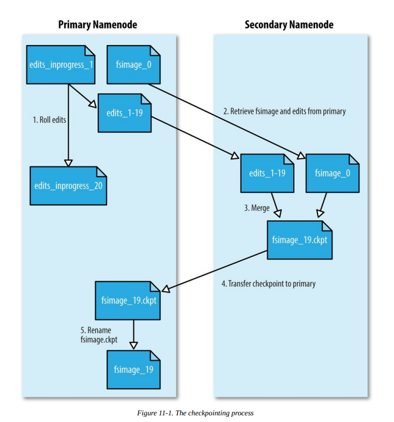

# Chapter 11. Administering Hadoop

The previous chapter was devoted to setting up a Hadoop cluster. In this chapter, we look
at the procedures to keep a cluster running smoothly.

## HDFS

### Persistent Data Structures \ 数据结构稳如狗

As an administrator, it is invaluable to have a basic understanding of how the components
of HDFS — the namenode, the secondary namenode, and the datanodes — organize their
persistent data on disk. Knowing which files are which can help you diagnose problems or
spot that something is awry.\
`了解HDFS里面的文件都是啥,帮助你诊断问题定位错误`

### Namenode directory structure \ NameNode 目录结构

A running namenode has a directory structure like this:\
`从本地看Namenode的样子`\
`结构是这样的:`

```bash
${dfs.namenode.name.dir}/
├── current
│ ├── VERSION
│ ├── edits_0000000000000000001-0000000000000000019
│ ├── edits_inprogress_0000000000000000020
│ ├── fsimage_0000000000000000000
│ ├── fsimage_0000000000000000000.md5
│ ├── fsimage_0000000000000000019
│ ├── fsimage_0000000000000000019.md5
│ └── seen_txid
└── in_use.lock
```

以20171101测试集群为例(一下都是)
李:

```bash
[root@BigData-02 nn]# pwd
/home/dfs/nn
[root@BigData-02 current]# pwd
/home/dfs/nn/current
## 截取 current里面部分文件
edits_0000000000002424733-0000000000002427411
edits_0000000000002427412-0000000000002430096
edits_0000000000002430097-0000000000002432781
edits_0000000000002432782-0000000000002435665
edits_inprogress_0000000000002435666
fsimage_0000000000002432781
fsimage_0000000000002432781.md5
fsimage_0000000000002435665
fsimage_0000000000002435665.md5
seen_txid
VERSION
```

Recall from Chapter 10 that the `dfs.namenode.name.dir` property is a list of directories,
with the same contents mirrored in each directory. This mechanism provides resilience,
particularly if one of the directories is an NFS mount, as is recommended.
The VERSION file is a Java properties file that contains information about the version of
HDFS that is running. Here are the contents of a typical file:\
`之前说了,dfs.namenode.name.dir是一组目录,每组目录中内容相同.这种机制保证了可靠性,特别是其中一个目录是NFS mount.`\
`VERSION 文件是一个 Java properties file包含运行的HDFS版本信息`

```bash
#Mon Sep 29 09:54:36 BST 2014
namespaceID=1342387246
clusterID=CID-01b5c398-959c-4ea8-aae6-1e0d9bd8b142
cTime=0
storageType=NAME_NODE
blockpoolID=BP-526805057-127.0.0.1-1411980876842
layoutVersion=-57 # persistent data structures ; 和hadoop版本没啥关系,当layout改变,这个数字减一
```

The `layoutVersion` is a negative integer that defines the version of HDFS’s persistent
data structures. This version number has no relation to the release number of the Hadoop
distribution. Whenever the layout changes, the version number is decremented (for
example, the version after −57 is −58). When this happens, HDFS needs to be upgraded,
since a newer namenode (or datanode) will not operate if its storage layout is an older
version. Upgrading HDFS is covered in Upgrades.\
`layoutVersion.`

The namespaceID is a unique identifier for the filesystem namespace, which is created
when the namenode is first formatted. The clusterID is a unique identifier for the HDFS
cluster as a whole; this is important for HDFS federation (see HDFS Federation), where a
cluster is made up of multiple namespaces and each namespace is managed by one
namenode. The blockpoolID is a unique identifier for the block pool containing all the
files in the namespace managed by this namenode.\
`namespaceID是文件系统命名空间中的唯一标识`\
`clusterID集群标识`\
`blockpoolID块集合的唯一标识`

The cTime property marks the creation time of the namenode’s storage. For newly
formatted storage, the value is always zero, but it is updated to a timestamp whenever the
filesystem is upgraded.\
`cTime文件系统更新,随之更新`

The storageType indicates that this storage directory contains data structures for a
namenode.

The in_use.lock file is a lock file that the namenode uses to lock the storage directory. This
prevents another namenode instance from running at the same time with (and possibly
corrupting) the same storage directory.\
`用于多个namenode的权限锁`

The other files in the namenode’s storage directory are the edits and fsimage files, and
seen_txid. To understand what these files are for, we need to dig into the workings of the
namenode a little more.\
`edits和fsimage,seen_txid,以下`

### The filesystem image and edit log

When a filesystem client performs a write operation (such as creating or moving a file),
the transaction is first recorded in the edit log. The namenode also has an in-memory
representation of the filesystem metadata, which it updates after the edit log has been
modified. The in-memory metadata is used to serve read requests.\
`当客户端进行写操作,比如创建要给文件,这个操作先记录到 edit log 中.内存中也有一份文件的元数据,edit log变动的时候内存元数据也跟着变.内存元数据用于满足读取请求`

Conceptually the edit log is a single entity, but it is represented as a number of files on
disk. Each file is called a segment, and has the prefix edits and a suffix that indicates the
transaction IDs contained in it. Only one file is open for writes at any one time
(edits_inprogress_0000000000000000020 in the preceding example), and it is flushed and
synced after every transaction before a success code is returned to the client. For
namenodes that write to multiple directories, the write must be flushed and synced to
every copy before returning successfully. This ensures that no transaction is lost due to
machine failure.\
`逻辑上(概念上,理论上)上edit log是单一实体,但是在磁盘上看是一组文件,被称作 segment(分段),每个文件有前缀和后缀=>内容是transaction IDs.任何时间只能编译一个文件,事务发生,然后文件flush,synced,然后向客户端返回成功.=>保证数据事务不丢失`

Each fsimage file is a complete persistent checkpoint of the filesystem metadata. (The
suffix indicates the last transaction in the image.) However, it is not updated for every
filesystem write operation, because writing out the fsimage file, which can grow to be
gigabytes in size, would be very slow. This does not compromise resilience because if the
namenode fails, then the latest state of its metadata can be reconstructed by loading the
latest fsimage from disk into memory, and then applying each of the transactions from the
relevant point onward in the edit log. In fact, this is precisely what the namenode does
when it starts up (see Safe Mode).\
`fsimage file是 filesystem metadata是文件系统元数据的一个备份版本.不过并不是每次操作都会同步fsimage.因为写fsimage file消耗很大(fsimage可能有GB大小).如果发生了问题,把fsimage 写到元数据中,然后查找 edit log 同步信息.=> namenode 启动的时候就是这么干的`

```note
NOTE
Each fsimage file contains a serialized form of all the directory and file inodes in the filesystem. Each inode is an
internal representation of a file or directory’s metadata and contains such information as the file’s replication level,
modification and access times, access permissions, block size, and the blocks the file is made up of. For directories,
the modification time, permissions, and quota metadata are stored.
An fsimage file does not record the datanodes on which the blocks are stored. Instead, the namenode keeps this
mapping in memory, which it constructs by asking the datanodes for their block lists when they join the cluster and
periodically afterward to ensure the namenode’s block mapping is up to date.
每个fsimage file包含一个序列化结构=>文件系统的,目录和文件索引节点.每个索引节点代表一个文件或目录的源信息,包含:
--对于文件 文件副本数量,修改时间,权限问题,块大小,文件包含那些块
--对于目录 修改时间,权限,元数据配置???
```

As described, the edit log would grow without bound (even if it was spread across several
physical edits files). Though this state of affairs would have no impact on the system while
the namenode is running, if the namenode were restarted, it would take a long time to
apply each of the transactions in its (very long) edit log. During this time, the filesystem
would be offline, which is generally undesirable.\
`edit log会不断增加.正常情况下没啥问题,一旦namenode重启,可能会用很久来校对edit log`

The solution is to run the secondary namenode, whose purpose is to produce checkpoints
of the primary’s in-memory filesystem metadata.
[77] The checkpointing process proceeds
as follows (and is shown schematically in Figure 11-1 for the edit log and image files
shown earlier):\
`办法是运行secondary namenode=>生成primary的内存源数据的 checkpoint,实现流程如下:`

```note
1. The secondary asks the primary to roll its in-progress edits file, so new edits go to a
new file. The primary also updates the seen_txid file in all its storage directories.
二号让一号roll他的正在编辑的文件,这样新的edit go to 新的文件.primary同事也更新所有存储目录中的 seen_txid 文件
2. The secondary retrieves the latest fsimage and edits files from the primary (using
HTTP GET).
secondary获取最新的fsimage和edits file=> 通过HTTP GET
3. The secondary loads fsimage into memory, applies each transaction from edits, then
creates a new merged fsimage file.
secondary 导入fsimage到内存,然后拿新edit=> merge 处新的额fsimage file
4. The secondary sends the new fsimage back to the primary (using HTTP PUT), and
the primary saves it as a temporary .ckpt file.
把 secondary 生成的fsimage 还给primary=>HTTP PUT. 然后primary 将他存为 .ckpt临时文件
5. The primary renames the temporary fsimage file to make it available.
primary将临时fsimage 重命名,然后就能用了
```

At the end of the process, the primary has an up-to-date fsimage file and a short inprogress
edits file (it is not necessarily empty, as it may have received some edits while
the checkpoint was being taken). It is possible for an administrator to run this process
manually while the namenode is in safe mode, using the hdfs dfsadmin -saveNamespace
command.\
`这个流程最后,primary获得一个新版fsimage文件和最近期的edit file.用户可以手动执行这个步骤=> hdfs dfsadmin -saveNamespace`

This procedure makes it clear why the secondary has similar memory requirements to the
primary (since it loads the fsimage into memory), which is the reason that the secondary
needs a dedicated machine on large clusters.\
`这就是为啥secondary和primary要同等的内存大小,硬件配置,大集群`

The schedule for checkpointing is controlled by two configuration parameters. The
secondary namenode checkpoints every hour (`dfs.namenode.checkpoint.period` in
`seconds`), or sooner if the edit log has reached one million transactions since the last
checkpoint (`dfs.namenode.checkpoint.txns`), which it checks every minute
(`dfs.namenode.checkpoint.check.period` in `seconds`).\
`有两个参数控制checkpointing的时间 , 一个是周期时间,一个是触发值.周期时间内达到触发值会提前check`



### Secondary namenode directory structure

The layout of the secondary’s checkpoint directory (dfs.namenode.checkpoint.dir) is
identical(完全相同) to the namenode’s. This is by design, since in the event of total namenode failure
(when there are no recoverable backups, even from NFS), it allows recovery from a
secondary namenode. This can be achieved either by copying the relevant storage
directory to a new namenode or, if the secondary is taking over as the new primary
namenode, by using the `-importCheckpoint` option when starting the namenode daemon.
The -importCheckpoint option will load the namenode metadata from the latest
checkpoint in the directory defined by the dfs.namenode.checkpoint.dir property, but
only if there is no metadata in the `dfs.namenode.name.dir directory`, to ensure that there
is no risk of overwriting precious metadata.

和primary 完全相同

### Datanode directory structure \ Datanode结构

Unlike namenodes, datanodes do not need to be explicitly formatted, because they create
their storage directories automatically on startup. Here are the key files and directories:

```bash
${dfs.datanode.data.dir}/
├── current
│ ├── BP-526805057-127.0.0.1-1411980876842
│ │ └── current
│ │ ├── VERSION
│ │ ├── finalized
│ │ │ ├── blk_1073741825
│ │ │ ├── blk_1073741825_1001.meta
│ │ │ ├── blk_1073741826
│ │ │ └── blk_1073741826_1002.meta
│ │ └── rbw
│ └── VERSION
└── in_use.lock
```

李:

```bash
##测试节点
[root@BigData-04 dn]# ls
current  in_use.lock
[root@BigData-04 current]# ls
BP-1158784224-10.1.2.43-1507706383834  VERSION
[root@BigData-04 BP-1158784224-10.1.2.43-1507706383834]# ls
current  scanner.cursor  tmp
## 等等不细看了
[root@BigData-04 rbw]# pwd
/home/dfs/dn/current/BP-1158784224-10.1.2.43-1507706383834/current/rbw
[root@BigData-04 rbw]# ls
blk_1073932085  blk_1073932085_191389.meta  blk_1073932086  blk_1073932086_191390.meta  blk_1073932088  blk_1073932088_191392.meta
```

HDFS blocks are stored in files with a blk_ prefix; they consist of the raw bytes of a
portion of the file being stored. Each block has an associated metadata file with a .meta
suffix. It is made up of a header with version and type information, followed by a series of
checksums for sections of the block.\
`HDFS block以 blk前缀存储,是存储文件的portion,没经过什么加工. 每个块都附加一个 .meta后缀,其中有版本信息,类型信息,block中每个部分的chechsum`

Each block belongs to a block pool, and each block pool has its own storage directory that
is formed from its ID (it’s the same block pool ID from the namenode’s VERSION file).\
`每个block是block pool的一部分,每个block pool有独立的存储目录`

When the number of blocks in a directory grows to a certain size, the datanode creates a
new subdirectory in which to place new blocks and their accompanying metadata. It
creates a new subdirectory every time the number of blocks in a directory reaches 64 (set
by the `dfs.datanode.numblocks` configuration property). The effect is to have a tree with
high fan-out, so even for systems with a very large number of blocks, the directories will
be only a few levels deep. By taking this measure, the datanode ensures that there is a
manageable number of files per directory, which avoids the problems that most operating
systems encounter when there are a large number of files (tens or hundreds of thousands)
in a single directory.\
`当目录下block到了一定数量,datanode 创建一个新的subdirectory放新的块和对应信息(64个); 影响是生成了一个树结构,这样及时有很多block,目录也不太深,也不会造成一个目录下很多个文件`

If the configuration property `dfs.datanode.data.dir` specifies multiple directories on
different drives, blocks are written in a round-robin fashion. Note that blocks are not
replicated on each drive on a single datanode; instead, block replication is across distinct
datanodes.\
`如果数据目录有多个,块 会被轮流存储,复制品放在不同节点`

### Safe Mode

When the namenode starts, the first thing it does is load its image file (fsimage) into
memory and apply the edits from the edit log. Once it has reconstructed a consistent inmemory
image of the filesystem metadata, it creates a new fsimage file (effectively doing
the checkpoint itself, without recourse to the secondary namenode) and an empty edit log.
During this process, the namenode is running in safe mode, which means that it offers only
a read-only view of the filesystem to clients.\
`namenode启动,首先加载 fsimage ,请求edit,当image在内存中完成后,创建新的fsimage和一个空的edit log.整个流程中系统处于safe mode`

```note
WARNING
Strictly speaking, in safe mode, only filesystem operations that access the filesystem metadata (such as producing a
directory listing) are guaranteed to work. Reading a file will work only when the blocks are available on the current
set of datanodes in the cluster, and file modifications (writes, deletes, or renames) will always fail.
```

Recall that the locations of blocks in the system are not persisted by the namenode; this
information resides with the datanodes, in the form of a list of the blocks each one is
storing. During normal operation of the system, the namenode has a map of block
locations stored in memory. Safe mode is needed to give the datanodes time to check in to
the namenode with their block lists, so the namenode can be informed of enough block
locations to run the filesystem effectively. If the namenode didn’t wait for enough
datanodes to check in, it would start the process of replicating blocks to new datanodes,
which would be unnecessary in most cases (because it only needed to wait for the extra
datanodes to check in) and would put a great strain on the cluster’s resources. Indeed,
while in safe mode, the namenode does not issue any block-replication or deletion
instructions to datanodes.\
`要注意,块的位置不是namenode决定的,datanode里面存储块的列,safe mode时,datanode和namenode交流,核对信息什么的`

Safe mode is exited when the minimal replication condition is reached, plus an extension
time of 30 seconds. The minimal replication condition is when 99.9% of the blocks in the
whole filesystem meet their minimum replication level (which defaults to 1 and is set by
dfs.namenode.replication.min; see Table 11-1).\
`安全模式会在集群确认数据的备份数量足够(99.9%的block达到备份数量)之后,延迟30秒自动解除.`

When you are starting a newly formatted HDFS cluster, the namenode does not go into
safe mode, since there are no blocks in the system.

`Table 11-1. Safe mode properties`
|Property name |Type |Default value |Description
|-|-|-|-
|dfs.namenode.replication.min |int |1 |The minimum number of replicas that have to be written for a write to be successful.
|dfs.namenode.safemode.threshold-pct |float |0.999 |The proportion of blocks in the system that must meet the minimum replication level defined by dfs.namenode.replication.min before the namenode will exit safe mode. Setting this value to 0 or less forces the namenode not to start in safe mode. Setting this value to more than 1 means the namenode never exits safe mode.
|dfs.namenode.safemode.extension |int |30000 |The time, in milliseconds, to extend safe mode after the minimum replication condition defined by dfs.namenode.safemode.threshold-pct has been satisfied. For small clusters (tens of nodes), it can be set to 0.

#### Entering and leaving safe mode

To see whether the namenode is in safe mode, you can use the dfsadmin command:

```bash
% hdfs dfsadmin -safemode get
Safe mode is ON
```

The front page of the HDFS web UI provides another indication of whether the namenode
is in safe mode.
Sometimes you want to wait for the namenode to exit safe mode before carrying out a
command, particularly in scripts. The wait option achieves this:

```bash
% hdfs dfsadmin -safemode wait
# command to read or write a file
```

An administrator has the ability to make the namenode enter or leave safe mode at any
time. It is sometimes necessary to do this when carrying out maintenance on the cluster or
after upgrading a cluster, to confirm that data is still readable. To enter safe mode, use the
following command:

```bash
% hdfs dfsadmin -safemode enter
Safe mode is ON
```

You can use this command when the namenode is still in safe mode while starting up to
ensure that it never leaves safe mode. Another way of making sure that the namenode
stays in safe mode indefinitely is to set the property dfs.namenode.safemode.thresholdpct
to a value over 1.

You can make the namenode leave safe mode by using the following:

```bash
% hdfs dfsadmin -safemode leave
Safe mode is OFF
```

## Audit Logging \ 审核日志

HDFS can log all filesystem access requests, a feature that some organizations require for
auditing purposes. Audit logging is implemented using `log4j logging at the INFO level`. In
the default configuration it is disabled, but it’s easy to enable by adding the following line
to hadoop-env.sh:

export HDFS_AUDIT_LOGGER="INFO,RFAAUDIT"

A log line is written to the audit log (hdfs-audit.log) for every HDFS event. Here’s an
example for a list status request on /user/tom:

```log
2014-09-30 21:35:30,484 INFO FSNamesystem.audit: allowed=true ugi=tom
(auth:SIMPLE) ip=/127.0.0.1 cmd=listStatus src=/user/tom dst=null
perm=null proto=rpc
```

## Tools

### dfsadmin

The dfsadmin tool is a multipurpose tool for finding information about the state of HDFS,
as well as for performing administration operations on HDFS. It is invoked as hdfs
dfsadmin and requires superuser privileges.

Some of the available commands to dfsadmin are described in Table 11-2. Use the -help
command to get more information.

`Table 11-2. dfsadmin commands`
|Command |Description
|-|-
|-help |Shows help for a given command, or all commands if no command is specified.
|-report |Shows filesystem statistics (similar to those shown in the web UI) and information on connected datanodes.`查看分析数据`
|-metasave |Dumps information to a file in Hadoop’s log directory about blocks that are being replicated or deleted, as well as a list of connected datanodes.`把正在被复制或删除的块信息以及相关的datanodes信息,写入log`
|-safemode |Changes or queries the state of safe mode. See Safe Mode.
|-saveNamespace |Saves the current in-memory filesystem image to a new fsimage file and resets the edits file. This operation may be performed only in safe mode.`把当前内存中的文件系统image写成新的fsimage,重置edits file(只能在safe mode下执行)`
|-fetchImage |Retrieves the latest fsimage from the namenode and saves it in a local file.`获取最新fsimage保存至本地`
|-refreshNodes |Updates the set of datanodes that are permitted to connect to the namenode. See Commissioning and Decommissioning Nodes.`更新datanodes信息`
|-upgradeProgress |Gets information on the progress of an HDFS upgrade or forces an upgrade to proceed. See Upgrades.
|-finalizeUpgrade |Removes the previous version of the namenode and datanode storage directories. Used after an upgrade has been applied and the cluster is running successfully on the new version. See Upgrades.
|-setQuota |Sets directory quotas. Directory quotas set a limit on the number of names (files or directories) in the directory tree. Directory quotas are useful for preventing users from creating large numbers of small files, a measure that helps preserve the namenode’s memory (recall that accounting information for every file, directory, and block in the filesystem is stored in memory).`设置配额=>用以限制某个目录下文件的上限,防止创建过多文件(小文件)`
|-clrQuota |Clears specified directory quotas.
|-setSpaceQuota |Sets space quotas on directories. Space quotas set a limit on the size of files that may be stored in a directory tree. They are useful for giving users a limited amount of storage.
|-clrSpaceQuota |Clears specified space quotas.
|-refreshServiceAcl |Refreshes the namenode’s service-level authorization policy file.
|-allowSnapshot |Allows snapshot creation for the specified directory.`允许快照`
|-disallowSnapshot |Disallows snapshot creation for the specified directory.

### Filesystem check (fsck)

Hadoop provides an fsck utility for checking the health of files in HDFS. The tool looks
for blocks that are missing from all datanodes, as well as under- or over-replicated blocks.
Here is an example of checking the whole filesystem for a small cluster:\
`Hadoop提供一个检查HDFS文件健康状况的工具=>检查block的replica情况`

```bash
% hdfs fsck /
......................Status: HEALTHY
Total size: 511799225 B
Total dirs: 10
Total files: 22
Total blocks (validated): 22 (avg. block size 23263601 B)
Minimally replicated blocks: 22 (100.0 %)
Over-replicated blocks: 0 (0.0 %)
Under-replicated blocks: 0 (0.0 %)
Mis-replicated blocks: 0 (0.0 %)
Default replication factor: 3
Average block replication: 3.0
Corrupt blocks: 0
Missing replicas: 0 (0.0 %)
Number of data-nodes: 4
Number of racks: 1
The filesystem under path '/' is HEALTHY
```

fsck recursively walks the filesystem namespace, starting at the given path (here the
filesystem root), and checks the files it finds. It prints a dot for every file it checks. To
check a file, fsck retrieves the metadata for the file’s blocks and looks for problems or
inconsistencies. Note that fsck retrieves all of its information from the namenode; it does
not communicate with any datanodes to actually retrieve any block data.\
`fsck从namenode获取信息,不联系datanode`

Most of the output from fsck is self-explanatory, but here are some of the conditions it
looks for:

- Over-replicated blocks

These are blocks that exceed their target replication for the file they belong to.
Normally, over-replication is not a problem, and HDFS will automatically delete excess
replicas.

- Under-replicated blocks

These are blocks that do not meet their target replication for the file they belong to.
HDFS will automatically create new replicas of under-replicated blocks until they meet
the target replication. You can get information about the blocks being replicated (or
waiting to be replicated) using hdfs dfsadmin -metasave.

- Misreplicated blocks

These are blocks that do not satisfy the block replica placement policy (see Replica
Placement). For example, for a replication level of three in a multirack cluster, if all
three replicas of a block are on the same rack, then the block is misreplicated because
the replicas should be spread across at least two racks for resilience. HDFS will
automatically re-replicate misreplicated blocks so that they satisfy the rack placement
policy.

- Corrupt blocks

These are blocks whose replicas are all corrupt. Blocks with at least one noncorrupt
replica are not reported as corrupt; the namenode will replicate the noncorrupt replica
until the target replication is met.

- Missing replicas

These are blocks with no replicas anywhere in the cluster.

Corrupt or missing blocks are the biggest cause for concern, as they mean data has been
lost. By default, fsck leaves files with corrupt or missing blocks, but you can tell it to
perform one of the following actions on them:\
`损坏与丢失的块需要被关注.`

    Move the affected files to the /lost+found directory in HDFS, using the -move option.
    Files are broken into chains of contiguous blocks to aid any salvaging efforts you may
    attempt.
    Delete the affected files, using the -delete option. Files cannot be recovered after
    being deleted.

#### Finding the blocks for a file \ fsck 可以帮助我们找出 block - file关系

The fsck tool provides an easy way to find out which blocks are in any particular file. For
example:

```bash
% hdfs fsck /user/tom/part-00007 -files -blocks -racks
/user/tom/part-00007 25582428 bytes, 1 block(s): OK
0. blk_-3724870485760122836_1035 len=25582428 repl=3 [/default-rack/10.251.43.2:
50010,/default-rack/10.251.27.178:50010, /default-rack/10.251.123.163:50010]
```

This says that the file `/user/tom/part-00007` is made up of `one block` and shows the
datanodes where the block is located. The fsck options used are as follows:

- The `-files` option shows the line with the `filename, size, number of blocks, and its health (whether there are any missing blocks)`.
- The `-blocks` option shows information about `each block in the file, one line per block`.
- The `-racks` option displays the `rack location and the datanode addresses for each block.`

Running hdfs fsck without any arguments displays full usage instructions.

### Datanode block scanner

Every datanode runs a block scanner, which `periodically verifies` all the blocks stored on
the datanode. This allows bad blocks to be detected and fixed before they are read by
clients. The scanner maintains a list of blocks to verify and scans them one by one for
checksum errors. It employs a throttling mechanism to preserve disk bandwidth on the
datanode.\
`每个dn上有个一个block scanner,周期性的扫描block情况,发现以及处理bad block=>chescksum`

Blocks are verified every three weeks to guard against disk errors over time (this period is
controlled by the `dfs.datanode.scan.period.hours property`, which defaults to 504
hours). Corrupt blocks are reported to the namenode to be fixed.
You can get a block verification report for a datanode by visiting the datanode’s web
interface at http://datanode:50075/blockScannerReport. Here’s an example of a report,
which should be self-explanatory:

```bash
Total Blocks : 21131
Verified in last hour : 70
Verified in last day : 1767
Verified in last week : 7360
Verified in last four weeks : 20057
Verified in SCAN_PERIOD : 20057
Not yet verified : 1074
Verified since restart : 35912
Scans since restart : 6541
Scan errors since restart : 0
Transient scan errors : 0
Current scan rate limit KBps : 1024
Progress this period : 109%
Time left in cur period : 53.08%
```

If you specify the listblocks parameter, http://datanode:50075/blockScannerReport?
listblocks, the report is preceded by a list of all the blocks on the datanode along with their
latest verification status. Here is a snippet of the block list (lines are split to fit the page):

```bash
blk_6035596358209321442 : status : ok type : none scan time :
0 not yet verified
blk_3065580480714947643 : status : ok type : remote scan time :
1215755306400 2008-07-11 05:48:26,400
blk_8729669677359108508 : status : ok type : local scan time :
1215755727345 2008-07-11 05:55:27,345
```

The first column is the block ID, followed by some key-value pairs. The status can be one
of failed or ok, according to whether the last scan of the block detected a checksum error.
The type of scan is local if it was performed by the background thread, remote if it was
performed by a client or a remote datanode, or none if a scan of this block has yet to be
made. The last piece of information is the scan time, which is displayed as the number of
milliseconds since midnight on January 1, 1970, and also as a more readable value.

## Balancer

Over time, the distribution of blocks across datanodes can become unbalanced. An
unbalanced cluster can affect locality for MapReduce, and it puts a greater strain on the
highly utilized datanodes, so it’s best avoided.\
`balancer的执行对集群资源使用很高,最好不要用`

The balancer program is a Hadoop daemon that redistributes blocks by moving them from
overutilized datanodes to underutilized datanodes, while adhering to the block replica
placement policy that makes data loss unlikely by placing block replicas on different racks
(see Replica Placement). It moves blocks until the cluster is deemed to be balanced, which
means that the utilization of every datanode (ratio of used space on the node to total
capacity of the node) differs from the utilization of the cluster (ratio of used space on the
cluster to total capacity of the cluster) by no more than a given threshold percentage. You
can start the balancer with:

`% start-balancer.sh`

The -threshold argument specifies the threshold percentage that defines what it means
for the cluster to be balanced. The flag is optional; if omitted, the threshold is 10%. At any
one time, only one balancer may be running on the cluster.

The balancer runs until the cluster is balanced, it cannot move any more blocks, or it loses
contact with the namenode. It produces a logfile in the standard log directory, where it
writes a line for every iteration of redistribution that it carries out. Here is the output from
a short run on a small cluster (slightly reformatted to fit the page):

```bash
Time Stamp Iteration# Bytes Already Moved ...Left To Move ...Being Moved
Mar 18, 2009 5:23:42 PM 0 0 KB 219.21 MB 150.29 MB
Mar 18, 2009 5:27:14 PM 1 195.24 MB 22.45 MB 150.29 MB
The cluster is balanced. Exiting…
Balancing took 6.072933333333333 minutes
```

The balancer is designed to run in the background without unduly taxing the cluster or
interfering with other clients using the cluster. It limits the bandwidth that it uses to copy a
block from one node to another. The default is a modest 1 MB/s, but this can be changed
by setting the dfs.datanode.balance.bandwidthPerSec property in hdfs-site.xml,
specified in bytes.

## Monitoring

Monitoring is an important part of system administration. In this section, we look at the
monitoring facilities in Hadoop and how they can hook into external monitoring systems.

The purpose of monitoring is to detect when the cluster is not providing the expected level
of service. The master daemons are the most important to monitor: the namenodes
(primary and secondary) and the resource manager. Failure of datanodes and node
managers is to be expected, particularly on larger clusters, so you should provide extra
capacity so that the cluster can tolerate having a small percentage of dead nodes at any
time.

In addition to the facilities described next, some administrators run test jobs on a periodic
basis as a test of the cluster’s health.

Logging

All Hadoop daemons produce logfiles that can be very useful for finding out what is
happening in the system. System logfiles explains how to configure these files.

Setting log levels

When debugging a problem, it is very convenient to be able to change the log level
temporarily for a particular component in the system.

Hadoop daemons have a web page for changing the log level for any log4j log name,
which can be found at /logLevel in the daemon’s web UI. By convention, log names in
Hadoop correspond to the names of the classes doing the logging, although there are
exceptions to this rule, so you should consult the source code to find log names.

It’s also possible to enable logging for all packages that start with a given prefix. For
example, to enable debug logging for all classes related to the resource manager, we
would visit the its web UI at http://resource-manager-host:8088/logLevel and set the log
name org.apache.hadoop.yarn.server.resourcemanager to level DEBUG.

The same thing can be achieved from the command line as follows:

% hadoop daemonlog -setlevel resource-manager-host:8088 \
org.apache.hadoop.yarn.server.resourcemanager DEBUG

Log levels changed in this way are reset when the daemon restarts, which is usually what
you want. However, to make a persistent change to a log level, you can simply change the
log4j.properties file in the configuration directory. In this case, the line to add is:

log4j.logger.org.apache.hadoop.yarn.server.resourcemanager=DEBUG

Getting stack traces

Hadoop daemons expose a web page (/stacks in the web UI) that produces a thread dump
for all running threads in the daemon’s JVM. For example, you can get a thread dump for
a resource manager from http://resource-manager-host:8088/stacks.
Metrics and JMX
The Hadoop daemons collect information about events and measurements that are
collectively known as metrics. For example, datanodes collect the following metrics (and
many more): the number of bytes written, the number of blocks replicated, and the number
of read requests from clients (both local and remote).

NOTE
The metrics system in Hadoop 2 and later is sometimes referred to as metrics2 to distinguish it from the older (now
deprecated) metrics system in earlier versions of Hadoop.

Metrics belong to a context; “dfs,” “mapred,” “yarn,” and “rpc” are examples of different
contexts. Hadoop daemons usually collect metrics under several contexts. For example,
datanodes collect metrics for the “dfs” and “rpc” contexts.

```note
HOW DO METRICS DIFFER FROM COUNTERS?
The main difference is their scope: metrics are collected by Hadoop daemons, whereas counters (see Counters) are
collected for MapReduce tasks and aggregated for the whole job. They have different audiences, too: broadly
speaking, metrics are for administrators, and counters are for MapReduce users.
The way they are collected and aggregated is also different. Counters are a MapReduce feature, and the MapReduce
system ensures that counter values are propagated from the task JVMs where they are produced back to the
application master, and finally back to the client running the MapReduce job. (Counters are propagated via RPC
heartbeats; see Progress and Status Updates.) Both the task process and the application master perform aggregation.
The collection mechanism for metrics is decoupled from the component that receives the updates, and there are
various pluggable outputs, including local files, Ganglia, and JMX. The daemon collecting the metrics performs
aggregation on them before they are sent to the output.
```

All Hadoop metrics are published to JMX (Java Management Extensions), so you can use
standard JMX tools like JConsole (which comes with the JDK) to view them. For remote
monitoring, you must set the JMX system property
com.sun.management.jmxremote.port (and others for security) to allow access. To do
this for the namenode, say, you would set the following in hadoop-env.sh:
HADOOP_NAMENODE_OPTS="-Dcom.sun.management.jmxremote.port=8004"
You can also view JMX metrics (in JSON format) gathered by a particular Hadoop
daemon by connecting to its /jmx web page. This is handy for debugging. For example,
you can view namenode metrics at http://namenode-host:50070/jmx.
Hadoop comes with a number of metrics sinks for publishing metrics to external systems,
such as local files or the Ganglia monitoring system. Sinks are configured in the hadoopmetrics2.properties
file; see that file for sample configuration settings.
www.it-ebooks.info
Maintenance
Routine Administration Procedures
Metadata backups
If the namenode’s persistent metadata is lost or damaged, the entire filesystem is rendered
unusable, so it is critical that backups are made of these files. You should keep multiple
copies of different ages (one hour, one day, one week, and one month, say) to protect
against corruption, either in the copies themselves or in the live files running on the
namenode.
A straightforward way to make backups is to use the dfsadmin command to download a
copy of the namenode’s most recent fsimage:
% hdfs dfsadmin -fetchImage fsimage.backup
You can write a script to run this command from an offsite location to store archive copies
of the fsimage. The script should additionally test the integrity of the copy. This can be
done by starting a local namenode daemon and verifying that it has successfully read the
fsimage and edits files into memory (by scanning the namenode log for the appropriate
success message, for example).
[78]
Data backups
Although HDFS is designed to store data reliably, data loss can occur, just like in any
storage system; thus, a backup strategy is essential. With the large data volumes that
Hadoop can store, deciding what data to back up and where to store it is a challenge. The
key here is to prioritize your data. The highest priority is the data that cannot be
regenerated and that is critical to the business; however, data that is either straightforward
to regenerate or essentially disposable because it is of limited business value is the lowest
priority, and you may choose not to make backups of this low-priority data.
WARNING
Do not make the mistake of thinking that HDFS replication is a substitute for making backups. Bugs in HDFS can
cause replicas to be lost, and so can hardware failures. Although Hadoop is expressly designed so that hardware
failure is very unlikely to result in data loss, the possibility can never be completely ruled out, particularly when
combined with software bugs or human error.
When it comes to backups, think of HDFS in the same way as you would RAID. Although the data will survive the
loss of an individual RAID disk, it may not survive if the RAID controller fails or is buggy (perhaps overwriting
some data), or the entire array is damaged.
It’s common to have a policy for user directories in HDFS. For example, they may have
space quotas and be backed up nightly. Whatever the policy, make sure your users know
what it is, so they know what to expect.
The distcp tool is ideal for making backups to other HDFS clusters (preferably running on
a different version of the software, to guard against loss due to bugs in HDFS) or other
Hadoop filesystems (such as S3) because it can copy files in parallel. Alternatively, you
can employ an entirely different storage system for backups, using one of the methods for
exporting data from HDFS described in Hadoop Filesystems.
HDFS allows administrators and users to take snapshots of the filesystem. A snapshot is a
www.it-ebooks.info
read-only copy of a filesystem subtree at a given point in time. Snapshots are very
efficient since they do not copy data; they simply record each file’s metadata and block
list, which is sufficient to reconstruct the filesystem contents at the time the snapshot was
taken.
Snapshots are not a replacement for data backups, but they are a useful tool for point-intime
data recovery for files that were mistakenly deleted by users. You might have a
policy of taking periodic snapshots and keeping them for a specific period of time
according to age. For example, you might keep hourly snapshots for the previous day and
daily snapshots for the previous month.
Filesystem check (fsck)
It is advisable to run HDFS’s fsck tool regularly (i.e., daily) on the whole filesystem to
proactively look for missing or corrupt blocks. See Filesystem check (fsck).
Filesystem balancer
Run the balancer tool (see Balancer) regularly to keep the filesystem datanodes evenly
balanced.
Commissioning and Decommissioning Nodes
As an administrator of a Hadoop cluster, you will need to add or remove nodes from time
to time. For example, to grow the storage available to a cluster, you commission new
nodes. Conversely, sometimes you may wish to shrink a cluster, and to do so, you
decommission nodes. Sometimes it is necessary to decommission a node if it is
misbehaving, perhaps because it is failing more often than it should or its performance is
noticeably slow.
Nodes normally run both a datanode and a node manager, and both are typically
commissioned or decommissioned in tandem.
Commissioning new nodes
Although commissioning a new node can be as simple as configuring the hdfs-site.xml file
to point to the namenode, configuring the yarn-site.xml file to point to the resource
manager, and starting the datanode and resource manager daemons, it is generally best to
have a list of authorized nodes.
It is a potential security risk to allow any machine to connect to the namenode and act as a
datanode, because the machine may gain access to data that it is not authorized to see.
Furthermore, because such a machine is not a real datanode, it is not under your control
and may stop at any time, potentially causing data loss. (Imagine what would happen if a
number of such nodes were connected and a block of data was present only on the “alien”
nodes.) This scenario is a risk even inside a firewall, due to the possibility of
misconfiguration, so datanodes (and node managers) should be explicitly managed on all
production clusters.
Datanodes that are permitted to connect to the namenode are specified in a file whose
name is specified by the dfs.hosts property. The file resides on the namenode’s local
filesystem, and it contains a line for each datanode, specified by network address (as
reported by the datanode; you can see what this is by looking at the namenode’s web UI).
www.it-ebooks.info
If you need to specify multiple network addresses for a datanode, put them on one line,
separated by whitespace.
Similarly, node managers that may connect to the resource manager are specified in a file
whose name is specified by the yarn.resourcemanager.nodes.include-path property. In
most cases, there is one shared file, referred to as the include file, that both dfs.hosts and
yarn.resourcemanager.nodes.include-path refer to, since nodes in the cluster run both
datanode and node manager daemons.
NOTE
The file (or files) specified by the dfs.hosts and yarn.resourcemanager.nodes.include-path properties is
different from the slaves file. The former is used by the namenode and resource manager to determine which worker
nodes may connect. The slaves file is used by the Hadoop control scripts to perform cluster-wide operations, such as
cluster restarts. It is never used by the Hadoop daemons.
To add new nodes to the cluster:
1. Add the network addresses of the new nodes to the include file.
2. Update the namenode with the new set of permitted datanodes using this command:
% hdfs dfsadmin -refreshNodes
3. Update the resource manager with the new set of permitted node managers using:
% yarn rmadmin -refreshNodes
4. Update the slaves file with the new nodes, so that they are included in future
operations performed by the Hadoop control scripts.
5. Start the new datanodes and node managers.
6. Check that the new datanodes and node managers appear in the web UI.
HDFS will not move blocks from old datanodes to new datanodes to balance the cluster.
To do this, you should run the balancer described in Balancer.
Decommissioning old nodes
Although HDFS is designed to tolerate datanode failures, this does not mean you can just
terminate datanodes en masse with no ill effect. With a replication level of three, for
example, the chances are very high that you will lose data by simultaneously shutting
down three datanodes if they are on different racks. The way to decommission datanodes
is to inform the namenode of the nodes that you wish to take out of circulation, so that it
can replicate the blocks to other datanodes before the datanodes are shut down.
With node managers, Hadoop is more forgiving. If you shut down a node manager that is
running MapReduce tasks, the application master will notice the failure and reschedule the
tasks on other nodes.
The decommissioning process is controlled by an exclude file, which is set for HDFS iby
the dfs.hosts.exclude property and for YARN by the
yarn.resourcemanager.nodes.exclude-path property. It is often the case that these
properties refer to the same file. The exclude file lists the nodes that are not permitted to
connect to the cluster.
The rules for whether a node manager may connect to the resource manager are simple: a
node manager may connect only if it appears in the include file and does not appear in the
www.it-ebooks.info
exclude file. An unspecified or empty include file is taken to mean that all nodes are in the
include file.
For HDFS, the rules are slightly different. If a datanode appears in both the include and
the exclude file, then it may connect, but only to be decommissioned. Table 11-3
summarizes the different combinations for datanodes. As for node managers, an
unspecified or empty include file means all nodes are included.
Table 11-3. HDFS include and exclude file precedence
Node appears in include file Node appears in exclude file Interpretation
No No Node may not connect.
No Yes Node may not connect.
Yes No Node may connect.
Yes Yes Node may connect and will be decommissioned.
To remove nodes from the cluster:
1. Add the network addresses of the nodes to be decommissioned to the exclude file.
Do not update the include file at this point.
2. Update the namenode with the new set of permitted datanodes, using this command:
% hdfs dfsadmin -refreshNodes
3. Update the resource manager with the new set of permitted node managers using:
% yarn rmadmin -refreshNodes
4. Go to the web UI and check whether the admin state has changed to “Decommission
In Progress” for the datanodes being decommissioned. They will start copying their
blocks to other datanodes in the cluster.
5. When all the datanodes report their state as “Decommissioned,” all the blocks have
been replicated. Shut down the decommissioned nodes.
6. Remove the nodes from the include file, and run:
% hdfs dfsadmin -refreshNodes
% yarn rmadmin -refreshNodes
7. Remove the nodes from the slaves file.
Upgrades
Upgrading a Hadoop cluster requires careful planning. The most important consideration
is the HDFS upgrade. If the layout version of the filesystem has changed, then the upgrade
will automatically migrate the filesystem data and metadata to a format that is compatible
with the new version. As with any procedure that involves data migration, there is a risk of
data loss, so you should be sure that both your data and the metadata are backed up (see
Routine Administration Procedures).
Part of the planning process should include a trial run on a small test cluster with a copy of
data that you can afford to lose. A trial run will allow you to familiarize yourself with the
process, customize it to your particular cluster configuration and toolset, and iron out any
snags before running the upgrade procedure on a production cluster. A test cluster also has
the benefit of being available to test client upgrades on. You can read about general
www.it-ebooks.info
compatibility concerns for clients in the following sidebar.
COMPATIBILITY
When moving from one release to another, you need to think about the upgrade steps that are needed. There are
several aspects to consider: API compatibility, data compatibility, and wire compatibility.
API compatibility concerns the contract between user code and the published Hadoop APIs, such as the Java
MapReduce APIs. Major releases (e.g., from 1.x.y to 2.0.0) are allowed to break API compatibility, so user programs
may need to be modified and recompiled. Minor releases (e.g., from 1.0.x to 1.1.0) and point releases (e.g., from 1.0.1
to 1.0.2) should not break compatibility.
NOTE
Hadoop uses a classification scheme for API elements to denote their stability. The
preceding rules for API compatibility cover those elements that are marked
InterfaceStability.Stable. Some elements of the public Hadoop APIs, however, are
marked with the InterfaceStability.Evolving or InterfaceStability.Unstable
annotations (all these annotations are in the org.apache.hadoop.classification
package), which mean they are allowed to break compatibility on minor and point
releases, respectively.
Data compatibility concerns persistent data and metadata formats, such as the format in which the HDFS namenode
stores its persistent data. The formats can change across minor or major releases, but the change is transparent to
users because the upgrade will automatically migrate the data. There may be some restrictions about upgrade paths,
and these are covered in the release notes. For example, it may be necessary to upgrade via an intermediate release
rather than upgrading directly to the later final release in one step.
Wire compatibility concerns the interoperability between clients and servers via wire protocols such as RPC and
HTTP. The rule for wire compatibility is that the client must have the same major release number as the server, but
may differ in its minor or point release number (e.g., client version 2.0.2 will work with server 2.0.1 or 2.1.0, but not
necessarily with server 3.0.0).
NOTE
This rule for wire compatibility differs from earlier versions of Hadoop, where internal
clients (like datanodes) had to be upgraded in lockstep with servers. The fact that
internal client and server versions can be mixed allows Hadoop 2 to support rolling
upgrades.
The full set of compatibility rules that Hadoop adheres to are documented at the Apache Software Foundation’s
website.
Upgrading a cluster when the filesystem layout has not changed is fairly straightforward:
install the new version of Hadoop on the cluster (and on clients at the same time), shut
down the old daemons, update the configuration files, and then start up the new daemons
and switch clients to use the new libraries. This process is reversible, so rolling back an
upgrade is also straightforward.
After every successful upgrade, you should perform a couple of final cleanup steps:
1. Remove the old installation and configuration files from the cluster.
2. Fix any deprecation warnings in your code and configuration.
Upgrades are where Hadoop cluster management tools like Cloudera Manager and Apache
Ambari come into their own. They simplify the upgrade process and also make it easy to
do rolling upgrades, where nodes are upgraded in batches (or one at a time for master
nodes), so that clients don’t experience service interruptions.
HDFS data and metadata upgrades
If you use the procedure just described to upgrade to a new version of HDFS and it
www.it-ebooks.info
expects a different layout version, then the namenode will refuse to run. A message like
the following will appear in its log:
File system image contains an old layout version -16.
An upgrade to version -18 is required.
Please restart NameNode with -upgrade option.
The most reliable way of finding out whether you need to upgrade the filesystem is by
performing a trial on a test cluster.
An upgrade of HDFS makes a copy of the previous version’s metadata and data. Doing an
upgrade does not double the storage requirements of the cluster, as the datanodes use hard
links to keep two references (for the current and previous version) to the same block of
data. This design makes it straightforward to roll back to the previous version of the
filesystem, if you need to. You should understand that any changes made to the data on the
upgraded system will be lost after the rollback completes, however.
You can keep only the previous version of the filesystem, which means you can’t roll back
several versions. Therefore, to carry out another upgrade to HDFS data and metadata, you
will need to delete the previous version, a process called finalizing the upgrade. Once an
upgrade is finalized, there is no procedure for rolling back to a previous version.
In general, you can skip releases when upgrading, but in some cases, you may have to go
through intermediate releases. The release notes make it clear when this is required.
You should only attempt to upgrade a healthy filesystem. Before running the upgrade, do a
full fsck (see Filesystem check (fsck)). As an extra precaution, you can keep a copy of the
fsck output that lists all the files and blocks in the system, so you can compare it with the
output of running fsck after the upgrade.
It’s also worth clearing out temporary files before doing the upgrade — both local
temporary files and those in the MapReduce system directory on HDFS.
With these preliminaries out of the way, here is the high-level procedure for upgrading a
cluster when the filesystem layout needs to be migrated:
1. Ensure that any previous upgrade is finalized before proceeding with another
upgrade.
2. Shut down the YARN and MapReduce daemons.
3. Shut down HDFS, and back up the namenode directories.
4. Install the new version of Hadoop on the cluster and on clients.
5. Start HDFS with the -upgrade option.
6. Wait until the upgrade is complete.
7. Perform some sanity checks on HDFS.
8. Start the YARN and MapReduce daemons.
9. Roll back or finalize the upgrade (optional).
While running the upgrade procedure, it is a good idea to remove the Hadoop scripts from
your PATH environment variable. This forces you to be explicit about which version of the
scripts you are running. It can be convenient to define two environment variables for the
new installation directories; in the following instructions, we have defined
OLD_HADOOP_HOME and NEW_HADOOP_HOME.
www.it-ebooks.info
Start the upgrade
To perform the upgrade, run the following command (this is step 5 in the high-level
upgrade procedure):
% $NEW_HADOOP_HOME/bin/start-dfs.sh -upgrade
This causes the namenode to upgrade its metadata, placing the previous version in a new
directory called previous under dfs.namenode.name.dir. Similarly, datanodes upgrade
their storage directories, preserving the old copy in a directory called previous.
Wait until the upgrade is complete
The upgrade process is not instantaneous, but you can check the progress of an upgrade
using dfsadmin (step 6; upgrade events also appear in the daemons’ logfiles):
% $NEW_HADOOP_HOME/bin/hdfs dfsadmin -upgradeProgress status
Upgrade for version -18 has been completed.
Upgrade is not finalized.
Check the upgrade
This shows that the upgrade is complete. At this stage, you should run some sanity checks
(step 7) on the filesystem (e.g., check files and blocks using fsck, test basic file
operations). You might choose to put HDFS into safe mode while you are running some of
these checks (the ones that are read-only) to prevent others from making changes; see Safe
Mode.
Roll back the upgrade (optional)
If you find that the new version is not working correctly, you may choose to roll back to
the previous version (step 9). This is possible only if you have not finalized the upgrade.
WARNING
A rollback reverts the filesystem state to before the upgrade was performed, so any changes made in the meantime
will be lost. In other words, it rolls back to the previous state of the filesystem, rather than downgrading the current
state of the filesystem to a former version.
First, shut down the new daemons:
% $NEW_HADOOP_HOME/bin/stop-dfs.sh
Then start up the old version of HDFS with the -rollback option:
% $OLD_HADOOP_HOME/bin/start-dfs.sh -rollback
This command gets the namenode and datanodes to replace their current storage
directories with their previous copies. The filesystem will be returned to its previous state.
Finalize the upgrade (optional)
When you are happy with the new version of HDFS, you can finalize the upgrade (step 9)
to remove the previous storage directories.
WARNING
After an upgrade has been finalized, there is no way to roll back to the previous version.
This step is required before performing another upgrade:
% $NEW_HADOOP_HOME/bin/hdfs dfsadmin -finalizeUpgrade
% $NEW_HADOOP_HOME/bin/hdfs dfsadmin -upgradeProgress status
www.it-ebooks.info
There are no upgrades in progress.
HDFS is now fully upgraded to the new version.
[77]
It is actually possible to start a namenode with the -checkpoint option so that it runs the checkpointing process
against another (primary) namenode. This is functionally equivalent to running a secondary namenode, but at the time of
this writing offers no advantages over the secondary namenode (and indeed, the secondary namenode is the most tried
and tested option). When running in a high-availability environment (see HDFS High Availability), the standby node
performs checkpointing.
[78] Hadoop comes with an Offline Image Viewer and an Offline Edits Viewer, which can be used to check the integrity
of the fsimage and edits files. Note that both viewers support older formats of these files, so you can use them to
diagnose problems in these files generated by previous releases of Hadoop. Type hdfs oiv and hdfs oev to invoke these
tools.
www.it-ebooks.info