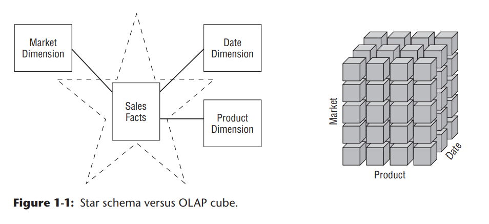

# Data Warehousing,Business Intelligence,and Dimensional Modeling Primer

`This first chapter lays the groundwork for the following chapters. We begin by
considering data warehousing and business intelligence (DW/BI) systems from
a high-level perspective`

- Chapter 1 discusses the following concepts:
  - ■ Business-driven goals of data warehousing and business intelligence
  - ■ Publishing metaphor for DW/BI systems
  - ■ Dimensional modeling core concepts and vocabulary, including fact and dimension tables
  - ■ Kimball DW/BI architecture’s components and tenets
  - ■ Comparison of alternative DW/BI architectures, and the role of dimensional modeling within each
  - ■ Misunderstandings about dimensional modeling

## Different Worlds of Data Capture and Data Analysis \ 数据采集 和 数据分析

One of the most important assets of any organization is its information. This asset is almost always used for two purposes: `operational record keeping` and `analytical decision making`. Simply speaking, the operational systems are where you put the data in, and the DW/BI system is where you get the data out.\
`数据资产两大存在目的:1-操作记录,2-决策依据`,操作系统写入数据,DW/BI系统输出数据

Users of an operational system turn the wheels of the organization`(改变...的运行方式)`. They take orders, sign up new customers, monitor the status of operational activities, and log complaints. The operational systems are optimized to process transactions quickly. These systems almost always deal with one transaction record at a time. They predictably perform the same operational tasks over and over, executing the organization’s business processes. Given this execution focus, operational systems typically do not maintain history, but rather update data to refl ect the most current state.\
`基于以上特点,操作系统通常不存储历史,一般都是更新状态`

Users of a DW/BI system, on the other hand, watch the wheels of the organization turn to evaluate performance. They count the new orders and compare them with last week’s orders, and ask why the new customers signed up, and what the customers complained about. They worry about whether operational processes are working correctly. Although they need detailed data to support their constantly changing questions, DW/BI users almost never deal with one transaction at a time. These systems are optimized for high-performance queries as users’ questions often require that hundreds or hundreds of thousands of transactions be searched and compressed into an answer set. To further complicate matters, users of a DW/BI system typically demand that historical context be preserved to accurately evaluate the organization’s performance over time.\
`DW/BI系统,监控?整个组织的运行情况.DW/BI系统通常不考虑单条记录,而是在更高的层面找寻一些问题的答案,所以系统需要历史数据用于精确评估一段时间内组织的运作情况`

In the first edition of The Data Warehouse Toolkit (Wiley, 1996), Ralph Kimball devoted an entire chapter to describe the dichotomy`(二分法)` between the worlds of operational processing and data warehousing. At this time, it is widely recognized that the DW/BI system has profoundly different needs, clients, structures, and rhythms than the operational systems of record. Unfortunately, we still encounter supposed DW/BI systems that are mere copies of the operational systems of record stored on a separate hardware platform. Although these environments may address the need to isolate the operational and analytical environments for performance reasons, they do nothing to address the other inherent differences between the two types of systems. Business users are underwhelmed by the usability and performance provided by these pseudo data warehouses; these imposters do a disservice to DW/ BI because they don’t acknowledge their users have drastically different needs than operational system users.\
`本书第一版中,祖师爷花了一整张来告诉人们操作系统和分析系统的差别,但是不行的是,很多分析系统实际上仅仅是一个保存操作系统数据备份的独立硬件`

## Goals of Data Warehousing and Business Intelligence \ DW/BI的目标

Before we delve into the details of dimensional modeling, it is helpful to focus on the fundamental goals of data warehousing and business intelligence. The goals can be readily developed by walking through the halls of any organization and listening to business management. These recurring themes have existed for more than three decades:

- ■ “We collect tons of data, but we can’t access it.”
- ■ “We need to slice and dice the data every which way.”
- ■ “Business people need to get at the data easily.”
- ■ “Just show me what is important.”
- ■ “We spend entire meetings arguing about who has the right numbers rather than making decisions.”
- ■ “We want people to use information to support more fact-based decision making.”

Based on our experience, these concerns are still so universal that they drive the bedrock requirements for the DW/BI system. Now turn these business management quotations into requirements.

- ■ `The DW/BI system must make information easily accessible`. The contents of the DW/BI system must be understandable. The data must be intuitive and obvious to the business user, not merely the developer. The data’s structures and labels should mimic the business users’ thought processes and vocabulary. `Business users want to separate and combine analytic data in endless combinations`. The business intelligence tools and applications that access the data must be simple and easy to use. They also must return query results to the user with minimal wait times. We can summarize this requirement by simply saying simple and fast.

- ■ `The DW/BI system must present information consistently`. The data in the DW/BI system must be credible. Data must be carefully `assembled from a variety of sources, cleansed, quality assured, and released only when it is fit for user consumption`. Consistency also implies common labels and definitions for the DW/BI system’s contents are used across data sources. `If two performance measures have the same name, they must mean the same thing`. Conversely, if two measures don’t mean the same thing, they should be labeled differently.

- ■ `The DW/BI system must adapt to change`. `User needs`, `business conditions`, `data`, and `technology` are all subject to change. The DW/BI system must be `designed to handle this inevitable change` gracefully so that it doesn’t invalidate existing data or applications. Existing data and applications should not be changed or disrupted when the business community asks new questions or new data is added to the warehouse. Finally, if descriptive data in the DW/BI system must be modified, you must appropriately account for the changes and make these changes transparent to the users.

- ■ `The DW/BI system must present information in a timely way`. As the DW/ BI system is used more intensively for operational decisions, raw data may need to be converted into actionable information within hours, minutes, or even seconds. The DW/BI team and business users need to have realistic expectations for what it means to deliver data when there is little time to clean or validate it.

- ■ `The DW/BI system must be a secure bastion that protects the information assets`. An organization’s informational crown jewels are stored in the data warehouse. At a minimum, the warehouse likely contains information about what you’re selling to whom at what price—potentially harmful details in the hands of the wrong people. The DW/BI system must effectively control access to the organization’s confidential information.

- ■ `The DW/BI system must serve as the authoritative and trustworthy foundation for improved decision making`. The data warehouse must have the right data to support decision making. The most important outputs from a DW/BI system are the decisions that are made based on the analytic evidence presented; these decisions deliver the business impact and value attributable to the DW/BI system. The original label that predates DW/BI is still the best description of what you are designing: `a decision support system`.

- ■ `The business community must accept the DW/BI system to deem it successful`. It doesn’t matter that you built an elegant solution using best-of-breed products and platforms. If the business community does not embrace the DW/BI environment and actively use it, you have failed the acceptance test. Unlike an operational system implementation where business users have no choice but to use the new system, DW/BI usage is sometimes optional. Business users will embrace the DW/BI system if it is the “simple and fast” source for actionable information.

Although each requirement on this list is important, `the final two are the most critical`, and unfortunately, often the most overlooked. Successful data warehousing and business intelligence demands more than being a stellar architect, technician, modeler, or database administrator. With a DW/BI initiative, you have one foot in your information technology (IT) comfort zone while your other foot is on the unfamiliar turf of business users. You must straddle the two, modifying some tried-and-true skills to adapt to the unique demands of DW/BI. Clearly, you need to bring a spectrum of skills to the party to behave like you’re a hybrid DBA/MBA.

### Publishing Metaphor for DW/BI Managers

With the goals of DW/BI as a backdrop, let’s compare the responsibilities of DW/BI managers with those of a publishing editor-in-chief. As the editor of a high-quality magazine, you would have broad latitude to manage the magazine’s content, style, and delivery. Anyone with this job title would likely tackle the following activities:

- ■ Understand the readers:
  - ■ Identify their demographic characteristics.
  - ■ Find out what readers want in this kind of magazine.
  - ■ Identify the “best” readers who will renew their subscriptions and buyproducts from the magazine’s advertisers.
  - ■ Find potential new readers and make them aware of the magazine.
- ■ Ensure the magazine appeals to the readers:
  - ■ Choose interesting and compelling magazine content.
  - ■ Make layout and rendering decisions that maximize the readers’pleasure.
  - ■ Uphold high-quality writing and editing standards while adopting a consistent presentation style.
  - ■ Continuously monitor the accuracy of the articles and advertisers’ claims.
  - ■ Adapt to changing reader profiles and the availability of new input from a network of writers and contributors.
- ■ Sustain the publication:
  - ■ Attract advertisers and run the magazine profitably.
  - ■ Publish the magazine on a regular basis.
  - ■ Maintain the readers’ trust.
  - ■ Keep the business owners happy.

You also can identify items that should be non-goals for the magazine’s editorin-chief, such as building the magazine around a particular printing technology or exclusively putting management’s energy into operational efficiencies, such as imposing a technical writing style that readers don’t easily understand, or creating an intricate and crowded layout that is difficult to read.\
`你还可以确认一些杂志主编考虑之外的事情,比如杂志的印刷技术,或者把主要管理精力放在经营效率上,比如改变难以理解的书写方式或不友好的排版方式`

By building the publishing business on a foundation of serving the readers effectively, the magazine is likely to be successful. Conversely, go through the list and imagine what happens if you omit any single item; ultimately, the magazine would have serious problems.

There are strong parallels that can be drawn between being a conventional publisher and being a DW/BI manager. Driven by the needs of the business, DW/BI managers must publish data that has been collected from a variety of sources and edited for quality and consistency. The main responsibility is to serve the readers, otherwise known as business users. The publishing metaphor underscores the need to focus outward on your customers rather than merely focusing inward on products and processes. Although you use technology to deliver the DW/BI system, the technology is at best a means to an end. As such, the technology and techniques used to build the system should not appear directly in your top job responsibilities.

Now recast the magazine publisher’s responsibilities as DW/BI manager responsibilities:

- ■ Understand the business users:
  - ■ Understand their job responsibilities, goals, and objectives.
  - ■ Determine the decisions that the business users want to make with the help of the DW/BI system.
  - ■ Identify the “best” users who make effective, high-impact decisions.
  - ■ Find potential new users and make them aware of the DW/BI system’s capabilities.
- ■ Deliver high-quality, relevant, and accessible information and analytics to the business users:
  - ■ Choose the most robust, actionable data to present in the DW/BI system, carefully selected from the vast universe of possible data sources in your organization.
  - ■ Make the user interfaces and applications simple and template-driven, explicitly matched to the users’ cognitive processing profiles.
  - ■ Make sure the data is accurate and can be trusted, labeling it consistently across the enterprise.
  - ■ Continuously monitor the accuracy of the data and analyses.
  - ■ Adapt to changing user profiles, requirements, and business priorities, along with the availability of new data sources.
- ■ Sustain the DW/BI environment:
  - ■ Take a portion of the credit for the business decisions made using the DW/BI system, and use these successes to justify staffing and ongoing expenditures.
  - ■ Update the DW/BI system on a regular basis.
  - ■ Maintain the business users’ trust.
  - ■ Keep the business users, executive sponsors, and IT management happy.

If you do a good job with all these responsibilities, you will be a great DW/BI manager! Conversely, go through the list and imagine what happens if you omit any single item. Ultimately, the environment would have serious problems. Now contrast this view of a DW/BI manager’s job with your own job description. Chances are the preceding list is more oriented toward user and business issues and may not even sound like a job in IT. In our opinion, this is what makes data warehousing and business intelligence interesting.

## Dimensional Modeling Introduction \ 维度建模介绍

Now that you understand the DW/BI system’s goals, let’s consider the basics of dimensional modeling. Dimensional modeling is widely accepted as the preferred technique for presenting analytic data because it addresses two simultaneous requirements:

- ■ Deliver data that’s understandable to the business users.\为老板提供可识别的数据
- ■ Deliver fast query performance.\快速响应查询

Dimensional modeling is a longstanding technique for making databases simple. In case after case, for more than five decades, IT organizations, consultants, and business users have naturally gravitated to a simple dimensional structure to match the fundamental human need for simplicity. Simplicity is critical because it ensures that users can easily understand the data, as well as allows software to navigate and deliver results quickly and efficiently.

Imagine an executive who describes her business as, “We sell products in various markets and measure our performance over time.” Dimensional designers listen carefully to the emphasis on product, market, and time. Most people find it intuitive to think of such a business as a cube of data, with the edges labeled product, market, and time. Imagine slicing and dicing along each of these dimensions. Points inside the cube are where the measurements, such as sales volume or profit, for that combination of product, market, and time are stored. `The ability to visualize something as abstract as a set of data in a concrete and tangible way is the secret of understandability.` If this perspective seems too simple, good! A data model that starts simple has a chance of remaining simple at the end of the design. A model that starts complicated surely will be overly complicated at the end, resulting in slow query performance and business user rejection.
>Albert Einstein captured the basic philosophy driving dimensional design when he said, “Make everything as simple as possible, but not simpler.”

Although dimensional models are often instantiated in relational database management systems, they are quite different from `third normal form (3NF) models` which seek to remove data redundancies. Normalized 3NF structures divide data into many discrete entities, each of which becomes a relational table. A database of sales orders might start with a record for each order line but turn into a complex spider web diagram as a 3NF model, perhaps consisting of hundreds of normalized tables.\
`尽管唯独模型很多情况下在关系数据库系统中实现,但是它与3NF模型由很大区别,3NF模型总是趋向于减少数据量,把数据存储与地理的实体,成为关系表.一个订单可能开始只是一条记录,但是在3NF模型中可能与上百个表产生联系`

The industry sometimes refers to 3NF models as `entity-relationship (ER)` models. `Entity-relationship diagrams` (ER diagrams or ERDs) are drawings that communicate the relationships between tables. Both 3NF and dimensional models can be represented in ERDs because `both consist of joined relational tables`; the key difference between 3NF and dimensional models is `the degree of normalization`. Because both model types can be presented as ERDs, we refrain from referring to 3NF models as ER models; instead, we call them normalized models to minimize confusion.\
`3NF模型和唯独模型都可以用ER图呈现,在这里我们不把3NF模型叫做ER模型(很多时候确实是这么称呼的),而是将他称为标准模型,以免造成混淆`

Normalized 3NF structures are immensely useful in operational processing because an update or insert transaction touches the database in only one place. Normalized models, however, are too complicated for BI queries. Users can’t understand, navigate, or remember normalized models that resemble a map of the Los Angeles freeway system. Likewise, most relational database management systems can’t efficiently query a normalized model; the complexity of users’ unpredictable queries overwhelms the database optimizers, resulting in disastrous query performance. The use of normalized modeling in the DW/BI presentation area defeats the intuitive and high-performance retrieval of data. Fortunately, dimensional modeling addresses the problem of overly complex schemas in the presentation area.\
`3NF模型在更新插入记录的时候只需要改动数据库里面的一处,所以很使用,但是对于BI需求来说,模型太过复杂.同样大多数关系数据库也不能高效的访问标准模型,各种可能的复杂的查询对关系库解析器来说是很大的负担=>维度表可以化解这个问题`

```note
NOTE A dimensional model contains the same information as a normalized model, but packages the data in a format that delivers user understandability, query performance, and resilience to change.维度模型和标准模型存储相同的信息,但是数据组织的形式更有利于理解,查询和弹性变化
```

### Star Schemas Versus OLAP Cubes

Dimensional models implemented in relational database management systems are referred to as star schemas because of their resemblance to a star-like structure. Dimensional models implemented in multidimensional database environments are referred to as online analytical processing (OLAP) cubes, as illustrated in Figure 1-1.\
`维度模型在关系库中=>星形,在多维库中=>OLAP`

If your DW/BI environment includes either star schemas or OLAP cubes, it leverages dimensional concepts. Both stars and cubes have a common logical design with recognizable dimensions; however, the physical implementation differs. When data is loaded into an OLAP cube, it is stored and indexed using formats and techniques that are designed for dimensional data. Performance aggregations or precalculated summary tables are often created and managed by the OLAP cube engine. Consequently, cubes deliver superior query performance because of the precalculations, indexing strategies, and other optimizations. Business users can drill down or up by adding or removing attributes from their analyses with excellent performance without issuing new queries. OLAP cubes also provide more analytically robust functions that exceed those available with SQL. The downside is that you pay a load performance price for these capabilities, especially with large data sets.\
`star和cube有通用的维度设计,但是物理实现上有所不同.当数据加载到cube,他会被以设定好的格式和方法存储排列,以便实现维度数据.cube引擎会处理好性能聚合与预计算=>cube提供更优的查询性能,就是因为这些预计算,排序策略,和其他一些优化.用户可以通过简单的增添属性来查询相应的结果.OLAP cubes提供的比SQL更强分析能力,但代价是载入数据需要更多性能开销`



Fortunately, most of the recommendations in this book pertain regardless of the relational versus multidimensional database platform. Although the capabilities of OLAP technology are continuously improving, we generally recommend that detailed, atomic information be loaded into a star schema; optional OLAP cubes are then populated from the star schema. For this reason, most dimensional modeling techniques in this book are couched in terms of a relational star schema.\`幸运的是,本书中多数建议与关系库或者维度库没有关系.尽管OLAP技术一直在进步,我们通常还是推荐使用star来存储明细的,原子性的数据,cube则是从star中产生`

#### OLAP Deployment Considerations \ OLAP 部署建议

Here are some things to keep in mind if you deploy data into OLAP cubes:

- ■ A star schema hosted in a relational database is `a good physical foundation` for building an OLAP cube, and is generally regarded as a more `stable basis for backup and recovery`.\
 `星形模型是构建cube的基础,并且常被用作备份与恢复`
- ■ OLAP cubes have traditionally been noted for extreme performance advantages over RDBMSs, but that distinction has become less important with advances in computer hardware, such as appliances and in-memory databases, and RDBMS software, such as columnar databases.
- ■ OLAP cube data structures are more variable across different vendors than relational DBMSs, thus the final deployment details often depend on which OLAP vendor is chosen. It is typically more difficult to port BI applications between different OLAP tools than to port BI applications across different relational databases.
- ■ OLAP cubes typically offer more sophisticated security options than RDBMSs, such as limiting access to detailed data but providing more open access to summary data.
- ■ OLAP cubes offer significantly richer analysis capabilities than RDBMSs, which are saddled by the constraints of SQL. This may be the main justification for using an OLAP product.
- ■ `OLAP cubes gracefully support slowly changing dimension type 2 changes` (which are discussed in Chapter 5: Procurement), but cubes often need to be reprocessed partially or totally whenever data is overwritten using alternative slowly changing dimension techniques.
- ■ OLAP cubes gracefully support transaction(事务事实表) and periodic snapshot fact tables(周期快照事实表), but do not handle accumulating snapshot fact tables(累计快照事实表) because of the limitations on overwriting data described in the previous point.
- ■ OLAP cubes typically support complex ragged hierarchies of indeterminate depth, such as organization charts or bills of material, using native query syntax that is superior to the approaches required for RDBMSs.
- ■ OLAP cubes may impose detailed constraints on the structure of dimension keys that implement drill-down hierarchies compared to relational databases.
- ■ Some OLAP products do not enable dimensional roles or aliases, thus requiring separate physical dimensions to be defined.

`We’ll return to the world of dimensional modeling in a relational platform as we consider the two key components of a star schema.`

### Fact Tables for Measurements

The fact table in a dimensional model stores the performance measurements resulting from an organization’s business process events. `You should strive to store the low-level measurement data resulting from a business process in a single dimensional model`. Because measurement data is overwhelmingly the largest set of data, it should not be replicated in multiple places for multiple organizational functions around the enterprise. Allowing business users from multiple organizations to access a single centralized repository for each set of measurement data ensures the use of consistent data throughout the enterprise.\
`尽力存储底层的单一维度的度量数据,避免这些数据的重复出现`

The term fact represents a business measure. Imagine standing in the marketplace watching products being sold and writing down the unit quantity and dollar sales amount for each product in each sales transaction. These measurements are captured as products are scanned at the register, as illustrated in Figure 1-2.

Each row in a fact table corresponds to a measurement event. The data on each row is at a specific level of detail, referred to as the grain, such as one row per product  Data Warehousing, Business Intelligence, and Dimensional Modeling Primer 11 sold on a sales transaction. One of the core tenets of dimensional modeling is that all the measurement rows in a fact table must be at the same grain. Having the discipline to create fact tables with a single level of detail ensures that measurements aren’t inappropriately double-counted.\
`事实表中每一行对应一个度量,`


NOTE The idea that a measurement event in the physical world has a one-to-one
relationship to a single row in the corresponding fact table is a bedrock principle
for dimensional modeling. Everything else builds from this foundation.
The most useful facts are numeric and additive, such as dollar sales amount.
Throughout this book we will use dollars as the standard currency to make the
case study examples more tangible—you can substitute your own local currency
if it isn’t dollars.
Additivity is crucial because BI applications rarely retrieve a single fact table
row. Rather, they bring back hundreds, thousands, or even millions of fact rows at
a time, and the most useful thing to do with so many rows is to add them up. No
matter how the user slices the data in Figure 1-2, the sales units and dollars sum
to a valid total. You will see that facts are sometimes semi-additive or even nonadditive.
Semi-additive facts, such as account balances, cannot be summed across
the time dimension. Non-additive facts, such as unit prices, can never be added. You
are forced to use counts and averages or are reduced to printing out the fact rows
one at a time—an impractical exercise with a billion-row fact table.
Facts are often described as continuously valued to help sort out what is a fact
versus a dimension attribute. The dollar sales amount fact is continuously valued in
this example because it can take on virtually any value within a broad range. As an 
12 Chapter 1
observer, you must stand out in the marketplace and wait for the measurement before
you have any idea what the value will be.
It is theoretically possible for a measured fact to be textual; however, the condition
rarely arises. In most cases, a textual measurement is a description of something
and is drawn from a discrete list of values. The designer should make every eff ort to
put textual data into dimensions where they can be correlated more eff ectively with
the other textual dimension attributes and consume much less space. You should
not store redundant textual information in fact tables. Unless the text is unique
for every row in the fact table, it belongs in the dimension table. A true text fact is
rare because the unpredictable content of a text fact, like a freeform text comment,
makes it nearly impossible to analyze.
Referring to the sample fact table in Figure 1-2, if there is no sales activity for a
given product, you don’t put any rows in the table. It is important that you do not
try to fi ll the fact table with zeros representing no activity because these zeros would
overwhelm most fact tables. By including only true activity, fact tables tend to be
quite sparse. Despite their sparsity, fact tables usually make up 90 percent or more
of the total space consumed by a dimensional model. Fact tables tend to be deep in
terms of the number of rows, but narrow in terms of the number of columns. Given
their size, you should be judicious about fact table space utilization.
As examples are developed throughout this book, you will see that all fact table
grains fall into one of three categories: transaction, periodic snapshot, and accumulating
snapshot. Transaction grain fact tables are the most common. We will
introduce transaction fact tables in Chapter 3: Retail Sales, and both periodic and
accumulating snapshots in Chapter 4: Inventory.
All fact tables have two or more foreign keys (refer to the FK notation in Figure 1-2)
that connect to the dimension tables’ primary keys. For example, the product key in
the fact table always matches a specifi c product key in the product dimension table.
When all the keys in the fact table correctly match their respective primary keys in
the corresponding dimension tables, the tables satisfy referential integrity. You access
the fact table via the dimension tables joined to it.
The fact table generally has its own primary key composed of a subset of the foreign
keys. This key is often called a composite key. Every table that has a composite
key is a fact table. Fact tables express many-to-many relationships. All others are
dimension tables.
There are usually a handful of dimensions that together uniquely identify each
fact table row. After this subset of the overall dimension list has been identifi ed, the
rest of the dimensions take on a single value in the context of the fact table row’s
primary key. In other words, they go along for the ride

### Dimension Tables for Descriptive Context

Dimension tables are integral companions to a fact table. The dimension tables contain
the textual context associated with a business process measurement event. They
describe the “who, what, where, when, how, and why” associated with the event.
As illustrated in Figure 1-3, dimension tables often have many columns or
attributes. It is not uncommon for a dimension table to have 50 to 100 attributes;
although, some dimension tables naturally have only a handful of attributes.
Dimension tables tend to have fewer rows than fact tables, but can be wide with
many large text columns. Each dimension is defi ned by a single primary key (refer
to the PK notation in Figure 1-3), which serves as the basis for referential integrity
with any given fact table to which it is joined.
Product Key (PK)
SKU Number (Natural Key)
Product Description
Brand Name
Category Name
Department Name
Package Type
Package Size
Abrasive Indicator
Weight
Weight Unit of Measure
Storage Type
Shelf Life Type
Shelf Width
Shelf Height
Shelf Depth
...
Product Dimension
Figure 1-3: Dimension tables contain descriptive characteristics of business
process nouns.
Dimension attributes serve as the primary source of query constraints, groupings,
and report labels. In a query or report request, attributes are identifi ed as the
by words. For example, when a user wants to see dollar sales by brand, brand must
be available as a dimension attribute.
Dimension table attributes play a vital role in the DW/BI system. Because they
are the source of virtually all constraints and report labels, dimension attributes are
critical to making the DW/BI system usable and understandable. Attributes should
consist of real words rather than cryptic abbreviations. You should strive to minimize
the use of codes in dimension tables by replacing them with more verbose 
14 Chapter 1
textual attributes. You may have already trained the business users to memorize
operational codes, but going forward, minimize their reliance on miniature notes
attached to their monitor for code translations. You should make standard decodes
for the operational codes available as dimension attributes to provide consistent
labeling on queries, reports, and BI applications. The decode values should never be
buried in the reporting applications where inconsistency is inevitable.
Sometimes operational codes or identifi ers have legitimate business signifi cance
to users or are required to communicate back to the operational world. In these
cases, the codes should appear as explicit dimension attributes, in addition to the
corresponding user-friendly textual descriptors. Operational codes sometimes have
intelligence embedded in them. For example, the fi rst two digits may identify the
line of business, whereas the next two digits may identify the global region. Rather
than forcing users to interrogate or fi lter on substrings within the operational codes,
pull out the embedded meanings and present them to users as separate dimension
attributes that can easily be fi ltered, grouped, or reported.
In many ways, the data warehouse is only as good as the dimension attributes; the
analytic power of the DW/BI environment is directly proportional to the quality and
depth of the dimension attributes. The more time spent providing attributes with
verbose business terminology, the better. The more time spent populating the domain
values in an attribute column, the better. The more time spent ensuring the quality
of the values in an attribute column, the better. Robust dimension attributes deliver
robust analytic slicing-and-dicing capabilities.
NOTE Dimensions provide the entry points to the data, and the fi nal labels and
groupings on all DW/BI analyses.
When triaging operational source data, it is sometimes unclear whether a
numeric data element is a fact or dimension attribute. You often make the decision
by asking whether the column is a measurement that takes on lots of values and
participates in calculations (making it a fact) or is a discretely valued description
that is more or less constant and participates in constraints and row labels (making
it a dimensional attribute). For example, the standard cost for a product seems like
a constant attribute of the product but may be changed so often that you decide it
is more like a measured fact. Occasionally, you can’t be certain of the classifi cation;
it is possible to model the data element either way (or both ways) as a matter of the
designer’s prerogative.
NOTE The designer’s dilemma of whether a numeric quantity is a fact or a
dimension attribute is rarely a diffi cult decision. Continuously valued numeric 
Data Warehousing, Business Intelligence, and Dimensional Modeling Primer 15
observations are almost always facts; discrete numeric observations drawn from a
small list are almost always dimension attributes.
Figure 1-4 shows that dimension tables often represent hierarchical relationships.
For example, products roll up into brands and then into categories. For each
row in the product dimension, you should store the associated brand and category
description. The hierarchical descriptive information is stored redundantly in the
spirit of ease of use and query performance. You should resist the perhaps habitual
urge to normalize data by storing only the brand code in the product dimension and
creating a separate brand lookup table, and likewise for the category description in a
separate category lookup table. This normalization is called snowfl aking. Instead of
third normal form, dimension tables typically are highly denormalized with fl attened
many-to-one relationships within a single dimension table. Because dimension tables
typically are geometrically smaller than fact tables, improving storage effi ciency by
normalizing or snowfl aking has virtually no impact on the overall database size. You
should almost always trade off dimension table space for simplicity and accessibility.
1
2
3
4
5
6
7
8
9
10
11
Product Key
PowerAll 20 oz
PowerAll 32 oz
PowerAll 48 oz
PowerAll 64 oz
ZipAll 20 oz
ZipAll 32 oz
ZipAll 48 oz
Shiny 20 oz
Shiny 32 oz
ZipGlass 20 oz
ZipGlass 32 oz
PowerClean
PowerClean
PowerClean
PowerClean
Zippy
Zippy
Zippy
Clean Fast
Clean Fast
Zippy
Zippy
All Purpose Cleaner
All Purpose Cleaner
All Purpose Cleaner
All Purpose Cleaner
All Purpose Cleaner
All Purpose Cleaner
All Purpose Cleaner
Glass Cleaner
Glass Cleaner
Glass Cleaner
Glass Cleaner
Product Description Brand Name Category Name
Figure 1-4: Sample rows from a dimension table with denormalized hierarchies.
Contrary to popular folklore, Ralph Kimball didn’t invent the terms fact and
dimension. As best as can be determined, the dimension and fact terminology
originated from a joint research project conducted by General Mills and Dartmouth
University in the 1960s. In the 1970s, both AC Nielsen and IRI used the terms consistently
to describe their syndicated data off erings and gravitated to dimensional
models for simplifying the presentation of their analytic information. They understood
that their data wouldn’t be used unless it was packaged simply. It is probably
accurate to say that no single person invented the dimensional approach. It is an
irresistible force in designing databases that always results when the designer places
understandability and performance as the highest goals.

### Facts and Dimensions Joined in a Star Schema