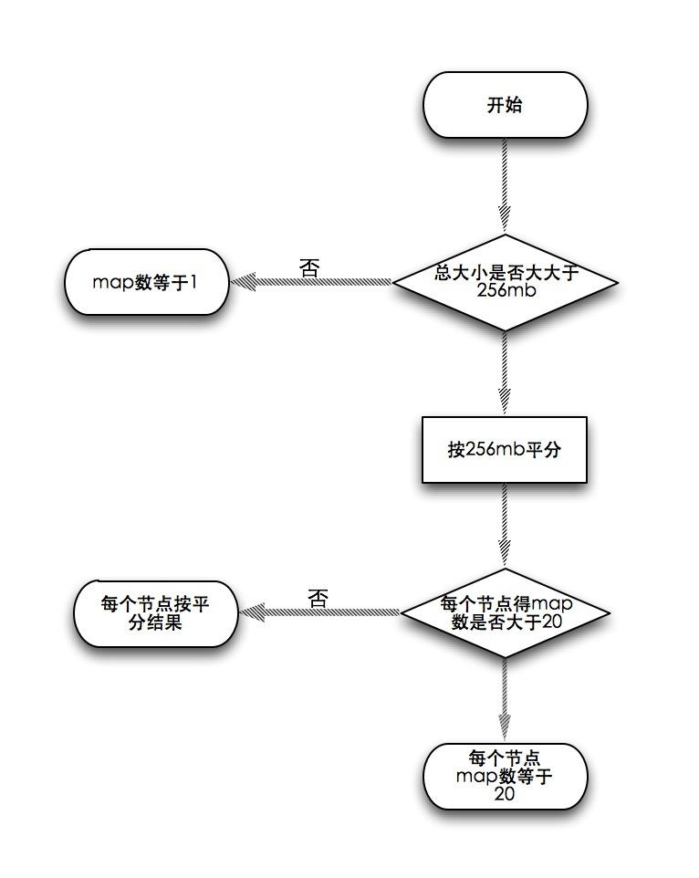

# distcp

	我们前几篇文章讲的都是单线程的操作，如果要并行拷贝很多文件，hadoop提供了一个小工具distcp，最常见的用法就是在两个hadoop集群间拷贝文件，帮助文档很详尽，这里就不一一解释了，开发环境没有两个集群，用同一集群演示：
hadoop distcp hdfs://namenode:9000/user/hadoop/input hdfs://namenode:9000/user/hadoop/input1
完整的options列表：

```bash
distcp [OPTIONS] <srcurl>* <desturl>

OPTIONS:
-p[rbugp]              Preserve status
                       r: replication number
                       b: block size
                       u: user
                       g: group
                       p: permission
                       -p alone is equivalent to -prbugp
-i                     Ignore failures
-log <logdir>          Write logs to <logdir>
-m <num_maps>          Maximum number of simultaneous copies
-overwrite             Overwrite destination
-update                Overwrite if src size different from dst size
-skipcrccheck          Do not use CRC check to determine if src is 
                       different from dest. Relevant only if -update
                       is specified
-f <urilist_uri>       Use list at <urilist_uri> as src list
-filelimit <n>         Limit the total number of files to be <= n
-sizelimit <n>         Limit the total size to be <= n bytes
-delete                Delete the files existing in the dst but not in src
-mapredSslConf <f>     Filename of SSL configuration for mapper task
```

看下distcp的执行结果你会发现，distcp是个MapReduce任务，但只有map没有reducer。

```bash
13/06/18 10:59:19 INFO tools.DistCp: srcPaths=[hftp://namenode:50070/user/hadoop/input]
13/06/18 10:59:19 INFO tools.DistCp: destPath=hdfs://namenode:9000/user/hadoop/input1
13/06/18 10:59:20 INFO tools.DistCp: hdfs://namenode:9000/user/hadoop/input1 does not exist.
13/06/18 10:59:20 INFO tools.DistCp: sourcePathsCount=3
13/06/18 10:59:20 INFO tools.DistCp: filesToCopyCount=2
13/06/18 10:59:20 INFO tools.DistCp: bytesToCopyCount=1.7m
13/06/18 10:59:20 INFO mapred.JobClient: Running job: job_201306131134_0009
13/06/18 10:59:21 INFO mapred.JobClient:  map 0% reduce 0%
13/06/18 10:59:35 INFO mapred.JobClient:  map 100% reduce 0%
```

distcp把一大堆文件平均分摊开交给map去执行，每个文件单独一个map任务。那么默认会分成几个map合适呢？首先按256mb平均分，如果总大小低于256mb，distcp只会分配一个map。但如果平分得结果出现节点得map数大于20的情况，每个节点的map数就会按20算，看下流程图：



你可以通过-m手动设置，如果为了hdfs的均衡，最好是将maps设的多一些，将block分摊开来。

如果两个集群间的版本不一致，那么使用hdfs可能就会产生错误，因为rpc系统不兼容。那么这时候你可以使用基于http协议的hftp协议，但目标地址还必须是hdfs的，象这样：
`hadoop distcp hftp://namenode:50070/user/hadoop/input hdfs://namenode:9000/user/hadoop/input1`
推荐用hftp的替代协议webhdfs，源地址和目标地址都可以使用webhdfs，可以完全兼容

`hadoop distcp webhdfs://namenode:50070/user/hadoop/input webhdfs://namenode:50070/user/hadoop/input1`