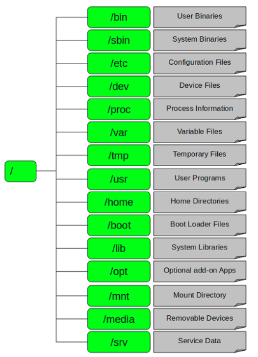

# CentOS 7 系统目录

- LINUX有四种基本文件系统类型
  - 普通文件
    - 普通文件：如文本文件、C语言元代码、SHELL脚本、二进制的可执行文件等，可用cat、less、more、vi、emacs来察看内容，用mv来改名
  - 目录文件
    - 目录文件：包括文件名、子目录名及其指针。它是LINUX储存文件名的唯一地方，可用ls列出目录文件。
  - 连接文件
    - 连接文件：是指向同一索引节点的那些目录条目。用ls来查看是，连接文件的标志用l开头，而文件面后以"->"指向所连接的文件。
  - 特殊文件
    - 特殊文件：LINUX的一些设备如磁盘、终端、打印机等都在文件系统中表示出来，则一类文件就是特殊文件，常放在/dev目录内。例如，软驱A称为/dev/fd0。LINUX无C：的概念，而是用/dev/had来自第一硬盘。
  - 可用file命令来识别。

## linux下的主要目录以及它们都是用来干什么的。

- `/`\
This is the root directory. The mothership. The home field. The one and only top directory for your whole computer. Everything, and I mean EVERYTHING starts here. When you type ‘/home’ what you’re really saying is “start at / and then go to the home directory.”
这就是根目录。对你的电脑来说，有且只有一个根目录。所有的东西，我是说所有的东西都是从这里开始。举个例子：当你在终端里输入“/home”，你其实是在告诉电脑，先从/(根目录)开始，再进入到home目录。

- /root\
    This is where the root user lives. The root user is the god of your system. Root can do anything, up to and including removing your entire filesystem. So be careful using root.
    这是系统管理员(root user)的目录。对于系统来说，系统管理员就好比是上帝，它能对系统做任何事情，甚至包括删除你的文件。因此，请小心使用root帐号。
- /bin\
    Here’s where your standard linux utilities(read programs) live — things like “ls” and “vi” and “more”. Generally this directory is included in your path. What this means is that if you type ‘ls’, /bin is one of the places your shell will look to see if ‘ls’ means anything.
    这里存放了标准的(或者说是缺省的)linux的工具，比如像“ls”、“vi”还有“more”等等。通常来说，这个目录已经包含在你的“path”系 统变量里面了。什么意思呢?就是：当你在终端里输入ls，系统就会去/bin目录下面查找是不是有ls这个程序。
- /etc\
    Here’s where the administrative and system configuration stuff lives. For instance, if you have samba installed, and you want to modify the samba configuration files, you’d find them in /etc/samba.
    这里主要存放了系统配置方面的文件。举个例子：你安装了samba这个套件，当你想要修改samba配置文件的时候，你会发现它们(配置文件)就在/etc/samba目录下。
- /dev\
    Here’s where files that control peripherals live. Talking to a printer? Your computer is doing it from here. Same goes for disk drives, usb devices, and other such stuff.
    这里主要存放与设备(包括外设)有关的文件(unix和linux系统均把设备当成文件)。想连线打印机吗?系统就是从这个目录开始工作的。另外还有一些包括磁盘驱动、USB驱动等都放在这个目录。
- /home\
    Here’s where your data is stored. Config files specific to users, your Desktop folder(whick makes your desktop what it is), and any data related to your user. Each user will have their own /home/username folder, with the exception of the root user.
    这里主要存放你的个人数据。具体每个用户的设置文件，用户的桌面文件夹，还有用户的数据都放在这里。每个用户都有自己的用户目录，位置为：/home/用户名。当然，root用户除外。
- /tmp\
    This is the Temporary folder. Think of it as a scratch directory for your Linux system. Files that won’t be needed by programs once their used once or twice are put here. Many Linux systems are set to automatically wipe the /tmp folder at certain intervals, so don’t put things you want to keep here.
    这是临时目录。对于某些程序来说，有些文件被用了一次两次之后，就不会再被用到，像这样的文件就放在这里。有些linux系统会定期自动对这个目录进行清理，因此，千万不要把重要的数据放在这里。
- /usr\
    Here’s where you’ll find extra utilities that don’t fit under /bin or /etc. Things like games, printer utilities, and whatnot. /usr is divided into sections like /usr/bin for programs, /usr/share for shared data like sound files or icons, /usr/lib for libraries whick cannot be directly run but are essential for running other programs.Your package manager takes care of the things in /usr for you.
    在这个目录下，你可以找到那些不适合放在/bin或/etc目录下的额外的工具。比如像游戏阿，一些打印工具拉等等。/usr目录包含了许多子目录： /usr/bin目录用于存放程序;/usr/share用于存放一些共享的数据，比如音乐文件或者图标等等;/usr/lib目录用于存放那些不能直接 运行的，但却是许多程序运行所必需的一些函数库文件。你的软件包管理器(应该是“新立得”吧)会自动帮你管理好/usr目录的。
- /opt
    Here’s where optional stuff is put. Trying out the latest Firefox beta? Install it to /opt where you can delete it without affecting other settings. Programs in here usually live inside a single folder whick contains all of their data, libraries, etc.
    这里主要存放那些可选的程序。你想尝试最新的firefox测试版吗?那就装到/opt目录下吧，这样，当你尝试完，想删掉firefox的时候，你就可 以直接删除它，而不影响系统其他任何设置。安装到/opt目录下的程序，它所有的数据、库文件等等都是放在同个目录下面。
    举个例子：刚才装的测试版firefox，就可以装到/opt/firefox_beta目录下，/opt/firefox_beta目录下面就包含了运 行firefox所需要的所有文件、库、数据等等。要删除firefox的时候，你只需删除/opt/firefox_beta目录即可，非常简单。
- /usr/local
    This is where most manually installed(ie. outside of your package manager) software goes. It has the same structure as /usr. It is a good idea to leave /usr to your package manager and put any custom scripts and things into /usr/local, since nothing important normally lives in /usr/local.
    这里主要存放那些手动安装的软件，即不是通过“新立得”或apt-get安装的软件。它和/usr目录具有相类似的目录结构。让软件包管理器来管理/usr目录，而把自定义的脚本(scripts)放到/usr/local目录下面，我想这应该是个不错的主意。
- /media
    Some distros use this folder to mount things like usb disks, cd or dvd drives and other filesystems.
    有些linux的发行版使用这个目录来挂载那些usb接口的移动硬盘(包括U盘)、CD/DVD驱动器等等。

## 补充：
- /bin\
系统所需要的那些命令位于此目录，比如 ls、cp、mkdir等命令；功能和/usr/bin类似，这个目录中的文件都是可执行的、普通用户都可以使用的命令。作为基础系统所需要的最基础的命令就是放在这里（/usr/bin和/usr/sbin 类似与“/”根目录下对应的目录（/bin和/sbin），但不用于基本的启动（譬如，在紧急维护中）。大多数命令在这个目录下。 ）。
- /boot\
Linux的内核及引导系统程序所需要的文件目录，比如 vmlinuz initrd.img 文件都位于这个目录中。在一般情况下，GRUB或LILO系统引导管理器也位于这个目录。
- /lost+found\
在ext2或ext3文件系统中，当系统意外崩溃或机器意外关机，而产生一些文件碎片放在这里。当系统启动的过程中fsck工具会检查这里，并修复已经损 坏的文件系统。 有时系统发生问题，有很多的文件被移到这个目录中，可能会用手工的方式来修复，或移到文件到原来的位置上。
- /mnt\
这个目录一般是用于存放挂载储存设备的挂载目录的，比如有cdrom 等目录。可以参看/etc/fstab的定义。有时我们可以把让系统开机自动挂载文件系统，把挂载点放在这里也是可以的。主要看/etc/fstab中怎 么定义了；比如光驱可以挂载到/mnt/cdrom 。
- /opt\
表示的是可选择的意思，有些软件包也会被安装在这里，也就是自定义软件包，比如在Fedora Core 5.0中，OpenOffice就是安装在这里。有些我们自己编译的软件包，就可以安装在这个目录中；通过源码包安装的软件，可以通过 ./configure --prefix=/opt/目录 。
- /proc\
操作系统运行时，进程信息及内核信息（比如cpu、硬盘分区、内存信息等）存放在这里。/proc目录伪装的文件系统proc的挂载目录，proc并不是真正的文件系统，它的定义可以参见 /etc/fstab 。 
- /sbin\
大多是涉及系统管理的命令的存放，是超级权限用户root的可执行命令存放地，普通用户无权限执行这个目录下的命令，这个目录和/usr/sbin; /usr/X11R6/sbin或/usr/local/sbin目录是相似的；我们记住就行了，凡是目录sbin中包含的都是root权限才能执行的。
- /usr\
这个是系统存放程序的目录，比如命令、帮助文件等。这个目录下有很多的文件和目录。当我们安装一个Linux发行版官方提供的软件包时，大多安装在这里。 如果有涉及服务器配置文件的，会把配置文件安装在/etc目录中。/usr目录下包括涉及字体目录/usr/share/fonts ，帮助目录 /usr/share/man或/usr/share/doc，普通用户可执行文件目录/usr/bin 或/usr/local/bin 或/usr/X11R6/bin ，超级权限用户root的可执行命令存放目录，比如 /usr/sbin 或/usr/X11R6/sbin 或/usr/local/sbin 等；还有程序的头文件存放目录/usr/include。
- /var\
这个目录的内容是经常变动的，看名字就知道，我们可以理解为vary的缩写，/var下有/var/log 这是用来存放系统日志的目录。/var/www目录是定义Apache服务器站点存放目录；/var/lib 用来存放一些库文件，比如MySQL的，以及MySQL数据库的的存放地； 

## 关于/opt目录的一个小技巧

在Linux中，/opt目录是存放某些大型软件或者某些特殊软件的目录，比如谷歌浏览器(Google Chrome)默认就是安装在/opt中。但是我们一般不会把opt单独分在一个区，因为/opt中大多数时候是空的，即使安装了软件也不会太多，而且有 些软件的容量还比较大，这样就会占用/的容量，我们可以在其它你愿意的地方建立一个目录来将/opt“转移”到别处，比如我的的/usr是单独分在一个 区，容量有50G，这么大的空间不要浪费了不是？而且/usr本来就是安装软件的地方，所以我可以/usr下建立一个叫opt的文件夹，然后右键点击这个 /usr下的opt，选择“创建链接”，得到一个名为“到 opt 的链接”文件，然后把这个文件剪切到/下，将原来的/opt删除，再将“到 opt 的链接”改名为opt就可以了，以后我们安装在/opt的软件实际上是安装到了/usr/opt下（实际上是一个符号链接）。
/usr/local 这个目录一般是用来存放用户自编译安装软件的存放目录；一般是通过源码包安装的软件，如果没有特别指定安装目录的话，一般是安装在这个目录中。这个目录下面有子目录。自己看看吧。
/usr/share 系统共用的东西存放地，比如 /usr/share/fonts 是字体目录，/usr/share/doc和/usr/share/man帮助文件。
/var/log 系统日志存放，分析日志要看这个目录的东西；
/var/spool 打印机、邮件、代理服务器等假脱机目录；
