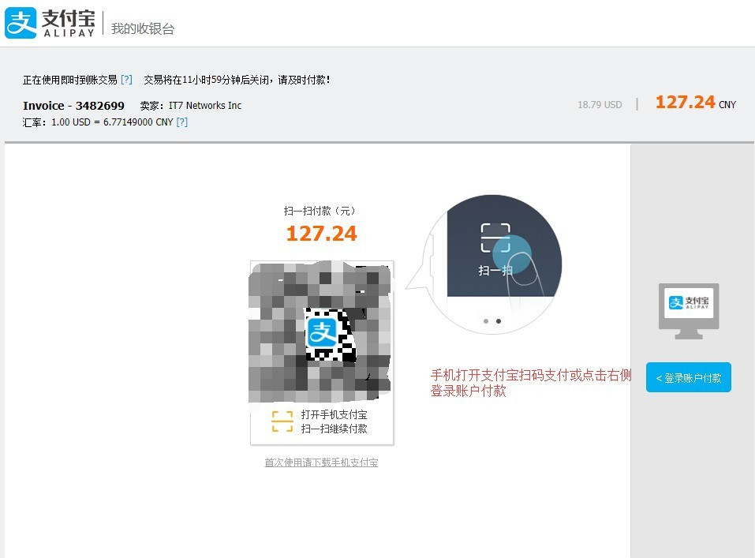

作为一个新时代的人，真的是离不开Google。但国内大环境如此，访问Google困难重重。但是再难，工作也是要展开的！我们之前还可以通过购买商家们的爬墙服务来实现访问Google，但这阵严打，这类服务商死掉了一大批，很多朋友也平白遭受了损失！以后政策会越来越收紧，能提供此类服务的商家会越来越少，取得合法资质运营此类业务的商家，其费用估计也是天价。在这种情况下，我推荐大家自行搭翻墙SS服务器翻墙，个人自己搭建自己使用的梯子，不会成为重点打击对象。

以下教程并非推销，也并非复制粘贴，小编亲测(现在也是在用这个，已用一年多了，非常稳定，访问外网就像打开百度一样快)！对了，小编最近刚刚用它翻墙购买了一台Google Pixel 2 XL，还在运输途中呢！据说这部手机拍照非常Nice，有点迫不及待了！好了，再说就偏题了，哈哈哈…

注：特别说明！此翻墙SS服务器适用于各种常见终端设备(Windows、Mac OS、安卓、IOS等等)…

本教程介绍的并非免费翻墙,需要购买一台境外服务器来作为自己的专用翻墙SS服务器。本篇教程全程傻瓜化，无任何技术难度，不需要输入任何命令，不需要记住任何代码。

分三步走，大概花十分钟就能建立起你自己的专用翻墙SS服务器，完全不必觉得这会非常困难。本篇教程以Bandwagonhost(搬瓦工)的 10G KVM – PROMO VPS（本服务器比较火爆，有时会出现断货，记得选择KVM服务器）为基础，使用Shadowsocks为梯子程序。

※废话不多说，开始本篇教程。
先打开以下链接，然后选择一款KVM主机，再按如下步骤“1、”处开始一步一步操作。
对了，如果需要小编代劳，请打赏手续费50块，谢谢，保证搭建成功！
—>点击打开以下链接：

>>[√推荐最具性价比KVM主机(19.99美元/年)方案√](https://bwh1.net/aff.php?aff=30544&pid=43)<<
主机配置：SSD：10G | 内存：512M | CPU：1x Intel Xeon | 流量：500G/月 | 链接速度：1千兆 | 免费更换IP
(使用优惠码“BWH1ZBPVK”再省6%)

>>[√推荐最具性价比KVM主机(49.99美元/年)方案√](https://bwh1.net/aff.php?aff=30544&pid=44)<<
主机配置：SSD：20G | 内存：1G | CPU：2x Intel Xeon | 流量：1TB/月 | 链接速度：1千兆 | 免费更换IP
(使用优惠码“BWH1ZBPVK”再省6%)

>>√其它KVM主机方案√<<
(使用优惠码“BWH1ZBPVK”再省6%)

搬瓦工官网地址：
https://bwh1.net/aff.php?aff=30544

1、购买一台境外服务器用于搭建翻墙SS服务器的服务端

选择一款KVM主机购买：
年付 19.99 美元 KVM 架构 VPS（本教程采用此服务器，本服务器比较火爆，有时会出现断货）1 核 CPU 512M 内存 每月 500G 流量<– 本篇教程使用

说明：以上搬瓦工在售的套餐中，不可更换机房与IP的套餐搬瓦工说明为 “DIRECT ROUTE” 中国直连路由，
但实测意义不大，和普通版机房几无差别。
直连VPS：流量更大，但不可更换机房与IP。
普通VPS：流量偏小(够用)，但可更换机房与IP(防止被封)。
OK！各有优缺点，大家自己取舍。

为什么要选年付呢？因为年付相比每月付款等于5.5折！搬瓦工也有30天退款保证，觉得不好用再申请退款也可以(月付基本上已经取消了)。

6个数据中心可选，建议选择“Los(洛杉矶)” ，离中国距离最近，开通以后也可以随意切换(直连路由套餐无法切换)。选完之后，点击最下面的“Add to Cart”。

进入到购物车，可以看到结账明细，下面有优惠码输入框，输入“BWH1ZBPVK”6%优惠码，然后点击“Validate Code”，节省一点是一点吧。

输入之后是这样的之后点“Checkout”结账。

新用户会要求填写一些信息注册账户，全部用拼音如实填写即可。注意地址一定要如实填写，不用写得那么细，但起码要和你所在城市一样，要不检测到 IP 地址与填写城市不一致，会被判欺诈，导致购买失败！

三种支付方式供选择，哪个方便选哪个吧，本次以某宝为例说明。

点“Complete Order”后再点“Pay now”。

跳转到某宝网站选择扫码或登陆账号完成支付。

搭建翻墙SS服务器

支付成功！

搭建翻墙SS服务器

跳转回搬瓦工，显示订单完成，并显示订单号，购买服务器完成！

2、搭建 shadowsocks server 端

搬瓦工直接在后台集成了Shadowsokcs，登陆后台就能一键安装，方便小白用户(它知道你们看见命令行会头痛)。

在用户中心 选择 My Services。

可以看到你刚才购买的服务器已经激活运行，点击 KiviVM Control Panel 进入 VPS 管理面板，进入面板后你会看到一些服务器的运行信息，如内存使用量，磁盘使用量，流量使用情况等，可能你会看不懂，没关系，略过这些，我们直接安装shadowsocks server 如下图所示！

注：最近很多新购买的服务器在VPS管理面板没有“Shadowsocks Server”这一项，若是发生此原因，请按如下操作即可正常安装！若页面中没有Shadowsocks Server这一项，说明一键搭建SS功能被去掉了，这时候需要在当前浏览器的新标签中打开以下网址：
https://kiwivm.64clouds.com/main-exec.php?mode=extras_shadowsocks
，打开后就是安装页面，点击页面中的Install Shadowsocks Server安装即可(安装前提是服务器已打开运行)。

安装成功显示如下：

点击“Go Back”后，看到如下图(建议将端口改成“8443”，如下图所示)：

然后，往下拉浏览器滚动条，就能看到“Shadowsocks Server”的配置信息了，如下图所示：

Shadowsocks服务端配置完成！
记住上图信息，后面客户端信息按此图对应填写(IP、端口、密码、加密方式)即可！

注：若安装完Shadowsocks Server后，“Status”不是显示“Running”，而是显示“Stopped”，接着点击“Start”后出现“Shadowsocks Server Failed to start(error:8411770)”。即SS服务无法启动，一直处于停止状态。那么遇到此情况，请参考“https://www.yigeni.com/solve-the-status-stop-of-the-ss-server/”这篇文章。
若可正常启动请忽略此段文字。

3、配置 shadowsocks 本地客户端

搬瓦工不愧为 Linux 小白挚友，直接在后台就给出了客户端配置教程。
对了，以下所有文件，如有解压密码，密码均为：www.yigeni.com！

Android 安卓手机用户：
方法一：直接下载–>Shadowsocks（提取密码：7di1，文件解压密码：www.yigeni.com）。
方法二：访问 Google Play 商店下载 Shadowsocks-Android。手机里没有 play 商店？无法翻墙？废话…没关系，打开“http://apps.evozi.com/apk-downloader/”，然后将链接“https://play.google.com/store/apps/details?id=com.github.shadowsocks”粘贴进去进行下载，当然也可搜索APK名称进行下载。
注：最好使用小编推荐链接下载，第三方其它路径下载可能会出现问题。
对了，如果旧版本不能用，可尝试下载最新版本，
下载地址–>：“https://github.com/shadowsocks/shadowsocks-android/releases”。

IOS 苹果 Iphone 用户：
方法一：直接下载–>Shadowrocket（提取密码：eva5，文件解压密码：www.yigeni.com）。
注：压缩包里面分为“未越狱版”与“越狱版”，手机需要连接安装了iTunes的电脑进行安装。
方法二：直接在App Store里选择以下App之一安装。
比如：Shadowrocket(2.99美元)、FirstWingy(0.99美元)、Wingy(0.99美元)等等，其它相关APP请自行测试。
注：由于苹果IOS系统比较奇葩，以上App下载需要“美国苹果ID”，中国苹果ID可能无法搜索App或下载。
点此查看–>美国苹果ID注册方法(提取密码：5ez4)！

Mac OS 用户：
直接下载–>ShadowsocksX-NG（提取密码：q559，文件解压密码：www.yigeni.com）。
注：如果旧版本不能用，可尝试下载最新版本，
下载地址–>：“https://github.com/shadowsocks/ShadowsocksX-NG/releases”。

Windows 用户：
直接下载–>Shadowsocks（提取密码：13pm，文件解压密码：www.yigeni.com）。
注：需要Microsoft .NET Framework 3.5支持(Windows 7以下，含Windows 7)，
下载地址–>：”http://www.microsoft.com/zh-CN/download/details.aspx?id=21″。
或需要Microsoft .NET Framework 4.6.2支持(Windows 7以上，不含Windows 7)，
下载地址–>：”https://www.microsoft.com/zh-cn/download/details.aspx?id=53321″。
对了，如果旧版本不能用，可尝试下载最新版本，
下载地址–>：“https://github.com/shadowsocks/shadowsocks-windows/releases”。

注意：此工具不是 VPN 之类全局代理，本质上只是一个 Socks5 代理，通过修改系统代理实现翻墙，可能会被某卫士或其它电脑安全管家之类的软件静默阻止，造成软件运行出错。运行前请退出某卫士或某管家，或把 SS 客户端加入其白名单！建议最好不要安装某卫士或管家，安装正统的杀毒软件，如卡巴斯基、NOD32、诺顿、McAfee，这些软件都不会对SS进行阻止！

Windows客户端操作：
这是绿色软件，下载之后解压就能用(部分电脑需要安装.NET)，打开 shadowsocks.exe 会看到通知栏有一个纸飞机图标 双击它！

填入服务端信息后确定，会自己最小化到通知栏，右键单击-启用系统代理（其中“系统代理模式”一般为“PAC模式”，有时可尝试切一切）。

搭建翻墙SS服务器

好了，你可以打开浏览器看下能不能正常访问YouTube或Google！

OK！Windows客户端搞定！

安卓客户端操作：
打开手机SS客户端，点击右上角+号，选择手动设置。
在弹出页面中填写你的SS服务器IP、远程端口、密码、加密方式，点击对号保存，如下图：

OK！安卓客户端搞定！

–>安全提醒：
a、网上有一些人在售卖或者免费提供SS 帐号(或者所谓的什么加速服务)，我想说的是，你永远不知道电脑那一端的那个陌生人在想些什么，想干什么！使用别人提供的 SS 帐号是有安全隐患的，因为他知道你的加密方式，并且服务端掌握在他手里，他是可以对你的网络通信进行监听的，我们做外贸的，有时信息泄露的后果挺严重的，望大家慎重；
b、Shadowsocks 只是一个帮你穿越长城防火墙的小工具，它无法帮你保持匿名！在使用时务必遵守中国（人在中国）和服务器所在地（服务器在美国）的法律！墙外言论纷杂，接收信息时务必保持自己的理性思辨；

不差钱！不想用美国的服务器，只要速度快！没问题！阿里云HK、LinodeJP 等高富帅服务器欢迎你！

特别说明(解答操作遇到问题的网友)：
1、很多网友还没仔细看帖或没有动手就说不会，然后各种问小编或要小编远程(抱歉，最近加我QQ问的人太多了，当然正常问题除外)，麻烦细心点多使用排除法！
对了，如果需要小编代劳，请打赏手续费50块，谢谢，保证搭建成功；

2、有些网友反应“搬瓦工”无法直接注册，这可能是“搬瓦工”故意为了防恶意注册吧！解决方法：选择一款KVM主机，然后按步骤购买并填好注册信息，即可成功注册(其实，按小编帖子一步一步来就不会有问题)；

3、翻墙速度的快慢跟服务器没关系，服务器很稳定的，主要看你本地网络(如果网络不纯净就会有问题，比如拨打电信10000或拨打移动10086或拨打联通10010报装的网络就没什么问题)，当然手机4G就是看信号了。电脑端有时会出现国内网站打不开，在“系统代理模式”那里切换“PAC模式”与“全局模式”，一般是“PAC模式”；

4、特别补充说明，PC端或手机端配置填写错误是没有任何提示的，包括密码错误；

5、如果你发现什么也没动，之前正常的突然发现上不了的话，那么小编建议去搬瓦工服务器面板重新更新一下端口，建议将端口设置成8443，或者重启一下服务器，当然小编上了半年就遇到这种情况一次，哈哈哈；

6、补充一点：还是那句话，速度与自己本身的网络有关，如果你非得使用第三方加速什么的，你得考虑安全问题了。毕竟第三方加速的原理是：不服从拥塞控制，拼命发包，不管丢包；

7、如果购买服务器时是选择“普通版QN机房”的，后期使用是可以更换不同机房的(中国直连不可更换)，一般更换机房会更换IP，当然也可能会导致SS服务器需要重新搭建(即重新安装服务器系统与Shadowsocks Server)。小编建议：除非IP被封或者操作熟练，否则不会的不要瞎折腾了；

8、登录搬瓦工官网(https://bwh1.net/aff.php?aff=30544)，然后依次点击Services–>My Services–>KiwiVM Control Panel，进去之后，接着就能看到左侧菜单栏有一项“Migrate to another DC”，ok，点击进去选择自己想要更换的机房即可(更换机房之后即可得到一个新的IP地址)；

9、部分极少数用户电脑或手机系统较新，有的会出现下载本站网盘客户端无法使用(建议更新客户端试试)，如果仍不行，可进入本站官方①群：242601621(QQ群通过码：www.yigeni.com，若官方①群已满，则进入官方②群：775014616)讨论，群文件里会有最新版本下载。其它问题请反馈或者留言或者发送Email至：yigeni@yigeni.com，小编会尽快回复各位。

–>另外，为了更好的翻墙，附上Windows版本Google Chrome 浏览器，以下为官方原始版(无任何修改)。
Chrome32位下载地址：点击下载（提取码：tdn4） | Chrome64位下载地址：点击下载（提取码：n5ox）