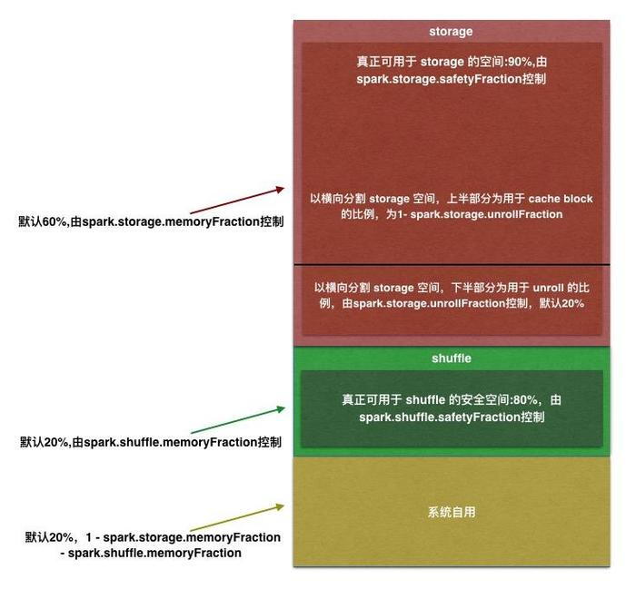

Spark 作为一个以擅长内存计算为优势的计算引擎，内存管理方案是其非常重要的模块。作为使用者的我们，搞清楚 Spark 是如何管理内存的，对我们编码、调试及优化过程会有很大帮助。本文之所以取名为 "Spark 新旧内存管理方案剖析" 是因为在 Spark 1.6 中引入了新的内存管理方案，加之当前很多公司还在使用 1.6 以前的版本，所以本文会对这两种方案进行剖析。

刚刚提到自 1.6 版本引入了新的内存管理方案，但并不是说在 1.6 版本中不能使用旧的方案，而是默认使用新方案。我们可以通过设置 `spark.memory.userLegacyMode` 值来选择，该值为 false 表示使用新方案，true 表示使用旧方案，默认为 false。该值是如何发挥作用的呢？看了下面的代码就明白了：
```scala
val useLegacyMemoryManager = conf.getBoolean("spark.memory.useLegacyMode", false)
val memoryManager: MemoryManager =
  if (useLegacyMemoryManager) {
    new StaticMemoryManager(conf, numUsableCores)
  } else {
    UnifiedMemoryManager(conf, numUsableCores)
  }
```

根据 `spark.memory.useLegacyMode` 值的不同，会创建 `MemoryManager` 不同子类的实例：

- 值为 `false`：创建 `UnifiedMemoryManager` 类实例，该类为新的内存管理模块的实现
- 值为 `true`：创建 `StaticMemoryManager`类实例，该类为旧的内存管理模块的实现

`MemoryManager` 是用于管理内存的虚基类，声明了一些方法来管理用于 execution 、 storage 的内存和其他内存：

- `execution 内存`：用于 shuffles，如joins、sorts 和 aggregations，避免频繁的 IO 而需要内存 buffer
- `storage 内存`：用于 caching RDD，缓存 broadcast 数据及缓存 task results
- 其他内存：在下文中说明

先来看看 MemoryManager 重要的成员和方法：


接下来，来看看 MemoryManager 的两种实现

- StaticMemoryManager

当 spark.memory.userLegacyMode 为 true 时，在 SparkEnv 中是这样实例化 StaticMemoryManager：
```scala
new StaticMemoryManager(conf, numUsableCores)
```
调用的是 StaticMemoryManager 辅助构造函数，如下：
```scala
  def this(conf: SparkConf, numCores: Int) {
    this(
      conf,
      StaticMemoryManager.getMaxExecutionMemory(conf),
      StaticMemoryManager.getMaxStorageMemory(conf),
      numCores)
  }
```
继而调用主构造函数，如下：
```scala
private[spark] class StaticMemoryManager(
    conf: SparkConf,
    maxOnHeapExecutionMemory: Long,
    override val maxStorageMemory: Long,
    numCores: Int)
  extends MemoryManager(
    conf,
    numCores,
    maxStorageMemory,
    maxOnHeapExecutionMemory)
```
这样我们就可以推导出，对于 StaticMemoryManager，其用于 storage 的内存大小等于 `StaticMemoryManager.getMaxStorageMemory(conf)`；用于 execution 的内存大小等于 `StaticMemoryManager.getMaxExecutionMemory(conf)`，下面进一步看看这两个方法的实现

>StaticMemoryManager.getMaxExecutionMemory(conf)

实现如下：
```scala
  private def getMaxExecutionMemory(conf: SparkConf): Long = {
    val systemMaxMemory = conf.getLong("spark.testing.memory", Runtime.getRuntime.maxMemory)
    val memoryFraction = conf.getDouble("spark.shuffle.memoryFraction", 0.2)
    val safetyFraction = conf.getDouble("spark.shuffle.safetyFraction", 0.8)
    (systemMaxMemory * memoryFraction * safetyFraction).toLong
  }
```

若设置了 `spark.testing.memory` 则以该配置的值作为 systemMaxMemory，否则使用 JVM 最大内存作为 systemMaxMemory。spark.testing.memory 仅用于测试，一般不设置，所以这里我们认为 systemMaxMemory 的值就是 executor 的最大可用内存。

`spark.shuffle.memoryFraction`：shuffle 期间用于 aggregation 和 cogroups 的内存占 executor 运行时内存的百分比，用小数表示。在任何时候，用于 shuffle 的内存总 size 不得超过这个限制，`超出部分会 spill 到磁盘`。如果经常 spill，考虑调大 spark.storage.memoryFraction

`spark.shuffle.safetyFraction`：为防止 OOM，不能把 systemMaxMemory * spark.shuffle.memoryFraction 全用了，需要有个安全百分比

所以最终用于 execution 的内存量为：executor 最大可用内存 * spark.shuffle.memoryFraction * spark.shuffle.safetyFraction，`默认为 executor 最大可用内存 * 0.16`

>需要特别注意的是，即使用于 execution 的内存不够用了，但同时 executor 还有其他空余内存，也不能给 execution 用

>StaticMemoryManager.getMaxStorageMemory(conf)

实现如下：
```scala
  private def getMaxStorageMemory(conf: SparkConf): Long = {
    val systemMaxMemory = conf.getLong("spark.testing.memory", Runtime.getRuntime.maxMemory)
    val memoryFraction = conf.getDouble("spark.storage.memoryFraction", 0.6)
    val safetyFraction = conf.getDouble("spark.storage.safetyFraction", 0.9)
    (systemMaxMemory * memoryFraction * safetyFraction).toLong
  }
```

分析过程与 getMaxExecutionMemory 一致，我们得出这样的结论，用于storage 的内存量为: executor 最大可用内存 * spark.storage.memoryFraction * spark.storage.safetyFraction，`默认为 executor 最大可用内存 * 0.54`

`spark.storage.memoryFraction`：用于做 memory cache 的内存占 executor 最大可用内存的百分比，该值不应大于老生代

`spark.storage.safetyFraction`：防止 OOM 的安全比例，由 spark.storage.safetyFraction 控制，默认为0.9。在 storage 中，有一部分内存是给 unroll 使用的，`unroll 即反序列化 block`，该部分占比由 spark.storage.unrollFraction 控制，默认为0.2

>others

从上面的分析我们可以看到，storage 和 execution 总共使用了 80% 的内存，那剩余 20% 去哪了？这部分内存被系统保留了，用来存储运行中产生的对象

所以，各部分内存占比可由下图表示：



经过上面的描述，我们搞明白了旧的内存管理方案是如何划分内存的，也就可以根据我们实际的 app 来调整各个部分的比例。同时，我们可以明显的看到这种内存管理方式的缺陷，即 execution 和 storage 两部分内存固定死，不能共享，即使在一方内存不够用而另一方内存空闲的情况下。这样的方式经常会造成内存浪费，所以有必要引入支持共享，能更好利用内存的方案，`UnifiedMemoryManage`r 就应运而生了

作者：牛肉圆粉不加葱
链接：https://www.jianshu.com/p/2e9eda28e86c
來源：简书
著作权归作者所有。商业转载请联系作者获得授权，非商业转载请注明出处。