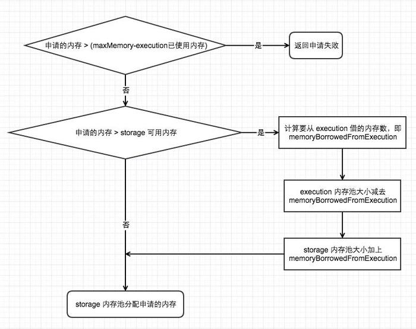
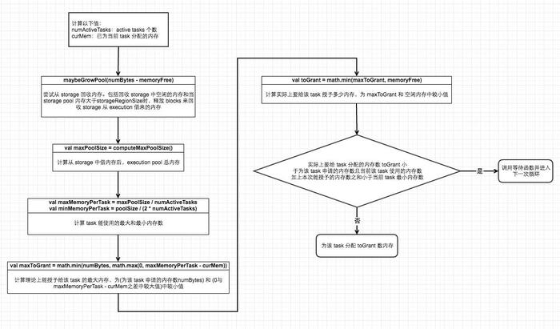

上一篇文章【源码剖析】- Spark 新旧内存管理方案（上）介绍了旧的内存管理方案以及其实现类 StaticMemoryManager 是如何工作的，本文将通过介绍 UnifiedMemoryManager 来介绍新内存管理方案（以下统称为新方案）。

## 内存总体分布
- 系统预留

在新方案中，内存依然分为三块，分别是`系统预留`、用于 `storage`、用于 `execution`。其中系统预留大小如下：
```scala
val reservedMemory = conf.getLong("spark.testing.reservedMemory",
  if (conf.contains("spark.testing")) 0 else RESERVED_SYSTEM_MEMORY_BYTES)
```

生产环境中使用一般不会设置 spark.testing.reservedMemory 和 spark.testing，所以我们认为系统预留空间大小置为 RESERVED_SYSTEM_MEMORY_BYTES，即 300M。

- execution 和 storage 部分总大小
上一小节这段代码是 `UnifiedMemoryManager#getMaxMemory` 的一个片段，该方法返回 execution 和 storage 可以共用的总空间，让我们来看看这个方法的具体实现：
```scala
// limingshun ： 实际上这部分代码就是，如果设置了相关的参数，把这些值设置为这些参数，如果没设置，就用一些环境值或预留值
  private def getMaxMemory(conf: SparkConf): Long = {
    //< 生产环境中一般不会设置 spark.testing.memory，所以这里认为 systemMemory 大小为 Jvm 最大可用内存
    val systemMemory = conf.getLong("spark.testing.memory", Runtime.getRuntime.maxMemory)
    //< 系统预留 300M
    val reservedMemory = conf.getLong("spark.testing.reservedMemory",
      if (conf.contains("spark.testing")) 0 else RESERVED_SYSTEM_MEMORY_BYTES)
    val minSystemMemory = reservedMemory * 1.5
    //< 如果 systemMemory 小于450M，则抛异常
    if (systemMemory < minSystemMemory) {
      throw new IllegalArgumentException(s"System memory $systemMemory must " +
        s"be at least $minSystemMemory. Please use a larger heap size.")
    }
    val usableMemory = systemMemory - reservedMemory
    val memoryFraction = conf.getDouble("spark.memory.fraction", 0.75)
    //< 最终 execution 和 storage 的可用内存之和为 (JVM最大可用内存 - 系统预留内存) * spark.memory.fraction
    (usableMemory * memoryFraction).toLong
  }
  // limingshun : 上面的代码里面 getLong() 

    /** Get a parameter as a long, falling back to a default if not set */
  def getLong(key: String, defaultValue: Long): Long = {
    getOption(key).map(_.toLong).getOrElse(defaultValue)
  }
```
从以上代码及注释我们可以看出，最终 execution 和 storage 的可用内存之和为 `(JVM最大可用内存 - 系统预留内存) * spark.memory.fraction`，默认为`（JVM 最大可用内存 - 300M）* 0.75`。举个例子，如果你为 execution 设置了2G 内存，那么 execution 和 storage 可用的总内存为 (2048-300)*0.75=1311

- execution 和 storage 部分默认大小

上一小节搞清了用于 execution 和 storage 的内存之和 maxMemory，那么用于 execution 和 storage 的内存分别为多少呢？看下面三段代码：

object UnifiedMemoryManager 的 apply 方法用来构造类 UnifiedMemoryManager 的实例
```scala
  def apply(conf: SparkConf, numCores: Int): UnifiedMemoryManager = {
    val maxMemory = getMaxMemory(conf)
    new UnifiedMemoryManager(
      conf,
      maxMemory = maxMemory,
      storageRegionSize =
        (maxMemory * conf.getDouble("spark.memory.storageFraction", 0.5)).toLong,
      numCores = numCores)
  }
```

这段代码确定在构造 `UnifiedMemoryManager` 时：

- maxMemory 即 execution 和 storage 能共用的内存总和为 getMaxMemory(conf)，即 (JVM最大可用内存 - 系统预留内存) * spark.memory.fraction
- storageRegionSize 为 maxMemory * conf.getDouble("spark.memory.storageFraction", 0.5)，在没有设置 spark.memory.storageFraction 的情况下为一半的 maxMemory

那么 storageRegionSize 是干嘛用的呢？继续看 UnifiedMemoryManager 和 MemoryManager 构造函数：
```scala
private[spark] class UnifiedMemoryManager private[memory] (
    conf: SparkConf,
    val maxMemory: Long,
    storageRegionSize: Long,
    numCores: Int)
  extends MemoryManager(
    conf,
    numCores,
    storageRegionSize,
    maxMemory - storageRegionSize)

private[spark] abstract class MemoryManager(
    conf: SparkConf,
    numCores: Int,
    storageMemory: Long,
    onHeapExecutionMemory: Long) extends Logging
```
我们不难发现：

- storageRegionSize 就是 storageMemory，大小为 maxMemory * conf.getDouble("spark.memory.storageFraction", 0.5)，默认为 maxMemory * 0.5
- execution 的大小为 maxMemory - storageRegionSize，默认为 maxMemory * 0.5，即默认情况下 storageMemory 和 execution 能用的内存相同，各占一半

## 互相借用内存

新方案与旧方案最大的不同是：旧方案中 execution 和 storage 可用的内存是固定死的，即使一方内存不够用而另一方有大把空闲内存，空闲一方也无法将结存借给不足一方，这样降造成严重的内存浪费。而新方案解决了这一点，execution 和 storage 之间的内存可以互相借用，大大提供内存利用率，也更好的满足了不同资源侧重的计算的需求

下面便来介绍新方案中内存是如何互相借用的

- acquireStorageMemory

先来看看 storage 从 execution 借用内存是如何在分配 storage 内存中发挥作用的



这一过程对应的实现是 `UnifiedMemoryManager#acquireStorageMemory`，上面的流程图应该说明了是如何 storage 内存及在 storage 内存不足时是如何向 execution 借用内存的

- acquireExecutionMemory

该方法是给 execution 给指定 task 分配内存的实现，当 execution pool 内存不足时，会从 storage pool 中借。该方法在某些情况下可能会阻塞直到有足够空闲内存。

在该方法内部定义了两个函数：

- maybeGrowExecutionPool：会释放storage中保存的数据，减小storage部分内存大小，从而增大Execution部分
- computeMaxExecutionPoolSize：计算在 storage 释放内存借给 execution 后，execution 部分的内存大小

在定义了这两个方法后，直接调用 `ExecutionMemoryPool#acquireMemory` 方法，acquireMemory方法会一直处理该 task 的请求，直到分配到足够内存或系统判断无法满足该请求为止。acquireMemory 方法内部有一个死循环，循环内部逻辑如下：



从上面的流程图中，我们可以知道当 execution pool 要为某个 task 分配内存并且内存不足时，会从 storage pool 中借用内存，能借用的最大 size 为 `storage 的空闲内存+之前 storage 从 execution 借走的内存`。这与 storage 从 execution 借用内存不同，storage 只能从 execution 借走空闲的内存，不能借走 execution 中已在使用的从 storage 借来的内存，源码中的解释是如果要这么做实现太过复杂，暂时不支持。

以上过程分析的是memoryMode 为 ON_HEAP 的情况，如果是 OFF_HEAP，则直接从 offHeapExecution 内存池中分配，本文重点不在此，故不展开分析。

作者：牛肉圆粉不加葱
链接：https://www.jianshu.com/p/bb0bdcb26ccc
來源：简书
著作权归作者所有。商业转载请联系作者获得授权，非商业转载请注明出处。