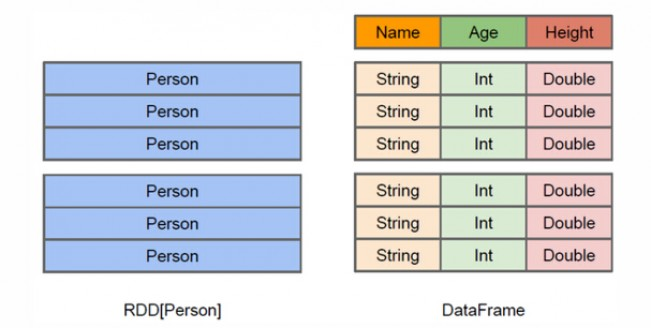

# dataframe

DataFrame的推出，让Spark具备了处理大规模结构化数据的能力，不仅比原有的RDD转化方式更加简单易用，而且获得了更高的计算性能。Spark能够轻松实现从MySQL到DataFrame的转化，并且支持SQL查询。

图 DataFrame与RDD的区别

从上面的图中可以看出DataFrame和RDD的区别。`RDD是分布式的 Java对象的集合`，比如，RDD[Person]是以Person为类型参数，但是，Person类的内部结构对于RDD而言却是不可知的。`DataFrame是一种以RDD为基础的分布式数据集`，也就是分布式的Row对象的集合（每个Row对象代表一行记录），提供了详细的结构信息，也就是我们经常说的模式（schema），Spark SQL可以清楚地知道该数据集中包含哪些列、每列的名称和类型。
和RDD一样，DataFrame的各种变换操作也采用惰性机制，只是记录了各种转换的逻辑转换路线图（是一个DAG图），不会发生真正的计算，这个DAG图相当于一个逻辑查询计划，最终，会被翻译成物理查询计划，生成RDD DAG，按照之前介绍的RDD DAG的执行方式去完成最终的计算得到结果。