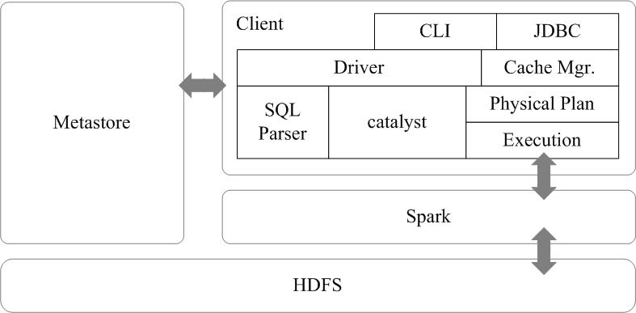

Spark SQL是Spark生态系统中非常重要的组件，其前身为Shark。Shark是Spark上的数据仓库，最初设计成与Hive兼容，但是该项目于2014年开始停止开发，转向Spark SQL。Spark SQL全面继承了Shark，并进行了优化。

## 从Shark说起

Shark即Hive on Spark，为了实现与Hive兼容，Shark在HiveQL方面重用了Hive中的HiveQL解析、逻辑执行计划翻译、执行计划优化等逻辑，可以近似认为仅将物理执行计划从MapReduce作业替换成了Spark作业，通过Hive的HiveQL解析，把HiveQL翻译成Spark上的RDD操作。（要想了解更多数据仓库Hive的知识，可以参考厦门大学数据库实验室的Hive授课视频、Hive安装指南）

Shark的设计导致了两个问题：一是执行计划优化完全依赖于Hive，不方便添加新的优化策略；二是因为Spark是线程级并行，而MapReduce是进程级并行，因此，Spark在兼容Hive的实现上存在线程安全问题，导致Shark不得不使用另外一套独立维护的打了补丁的Hive源码分支。

Shark的实现继承了大量的Hive代码，因而给优化和维护带来了大量的麻烦，特别是基于MapReduce设计的部分，成为整个项目的瓶颈。因此，在2014年的时候，Shark项目中止，并转向Spark SQL的开发。

## Spark SQL设计

Spark SQL的架构如图16-12所示，在Shark原有的架构上重写了逻辑执行计划的优化部分，解决了Shark存在的问题。Spark SQL在Hive兼容层面仅依赖HiveQL解析和Hive元数据，也就是说，从`HQL被解析成抽象语法树（AST）起，就全部由Spark SQL接管了`。Spark SQL`执行计划生成和优化都由Catalyst`（函数式关系查询优化框架）负责。

图16-12-Spark-SQL架构

Spark SQL增加了`SchemaRDD`（即带有Schema信息的RDD），使用户可以在Spark SQL中执行SQL语句，数据既可以来自RDD，也可以来自Hive、HDFS、Cassandra等外部数据源，还可以是JSON格式的数据。Spark SQL目前支持Scala、Java、Python三种语言，支持SQL-92规范。从Spark1.2 升级到Spark1.3以后，Spark SQL中的`SchemaRDD变为了DataFrame`，`DataFrame相对于SchemaRDD有了较大改变,同时提供了更多好用且方便的API，如图16-13所示`。

`图16-13-Spark-SQL支持的数据格式和编程语言`

Spark SQL可以很好地支持SQL查询，一方面，可以`编写Spark应用程序使用SQL语句进行数据查询`，另一方面，`也可以使用标准的数据库连接器（比如JDBC或ODBC）连接Spark进行SQL查询`，这样，一些市场上现有的商业智能工具（比如Tableau）就可以很好地和Spark SQL组合起来使用，从而使得这些外部工具借助于Spark SQL也能获得大规模数据的处理分析能力。