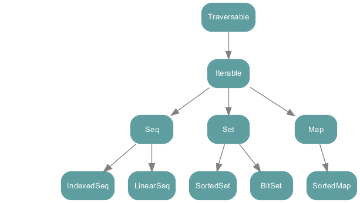
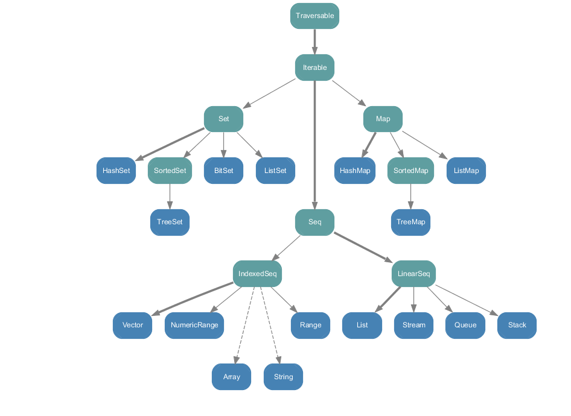
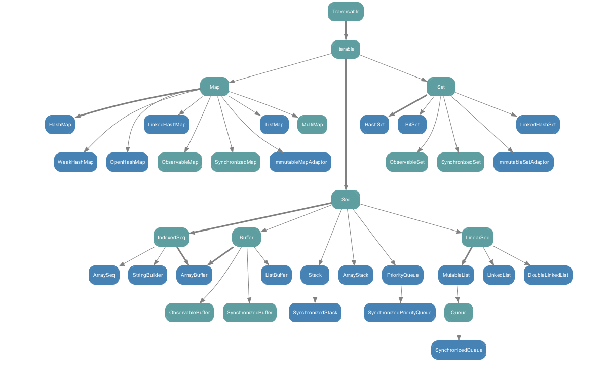

## 简介（Introduction）

https://www.cnblogs.com/cbscan/articles/4147709.html

Martin Odersky和Lex Spoon
在许多人看来，新的集合框架是Scala 2.8中最显著的改进。此前Scala也有集合（实际上新框架大部分地兼容了旧框架），但2.8中的集合类在通用性、一致性和功能的丰富性上更胜一筹。

即使粗看上去集合新增的内容比较微妙，但这些改动却足以对开发者的编程风格造成深远的影响。实际上，就好像你从事一个高层次的程序，而此程序的基本的构建块的元素被整个集合代替。适应这种新的编程风格需要一个过程。幸运的是，新的Scala集合得益于几个新的几个漂亮的属性，从而它们易于使用、简洁、安全、快速、通用。

- 易用性：由20-50个方法的小词汇量，足以在几个操作内解决大部分的集合问题。没有必要被复杂的循环或递归所困扰。持久化的集合类和无副作用的操作意味着你不必担心新数据会意外的破坏已经存在的集合。迭代器和集合更新之间的干扰会被消除！

- 简洁：你可以通过单独的一个词来执行一个或多个循环。你也可以用轻量级的语法和组合轻松地快速表达功能性的操作，以致结果看起来像一个自定义的代数。

- 安全：这一问题必须被熟练的理解，Scala集合的静态类型和函数性质意味着你在编译的时候就可以捕获绝大多数错误。原因是(1)、集合操作本身被大量的使用，是测试良好的。(2)、集合的用法要求输入和输出要显式作为函数参数和结果。（3）这些显式的输入输出会受到静态类型检查。最终，绝大部分的误用将会显示为类型错误。这是很少见的的有数百行的程序的首次运行。

- 快速：集合操作已经在类库里是调整和优化过。因此，使用集合通常是比较高效的。你也许能够通过手动调整数据结构和操作来做的好一点，但是你也可能会由于一些次优的实现而做的更糟。不仅如此，集合类最近已经能支持在多核处理器上并行运算。并行集合类支持有序集合的相同操作，因此没有新的操作需要学习也没有代码需要重写。你可以简单地通过调用标准方法来把有序集合优化为一个并行集合。

- 通用：集合类提供了相同的操作在一些类型上，确实如此。所以，你可以用相当少的词汇完成大量的工作。例如，一个字符串从概念上讲就是一个字符序列。因此，在Scala集合类中，字符串支持所有的序列操作。同样的，数组也是支持的。

例子：这有一行代码演示了Scala集合类的先进性。

val (minors, adults) = people partition (_.age < 18)

这个操作是清晰的：通过他们的age（年龄）把这个集合people拆分到到miors（未成年人）和adults（成年人）中。由于这个拆分方法是被定义在根集合类型TraversableLike类中，这部分代码服务于任何类型的集合，包括数组。例子运行的结果就是miors和adults集合与people集合的类型相同。

这个代码比使用传统的类运行一到三个循环更加简明（三个循环处理一个数组，是由于中间结果需要有其它地方做缓存）。一旦你已经学习了基本的集合词汇，你将也发现写这种代码显式的循环更简单和更安全。而且，这个拆分操作是非常快速，并且在多核处理器上采用并行集合类达到更快的速度（并行集合类已经Scala 2.9的一部分发布）。

本文档从一个用户的角度出发，提供了一个关于Scala集合类的 API的深入讨论。它将带你体验它定义的所有的基础类和方法。

更多详细内容参考官网：http://docs.scala-lang.org/overviews/collections/introduction.html

 

 

Mutable和-Immutable-集合.md

Mutable 和 Immutable 集合

Scala 集合类系统地区分了可变的和不可变的集合。可变集合可以在适当的地方被更新或扩展。这意味着你可以修改，添加，移除一个集合的元素。而不可变集合类，相比之下，永远不会改变。不过，你仍然可以模拟添加，移除或更新操作。但是这些操作将在每一种情况下都返回一个新的集合，同时使原来的集合不发生改变。

所有的集合类都可以在包scala.collection 或scala.collection.mutable，scala.collection.immutable，scala.collection.generic中找到。客户端代码需要的大部分集合类都独立地存在于3种变体中，它们位于scala.collection, scala.collection.immutable, scala.collection.mutable包。每一种变体在可变性方面都有不同的特征。

scala.collection.immutable包是的集合类确保不被任何对象改变。例如一个集合创建之后将不会改变。因此，你可以相信一个事实，在不同的点访问同一个集合的值，你将总是得到相同的元素。。

scala.collection.mutable包的集合类则有一些操作可以修改集合。所以处理可变集合意味着你需要去理解哪些代码的修改会导致集合同时改变。

scala.collection包中的集合，既可以是可变的，也可以是不可变的。例如：collection.IndexedSeq[T]] 就是 collection.immutable.IndexedSeq[T] 和collection.mutable.IndexedSeq[T]这两类的超类。scala.collection包中的根集合类中定义了相同的接口作为不可变集合类，同时，scala.collection.mutable包中的可变集合类代表性的添加了一些有辅助作用的修改操作到这个immutable 接口。

根集合类与不可变集合类之间的区别是不可变集合类的客户端可以确保没有人可以修改集合。然而，根集合类的客户端仅保证不修改集合本身。即使这个集合类没有提供修改集合的静态操作，它仍然可能在运行时作为可变集合被其它客户端所修改。

默认情况下，Scala 一直采用不可变集合类。例如，如果你仅写了Set 而没有任何加前缀也没有从其它地方导入Set，你会得到一个不可变的set，另外如果你写迭代，你也会得到一个不可变的迭代集合类，这是由于这些类在从scala中导入的时候都是默认绑定的。为了得到可变的默认版本，你需要显式的声明collection.mutable.Set或collection.mutable.Iterable.

一个有用的约定，如果你想要同时使用可变和不可变集合类，只导入collection.mutable包即可。

import scala.collection.mutable  //导入包scala.collection.mutable 
然而，像没有前缀的Set这样的关键字， 仍然指的是一个不可变集合，然而mutable.Set指的是可变的副本（可变集合）。

集合树的最后一个包是collection.generic。这个包包含了集合的构建块。集合类延迟了collection.generic类中的部分操作实现，另一方面集合框架的用户需要引用collection.generic中类在异常情况中。

为了方便和向后兼容性，一些导入类型在包scala中有别名，所以你能通过简单的名字使用它们而不需要import。这有一个例子是List 类型，它可以用以下两种方法使用，如下：

scala.collection.immutable.List // 这是它的定义位置
scala.List //通过scala 包中的别名
List // 因为scala._ 
                                  // 总是是被自动导入。

其它类型的别名有： Traversable, Iterable, Seq, IndexedSeq, Iterator, Stream, Vector, StringBuilder, Range。

下面的图表显示了scala.collection包中所有的集合类。这些都是高级抽象类或特性，它们通常具备和不可变实现一样的可变实现。

下面的图表显示scala.collection.immutable中的所有集合类。

下面的图表显示scala.collection.mutable中的所有集合类。

（以上三个图表由Matthias生成， 来自decodified.com）。

集合API概述
大多数重要的集合类都被展示在了上表。而且这些类有很多的共性。例如，每一种集合都能用相同的语法创建，写法是集合类名紧跟着元素。

Traversable(1, 2, 3)
Iterable("x", "y", "z")
Map("x" -> 24, "y" -> 25, "z" -> 26)
Set(Color.red, Color.green, Color.blue)
SortedSet("hello", "world")
Buffer(x, y, z)
IndexedSeq(1.0, 2.0)
LinearSeq(a, b, c)
相同的原则也应用于特殊的集合实现，例如：

List(1, 2, 3)
HashMap("x" -> 24, "y" -> 25, "z" -> 26)
所有这些集合类都通过相同的途径，用toString方法展示出来。

Traversable类提供了所有集合支持的API，同时，对于特殊类型也是有意义的。例如，Traversable类 的map方法会返回另一个Traversable对象作为结果，但是这个结果类型在子类中被重写了。例如，在一个List上调用map会又生成一个List，在Set上调用会再生成一个Set，以此类推。

scala> List(1, 2, 3) map (_ + 1) 
res0: List[Int] = List(2, 3, 4)
scala> Set(1, 2, 3) map (_ * 2)
res0: Set[Int] = Set(2, 4, 6)
在集合类库中，这种在任何地方都实现了的行为，被称之为返回类型一致原则。

大多数类在集合树中存在这于三种变体：root, mutable 和immutable。唯一的例外是缓冲区特征，它仅在于mutable集合。

下面我们将一个个的回顾这些类，更多详细内容参考官网：http://docs.scala-lang.org/overviews/collections/overview.html

 

 

Trait Traversable
Traversable（遍历）是容器(collection)类的最高级别特性，它唯一的抽象操作是foreach:

def foreach[U](/DOC_Scala/chinese_scala_offical_document/file/f: Elem => U)

需要实现Traversable的容器(collection)类仅仅需要定义与之相关的方法，其他所有方法可都可以从Traversable中继承。

foreach方法用于遍历容器（collection）内的所有元素和每个元素进行指定的操作（比如说f操作）。操作类型是Elem => U，其中Elem是容器（collection）中元素的类型，U是一个任意的返回值类型。对f的调用仅仅是容器遍历的副作用，实际上所有函数f的计算结果都被foreach抛弃了。

Traversable同时定义的很多具体方法，如下表所示。这些方法可以划分为以下类别：

相加操作++（addition）表示把两个traversable对象附加在一起或者把一个迭代器的所有元素添加到traversable对象的尾部。

Map操作有map，flatMap和collect，它们可以通过对容器中的元素进行某些运算来生成一个新的容器。

转换器（Conversion）操作包括toArray，toList，toIterable，toSeq，toIndexedSeq，toStream，toSet，和toMap，它们可以按照某种特定的方法对一个Traversable 容器进行转换。等容器类型已经与所需类型相匹配的时候，所有这些转换器都会不加改变的返回该容器。例如，对一个list使用toList，返回的结果就是list本身。

拷贝（Copying）操作有copyToBuffer和copyToArray。从字面意思就可以知道，它们分别用于把容器中的元素元素拷贝到一个缓冲区或者数组里。

Size info操作包括有isEmpty，nonEmpty，size和hasDefiniteSize。Traversable容器有有限和无限之分。比方说，自然数流Stream.from(0)就是一个无限的traversable 容器。hasDefiniteSize方法能够判断一个容器是否可能是无限的。若hasDefiniteSize返回值为ture，容器肯定有限。若返回值为false，根据完整信息才能判断容器（collection）是无限还是有限。

元素检索（Element Retrieval）操作有head，last，headOption，lastOption和find。这些操作可以查找容器的第一个元素或者最后一个元素，或者第一个符合某种条件的元素。注意，尽管如此，但也不是所有的容器都明确定义了什么是“第一个”或”最后一个“。例如，通过哈希值储存元素的哈希集合（hashSet），每次运行哈希值都会发生改变。在这种情况下，程序每次运行都可能会导致哈希集合的”第一个“元素发生变化。如果一个容器总是以相同的规则排列元素，那这个容器是有序的。大多数容器都是有序的，但有些不是（例如哈希集合）-- 排序会造成一些额外消耗。排序对于重复性测试和辅助调试是不可或缺的。这就是为什么Scala容器中的所有容器类型都把有序作为可选项。例如，带有序性的HashSet就是LinkedHashSet。

子容器检索（sub-collection Retrieval）操作有tail，init，slice，take，drop，takeWhilte，dropWhile，filter，filteNot和withFilter。它们都可以通过范围索引或一些论断的判断返回某些子容器。

拆分（Subdivision）操作有splitAt，span，partition和groupBy，它们用于把一个容器（collection）里的元素分割成多个子容器。

元素测试（Element test）包括有exists，forall和count，它们可以用一个给定论断来对容器中的元素进行判断。

折叠（Folds）操作有foldLeft，foldRight，/:，:\，reduceLeft和reduceRight，用于对连续性元素的二进制操作。

特殊折叠（Specific folds）包括sum, product, min, max。它们主要用于特定类型的容器（数值或比较）。

字符串（String）操作有mkString，addString和stringPrefix，可以将一个容器通过可选的方式转换为字符串。

视图（View）操作包含两个view方法的重载体。一个view对象可以当作是一个容器客观地展示。接下来将会介绍更多有关视图内容。

Traversable对象的操作
WHAT IT IS	WHAT IT DOES
抽象方法：	 
xs foreach f	对xs中的每一个元素执行函数f
加运算（Addition）：	 
xs ++ ys	生成一个由xs和ys中的元素组成容器。ys是一个TraversableOnce容器，即Taversable类型或迭代器。
Maps:	 
xs map f	通过函数xs中的每一个元素调用函数f来生成一个容器。
xs flatMap f	通过对容器xs中的每一个元素调用作为容器的值函数f，在把所得的结果连接起来作为一个新的容器。
xs collect f	通过对每个xs中的符合定义的元素调用偏函数f，并把结果收集起来生成一个集合。
转换（Conversions）：	 
xs.toArray	把容器转换为一个数组
xs.toList	把容器转换为一个list
xs.toIterable	把容器转换为一个迭代器。
xs.toSeq	把容器转换为一个序列
xs.toIndexedSeq	把容器转换为一个索引序列
xs.toStream	把容器转换为一个延迟计算的流。
xs.toSet	把容器转换为一个集合（Set）。
xs.toMap	把由键/值对组成的容器转换为一个映射表（map）。如果该容器并不是以键/值对作为元素的，那么调用这个操作将会导致一个静态类型的错误。
拷贝（Copying）：	 
xs copyToBuffer buf	把容器的所有元素拷贝到buf缓冲区。
xs copyToArray(arr, s, n)	拷贝最多n个元素到数组arr的坐标s处。参数s，n是可选项。
大小判断（Size info）：	 
xs.isEmpty	测试容器是否为空。
xs.nonEmpty	测试容器是否包含元素。
xs.size	计算容器内元素的个数。
xs.hasDefiniteSize	如果xs的大小是有限的，则为true。
元素检索（Element Retrieval）：	 
xs.head	返回容器内第一个元素（或其他元素，若当前的容器无序）。
xs.headOption	xs选项值中的第一个元素，若xs为空则为None。
xs.last	返回容器的最后一个元素（或某个元素，如果当前的容器无序的话）。
xs.lastOption	xs选项值中的最后一个元素，如果xs为空则为None。
xs find p	查找xs中满足p条件的元素，若存在则返回第一个元素；若不存在，则为空。
子容器（Subcollection）：	 
xs.tail	返回由除了xs.head外的其余部分。
xs.init	返回除xs.last外的其余部分。
xs slice (from, to)	返回由xs的一个片段索引中的元素组成的容器（从from到to，但不包括to）。
xs take n	由xs的第一个到第n个元素（或当xs无序时任意的n个元素）组成的容器。
xs drop n	由除了xs take n以外的元素组成的容器。
xs takeWhile p	容器xs中最长能够满足断言p的前缀。
xs dropWhile p	容器xs中除了xs takeWhile p以外的全部元素。
xs filter p	由xs中满足条件p的元素组成的容器。
xs withFilter p	这个容器是一个不太严格的过滤器。子容器调用map，flatMap，foreach和withFilter只适用于xs中那些的满足条件p的元素。
xs filterNot p	由xs中不满足条件p的元素组成的容器。
拆分（Subdivision）：	 
xs splitAt n	把xs从指定位置的拆分成两个容器（xs take n和xs drop n）。
xs span p	根据一个断言p将xs拆分为两个容器（xs takeWhile p, xs.dropWhile p）。
xs partition p	把xs分割为两个容器，符合断言p的元素赋给一个容器，其余的赋给另一个(xs filter p, xs.filterNot p)。
xs groupBy f	根据判别函数f把xs拆分一个到容器（collection）的map中。
条件元素（Element Conditions）：	 
xs forall p	返回一个布尔值表示用于表示断言p是否适用xs中的所有元素。
xs exists p	返回一个布尔值判断xs中是否有部分元素满足断言p。
xs count p	返回xs中符合断言p条件的元素个数。
折叠（Fold）：	 
(z /: xs)(op)	在xs中，对由z开始从左到右的连续元素应用二进制运算op。
(xs :\ z)(op)	在xs中，对由z开始从右到左的连续元素应用二进制运算op
xs.foldLeft(z)(op)	与(z /: xs)(op)相同。
xs.foldRight(z)(op)	与 (xs :\ z)(op)相同。
xs reduceLeft op	非空容器xs中的连续元素从左至右调用二进制运算op。
xs reduceRight op	非空容器xs中的连续元素从右至左调用二进制运算op。
特殊折叠（Specific Fold）：	 
xs.sum	返回容器xs中数字元素的和。
xs.product	xs返回容器xs中数字元素的积。
xs.min	容器xs中有序元素值中的最小值。
xs.max	容器xs中有序元素值中的最大值。
字符串（String）：	 
xs addString (b, start, sep, end)	把一个字符串加到StringBuilder对象b中，该字符串显示为将xs中所有元素用分隔符sep连接起来并封装在start和end之间。其中start，end和sep都是可选的。
xs mkString (start, sep, end)	把容器xs转换为一个字符串，该字符串显示为将xs中所有元素用分隔符sep连接起来并封装在start和end之间。其中start，end和sep都是可选的。
xs.stringPrefix	返回一个字符串，该字符串是以容器名开头的xs.toString。
视图（View）：	 
xs.view	通过容器xs生成一个视图。
xs view (from, to)	生成一个表示在指定索引范围内的xs元素的视图。
更多详细内容参考官网：http://docs.scala-lang.org/overviews/collections/trait-traversable.html

 

 

Trait Iterable
自下而上的容器（collection）层次结构具有可迭代的Trait。Trait的所有方法可定义为一个抽象方法，逐个生成容器（collection）元素迭代器。Traversable Trait的foreach方法实现了迭代器的Iterable。下面是具体的实现。

def foreach[U](/DOC_Scala/chinese_scala_offical_document/file/f: Elem => U): Unit = {
  val it = iterator
  while (it.hasNext) f(it.next())
} 
许多Iterable 的子类覆写了Iteable的foreach标准实现，因为它们提供了更多有效的实现。记住，由于性能问题，foreach是Traversable所有操作能够实现的基础。

Iterable有两个方法返回迭代器：grouped和sliding。然而，这些迭代器返回的不是单个元素，而是原容器（collection）元素的全部子序列。这些最大的子序列作为参数传给这些方法。grouped方法返回元素的增量分块，sliding方法生成一个滑动元素的窗口。两者之间的差异通过REPL的作用能够清楚看出。

scala> val xs = List(1, 2, 3, 4, 5)
xs: List[Int] = List(1, 2, 3, 4, 5)
scala> val git = xs grouped 3
git: Iterator[List[Int]] = non-empty iterator
scala> git.next()
res3: List[Int] = List(1, 2, 3)
scala> git.next()
res4: List[Int] = List(4, 5)
scala> val sit = xs sliding 3
sit: Iterator[List[Int]] = non-empty iterator
scala> sit.next()
res5: List[Int] = List(1, 2, 3)
scala> sit.next()
res6: List[Int] = List(2, 3, 4)
scala> sit.next()
res7: List[Int] = List(3, 4, 5)
当只有一个迭代器可用时，Trait Iterable增加了一些其他方法，为了能被有效的实现的可遍历的情况。这些方法总结在下面的表中。

Trait Iterable操作
WHAT IT IS	WHAT IT DOES
抽象方法：	 
xs.iterator	xs迭代器生成的每一个元素，以相同的顺序就像foreach一样遍历元素。
其他迭代器：	 
xs grouped size	一个迭代器生成一个固定大小的容器（collection）块。
xs sliding size	一个迭代器生成一个固定大小的滑动窗口作为容器（collection）的元素。
子容器（Subcollection）：	 
xs takeRight n	一个容器（collection）由xs的最后n个元素组成（或，若定义的元素是无序，则由任意的n个元素组成）。
xs dropRight n	一个容器（collection）由除了xs 被取走的（执行过takeRight （）方法）n个元素外的其余元素组成。
拉链方法（Zippers）：	 
xs zip ys	把一对容器 xs和ys的包含的元素合成到一个iterabale。
xs zipAll (ys, x, y)	一对容器 xs 和ys的相应的元素合并到一个iterable ，实现方式是通过附加的元素x或y，把短的序列被延展到相对更长的一个上。
xs.zip WithIndex	把一对容器xs和它的序列，所包含的元素组成一个iterable 。
比对：	 
xs sameElements ys	测试 xs 和 ys 是否以相同的顺序包含相同的元素。
在Iterable下的继承层次结构你会发现有三个traits：Seq，Set，和 Map。这三个Traits有一个共同的特征，它们都实现了PartialFunction trait以及它的应用和isDefinedAt 方法。然而，每一个trait实现的PartialFunction 方法却各不相同。

例如序列，使用用的是位置索引，它里面的元素的总是从0开始编号。即Seq(1, 2, 3)(1)为2。例如sets，使用的是成员测试。例如Set('a', 'b', 'c')('b')算出来的是true，而Set()('a')为false。最后，maps使用的是选择。比如Map('a' -> 1, 'b' -> 10, 'c' -> 100)('b') 得到的是10。

接下来，我们将详细的介绍三种类型的容器（collection）。

更多详细内容参考官网：http://docs.scala-lang.org/overviews/collections/trait-iterable.html

 

 

序列trait：Seq、IndexedSeq及LinearSeq
Seq trait用于表示序列。所谓序列，指的是一类具有一定长度的可迭代访问的对象，其中每个元素均带有一个从0开始计数的固定索引位置。

序列的操作有以下几种，如下表所示：

索引和长度的操作 apply、isDefinedAt、length、indices，及lengthCompare。序列的apply操作用于索引访问；因此，Seq[T]类型的序列也是一个以单个Int（索引下标）为参数、返回值类型为T的偏函数。换言之，Seq[T]继承自Partial Function[Int, T]。序列各元素的索引下标从0开始计数，最大索引下标为序列长度减一。序列的length方法是collection的size方法的别名。lengthCompare方法可以比较两个序列的长度，即便其中一个序列长度无限也可以处理。
索引检索操作（indexOf、lastIndexOf、indexofSlice、lastIndexOfSlice、indexWhere、lastIndexWhere、segmentLength、prefixLength）用于返回等于给定值或满足某个谓词的元素的索引。
加法运算（+:，:+，padTo）用于在序列的前面或者后面添加一个元素并作为新序列返回。
更新操作（updated，patch）用于替换原序列的某些元素并作为一个新序列返回。
排序操作（sorted, sortWith, sortBy）根据不同的条件对序列元素进行排序。
反转操作（reverse, reverseIterator, reverseMap）用于将序列中的元素以相反的顺序排列。
比较（startsWith, endsWith, contains, containsSlice, corresponds）用于对两个序列进行比较，或者在序列中查找某个元素。
多集操作（intersect, diff, union, distinct）用于对两个序列中的元素进行类似集合的操作，或者删除重复元素。
如果一个序列是可变的，它提供了另一种更新序列中的元素的，但有副作用的update方法，Scala中常有这样的语法，如seq(idx) = elem。它只是seq.update(idx, elem)的简写，所以update 提供了方便的赋值语法。应注意update 和updated之间的差异。update 再原来基础上更改序列中的元素，并且仅适用于可变序列。而updated 适用于所有的序列，它总是返回一个新序列，而不会修改原序列。

Set类的操作
WHAT IT IS	WHAT IT DOES
索引和长度	 
xs(i)	(或者写作xs apply i)。xs的第i个元素
xs isDefinedAt i	测试xs.indices中是否包含i。
xs.length	序列的长度（同size）。
xs.lengthCompare ys	如果xs的长度小于ys的长度，则返回-1。如果xs的长度大于ys的长度，则返回+1，如果它们长度相等，则返回0。即使其中一个序列是无限的，也可以使用此方法。
xs.indices	xs的索引范围，从0到xs.length - 1。
索引搜索	 
xs indexOf x	返回序列xs中等于x的第一个元素的索引（存在多种变体）。
xs lastIndexOf x	返回序列xs中等于x的最后一个元素的索引（存在多种变体）。
xs indexOfSlice ys	查找子序列ys，返回xs中匹配的第一个索引。
xs indexOfSlice ys	查找子序列ys，返回xs中匹配的倒数一个索引。
xs indexWhere p	xs序列中满足p的第一个元素。（有多种形式）
xs segmentLength (p, i)	xs中，从xs(i)开始并满足条件p的元素的最长连续片段的长度。
xs prefixLength p	xs序列中满足p条件的先头元素的最大个数。
加法：	 
x +: xs	由序列xs的前方添加x所得的新序列。
xs :+ x	由序列xs的后方追加x所得的新序列。
xs padTo (len, x)	在xs后方追加x，直到长度达到len后得到的序列。
更新	 
xs patch (i, ys, r)	将xs中第i个元素开始的r个元素，替换为ys所得的序列。
xs updated (i, x)	将xs中第i个元素替换为x后所得的xs的副本。
xs(i) = x	（或写作 xs.update(i, x)，仅适用于可变序列）将xs序列中第i个元素修改为x。
排序	 
xs.sorted	通过使用xs中元素类型的标准顺序，将xs元素进行排序后得到的新序列。
xs sortWith lt	将lt作为比较操作，并以此将xs中的元素进行排序后得到的新序列。
xs sortBy f	将序列xs的元素进行排序后得到的新序列。参与比较的两个元素各自经f函数映射后得到一个结果，通过比较它们的结果来进行排序。
反转	 
xs.reverse	与xs序列元素顺序相反的一个新序列。
xs.reverseIterator	产生序列xs中元素的反序迭代器。
xs reverseMap f	以xs的相反顺序，通过f映射xs序列中的元素得到的新序列。
比较	 
xs startsWith ys	测试序列xs是否以序列ys开头（存在多种形式）。
xs endsWith ys	测试序列xs是否以序列ys结束（存在多种形式）。
xs contains x	测试xs序列中是否存在一个与x相等的元素。
xs containsSlice ys	测试xs序列中是否存在一个与ys相同的连续子序列。
(xs corresponds ys)(p)	测试序列xs与序列ys中对应的元素是否满足二元的判断式p。
多集操作	 
xs intersect ys	序列xs和ys的交集，并保留序列xs中的顺序。
xs diff ys	序列xs和ys的差集，并保留序列xs中的顺序。
xs union ys	并集；同xs ++ ys。
xs.distinct	不含重复元素的xs的子序列。
 	 
特性（trait) Seq 具有两个子特征（subtrait） LinearSeq和IndexedSeq。它们不添加任何新的操作，但都提供不同的性能特点：线性序列具有高效的 head 和 tail 操作，而索引序列具有高效的apply, length, 和 (如果可变) update操作。

常用线性序列有 scala.collection.immutable.List和scala.collection.immutable.Stream。常用索引序列有scala.Array scala.collection.mutable.ArrayBuffer。Vector 类提供一个在索引访问和线性访问之间有趣的折中。它同时具有高效的恒定时间的索引开销，和恒定时间的线性访问开销。正因为如此，对于混合访问模式，vector是一个很好的基础。后面将详细介绍vector。

缓冲器
Buffers是可变序列一个重要的种类。它们不仅允许更新现有的元素，而且允许元素的插入、移除和在buffer尾部高效地添加新元素。buffer 支持的主要新方法有：用于在尾部添加元素的 += 和 ++=；用于在前方添加元素的+=:和++=: ；用于插入元素的 insert和insertAll；以及用于删除元素的remove 和 -=。如下表所示。

ListBuffer和ArrayBuffer是常用的buffer实现 。顾名思义，ListBuffer依赖列表（List），支持高效地将它的元素转换成列表。而ArrayBuffer依赖数组（Array），能快速地转换成数组。

Buffer类的操作
WHAT IT IS	WHAT IT DOES
加法：	 
buf += x	将元素x追加到buffer，并将buf自身作为结果返回。
buf += (x, y, z)	将给定的元素追加到buffer。
buf ++= xs	将xs中的所有元素追加到buffer。
x +=: buf	将元素x添加到buffer的前方。
xs ++=: buf	将xs中的所有元素都添加到buffer的前方。
buf insert (i, x)	将元素x插入到buffer中索引为i的位置。
buf insertAll (i, xs)	将xs的所有元素都插入到buffer中索引为i的位置。
移除：	 
buf -= x	将元素x从buffer中移除。
buf remove i	将buffer中索引为i的元素移除。
buf remove (i, n)	将buffer中从索引i开始的n个元素移除。
buf trimStart n	移除buffer中的前n个元素。
buf trimEnd n	移除buffer中的后n个元素。
buf.clear()	移除buffer中的所有元素。
克隆：	 
buf.clone	与buf具有相同元素的新buffer。
更多详细内容参考官网：http://docs.scala-lang.org/overviews/collections/seqs.html

 

 

集合（Set）
集合是不包含重复元素的可迭代对象。下面的通用集合表和可变集合表中概括了集合类型适用的运算。分为几类：

测试型的方法：contains，apply，subsetOf。contains方法用于判断集合是否包含某元素。集合的apply方法和contains方法的作用相同，因此 set(elem) 等同于set constains elem。这意味着集合对象的名字能作为其自身是否包含某元素的测试函数。
例如

val fruit = Set("apple", "orange", "peach", "banana")
fruit: scala.collection.immutable.Set[java.lang.String] = 
Set(apple, orange, peach, banana)
scala> fruit("peach")
res0: Boolean = true
scala> fruit("potato")
res1: Boolean = false
加法类型的方法： + 和 ++ 。添加一个或多个元素到集合中，产生一个新的集合。
减法类型的方法： - 、--。它们实现从一个集合中移除一个或多个元素，产生一个新的集合。
Set运算包括并集、交集和差集。每一种运算都存在两种书写形式：字母和符号形式。字母形式：intersect、union和diff，符号形式：&、|和&~。事实上，Set中继承自Traversable的++也能被看做union或|的另一个别名。区别是，++的参数为Traversable对象，而union和|的参数是集合。
Set 类的操作
WHAT IT IS	WHAT IT DOES
实验代码：	 
xs contains x	测试x是否是xs的元素。
xs(x)	与xs contains x相同。
xs subsetOf ys	测试xs是否是ys的子集。
加法：	 
xs + x	包含xs中所有元素以及x的集合。
xs + (x, y, z)	包含xs中所有元素及附加元素的集合
xs ++ ys	包含xs中所有元素及ys中所有元素的集合
实验代码：	 
xs - x	包含xs中除x以外的所有元素的集合。
xs - x	包含xs中除去给定元素以外的所有元素的集合。
xs -- ys	集合内容为：xs中所有元素，去掉ys中所有元素后剩下的部分。
xs.empty	与xs同类的空集合。
二进制操作：	 
xs & ys	集合xs和ys的交集。
xs intersect ys	等同于 xs & ys。
xs	ys
xs union ys	等同于xs
xs &~ ys	集合xs和ys的差集。
xs diff ys	等同于 xs &~ ys。
可变集合提供加法类方法，可以用来添加、删除或更新元素。下面对这些方法做下总结。

mutable.Set 类的操作
WHAT IT IS	WHAT IT DOES
加法：	 
xs += x	把元素x添加到集合xs中。该操作有副作用，它会返回左操作符，这里是xs自身。
xs += (x, y, z)	添加指定的元素到集合xs中，并返回xs本身。（同样有副作用）
xs ++= ys	添加集合ys中的所有元素到集合xs中，并返回xs本身。（表达式有副作用）
xs add x	把元素x添加到集合xs中，如集合xs之前没有包含x，该操作返回true，否则返回false。
移除：	 
xs -= x	从集合xs中删除元素x，并返回xs本身。（表达式有副作用）
xs -= (x, y, z)	从集合xs中删除指定的元素，并返回xs本身。（表达式有副作用）
xs --= ys	从集合xs中删除所有属于集合ys的元素，并返回xs本身。（表达式有副作用）
xs remove x	从集合xs中删除元素x。如之前xs中包含了x元素，返回true，否则返回false。
xs retain p	只保留集合xs中满足条件p的元素。
xs.clear()	删除集合xs中的所有元素。
**更新： **	 
xs(x) = b	（ 同 xs.update(x, b) ）参数b为布尔类型，如果值为true就把元素x加入集合xs，否则从集合xs中删除x。
克隆：	 
xs.clone	产生一个与xs具有相同元素的可变集合。
与不变集合一样，可变集合也提供了+和++操作符来添加元素，-和--用来删除元素。但是这些操作在可变集合中通常很少使用，因为这些操作都要通过集合的拷贝来实现。可变集合提供了更有效率的更新方法，+=和-=。 s += elem，添加元素elem到集合s中，并返回产生变化后的集合作为运算结果。同样的，s -= elem执行从集合s中删除元素elem的操作，并返回产生变化后的集合作为运算结果。除了+=和-=之外还有从可遍历对象集合或迭代器集合中添加和删除所有元素的批量操作符++=和--=。

选用+=和-=这样的方法名使得我们得以用非常近似的代码来处理可变集合和不可变集合。先看一下以下处理不可变集合s的REPL会话：

scala> var s = Set(1, 2, 3)
s: scala.collection.immutable.Set[Int] = Set(1, 2, 3)
scala> s += 4
scala> s -= 2
scala> s
res2: scala.collection.immutable.Set[Int] = Set(1, 3, 4)
我们在immutable.Set类型的变量中使用+=和-=。诸如 s += 4 的表达式是 s = s + 4的缩写，它的作用是，在集合s上运用方法+，并把结果赋回给变量s。下面我们来分析可变集合上的类似操作。

scala> val s = collection.mutable.Set(1, 2, 3)
s: scala.collection.mutable.Set[Int] = Set(1, 2, 3)
scala> s += 4
res3: s.type = Set(1, 4, 2, 3)
scala> s -= 2
res4: s.type = Set(1, 4, 3)
最后结果看起来和之前的在非可变集合上的操作非常相似；从Set(1, 2, 3)开始，最后得到Set(1, 3, 4)。然而，尽管相似，但它们在实现上其实是不同的。 这里s += 4是在可变集合值s上调用+=方法，它会改变s的内容。同样的，s -= 2 也是在s上调用 -=方法，也会修改s集合的内容。

通过比较这两种方式得出一个重要的原则。我们通常能用一个非可变集合的变量来替换可变集合的常量，反之亦然。这一原则至少在没有别名的引用添加到Collection时起作用。别名引用主要是用来观察操作在Collection上直接做的修改还是生成了一个新的Collection。

可变集合同样提供作为+=和-=的变型方法，add和remove，它们的不同之处在于add和remove会返回一个表明运算是否对集合有作用的Boolean值

目前可变集合默认使用哈希表来存储集合元素，非可变集合则根据元素个数的不同，使用不同的方式来实现。空集用单例对象来表示。元素个数小于等于4的集合可以使用单例对象来表达，元素作为单例对象的字段来存储。 元素超过4个，非可变集合就用哈希前缀树（hash trie）来实现。

采用这种表示方法，较小的不可变集合（元素数不超过4）往往会比可变集合更加紧凑和高效。所以，在处理小尺寸的集合时，不妨试试不可变集合。

集合的两个特质是SortedSet和 BitSet。

有序集（SortedSet）
SortedSet 是指以特定的顺序（这一顺序可以在创建集合之初自由的选定）排列其元素（使用iterator或foreach）的集合。 SortedSet 的默认表示是有序二叉树，即左子树上的元素小于所有右子树上的元素。这样，一次简单的顺序遍历能按增序返回集合中的所有元素。Scala的类 immutable.TreeSet 使用红黑树实现，它在维护元素顺序的同时，也会保证二叉树的平衡，即叶节点的深度差最多为1。

创建一个空的 TreeSet ，可以先定义排序规则：

scala> val myOrdering = Ordering.fromLessThan[String](/DOC_Scala/chinese_scala_offical_document/file/_ > _)
myOrdering: scala.math.Ordering[String] = ...
然后，用这一排序规则创建一个空的树集：

scala> TreeSet.empty(myOrdering)
res1: scala.collection.immutable.TreeSet[String] = TreeSet()
或者，你也可以不指定排序规则参数，只需要给定一个元素类型或空集合。在这种情况下，将使用此元素类型默认的排序规则。

scala> TreeSet.empty[String]
res2: scala.collection.immutable.TreeSet[String] = TreeSet()
如果通过已有的TreeSet来创建新的集合（例如，通过串联或过滤操作），这些集合将和原集合保持相同的排序规则。例如，

scala> res2 + ("one", "two", "three", "four")
res3: scala.collection.immutable.TreeSet[String] = TreeSet(four, one, three, two)
有序集合同样支持元素的范围操作。例如，range方法返回从指定起始位置到结束位置（不含结束元素）的所有元素，from方法返回大于等于某个元素的所有元素。调用这两种方法的返回值依然是有序集合。例如：

scala> res3 range ("one", "two")
res4: scala.collection.immutable.TreeSet[String] = TreeSet(one, three)
scala> res3 from "three"
res5: scala.collection.immutable.TreeSet[String] = TreeSet(three, two)
位集合（Bitset）
位集合是由单字或多字的紧凑位实现的非负整数的集合。其内部使用Long型数组来表示。第一个Long元素表示的范围为0到63，第二个范围为64到127，以此类推（值为0到127的非可变位集合通过直接将值存储到第一个或第两个Long字段的方式，优化掉了数组处理的消耗）。对于每个Long，如果有相应的值包含于集合中则它对应的位设置为1，否则该位为0。这里遵循的规律是，位集合的大小取决于存储在该集合的最大整数的值的大小。假如N是为集合所要表示的最大整数，则集合的大小就是N/64个长整形字，或者N/8个字节，再加上少量额外的状态信息字节。

因此当位集合包含的元素值都比较小时，它比其他的集合类型更紧凑。位集合的另一个优点是它的contains方法（成员测试）、+=运算（添加元素）、-=运算（删除元素）都非常的高效。

更多详细内容参考官网：http://docs.scala-lang.org/overviews/collections/sets.html

 

 

映射（Map）
映射（Map）是一种可迭代的键值对结构（也称映射或关联）。Scala的Predef类提供了隐式转换，允许使用另一种语法：key -> value，来代替(key, value)。如：Map("x" -> 24, "y" -> 25, "z" -> 26)等同于Map(("x", 24), ("y", 25), ("z", 26))，却更易于阅读。

映射（Map）的基本操作与集合（Set）类似。下面的表格分类总结了这些操作：

查询类操作：apply、get、getOrElse、contains和DefinedAt。它们都是根据主键获取对应的值映射操作。例如：def get(key): Option[Value]。“m get key” 返回m中是否用包含了key值。如果包含了，则返回对应value的Some类型值。否则，返回None。这些映射中也包括了apply方法，该方法直接返回主键对应的值。apply方法不会对值进行Option封装。如果该主键不存在，则会抛出异常。
添加及更新类操作：+、++、updated，这些映射操作允许你添加一个新的绑定或更改现有的绑定。
删除类操作：-、--，从一个映射（Map）中移除一个绑定。
子集类操作：keys、keySet、keysIterator、values、valuesIterator，可以以不同形式返回映射的键和值。
filterKeys、mapValues等变换用于对现有映射中的绑定进行过滤和变换，进而生成新的映射。
Map类的操作
WHAT IT IS	WHAT IT DOES
查询：	 
ms get k	返回一个Option，其中包含和键k关联的值。若k不存在，则返回None。
ms(k)	（完整写法是ms apply k）返回和键k关联的值。若k不存在，则抛出异常。
ms getOrElse (k, d)	返回和键k关联的值。若k不存在，则返回默认值d。
ms contains k	检查ms是否包含与键k相关联的映射。
ms isDefinedAt k	同contains。
添加及更新:	 
ms + (k -> v)	返回一个同时包含ms中所有键值对及从k到v的键值对k -> v的新映射。
ms + (k -> v, l -> w)	返回一个同时包含ms中所有键值对及所有给定的键值对的新映射。
ms ++ kvs	返回一个同时包含ms中所有键值对及kvs中的所有键值对的新映射。
ms updated (k, v)	同ms + (k -> v)。
移除：	 
ms - k	返回一个包含ms中除键k以外的所有映射关系的映射。
ms - (k, 1, m)	返回一个滤除了ms中与所有给定的键相关联的映射关系的新映射。
ms -- ks	返回一个滤除了ms中与ks中给出的键相关联的映射关系的新映射。
子容器（Subcollection）：	 
ms.keys	返回一个用于包含ms中所有键的iterable对象（译注：请注意iterable对象与iterator的区别）
ms.keySet	返回一个包含ms中所有的键的集合。
ms.keyIterator	返回一个用于遍历ms中所有键的迭代器。
ms.values	返回一个包含ms中所有值的iterable对象。
ms.valuesIterator	返回一个用于遍历ms中所有值的迭代器。
变换：	 
ms filterKeys p	一个映射视图（Map View），其包含一些ms中的映射，且这些映射的键满足条件p。用条件谓词p过滤ms中所有的键，返回一个仅包含与过滤出的键值对的映射视图（view）。
ms mapValues f	用f将ms中每一个键值对的值转换成一个新的值，进而返回一个包含所有新键值对的映射视图（view）。
可变映射（Map）还支持下表中列出的操作。

mutable.Map类中的操作
WHAT IT IS	WHAT IT DOES
添加及更新	 
ms(k) = v	（完整形式为ms.update(x, v)）。向映射ms中新增一个以k为键、以v为值的映射关系，ms先前包含的以k为值的映射关系将被覆盖。
ms += (k -> v)	向映射ms增加一个以k为键、以v为值的映射关系，并返回ms自身。
ms += (k -> v, l -> w)	向映射ms中增加给定的多个映射关系，并返回ms自身。
ms ++= kvs	向映射ms增加kvs中的所有映射关系，并返回ms自身。
ms put (k, v)	向映射ms增加一个以k为键、以v为值的映射，并返回一个Option，其中可能包含此前与k相关联的值。
ms getOrElseUpdate (k, d)	如果ms中存在键k，则返回键k的值。否则向ms中新增映射关系k -> v并返回d。
移除：	 
ms -= k	从映射ms中删除以k为键的映射关系，并返回ms自身。
ms -= (k, l, m)	从映射ms中删除与给定的各个键相关联的映射关系，并返回ms自身。
ms --= ks	从映射ms中删除与ks给定的各个键相关联的映射关系，并返回ms自身。
ms remove k	从ms中移除以k为键的映射关系，并返回一个Option，其可能包含之前与k相关联的值。
ms retain p	仅保留ms中键满足条件谓词p的映射关系。
ms.clear()	删除ms中的所有映射关系
变换：	 
ms transform f	以函数f转换ms中所有键值对（译注：原文比较含糊，transform中参数f的类型是(A, B) => B，即对ms中的所有键值对调用f，得到一个新的值，并用该值替换原键值对中的值）。
克隆：	 
ms.clone	返回一个新的可变映射（Map），其中包含与ms相同的映射关系。
映射（Map）的添加和删除操作与集合（Set）的相关操作相同。同集合（Set）操作一样，可变映射（mutable maps）也支持非破坏性（non-destructive）修改操作+、-、和updated。但是这些操作涉及到可变映射的复制，因此较少被使用。而利用两种变形m(key) = value和m += (key -> value)， 我们可以“原地”修改可变映射m。此外，存还有一种变形m put (key, value)，该调用返回一个Option值，其中包含此前与键相关联的值，如果不存在这样的值，则返回None。

getOrElseUpdate特别适合用于访问用作缓存的映射（Map）。假设调用函数f开销巨大：

scala> def f(x: String) = { 
       println("taking my time."); sleep(100)
       x.reverse }
f: (x: String)String
此外，再假设f没有副作用，即反复以相同参数调用f，得到的结果都相同。那么，我们就可以将之前的调用参数和计算结果保存在一个映射（Map）内，今后仅在映射中查不到对应参数的情况下实际调用f，这样就可以节约时间。这个映射便可以认为是函数f的缓存。

val cache = collection.mutable.Map[String, String]()
cache: scala.collection.mutable.Map[String,String] = Map()
现在，我们可以写出一个更高效的带缓存的函数f：

scala> def cachedF(s: String) = cache.getOrElseUpdate(s, f(s))
cachedF: (s: String)String
scala> cachedF("abc")
稍等片刻。

res3: String = cba
scala> cachedF("abc")
res4: String = cba
注意，getOrElseUpdate的第2个参数是“按名称（by-name）"传递的，所以，仅当在缓存映射中找不到第1个参数，而getOrElseUpdate需要其第2个参数的值时，上述的f("abc")才会被执行。当然我们也可以利用Map的基本操作直接实现cachedF，但那样写就要冗长很多了。

def cachedF(arg: String) = cache get arg match {
  case Some(result) => result
  case None => 
    val result = f(x)
    cache(arg) = result
    result
}
同步集合（Set）和映射（Map）
无论什么样的Map实现，只需混入SychronizedMap trait，就可以得到对应的线程安全版的Map。例如，我们可以像下述代码那样在HashMap中混入SynchronizedMap。这个示例一上来先从scala.colletion.mutable包中import了两个trait：Map、SynchronizedMap，和一个类：HashMap。接下来，示例中定义了一个单例对象MapMaker，其中定义了一个方法makeMap。该方法的返回值类型是一个同时以String为键值类型的可变映射。

  import scala.collection.mutable.{Map,
      SynchronizedMap, HashMap}
  object MapMaker {
    def makeMap: Map[String, String] = {
        new HashMap[String, String] with
            SynchronizedMap[String, String] {
          override def default(key: String) =
            "Why do you want to know?"
        }
    }
  }
混入SynchronizedMap trait

makeMap方法中的第1个语句构造了一个新的混入了SynchronizedMap trait的可变映射：

new HashMap[String, String] with
  SynchronizedMap[String, String]
针对这段代码，Scala编译器会合成HashMap的一个混入了SynchronizedMap trait的子类，同时生成（并返回）该合成子类的一个实例。处于下面这段代码的缘故，这个合成类还覆写了default方法：

override def default(key: String) =
  "Why do you want to know?"
当向某个Map查询给定的键所对应的值，而Map中不存在与该键相关联的值时，默认情况下会触发一个NoSuchElementException异常。不过，如果自定义一个Map类并覆写default方法，便可以针对不存在的键返回一个default方法返回的值。所以，编译器根据上述代码合成的HashMap子类在碰到不存在的键时将会反过来质问你“Why do you want to know?”

makeMap方法返回的可变映射混入了 SynchronizedMap trait，因此可以用在多线程环境下。对该映射的每次访问都是同步的。以下示例展示的是从解释器内以单个线程访问该映射：

scala> val capital = MapMaker.makeMap  
capital: scala.collection.mutable.Map[String,String] = Map()
scala> capital ++ List("US" -> "Washington",
        "Paris" -> "France", "Japan" -> "Tokyo")
res0: scala.collection.mutable.Map[String,String] =
  Map(Paris -> France, US -> Washington, Japan -> Tokyo)
scala> capital("Japan")
res1: String = Tokyo
scala> capital("New Zealand")
res2: String = Why do you want to know?
scala> capital += ("New Zealand" -> "Wellington")
scala> capital("New Zealand")                    
res3: String = Wellington
同步集合（synchronized set）的创建方法与同步映射（synchronized map）类似。例如，我们可以通过混入SynchronizedSet trait来创建同步哈希集：

import scala.collection.mutable  //导入包scala.collection.mutable 
val synchroSet =
  new mutable.HashSet[Int] with
      mutable.SynchronizedSet[Int]
最后，如有使用同步容器（synchronized collection）的需求，还可以考虑使用java.util.concurrent中提供的并发容器（concurrent collections）。

更多详细内容参考官网：http://docs.scala-lang.org/overviews/collections/maps.html。

 

 

不可变集实体类（Concrete Immutable Collection Classes）
Scala中提供了多种具体的不可变集类供你选择，这些类(maps, sets, sequences)实现的接口(traits)不同，比如是否能够是无限(infinite)的，各种操作的速度也不一样。下面的篇幅介绍几种Scala中最常用的不可变集类型。

List（列表）
列表List是一种有限的不可变序列式。提供了常数时间的访问列表头元素和列表尾的操作，并且提供了常熟时间的构造新链表的操作，该操作将一个新的元素插入到列表的头部。其他许多操作则和列表的长度成线性关系。

List通常被认为是Scala中最重要的数据结构，所以我们在此不必过于赘述。版本2.8中主要的变化是，List类和其子类::以及其子对象Nil都被定义在了其逻辑上所属的scala.collection.immutable包里。scala包中仍然保留了List，Nil和::的别名，所以对于用户来说可以像原来一样访问List。

另一个主要的变化是，List现在更加紧密的融入了Collections Framework中，而不是像过去那样更像一个特例。比如说，大量原本存在于与List相关的对象的方法基本上全部都过时(deprecated)了，取而代之的是被每种Collection所继承的统一的构造方法。

Stream（流）
流Stream与List很相似，只不过其中的每一个元素都经过了一些简单的计算处理。也正是因为如此，stream结构可以无限长。只有那些被要求的元素才会经过计算处理，除此以外stream结构的性能特性与List基本相同。

鉴于List通常使用 ::运算符来进行构造，stream使用外观上很相像的#::。这里用一个包含整数1，2和3的stream来做一个简单的例子：

scala> val str = 1 #:: 2 #:: 3 #:: Stream.empty
str: scala.collection.immutable.Stream[Int] = Stream(1, ?)
该stream的头结点是1，尾是2和3.尾部并没有被打印出来，因为还没有被计算。stream被特别定义为懒惰计算，并且stream的toString方法很谨慎的设计为不去做任何额外的计算。

下面给出一个稍复杂些的例子。这里讲一个以两个给定的数字为起始的斐波那契数列转换成stream。斐波那契数列的定义是，序列中的每个元素等于序列中在它之前的两个元素之和。

scala> def fibFrom(a: Int, b: Int): Stream[Int] = a #:: fibFrom(b, a + b)
fibFrom: (a: Int,b: Int)Stream[Int]
这个函数看起来比较简单。序列中的第一个元素显然是a，其余部分是以b和位于其后的a+b为开始斐波那契数列。这段程序最大的亮点是在对序列进行计算的时候避免了无限递归。如果函数中使用::来替换#::，那么之后的每次调用都会产生另一次新的调用，从而导致无限递归。在此例中，由于使用了#::，等式右值中的调用在需要求值之前都不会被展开。这里尝试着打印出以1，1开头的斐波那契数列的前几个元素：

scala> val fibs = fibFrom(1, 1).take(7)
fibs: scala.collection.immutable.Stream[Int] = Stream(1, ?)
scala> fibs.toList
res9: List[Int] = List(1, 1, 2, 3, 5, 8, 13)
Vector（向量）
对于只需要处理数据结构头结点的算法来说，List非常高效。可是相对于访问、添加和删除List头结点只需要固定时间，访问和修改头结点之后元素所需要的时间则是与List深度线性相关的。

向量Vector是用来解决列表(list)不能高效的随机访问的一种结构。Vector结构能够在“更高效”的固定时间内访问到列表中的任意元素。虽然这个时间会比访问头结点或者访问某数组元素所需的时间长一些，但至少这个时间也是个常量。因此，使用Vector的算法不必仅是小心的处理数据结构的头结点。由于可以快速修改和访问任意位置的元素，所以对Vector结构做写操作很方便。

Vector类型的构建和修改与其他的序列结构基本一样。

scala> val vec = scala.collection.immutable.Vector.empty
vec: scala.collection.immutable.Vector[Nothing] = Vector()
scala> val vec2 = vec :+ 1 :+ 2
vec2: scala.collection.immutable.Vector[Int] = Vector(1, 2)
scala> val vec3 = 100 +: vec2
vec3: scala.collection.immutable.Vector[Int] = Vector(100, 1, 2)
scala> vec3(0)
res1: Int = 100
Vector结构通常被表示成具有高分支因子的树（树或者图的分支因子是指数据结构中每个节点的子节点数目）。每一个树节点包含最多32个vector元素或者至多32个子树节点。包含最多32个元素的vector可以表示为一个单一节点，而一个间接引用则可以用来表示一个包含至多32*32=1024个元素的vector。从树的根节点经过两跳到达叶节点足够存下有2的15次方个元素的vector结构，经过3跳可以存2的20次方个，4跳2的25次方个，5跳2的30次方个。所以对于一般大小的vector数据结构，一般经过至多5次数组访问就可以访问到指定的元素。这也就是我们之前所提及的随机数据访问时“运行时间的相对高效”。

由于Vectors结构是不可变的，所以您不能通过修改vector中元素的方法来返回一个新的vector。尽管如此，您仍可以通过update方法从一个单独的元素中创建出区别于给定数据结构的新vector结构：

scala> val vec = Vector(1, 2, 3)
vec: scala.collection.immutable.Vector[Int] = Vector(1, 2, 3)
scala> vec updated (2, 4)
res0: scala.collection.immutable.Vector[Int] = Vector(1, 2, 4)
scala> vec
res1: scala.collection.immutable.Vector[Int] = Vector(1, 2, 3)
从上面例子的最后一行我们可以看出，update方法的调用并不会改变vec的原始值。与元素访问类似，vector的update方法的运行时间也是“相对高效的固定时间”。对vector中的某一元素进行update操作可以通过从树的根节点开始拷贝该节点以及每一个指向该节点的节点中的元素来实现。这就意味着一次update操作能够创建1到5个包含至多32个元素或者子树的树节点。当然，这样做会比就地更新一个可变数组败家很多，但比起拷贝整个vector结构还是绿色环保了不少。

由于vector在快速随机选择和快速随机更新的性能方面做到很好的平衡，所以它目前正被用作不可变索引序列的默认实现方式。

scala> collection.immutable.IndexedSeq(1, 2, 3)
res2: scala.collection.immutable.IndexedSeq[Int] = Vector(1, 2, 3)
Immutable stacks（不可变栈）
如果您想要实现一个后入先出的序列，那您可以使用Stack。您可以使用push向栈中压入一个元素，用pop从栈中弹出一个元素，用top查看栈顶元素而不用删除它。所有的这些操作都仅仅耗费固定的运行时间。

这里提供几个简单的stack操作的例子：

scala> val stack = scala.collection.immutable.Stack.empty
stack: scala.collection.immutable.Stack[Nothing] = Stack()
scala> val hasOne = stack.push(1)
hasOne: scala.collection.immutable.Stack[Int] = Stack(1)
scala> stack
stack: scala.collection.immutable.Stack[Nothing] = Stack()
scala> hasOne.top
res20: Int = 1
scala> hasOne.pop
res19: scala.collection.immutable.Stack[Int] = Stack()
不可变stack一般很少用在Scala编程中，因为List结构已经能够覆盖到它的功能：push操作同List中的::基本相同，pop则对应着tail。

Immutable Queues（不可变队列）
Queue是一种与stack很相似的数据结构，除了与stack的后入先出不同，Queue结构的是先入先出的。

这里给出一个创建空不可变queue的例子：

scala> val empty = scala.collection.immutable.Queue[Int]()
empty: scala.collection.immutable.Queue[Int] = Queue()
您可以使用enqueue方法在不可变Queue中加入一个元素：

scala> val has1 = empty.enqueue(1)
has1: scala.collection.immutable.Queue[Int] = Queue(1)
如果想要在queue中添加多个元素需要在调用enqueue方法时用一个collection对象作为参数：

scala> val has123 = has1.enqueue(List(2, 3))
has123: scala.collection.immutable.Queue[Int]
  = Queue(1, 2, 3)
如果想要从queue的头部删除一个元素，您可以使用dequeue方法：

scala> val (element, has23) = has123.dequeue
element: Int = 1
has23: scala.collection.immutable.Queue[Int] = Queue(2, 3)
请注意，dequeue方法将会返回两个值，包括被删除掉的元素和queue中剩下的部分。

Ranges (等差数列)
[Range]表示的是一个有序的等差整数数列。比如说，“1，2，3，”就是一个Range，“5，8，11，14，”也是。在Scala中创建一个Range类，需要用到两个预定义的方法to和by。

scala> 1 to 3
res2: scala.collection.immutable.Range.Inclusive
  with scala.collection.immutable.Range.ByOne = Range(1, 2, 3)
scala> 5 to 14 by 3
res3: scala.collection.immutable.Range = Range(5, 8, 11, 14)
如果您想创建一个不包含范围上限的Range类，那么用until方法代替to更为方便：

scala> 1 until 3
res2: scala.collection.immutable.Range.Inclusive
  with scala.collection.immutable.Range.ByOne = Range(1, 2)
Range类的空间复杂度是恒定的，因为只需要三个数字就可以定义一个Range类：起始、结束和步长值。也正是因为有这样的特性，对Range类多数操作都非常非常的快。

Hash Tries
Hash try是高效实现不可变集合和关联数组(maps)的标准方法，immutable.HashMap类提供了对Hash Try的支持。从表现形式上看，Hash Try和Vector比较相似，都是树结构，且每个节点包含32个元素或32个子树，差别只是用不同的hash code替换了指向各个节点的向量值。举个例子吧：当您要在一个映射表里找一个关键字，首先需要用hash code值替换掉之前的向量值；然后用hash code的最后5个bit找到第一层子树，然后每5个bit找到下一层子树。当存储在一个节点中所有元素的代表他们当前所在层的hash code位都不相同时，查找结束。

Hash Try对于快速查找和函数式的高效添加和删除操作上取得了很好的平衡，这也是Scala中不可变映射和集合采用Hash Try作为默认实现方式的原因。事实上，Scala对于大小小于5的不可变集合和映射做了更进一步的优化。只有1到4个元素的集合和映射被在现场会被存储在一个单独仅仅包含这些元素（对于映射则只是包含键值对）的对象中。空集合和空映射则视情况不同作为一个单独的对象，空的一般情况下就会一直空下去，所以也没有必要为他们复制一份拷贝。

Red-Black Trees（红黑树）
红黑树是一种平衡二叉树，树中一些节点被设计成红节点，其余的作为黑节点。同任何平衡二叉树一样，对红黑树的最长运行时间随树的节点数成对数(logarithmic)增长。

Scala隐含的提供了不可变集合和映射的红黑树实现，您可以在TreeSet和TreeMap下使用这些方法。

## scala> scala.collection.immutable.TreeSet.empty[Int]
res11: scala.collection.immutable.TreeSet[Int] = TreeSet()
scala> res11 + 1 + 3 + 3
res12: scala.collection.immutable.TreeSet[Int] = TreeSet(1, 3)
红黑树在Scala中被作为SortedSet的标准实现，因为它提供了一个高效的迭代器，可以用来按照拍好的序列返回所有的元素。

Immutable BitSets（不可变位集合）
BitSet代表一个由小整数构成的容器，这些小整数的值表示了一个大整数被置1的各个位。比如说，一个包含3、2和0的bit集合可以用来表示二进制数1101和十进制数13.

BitSet内部的使用了一个64位long型的数组。数组中的第一个long表示整数0到63，第二个表示64到27，以此类推。所以只要集合中最大的整数在千以内BitSet的压缩率都是相当高的。

BitSet操作的运行时间是非常快的。查找测试仅仅需要固定时间。向集合内增加一个项所需时间同BitSet数组中long型的个数成正比，但这也通常是个非常小的值。这里有几个关于BitSet用法的例子：

scala> val bits = scala.collection.immutable.BitSet.empty
bits: scala.collection.immutable.BitSet = BitSet()
scala> val moreBits = bits + 3 + 4 + 4
moreBits: scala.collection.immutable.BitSet = BitSet(3, 4)
scala> moreBits(3)
res26: Boolean = true
scala> moreBits(0)
res27: Boolean = false
List Maps
ListMap被用来表示一个保存键-值映射的链表。一般情况下，ListMap操作都需要遍历整个列表，所以操作的运行时间也同列表长度成线性关系。实际上ListMap在Scala中很少使用，因为标准的不可变映射通常速度会更快。唯一的例外是，在构造映射时由于某种原因，链表中靠前的元素被访问的频率大大高于其他的元素。

scala> val map = scala.collection.immutable.ListMap(1->"one", 2->"two")
map: scala.collection.immutable.ListMap[Int,java.lang.String] = 
   Map(1 -> one, 2 -> two)
scala> map(2)
res30: String = "two"
更多详细内容参考官网：http://docs.scala-lang.org/overviews/collections/concrete-immutable-collection-classes.html

 

 

具体的可变容器类(Concrete Mutable Collection Classes)
目前你已经看过了Scala的不可变容器类，这些是标准库中最常用的。现在来看一下可变容器类。

Array Buffers
一个ArrayBuffer缓冲包含数组和数组的大小。对数组缓冲的大多数操作，其速度与数组本身无异。因为这些操作直接访问、修改底层数组。另外，数组缓冲可以进行高效的尾插数据。追加操作均摊下来只需常量时间。因此，数组缓冲可以高效的建立一个有大量数据的容器，无论是否总有数据追加到尾部。

scala> val buf = scala.collection.mutable.ArrayBuffer.empty[Int]
buf: scala.collection.mutable.ArrayBuffer[Int] = ArrayBuffer()
scala> buf += 1
res32: buf.type = ArrayBuffer(1)
scala> buf += 10
res33: buf.type = ArrayBuffer(1, 10)
scala> buf.toArray
res34: Array[Int] = Array(1, 10)
List Buffers
ListBuffer 类似于数组缓冲。区别在于前者内部实现是链表， 而非数组。如果你想把构造完的缓冲转换为列表，那就用列表缓冲，别用数组缓冲。

scala> val buf = scala.collection.mutable.ListBuffer.empty[Int]
buf: scala.collection.mutable.ListBuffer[Int] = ListBuffer()
scala> buf += 1
res35: buf.type = ListBuffer(1)
scala> buf += 10
res36: buf.type = ListBuffer(1, 10)
scala> buf.toList
res37: List[Int] = List(1, 10)
StringBuilders
数组缓冲用来构建数组，列表缓冲用来创建列表。类似地，StringBuilder 用来构造字符串。作为常用的类，字符串构造器已导入到默认的命名空间。直接用 new StringBuilder就可创建字符串构造器 ，像这样：

scala> val buf = new StringBuilder
buf: StringBuilder = 
scala> buf += 'a'
res38: buf.type = a
scala> buf ++= "bcdef"
res39: buf.type = abcdef
scala> buf.toString
res41: String = abcdef
链表
链表是可变序列，它由一个个使用next指针进行链接的节点构成。它们的支持类是LinkedList。在大多数的编程语言中，null可以表示一个空链表，但是在Scalable集合中不是这样。因为就算是空的序列，也必须支持所有的序列方法。尤其是 LinkedList.empty.isEmpty 必须返回true，而不是抛出一个NullPointerException 。空链表用一种特殊的方式编译：

它们的 next 字段指向它自身。链表像他们的不可变对象一样，是最佳的顺序遍历序列。此外，链表可以很容易去插入一个元素或链接到另一个链表。

双向链表
双向链表和单向链表相似，只不过它们除了具有 next字段外，还有一个可变字段 prev用来指向当前节点的上一个元素 。这个多出的链接的好处主要在于可以快速的移除元素。双向链表的支持类是DoubleLinkedList.

可变列表
MutableList 由一个单向链表和一个指向该链表终端空节点的指针构成。因为避免了贯穿整个列表去遍历搜索它的终端节点，这就使得列表压缩了操作所用的时间。MutableList 目前是Scala中mutable.LinearSeq 的标准实现。

队列
Scala除了提供了不可变队列之外，还提供了可变队列。你可以像使用一个不可变队列一样地使用一个可变队列，但你需要使用+= 和++=操作符进行添加的方式来替代排队方法。 当然，在一个可变队列中，出队方法将只移除头元素并返回该队列。这里是一个例子：

scala> val queue = new scala.collection.mutable.Queue[String]
queue: scala.collection.mutable.Queue[String] = Queue()
scala> queue += "a"
res10: queue.type = Queue(a)
scala> queue ++= List("b", "c")
res11: queue.type = Queue(a, b, c)
scala> queue
res12: scala.collection.mutable.Queue[String] = Queue(a, b, c)
scala> queue.dequeue
res13: String = a
scala> queue
res14: scala.collection.mutable.Queue[String] = Queue(b, c)
数组序列
Array Sequences 是具有固定大小的可变序列。在它的内部，用一个 Array[Object]来存储元素。在Scala 中，ArraySeq 是它的实现类。

如果你想拥有 Array 的性能特点，又想建立一个泛型序列实例，但是你又不知道其元素的类型，在运行阶段也无法提供一个ClassManifest ，那么你通常可以使用 ArraySeq 。这些问题在arrays一节中有详细的说明。

堆栈
你已经在前面看过了不可变栈。还有一个可变栈，支持类是mutable.Stack。它的工作方式与不可变栈相同，只是适当的做了修改。

scala> val stack = new scala.collection.mutable.Stack[Int]           
stack: scala.collection.mutable.Stack[Int] = Stack()
scala> stack.push(1)
res0: stack.type = Stack(1)
scala> stack
res1: scala.collection.mutable.Stack[Int] = Stack(1)
scala> stack.push(2)
res0: stack.type = Stack(1, 2)
scala> stack
res3: scala.collection.mutable.Stack[Int] = Stack(1, 2)
scala> stack.top
res8: Int = 2
scala> stack
res9: scala.collection.mutable.Stack[Int] = Stack(1, 2)
scala> stack.pop    
res10: Int = 2
scala> stack    
res11: scala.collection.mutable.Stack[Int] = Stack(1)
数组堆栈
ArrayStack 是另一种可变栈的实现，用一个可根据需要改变大小的数组做为支持。它提供了快速索引，使其通常在大多数的操作中会比普通的可变堆栈更高效一点。

哈希表
Hash Table 用一个底层数组来存储元素，每个数据项在数组中的存储位置由这个数据项的Hash Code 来决定。添加一个元素到Hash Table不用花费多少时间，只要数组中不存在与其含有相同Hash Code的另一个元素。因此，只要Hash Table能够根据一种良好的hash codes分配机制来存放对象，Hash Table的速度会非常快。所以在Scala中默认的可变map和set都是基于Hash Table的。你也可以直接用mutable.HashSet 和 mutable.HashMap 来访问它们。

Hash Set 和 Map 的使用和其他的Set和Map是一样的。这里有一些简单的例子：

scala> val map = scala.collection.mutable.HashMap.empty[Int,String]
map: scala.collection.mutable.HashMap[Int,String] = Map()
scala> map += (1 -> "make a web site")
res42: map.type = Map(1 -> make a web site)
scala> map += (3 -> "profit!")
res43: map.type = Map(1 -> make a web site, 3 -> profit!)
scala> map(1)
res44: String = make a web site
scala> map contains 2
res46: Boolean = false
Hash Table的迭代并不是按特定的顺序进行的。它是按任何可能的顺序，依次处理底层数组的数据。为了保证迭代的次序，可以使用一个Linked Hash Map 或 Set 来做为替代。Linked Hash Map 或 Set 像标准的Hash Map 或 Set一样，只不过它包含了一个Linked List,其中的元素按添加的顺序排列。在这种容器中的迭代都是具有相同的顺序，就是按照元素最初被添加的顺序进行迭代。

Weak Hash Maps
Weak Hash Map 是一种特殊的Hash Map，垃圾回收器会忽略从Map到存储在其内部的Key值的链接。这也就是说，当一个key不再被引用的时候，这个键和对应的值会从map中消失。Weak Hash Map 可以用来处理缓存，比如当一个方法被同一个键值重新调用时，你想重用这个大开销的方法返回值。如果Key值和方法返回值存储在一个常规的Hash Map里，Map会无限制的扩展，Key值也永远不会被垃圾回收器回收。用Weak Hash Map会避免这个问题。一旦有一个Key对象不再被引用，那它的实体会从Weak Hash Map中删除。在Scala中，WeakHashMap类是Weak Hash Map的实现类，封装了底层的Java实现类java.util.WeakHashMap。

Concurrent Maps
Concurrent Map可以同时被多个线程访问。除了Map的通用方法，它提供了下列的原子方法：

Concurrent Map类中的方法：
WHAT IT IS	WHAT IT DOES
m putIfAbsent(k, v)	添加 键/值 绑定 k -> m ，如果k在m中没有被定义过
m remove (k, v)	如果当前 k 映射于 v，删除k对应的实体。
m replace (k, old, new)	如果k先前绑定的是old，则把键k 关联的值替换为new。
m replace (k, v)	如果k先前绑定的是其他值，则把键k对应的值替换为v
ConcurrentMap体现了Scala容器库的特性。目前，它的实现类只有Java的java.util.concurrent.ConcurrentMap, 它可以用standard Java/Scala collection conversions(标准的java/Scala容器转换器)来自动转换成一个Scala map。

Mutable Bitsets
一个类型为mutable.BitSet的可变bit集合和不可变的bit集合很相似，它只是做了适当的修改。Mutable bit sets在更新的操作上比不可变bit set 效率稍高，因为它不必复制没有发生变化的 Long值。

scala> val bits = scala.collection.mutable.BitSet.empty
bits: scala.collection.mutable.BitSet = BitSet()
scala> bits += 1
res49: bits.type = BitSet(1)
scala> bits += 3
res50: bits.type = BitSet(1, 3)
scala> bits
res51: scala.collection.mutable.BitSet = BitSet(1, 3)
更多详细内容参考官网：http://docs.scala-lang.org/overviews/collections/concrete-mutable-collection-classes.html

 

 

Arrays.md
数组（Array）
在Scala中，数组是一种特殊的collection。一方面，Scala数组与Java数组是一一对应的。即Scala数组Array[Int]可看作Java的Int[]，Array[Double]可看作Java的double[]，以及Array[String]可看作Java的String[]。但Scala数组比Java数组提供了更多内容。首先，Scala数组是一种泛型。即可以定义一个Array[T]，T可以是一种类型参数或抽象类型。其次，Scala数组与Scala序列是兼容的 - 在需要Seq[T]的地方可由Array[T]代替。最后，Scala数组支持所有的序列操作。这里有个实际的例子：

scala> val a1 = Array(1, 2, 3)
a1: Array[Int] = Array(1, 2, 3)
scala> val a2 = a1 map (_ * 3)
a2: Array[Int] = Array(3, 6, 9)
scala> val a3 = a2 filter (_ % 2 != 0)
a3: Array[Int] = Array(3, 9)
scala> a3.reverse
res1: Array[Int] = Array(9, 3)
既然Scala数组表现的如同Java的数组，那么Scala数组这些额外的特性是如何运作的呢？实际上，Scala 2.8与早期版本在这个问题的处理上有所不同。早期版本中执行打包/解包过程时，Scala编译器做了一些“神奇”的包装/解包的操作，进行数组与序列对象之间互转。其中涉及到的细节相当复杂，尤其是创建一个新的泛型类型数组Array[T]时。一些让人迷惑的罕见实例以及数组操作的性能都是不可预测的。

Scala 2.8设计要简单得多，其数组实现系统地使用隐式转换，从而基本去除了编译器的特殊处理。Scala 2.8中数组不再看作序列，因为本地数组的类型不是Seq的子类型。而是在数组和 scala.collection.mutable.WrappedArray这个类的实例之间隐式转换，后者则是Seq的子类。这里有个例子：

scala> val seq: Seq[Int] = a1
seq: Seq[Int] = WrappedArray(1, 2, 3)
scala> val a4: Array[Int] = s.toArray
a4: Array[Int] = Array(1, 2, 3)
scala> a1 eq a4
res2: Boolean = true
上面的例子说明数组与序列是兼容的，因为数组可以隐式转换为WrappedArray。反之可以使用Traversable提供的toArray方法将WrappedArray转换为数组。REPL最后一行表明，隐式转换与toArray方法作用相互抵消。

数组还有另外一种隐式转换，不需要将数组转换成序列，而是简单地把所有序列的方法“添加”给数组。“添加”其实是将数组封装到一个ArrayOps类型的对象中，后者支持所有序列的方法。ArrayOps对象的生命周期通常很短暂，不调用序列方法的时候基本不会用到，其内存也可以回收。现代虚拟机一般不会创建这个对象。

在接下来REPL中展示数组的这两种隐式转换的区别：

scala> val seq: Seq[Int] = a1
seq: Seq[Int] = WrappedArray(1, 2, 3)
scala> seq.reverse
res2: Seq[Int] = WrappedArray(3, 2, 1)
scala> val ops: collection.mutable.ArrayOps[Int] = a1
ops: scala.collection.mutable.ArrayOps[Int] = [I(1, 2, 3)
scala> ops.reverse
res3: Array[Int] = Array(3, 2, 1)
注意seq是一个WrappedArray，seq调用reverse方法也会得到一个WrappedArray。这是没问题的，因为封装的数组就是Seq，在任意Seq上调用reverse方法都会得到Seq。反之，变量ops属于ArrayOps这个类，对其调用reverse方法得到一个数组，而不是Seq。

上例直接使用ArrayOps仅为了展示其与WrappedArray的区别，这种用法非常不自然。一般情况下永远不要实例化一个ArrayOps，而是在数组上调用Seq的方法：

scala> a1.reverse
res4: Array[Int] = Array(3, 2, 1)
ArrayOps的对象会通过隐式转换自动的插入，因此上述的代码等价于

scala> intArrayOps(a1).reverse
res5: Array[Int] = Array(3, 2, 1)
这里的intArrayOps就是之前例子中插入的隐式转换。这里引出一个疑问，上面代码中，编译器为何选择了intArrayOps而不是WrappedArray做隐式转换？毕竟，两种转换都是将数组映射到支持reverse方法的类型，并且指定输入。答案是两种转换是有优先级次序的，ArrayOps转换比WrappedArray有更高的优先级。前者定义在Predef对象中，而后者定义在继承自Predef的scala.LowPritoryImplicits类中。子类、子对象中隐式转换的优先级低于基类。所以如果两种转换都可用，Predef中的会优先选取。字符串的情况也是如此。

数组与序列兼容，并支持所有序列操作的方法，你现在应该已经了然于胸。那泛型呢？在Java中你不可以定义一个以T为类型参数的T[]。那么Scala的Array[T]是如何做的呢？事实上一个像Array[T]的泛型数组在运行时态可任意为Java的八个原始数组类型像byte[], short[], char[],int[], long[], float[], double[], boolean[],甚至它可以是一个对象数组。最常见的运行时态类型是AnyRef ，它包括了所有的这些类型（相当于java.lang.Object），因此这样的类型可以通过Scala编译器映射到Array[T].在运行时，当Array[T]类型的数组元素被访问或更新时，就会有一个序列的类型测试用于确定真正的数组类型，随后就是java中的正确的数组操作。这些类型测试会影响数组操作的效率。这意味着如果你需要更大的性能，你应该更喜欢具体而明确的泛型数组。代表通用的泛型数组是不够的，因此，也必然有一种方式去创造泛型数组。这是一个更难的问题，需要一点点的帮助你。为了说明这个问题，考虑下面用一个通用的方法去创造数组的尝试。

//这是错的！
def evenElems[T](xs: Vector[T]): Array[T] = {
  val arr = new Array[T]((xs.length + 1) / 2)
  for (i <- 0 until xs.length by 2)
    arr(i / 2) = xs(i)
  arr
}
evenElems方法返回一个新数组，该数组包含了参数向量xs的所有元素甚至在向量中的位置。evenElems 主体的第一行构建了结果数组，将相同元素类型作为参数。所以根据T的实际类型参数，这可能是一个Array[Int]，或者是一个Array[Boolean]，或者是一个在java中有一些其他基本类型的数组，或者是一个有引用类型的数组。但是这些类型有不同的运行时表达，那么Scala如何在运行时选择正确的呢？事实上，它不是基于信息传递做的，因为与类型参数T相对应的实际类型在运行时已被抹去。这就是为什么你在编译上面的代码时会出现如下的错误信息：

error: cannot find class manifest for element type T
  val arr = new Array[T]((arr.length + 1) / 2)
        ^
这里需要你做的就是通过提供一些运行时的实际元素类型参数的线索来帮助编译器处理。这个运行时的提示采取的形式是一个scala.reflect.ClassManifest类型的类声明。一个类声明就是一个类型描述对象，给对象描述了一个类型的顶层类。另外，类声明也有scala.reflect.Manifest类型的所有声明，它描述了类型的各个方面。但对于数组创建而言，只需要提供类声明。

如果你指示编译器那么做它就会自动的构建类声明。“指示”意味着你决定一个类声明作为隐式参数，像这样：

def evenElems[T](xs: Vector[T])(implicit m: ClassManifest[T]): Array[T] = ...
使用一个替换和较短的语法。通过用一个上下文绑定你也可以要求类型与一个类声明一起。这种方式是跟在一个冒号类型和类名为ClassManifest的后面，想这样：

// this works
def evenElems[T: ClassManifest](xs: Vector[T]): Array[T] = {
  val arr = new Array[T]((xs.length + 1) / 2)
  for (i <- 0 until xs.length by 2)
    arr(i / 2) = xs(i)
  arr
}
这两个evenElems的修订版本意思是完全相同的。当Array[T] 构造时，在任何情况下会发生的是，编译器会寻找类型参数T的一个类声明，这就是说，它会寻找ClassManifest[T]一个隐式类型的值。如果如此的一个值被发现，声明会用来构造正确的数组类型。否则，你就会看到一个错误信息像上面一样。

下面是一些使用evenElems 方法的REPL 交互。

scala> evenElems(Vector(1, 2, 3, 4, 5))
res6: Array[Int] = Array(1, 3, 5)
scala> evenElems(Vector("this", "is", "a", "test", "run"))
res7: Array[java.lang.String] = Array(this, a, run)
在这两种情况下，Scala编译器自动的为元素类型构建一个类声明（首先，Int,然后String）并且通过它传递evenElems 方法的隐式参数。编译器可以对所有的具体类型构造，但如果论点本身是另一个没有类声明的类型参数就不可以。例如，下面的错误：

scala> def wrap[U](xs: Array[U]) = evenElems(xs)
<console>:6: error: could not find implicit value for 
 证明类型ClassManifest[U]的参数
     def wrap[U](xs: Array[U]) = evenElems(xs)
                                      ^
这里所发生的是，evenElems 需要一个类型参数U的类声明，但是没有发现。这种情况下的解决方案是，当然，是为了U的另一个隐式类声明。所以下面起作用了：

scala> def wrap[U: ClassManifest](xs: Array[U]) = evenElems(xs)
wrap: [U](xs: Array[U])(implicit evidence$1: ClassManifest[U])Array[U]
这个实例还显示在定义U的上下文绑定里这仅是一个简短的隐式参数命名为ClassManifest[U]类型的evidence$1。

总结，泛型数组创建需要类声明。所以每当创建一个类型参数T的数组，你还需要提供一个T的隐式类声明。最简单的方法是声明类型参数与ClassManifest的上下文绑定，如 [T: ClassManifest]。

更多详细内容参考官网：http://docs.scala-lang.org/overviews/collections/arrays.html

 

Strings.md
Strings（字符串）
像数组，字符串不是直接的序列，但是他们可以转换为序列，并且他们也支持所有的在字符串上的序列操作这里有些例子让你可以理解在字符串上操作。

scala> val str = "hello"
str: java.lang.String = hello
scala> str.reverse
res6: String = olleh
scala> str.map(_.toUpper)
res7: String = HELLO
scala> str drop 3 
res8: String = lo
scala> str slice (1, 4)
res9: String = ell
scala> val s: Seq[Char] = str
s: Seq[Char] = WrappedString(h, e, l, l, o)
这些操作依赖于两种隐式转换。第一种，低优先级转换映射一个String到WrappedString,它是immutable.IndexedSeq的子类。在上述代码中这种转换应用在一个string转换为一个Seq。另一种，高优先级转换映射一个string到StringOps 对象，从而在immutable 序列到strings上增加了所有的方法。在上面的例子里，这种隐式转换插入在reverse，map,drop和slice的方法调用中。

更多详细内容参考官网：http://docs.scala-lang.org/overviews/collections/strings.html

 

PerformanceCharacteristics.md
性能特点（Performance Characteristics）
前面的解释明确说明了不同的容器类型具有不同的性能特点。这通常是选择容器类型的首要依据。以下的两张表格，总结了一些关于容器类型常用操作的性能特点。

序列类型的性能特点
head	tail	apply	update	prepend	append	insert
不可变序列	 	 	 	 	 	 
List	C	C	L	L	C	L
Stream	C	C	L	L	C	L
Vector	eC	eC	eC	eC	eC	eC
Stack	C	C	L	L	C	C
Queue	aC	aC	L	L	L	C
Range	C	C	C	-	-	-
String	C	L	C	L	L	L
可变序列	 	 	 	 	 	 
ArrayBuffer	C	L	C	C	L	aC
ListBuffer	C	L	L	L	C	C
StringBuilder	C	L	C	C	L	aC
MutableList	C	L	L	L	C	C
Queue	C	L	L	L	C	C
ArraySeq	C	L	C	C	-	-
Stack	C	L	L	L	C	L
ArrayStack	C	L	C	C	aC	L
Array	C	L	C	C	-	-
集合和映射类型的性能特点
lookup	add	remove	min
不可变序列	 	 	 
HashSet/HashMap	eC	eC	eC
TreeSet/TreeMap	Log	Log	Log
BitSet	C	L	L
ListMap	L	L	L
可变序列	 	 	 
HashSet/HashMap	eC	eC	eC
WeakHashMap	eC	eC	eC
BitSet	C	aC	C
TreeSet	Log	Log	Log
标注：1 假设位是密集分布的

这两个表中的条目：

解释如下	 
C	指操作的时间复杂度为常数
eC	指操作的时间复杂度实际上为常数，但可能依赖于诸如一个向量最大长度或是哈希键的分布情况等一些假设。
aC	该操作的均摊运行时间为常数。某些调用的可能耗时较长，但多次调用之下，每次调用的平均耗时是常数。
Log	操作的耗时与容器大小的对数成正比。
L	操作是线性的，耗时与容器的大小成正比。
-	操作不被支持。
第一张表处理序列类型——无论可变还是不可变——：

使用以下操作	 
head	选择序列的第一个元素。
tail	生成一个包含除第一个元素以外所有其他元素的新的列表。
apply	索引。
update	功能性更新不可变序列，同步更新可变序列。
prepend	添加一个元素到序列头。对于不可变序列，操作会生成个新的序列。对于可变序列，操作会修改原有的序列。
append	在序列尾部插入一个元素。对于不可变序列，这将产生一个新的序列。对于可变序列，这将修改原有的序列。
insert	在序列的任意位置上插入一个元素。只有可变序列支持该操作。
第二个表处理可变和不可变集与映射

使用以下操作：	 
lookup	测试一个元素是否被包含在集合中，或者找出一个键对应的值
add	添加一个新的元素到一个集合中或者添加一个键值对到一个映射中。
remove	移除一个集合中的一个元素或者移除一个映射中一个键。
min	集合中的最小元素，或者映射中的最小键。
更多详细内容参考官网：http://docs.scala-lang.org/overviews/collections/performance-characteristics.html

 

等价性（Equality）
容器库有标准的等价性和散列法。首先，这个想法是为了将容器划分为集合，序列。不同范畴的容器总是不相等的。例如，即使包含相同的元素，Set(1, 2, 3) 与 List(1, 2, 3) 不等价。另一方面，在同一范畴下的容器是相等的，当且仅当它们具有相同的元素（对于序列：元素要相同，顺序要相同）。例如List(1, 2, 3) == Vector(1, 2, 3)， HashSet(1, 2) == TreeSet(2, 1)。

一个容器可变与否对等价性校验没有任何影响。对于一个可变容器，在执行等价性测试的同时，你可以简单地思考下它的当前元素。意思是，一个可变容器可能在不同时间等价于不同容器，这是由增加或移除了哪些元素所决定的。当你使用可变容器作为一个hashmap的键时，这将是一个潜在的陷阱。例如：

scala> import collection.mutable.{HashMap, ArrayBuffer}
import collection.mutable.{HashMap, ArrayBuffer}
scala> val buf = ArrayBuffer(1, 2, 3)
buf: scala.collection.mutable.ArrayBuffer[Int] = 
ArrayBuffer(1, 2, 3)
scala> val map = HashMap(buf -> 3)
map: scala.collection.mutable.HashMap[scala.collection。
mutable.ArrayBuffer[Int],Int] = Map((ArrayBuffer(1, 2, 3),3))
scala> map(buf)
res13: Int = 3
scala> buf(0) += 1
scala> map(buf)
java.util.NoSuchElementException: key not found: 
ArrayBuffer(2, 2, 3) 
在这个例子中，由于从第二行到最后一行的数组散列码xs已经发生了改变，最后一行的选择操作将很有可能失败。因此，基于散列码的查找函数将会查找另一个位置，而不是xs所存储的位置。

更多详细内容参考官网：http://docs.scala-lang.org/overviews/collections/equality.html

 

视图（Views）
各种容器类自带一些用于开发新容器的方法。例如map、filter和++。我们将这类方法称为转换器（transformers），喂给它们一个或多个容器，它们就会输入一个新容器。

有两个主要途径实现转换器（transformers）。一个途径叫紧凑法，就是一个容器及其所有单元构造成这个转换器（transformers）。另一个途径叫松弛法或惰性法（lazy），就是一个容器及其所有单元仅仅是构造了结果容器的代理，并且结果容器的每个单元都是按单一需求构造的。

作为一个松弛法转换器的例子，分析下面的 lazy map操作：

def lazyMap[T, U](coll: Iterable[T], f: T => U) = new Iterable[T] {
  def iterator = coll.iterator map f
}
注意lazyMap构造了一个没有遍历容器coll（collection coll）所有单元的新容器Iterable。当需要时，函数f 可作用于一个该新容器的迭代器单元。

除了Stream的转换器是惰性实现的外，Scala的其他容器默认都是用紧凑法实现它们的转换器。
然而，通常基于容器视图，可将容器转换成惰性容器，反之亦可。视图是代表一些基容器但又可以惰性得构成转换器（transformers）的一种特殊容器。

从容器转换到其视图，可以使用容器相应的视图方法。如果xs是个容器，那么xs.view就是同一个容器，不过所有的转换器都是惰性的。若要从视图转换回紧凑型容器，可以使用强制性方法。

让我们看一个例子。假设你有一个带有int型数据的vector对象，你想用map函数对它进行两次连续的操作

scala> val v = Vector(1 to 10: _*)
v: scala.collection.immutable.Vector[Int] =
   Vector(1, 2, 3, 4, 5, 6, 7, 8, 9, 10)
scala> v map (_ + 1) map (_ * 2)
res5: scala.collection.immutable.Vector[Int] = 
   Vector(4, 6, 8, 10, 12, 14, 16, 18, 20, 22)
在最后一条语句中，表达式v map (_ + 1) 构建了一个新的vector对象，该对象被map第二次调用(_ * 2)而转换成第3个vector对象。很多情况下，从map的第一次调用构造一个中间结果有点浪费资源。上述示例中，将map的两次操作结合成一次单一的map操作执行得会更快些。如果这两次操作同时可行，则可亲自将它们结合成一次操作。但通常，数据结构的连续转换出现在不同的程序模块里。融合那些转换将会破坏其模块性。更普遍的做法是通过把vector对象首先转换成其视图，然后把所有的转换作用于该视图，最后强制将视图转换成vector对象，从而避开出现中间结果这种情况。

scala> (v.view map (_ + 1) map (_ * 2)).force
res12: Seq[Int] = Vector(4, 6, 8, 10, 12, 14, 16, 18, 20, 22)  
让我们按这个步骤一步一步再做一次：

scala> val vv = v.view
vv: scala.collection.SeqView[Int,Vector[Int]] = 
   SeqView(1, 2, 3, 4, 5, 6, 7, 8, 9, 10)
v.view 给出了SeqView对象，它是一个延迟计算的Seq。SeqView有两个参数，第一个是整型（Int）表示视图单元的类型。第二个Vector[Int]数组表示当需要强制将视图转回时构造函数的类型。

将第一个map 转换成视图可得到：

scala> vv map (_ + 1)
res13: scala.collection.SeqView[Int,Seq[_]] = SeqViewM(...)
map的结果是输出SeqViewM(...)的值。实质是记录函数map (_ + 1)应用在vector v数组上的封装。除非视图被强制转换，否则map不会被执行。然而，SeqView后面的 ‘’M‘’表示这个视图包含一个map操作。其他字母表示其他延迟操作。比如‘’S‘’表示一个延迟的slice操作，而‘’R‘’表示reverse操作。现在让我们将第二个map操作作用于最后的结果。

scala> res13 map (_ * 2)
res14: scala.collection.SeqView[Int,Seq[_]] = SeqViewMM(...)
现在得到了包含2个map操作的SeqView对象，这将输出两个‘’M‘’： SeqViewMM(...)。最后强制转换最后结果：

scala> res14.force res15: Seq[Int] = Vector(4, 6, 8, 10, 12, 14, 16, 18, 20, 22)
两个存储函数应用于强制操作的执行部分并构造一个新的矢量数组。这样，没有中间数据结构是必须的。

需要注意的是静态类型的最终结果是Seq对象而不是Vector对象。跟踪类型后我们看到一旦第一个延迟map被应用，就会得到一个静态类型的SeqViewM[Int, Seq[_]。就是说，应用于特定序列类型的矢量数组的"knowledge"会被丢失。一些类的视图的实现需要大量代码，于是Scala 容器链接库仅主要为一般的容器类型而不是特殊功能（一个例外是数组：将数组操作延迟会再次给予静态类型数组的结果）的实现提供视图。

有2个理由使您考虑使用视图。首先是性能。你已经看到，通过转换容器为视图可以避免中间结果。这些节省是非常重要的。就像另一个例子，考虑到在一个单词列表找到第一个回文问题。回文就是顺读或倒读都一样的单词。以下是必要的定义：

def isPalindrome(x: String) = x == x.reverse
def findPalidrome(s: Seq[String]) = s find isPalindrome
现在，假设你有一个很长序列的单词表，你想在这个序列的第一百万个字内找到回文。你能复用findPalidrome么？当然，你可以写：

findPalindrome(words take 1000000)
这很好地解决了两个方面问题：提取序列的第一个百万单词，找到一个回文结构。但缺点是，它总是构建由一百万个字组成的中间序列，即使该序列的第一个单词已经是一个回文。所以可能，999 '999个单词在根本没被检查就复制到中间的结果（数据结构中）。很多程序员会在这里放弃转而编写给定参数前缀的寻找回文的自定义序列。但对于视图（views），这没必要。简单地写：

findPalindrome(words.view take 1000000)
这同样是一个很好的分选，但不是一个序列的一百万个元素，它只会构造一个轻量级的视图对象。这样，你无需在性能和模块化之间衡量取舍。

第二个案例适用于遍历可变序列的视图。许多转换器函数在那些视图提供视窗给部分元素可以非常规更新的原始序列。通过一个示例看看这种情形。让我们假定有一个数组arr:

scala> val arr = (0 to 9).toArray
arr: Array[Int] = Array(0, 1, 2, 3, 4, 5, 6, 7, 8, 9)
你可以在arr数组视图的一部分里创建一个子窗体。

scala> val subarr = arr.view.slice(3, 6)
subarr: scala.collection.mutable.IndexedSeqView[
Int,Array[Int]] = IndexedSeqViewS(...)
这里给出了一个视图subarr指向从数组arr的第三个元素开始的5个元素组成的子数组。这个视图没有拷贝这些元素，而只是提供了它们的一个映射。现在，假设你有一个修改序列元素的方法。例如，下面的negate方法将对给定整数序列的所有元素取反操作：

scala> def negate(xs: collection.mutable.Seq[Int]) =
         for (i <- 0 until xs.length) xs(i) = -xs(i)
negate: (xs: scala.collection.mutable.Seq[Int])Unit
假定现在你要对数组arr里从第3个元素开始的5个元素取反操作。你能够使用negate方法来做么？使用视图，就这么简单：

scala> negate(subarr)
scala> arr
res4: Array[Int] = Array(0, 1, 2, -3, -4, -5, 6, 7, 8, 9)
看看发生什么了，negate方法改变了从数组arr截取元素生成的数组subarr里面的所有元素。你再次看到视图（views）在保持模块化方面的功效。上面的代码完美地分离了使用方法时如何安排下标顺序和使用什么方法的问题。

看了这些漂亮的视图应用示例你可能会困惑于为什么怎么还是会有 strict型容器存在了？一个原因是 lazy型容器性能不总是优于strict型容器的。对于较小的容器在视图里创建和关闭应用附加开销通常是大于从避免中间数据结构的增益。一个更重要的原因是，如果延迟操作有副作用，可能导致视图非常混乱。

这里有一个使用2.8版本以前的Scala的几个用户的例子。在这些版本中， Range类型是延迟型的。所以它表现的效果就像一个视图。人们试图创造一些对象像这样：

val actors = for (i <- 1 to 10) yield actor { ... }
令他们吃惊的是，没有对象被执行。甚至在后面括号里的代码里无法创建和启动对象方法。对于为什么什么都没发生，记住，对上述表达式等价于map应用：

val actors = (1 to 10) map (i => actor { ... })
由于先前的范围由（1～10）表现得像一个视图，map的结果又是一个视图。那就是，没有元素计算，并且，因此，没有对象的构建！对象会在整个表达的范围内被强制创建，但这并不就是对象要完成的工作。

为了避免这样的疑惑，Scala 2.8版容器链接库有了更严格的规定。除streams 和 views 外所有容器都是strict型的。只有一种途径将strict型容器转换成lazy型，那就是采用视图（view）方法。而唯一可逆的途径（from lazy to strict）就是采用强制。因此在Scala 2.8版里actors 对象上面的定义会像预期的那样，这将创建和启动10个actors对象。回到先前疑惑处，你可以增加一个明确的视图方法调用：

val actors = for (i <- (1 to 10).view) yield actor { ... }
总之，视图是协调性能和模块化的一个强大工具。但为了不被延迟利弊评估方面的纠缠，应该在2个方面对视图进行约束。要么你将在容器转换器不产生副作用的纯粹的功能代码里使用视图。要么你将它们应用在所有的修改都是明确的可变容器。最好的规避就是混合视图和操作，创建新的根接口，同时消除片面影响。

更多详细内容参考官网：http://docs.scala-lang.org/overviews/collections/views.html

 

Iterators
迭代器不是一个容器，更确切的说是逐一访问容器内元素的方法。迭代器it的两个基本操作是next和hasNext。调用it.next()会返回迭代器的下一个元素，并且更新迭代器的状态。在同一个迭代器上再次调用next，会产生一个新元素来覆盖之前返回的元素。如果没有元素可返回，调用next方法会抛出一个NoSuchElementException异常。你可以调用[迭代器]的hasNext方法来查询容器中是否有下一个元素可供返回。

让迭代器it逐个返回所有元素最简单的方法是使用while循环：

while (it.hasNext) 
  println(it.next())
Scala为Traversable, Iterable和Seq类中的迭代器提供了许多类似的方法。比如：这些类提供了foreach方法以便在迭代器返回的每个元素上执行指定的程序。使用foreach方法可以将上面的循环缩写为：

it foreach println
与往常一样，for表达式可以作为foreach、map、withFilter和flatMap表达式的替代语法，所以另一种打印出迭代器返回的所有元素的方式会是这样：

for (elem <- it) println(elem)
在迭代器或traversable容器中调用foreach方法的最大区别是：当在迭代器中完成调用foreach方法后会将迭代器保留在最后一个元素的位置。所以在这个迭代器上再次调用next方法时会抛出NoSuchElementException异常。与此不同的是，当在容器中调用foreach方法后，容器中的元素数量不会变化（除非被传递进来的函数删除了元素，但不赞成这样做，因为这会导致意想不到的结果）。

迭代器的其他操作跟Traversable一样具有相同的特性。例如：迭代器提供了map方法，该方法会返回一个新的迭代器：

scala> val it = Iterator("a", "number", "of", "words")
it: Iterator[java.lang.String] = non-empty iterator
scala> it.map(_.length)
res1: Iterator[Int] = non-empty iterator
scala> res1 foreach println
1
6
2
5
scala> it.next()
java.util.NoSuchElementException: next on empty iterator
如你所见，在调用了it.map方法后，迭代器it移动到了最后一个元素的位置。

另一个例子是关于dropWhile方法，它用来在迭代器中找到第一个具有某些属性的元素。比如：在上文所说的迭代器中找到第一个具有两个以上字符的单词，你可以这样写：

scala> val it = Iterator("a", "number", "of", "words")
it: Iterator[java.lang.String] = non-empty iterator
scala> it dropWhile (_.length < 2)
res4: Iterator[java.lang.String] = non-empty iterator
scala> it.next()
res5: java.lang.String = number
再次注意it在调用dropWhile方法后发生的变化：现在it指向了list中的第二个单词"number"。实际上，it和dropWhile返回的结果res4将会返回相同的元素序列。

只有一个标准操作允许重用同一个迭代器：

val (it1, it2) = it.duplicate
这个操作返回两个迭代器,每个都相当于迭代器it的完全拷贝。这两个iterator相互独立；一个发生变化不会影响到另外一个。相比之下，原来的迭代器it则被指定到元素的末端而无法再次使用。

总的来说，如果调用完迭代器的方法后就不再访问它，那么迭代器的行为方式与容器是比较相像的。Scala容器库中的抽象类TraversableOnce使这一特质更加明显，它是 Traversable 和 Iterator 的公共父类。顾名思义，TraversableOnce 对象可以用foreach来遍历，但是没有指定该对象遍历之后的状态。如果TraversableOnce对象是一个迭代器，它遍历之后会位于最后一个元素，但如果是Traversable则不会发生变化。TraversableOnce的一个通常用法是作为一个方法的参数类型，传递的参数既可以是迭代器，也可以是traversable。Traversable类中的追加方法++就是一个例子。它有一个TraversableOnce 类型的参数，所以你要追加的元素既可以来自于迭代器也可以来自于traversable容器。

下面汇总了迭代器的所有操作。

Iterator类的操作
WHAT IT IS	WHAT IT DOES
抽象方法：	 
it.next()	返回迭代器中的下一个元素，并将位置移动至该元素之后。
it.hasNext	如果还有可返回的元素，返回true。
变量：	 
it.buffered	被缓存的迭代器返回it的所有元素。
it grouped size	迭代器会生成由it返回元素组成的定长序列块。
xs sliding size	迭代器会生成由it返回元素组成的定长滑动窗口序列。
复制：	 
it.duplicate	会生成两个能分别返回it所有元素的迭代器。
加法：	 
it ++ jt	迭代器会返回迭代器it的所有元素，并且后面会附加迭代器jt的所有元素。
it padTo (len, x)	首先返回it的所有元素，追加拷贝x直到长度达到len。
Maps:	 
it map f	将it中的每个元素传入函数f后的结果生成新的迭代器。
it flatMap f	针对it指向的序列中的每个元素应用函数f，并返回指向结果序列的迭代器。
it collect f	针对it所指向的序列中的每一个在偏函数f上有定义的元素应用f，并返回指向结果序列的迭代器。
转换（Conversions）：	 
it.toArray	将it指向的所有元素归入数组并返回。
it.toList	把it指向的所有元素归入列表并返回
it.toIterable	把it指向的所有元素归入一个Iterable容器并返回。
it.toSeq	将it指向的所有元素归入一个Seq容器并返回。
it.toIndexedSeq	将it指向的所有元素归入一个IndexedSeq容器并返回。
it.toStream	将it指向的所有元素归入一个Stream容器并返回。
it.toSet	将it指向的所有元素归入一个Set并返回。
it.toMap	将it指向的所有键值对归入一个Map并返回。
拷贝：	 
it copyToBuffer buf	将it指向的所有元素拷贝至缓冲区buf。
it copyToArray(arr, s, n)	将it指向的从第s个元素开始的n个元素拷贝到数组arr，其中后两个参数是可选的。
尺寸信息:	 
it.isEmpty	检查it是否为空（与hasNext相反）。
it.nonEmpty	检查容器中是否包含元素（相当于 hasNext）。
it.size	it可返回的元素数量。注意：这个操作会将it置于终点！
it.length	与it.size相同。
it.hasDefiniteSize	如果it指向的元素个数有限则返回true（缺省等同于isEmpty）
按下标检索元素：	 
it find p	返回第一个满足p的元素或None。注意：如果找到满足条件的元素，迭代器会被置于该元素之后；如果没有找到，会被置于终点。
it indexOf x	返回it指向的元素中index等于x的第一个元素。注意：迭代器会越过这个元素。
it indexWhere p	返回it指向的元素中下标满足条件p的元素。注意：迭代器会越过这个元素。
子迭代器：	 
it take n	返回一个包含it指向的前n个元素的新迭代器。注意：it的位置会步进至第n个元素之后，如果it指向的元素数不足n个，迭代器将指向终点。
it drop n	返回一个指向it所指位置之后第n+1个元素的新迭代器。注意：it将步进至相同位置。
it slice (m,n)	返回一个新的迭代器，指向it所指向的序列中从开始于第m个元素、结束于第n个元素的片段。
it takeWhile p	返回一个迭代器，指代从it开始到第一个不满足条件p的元素为止的片段。
it dropWhile p	返回一个新的迭代器，指向it所指元素中第一个不满足条件p的元素开始直至终点的所有元素。
it filter p	返回一个新迭代器 ，指向it所指元素中所有满足条件p的元素。
it withFilter p	同it filter p 一样，用于for表达式。
it filterNot p	返回一个迭代器，指向it所指元素中不满足条件p的元素。
拆分（Subdivision）：	 
it partition p	将it分为两个迭代器；一个指向it所指元素中满足条件谓词p的元素，另一个指向不满足条件谓词p的元素。
条件元素（Element Conditions）：	 
it forall p	返回一个布尔值，指明it所指元素是否都满足p。
it exists p	返回一个布尔值，指明it所指元素中是否存在满足p的元素。
it count p	返回it所指元素中满足条件谓词p的元素总数。
折叠（Fold）：	 
(z /: it)(op)	自左向右在it所指元素的相邻元素间应用二元操作op，初始值为z。
(it :\ z)(op)	自右向左在it所指元素的相邻元素间应用二元操作op，初始值为z。
it.foldLeft(z)(op)	与(z /: it)(op)相同。
it.foldRight(z)(op)	与(it :\ z)(op)相同。
it reduceLeft op	自左向右对非空迭代器it所指元素的相邻元素间应用二元操作op。
it reduceRight op	自右向左对非空迭代器it所指元素的相邻元素间应用二元操作op。
特殊折叠（Specific Fold）：	 
it.sum	返回迭代器it所指数值型元素的和。
it.product	返回迭代器it所指数值型元素的积。
it.min	返回迭代器it所指元素中最小的元素。
it.max	返回迭代器it所指元素中最大的元素。
拉链方法（Zippers）：	 
it zip jt	返回一个新迭代器，指向分别由it和jt所指元素一一对应而成的二元组序列。
it zipAll (jt, x, y)	返回一个新迭代器，指向分别由it和jt所指元素一一对应而成的二元组序列，长度较短的迭代器会被追加元素x或y，以匹配较长的迭代器。
it.zipWithIndex	返回一个迭代器，指向由it中的元素及其下标共同构成的二元组序列。
更新：	 
it patch (i, jt, r)	由it返回一个新迭代器，其中自第i个元素开始的r个元素被迭代器jt所指元素替换。
比对：	 
it sameElements jt	判断迭代器it和jt是否依次返回相同元素注意：it和jt中至少有一个会步进到终点。
字符串（String）：	 
it addString (b, start, sep, end)	添加一个字符串到StringBuilder b，该字符串以start为前缀、以end为后缀，中间是以sep分隔的it所指向的所有元素。start、end和sep都是可选项。
it mkString (start, sep, end)	将it所指所有元素转换成以start为前缀、end为后缀、按sep分隔的字符串。start、sep、end都是可选项。
带缓冲的迭代器
有时候你可能需要一个支持“预览”功能的迭代器，这样我们既可以看到下一个待返回的元素，又不会令迭代器跨过这个元素。比如有这样一个任务，把迭代器所指元素中的非空元素转化成字符串。你可能会这样写：

def skipEmptyWordsNOT(it: Iterator[String]) =
  while (it.next().isEmpty) {}
但仔细看看这段代码，就会发现明显的错误：代码确实会跳过空字符串，但同时它也跳过了第一个非空字符串！

要解决这个问题，可以使用带缓冲能力的迭代器。[BufferedIterator]类是[Iterator]的子类，提供了一个附加的方法，head。在BufferedIterator中调用head 会返回它指向的第一个元素，但是不会令迭代器步进。使用BufferedIterator，跳过空字符串的方法可以写成下面这样：

def skipEmptyWords(it: BufferedIterator[String]) =
  while (it.head.isEmpty) { it.next() }
通过调用buffered方法，所有迭代器都可以转换成BufferedIterator。参见下例：

scala> val it = Iterator(1, 2, 3, 4)
it: Iterator[Int] = non-empty iterator
scala> val bit = it.buffered
bit: java.lang.Object with scala.collection.
  BufferedIterator[Int] = non-empty iterator
scala> bit.head
res10: Int = 1
scala> bit.next()
res11: Int = 1
scala> bit.next()
res11: Int = 2
注意，调用BufferedIterator bit的head方法不会令它步进。因此接下来的bit.next()返回的元素跟bit.head相同。

更多详细内容参考官网：http://docs.scala-lang.org/overviews/collections/iterators.html

 

CreatingCollections-From-Scratch.md
从头定义新容器(Creating Collections From Scratch)
我们已经知道List(1, 2, 3)可以创建出含有三个元素的列表，用Map('A' -> 1, 'C' -> 2)可以创建含有两对绑定的映射。实际上各种Scala容器都支持这一功能。任意容器的名字后面都可以加上一对带参数列表的括号，进而生成一个以这些参数为元素的新容器。不妨再看一些例子：

Traversable() // 一个空的Traversable对象
List() // 空列表
List(1.0, 2.0) // 一个以1.0、2.0为元素的列表
Vector(1.0, 2.0) // 一个以1.0、2.0为元素的Vector
Iterator(1, 2, 3) // 一个迭代器，可返回三个整数
Set(dog, cat, bird) // 一个包含三个动物的集合
HashSet(dog, cat, bird) // 一个包含三个同样动物的HashSet
Map('a' -> 7, 'b' -> 0) // 一个将字符映射到整数的Map
实际上，上述每个例子都被“暗地里”转换成了对某个对象的apply方法的调用。例如，上述第三行会展开成如下形式：

List.apply(1.0, 2.0)
可见，这里调用的是List类的伴生对象的apply方法。该方法可以接受任意多个参数，并将这些参数作为元素，生成一个新的列表。在Scala标准库中，无论是List、Stream、Vector等具体的实现类还是Seq、Set、Traversable等抽象基类，每个容器类都伴一个带apply方法的伴生对象。针对后者，调用apply方法将得到对应抽象基类的某个默认实现，例如：

scala > List(1,2,3)
res17: List[Int] = List(1, 2, 3)
scala> Traversable(1, 2, 3)
res18: Traversable[Int] = List(1, 2, 3)
scala> mutable.Traversable(1, 2, 3)
res19: scala.collection.mutable.Traversable[Int] = ArrayBuffer(1, 2, 3)
除了apply方法，每个容器类的伴生对象还定义了一个名为empty的成员方法，该方法返回一个空容器。也就是说，List.empty可以代替List()，Map.empty可以代替Map()，等等。

Seq的子类同样在它们伴生对象中提供了工厂方法，总结如下表。简而言之，有这么一些：

concat，将任意多个Traversable容器串联起来
fill 和 tabulate，用于生成一维或者多维序列，并用给定的初值或打表函数来初始化。
range，用于生成步长为step的整型序列，并且iterate，将某个函数反复应用于某个初始元素，从而产生一个序列。

序列的工厂方法
WHAT IT IS	WHAT IT DOES
S.emtpy	空序列
S(x, y, z)	一个包含x、y、z的序列
S.concat(xs, ys, zs)	将xs、ys、zs串街起来形成一个新序列。
S.fill(n) {e}	以表达式e的结果为初值生成一个长度为n的序列。
S.fill(m, n){e}	以表达式e的结果为初值生成一个维度为m x n的序列（还有更高维度的版本）
S.tabulate(n) {f}	生成一个厂素为n、第i个元素为f(i)的序列。
S.tabulate(m, n){f}	生成一个维度为m x n，第(i, j)个元素为f(i, j)的序列（还有更高维度的版本）。
S.range(start, end)	start, start + 1, ... end-1的序列。（译注：注意始左闭右开区间）
S.range(start, end, step)	生成以start为起始元素、step为步长、最大值不超过end的递增序列（左闭右开）。
S.iterate(x, n)(f)	生成一个长度为n的序列，其元素值分别为x、f(x)、f(f(x))、……
更详细内容参考官网：http://docs.scala-lang.org/overviews/collections/creating-collections-from-scratch.html

 
 
Java和Scala容器的转换(Conversions Between Java and Scala Colle)
和Scala一样，Java同样提供了丰富的容器库，Scala和Java容器库有很多相似点，例如，他们都包含迭代器、可迭代结构、集合、 映射和序列。但是他们有一个重要的区别。Scala的容器库特别强调不可变性，因此提供了大量的新方法将一个容器变换成一个新的容器。

某些时候，你需要将一种容器类型转换成另外一种类型。例如，你可能想要像访问Scala容器一样访问某个Java容器，或者你可能想将一个Scala容器像Java容器一样传递给某个Java方法。在Scala中，这是很容易的，因为Scala提供了大量的方法来隐式转换所有主要的Java和Scala容器类型。其中提供了如下的双向类型转换：

Iterator <=> java.util.Iterator
Iterator <=> java.util.Enumeration
Iterable <=> java.lang.Iterable
Iterable <=> java.util.Collection
mutable.Buffer <=> java.util.List
mutable.Set <=> java.util.Set
mutable.Map <=> java.util.Map
mutable.ConcurrentMap <=> java.util.concurrent.ConcurrentMap
使用这些转换很简单，只需从JavaConversions对象中import它们即可。

scala> import collection.JavaConversions._
import collection.Java.Conversions._
import之后，就可以在Scala容器和与之对应的Java容器之间进行隐式转换了

scala> import collection.mutable._
import collection.mutable._
scala> val jul: java.util.List[Int] = ArrayBuffer(1, 2, 3)
jul: java.util.List[Int] = [1, 2, 3]
scala> val buf: Seq[Int] = jul
buf: scala.collection.mutable.Seq[Int] = ArrayBuffer(1, 2, 3)
scala> val m: java.util.Map[String, Int] = HashMap("abc" -> 1, "hello" -> 2)
m: java.util.Map[String, Int] = {hello=2, abc=1}
在Scala内部，这些转换是通过一系列“包装”对象完成的，这些对象会将相应的方法调用转发至底层的容器对象。所以容器不会在Java和Scala之间拷贝来拷贝去。一个值得注意的特性是，如果你将一个Java容器转换成其对应的Scala容器，然后再将其转换回同样的Java容器，最终得到的是一个和一开始完全相同的容器对象（译注：这里的相同意味着这两个对象实际上是指向同一片内存区域的引用，容器转换过程中没有任何的拷贝发生）。

还有一些Scala容器类型可以转换成对应的Java类型，但是并没有将相应的Java类型转换成Scala类型的能力，它们是：

Seq => java.util.List 
mutable.Seq => java.util.List
Set => java.util.Set 
Map => java.util.Map 
因为Java并未区分可变容器不可变容器类型，所以，虽然能将scala.immutable.List转换成java.util.List，但所有的修改操作都会抛出“UnsupportedOperationException”。参见下例：

scala> jul = List(1, 2, 3)
jul: java.util.List[Int] = [1, 2, 3]
scala> jul.add(7)
java.lang.UnsupportedOperationException
        at java.util.AbstractList.add(AbstractList.java:131)
更多详细内容参考官网：http://docs.scala-lang.org/overviews/collections/conversions-between-java-and-scala-collections.html

