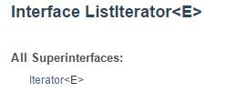
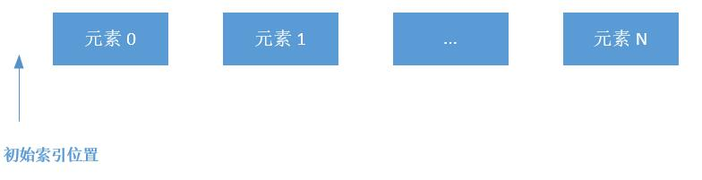
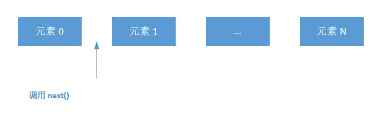
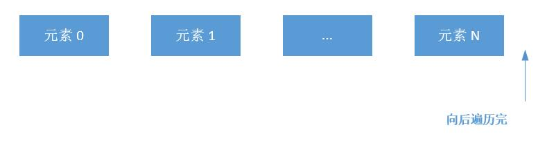
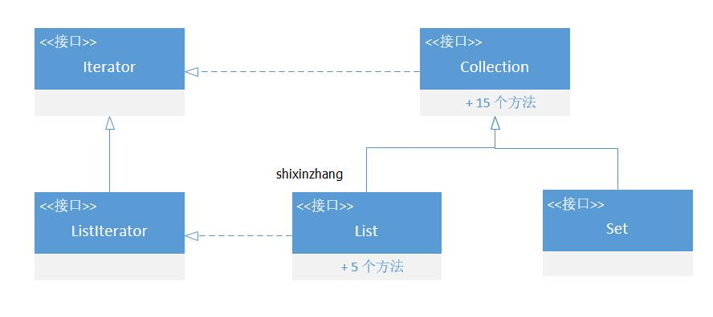
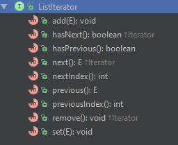
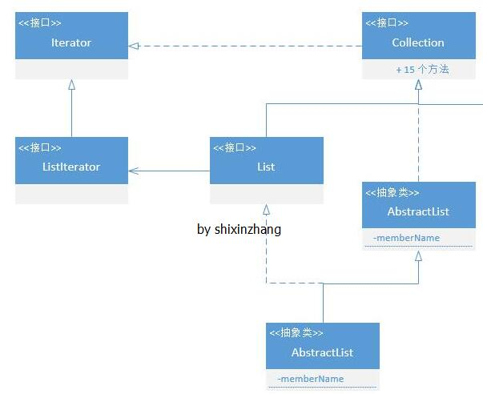
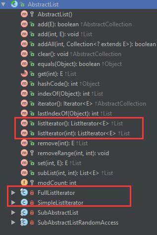
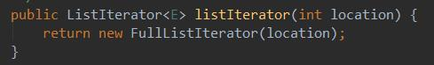

# ListIterator

```note
我的总结
这里就是对于 iterator的增强
添加了向前查询的相关功能

内部维护了一个 - 游标 - 用来实现一些增强功能
previous()
hasPrevious()
add() - 基于当前位置
set() - 基于当前元素
netIndex() 
previousIndex()

也包含之前的一些内容
next()
hasNext()
remove()

一些题外： 实际上迭代器 的核心，就是维护两个两
- 1. 查询位置
- 2. 查询版本
```




根据官方文档介绍, ListIterator 有以下功能：

- 允许我们向前、向后两个方向遍历 List;
- 在遍历时修改 List 的元素；
- 遍历时获取迭代器当前游标所在位置。

注意，迭代器 没有当前所在元素一说，它只有一个游标( cursor )的概念，这个游标总是在元素之间，比如这样:



初始时它在第 0 个元素之前，调用 next() 游标后移一位：



调用 previous() 游标就会回到之前位置。当向后遍历完元素，游标就会在元素 N 的后面：



也就是说长度为 N 的集合会有 N+1 个游标的位置。



ListIterator 继承自 Iterator 接口（关于 Iterator 的介绍 请点这里），在 Iterator 的基础上增加了 6 个方法：



介绍一下新来的几个方法：
- void hasPrevious() 
判断游标前面是否有元素;
- Object previous() 
返回游标前面的元素，同时游标前移一位。游标前没有元素就报 java.util.NoSuchElementException 的错，所以使用前最好判断一下;
- int nextIndex() 
返回游标后边元素的索引位置，初始为 0 ；遍历 N 个元素结束时为 N;
- int previousIndex() 
返回游标前面元素的位置，初始时为 -1，同时报 java.util.NoSuchElementException 错;
- void add(E) 
`在游标 前面 插入一个元素`
注意，是前面
- void set(E) 
`更新迭代器最后一次操作的元素为 E`，也就是更新最后一次调用 next() 或者 previous() 返回的元素。
注意，当没有迭代，也就是没有调用 next() 或者 previous() 直接调用 set 时会报 java.lang.IllegalStateException 错;
- void remove() 
删除迭代器最后一次操作的元素，注意事项和 set 一样。

## ListIterator 有两种获取方式
- List.listIterator()
- List.listIterator(int location)

区别在于第二种可以指定 游标的所在位置。

## ListIterator 的具体实现？



AbstractList 作为 List 的直接子类，里面实现了 listIterator() 方法，并且有两个内部迭代器实现类：SimpleListIterator，FullListIterator：



listIterator() 返回的是 FullListIterator()：



FullListIterator 继承了 SimpleListIterator, SimpleListIterator 实现了 Iterator 接口：

>在里，在我所用的JDK1.8版本已经改版了
不再有 SimpleListIterator & FullistIterator
只有 Itr 和 ListItr 

> 调用 .ListIterator 的时候返回 ListItr

```java
/**
*  JDK 1.8
*/
    private class ListItr extends Itr implements ListIterator<E> {
        ListItr(int index) {
            // 初始化 获取 index
            cursor = index;
        }

        public boolean hasPrevious() {
            return cursor != 0;
        }

        public E previous() {
            checkForComodification();
            try {
                int i = cursor - 1;
                E previous = get(i);
                lastRet = cursor = i;
                return previous;
            } catch (IndexOutOfBoundsException e) {
                checkForComodification();
                throw new NoSuchElementException();
            }
        }

        public int nextIndex() {
            return cursor;
        }

        public int previousIndex() {
            return cursor-1;
        }

        public void set(E e) {
            if (lastRet < 0)
                throw new IllegalStateException();
            checkForComodification();

            try {
                AbstractList.this.set(lastRet, e);
                expectedModCount = modCount;
            } catch (IndexOutOfBoundsException ex) {
                throw new ConcurrentModificationException();
            }
        }

        public void add(E e) {
            checkForComodification();

            try {
                int i = cursor;
                AbstractList.this.add(i, e);
                lastRet = -1;
                cursor = i + 1;
                expectedModCount = modCount;
            } catch (IndexOutOfBoundsException ex) {
                throw new ConcurrentModificationException();
            }
        }
    }
```


> 以下 是 旧版的 接口 不知道是JKD 1.X？

```java
private class SimpleListIterator implements Iterator<E> {
    //游标的位置，初始为 -1
    int pos = -1;
    //用来判断是否 fail-fast 的变量
    int expectedModCount;
    //记录上次迭代的位置
    int lastPosition = -1;

    SimpleListIterator() {
        expectedModCount = modCount;
    }

    //当游标没有跑到最后一个元素后面时 hasNext 返回 true
    public boolean hasNext() {
        return pos + 1 < size();
    }

    //获取下一个元素
    public E next() {
        if (expectedModCount == modCount) {
            try {
                //获取游标后面的元素，具体子类有具体实现
                E result = get(pos + 1);
                //更新
                lastPosition = ++pos;
                return result;
            } catch (IndexOutOfBoundsException e) {
                throw new NoSuchElementException();
            }
        }
        //当迭代时修改元素，就会报这个错，上篇文章介绍过解决办法~
        throw new ConcurrentModificationException();
    }

    //删除上次迭代操作的元素
    public void remove() {
        //还没进行迭代操作就会报这个错
        if (this.lastPosition == -1) {
            throw new IllegalStateException();
        }

        if (expectedModCount != modCount) {
            throw new ConcurrentModificationException();
        }

        try {
            //调用子类实现的删除操作
            AbstractList.this.remove(lastPosition);
        } catch (IndexOutOfBoundsException e) {
            throw new ConcurrentModificationException();
        }

        expectedModCount = modCount;
        if (pos == lastPosition) {
            pos--;
        }
        //每次删除后都会还原为 -1，也就是说我们迭代一次后只能 remove 一次，再 remove 就会报错
        lastPosition = -1;
    }
}
```

了解了 SimpleListIterator 后我们看下 FullListIterator 的具体实现：

```java
private final class FullListIterator extends SimpleListIterator implements ListIterator<E> {
    //根据 start 指定游标位置
    FullListIterator(int start) {
        if (start >= 0 && start <= size()) {
            pos = start - 1;
        } else {
            throw new IndexOutOfBoundsException();
        }
    }

    //在游标前面添加元素
    public void add(E object) {
        if (expectedModCount == modCount) {
            try {
                //调用子类的添加操作，ArrayList, LinkedList,Vector 的添加操作实现有所不同
                AbstractList.this.add(pos + 1, object);
            } catch (IndexOutOfBoundsException e) {
                throw new NoSuchElementException();
            }
            //游标后移一位
            pos++;
            //!注意！ 添加后 上次迭代位置又变回 -1 了，说明 add 后调用 remove, set 会有问题！
            lastPosition = -1;
            if (modCount != expectedModCount) {
                expectedModCount = modCount;
            }
        } else {
            throw new ConcurrentModificationException();
        }
    }

    //当游标不在初始位置（-1）时返回true
    public boolean hasPrevious() {
        return pos >= 0;
    }

    //游标后面的元素索引，就是游标 +1
    public int nextIndex() {
        return pos + 1;
    }

    //游标前面一个元素
    public E previous() {
        if (expectedModCount == modCount) {
            try {
                E result = get(pos);
                lastPosition = pos;
                pos--;
                return result;
            } catch (IndexOutOfBoundsException e) {
                throw new NoSuchElementException();
            }
        }
        throw new ConcurrentModificationException();
    }

    //游标前面元素的索引，就是游标的位置,有点晕的看开头那几张图
    public int previousIndex() {
        return pos;
    }

    //更新之前迭代的元素为 object
    public void set(E object) {
        if (expectedModCount == modCount) {
            try {
                //调用子类的set
                AbstractList.this.set(lastPosition, object);
            } catch (IndexOutOfBoundsException e) {
                throw new IllegalStateException();
            }
        } else {
            throw new ConcurrentModificationException();
        }
    }
}
```

可以看到 SimpleListIterator 的主要操作最后都交给子类来实现，List 的子类 ArrayList, LinkedList, Vector 由于底层实现原理不同（数组，双向链表），具体操作类实现有所不同。
等接下来分析到具体子类再看相关实现吧。