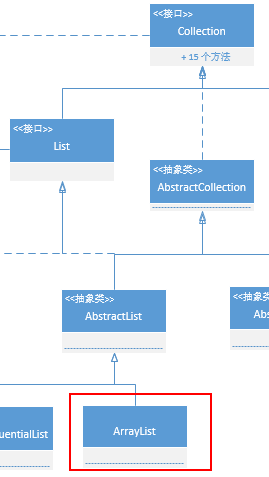
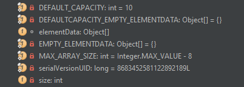

# ArrayList

\


ArrayList 是 Java 集合框架中 List接口 的一个实现类。

可以说 ArrayList 是我们使用最多的 List 集合，它有以下特点：
- 容量不固定，想放多少放多少（当然有最大阈值，但一般达不到）
- 有序的（元素输出顺序与输入顺序一致）
- 元素可以为 null
- 效率高 
  - size(), isEmpty(), get(), set() iterator(), ListIterator() 方法的时间复杂度都是 O(1)
  - add() 添加操作的时间复杂度平均为 O(n)
  - 其他所有操作的时间复杂度几乎都是 O(n)
  - 占用空间更小 
  - 对比 LinkedList，不用占用额外空间维护链表结构

那 ArrayList 为什么有这些优点呢？我们通过源码一一解析。
ArrayList 的成员变量



- 1.`底层数据结构，数组`：
transient Object[] elementData
由于数组类型为 Object，所以允许添加 null 。 
transient 说明这个数组无法序列化。 
初始时为 DEFAULTCAPACITY_EMPTY_ELEMENTDATA 。

- 2.默认的空数组：
private static final Object[] DEFAULTCAPACITY_EMPTY_ELEMENTDATA = {};

private static final Object[] EMPTY_ELEMENTDATA = {};
不清楚它俩啥区别。

- 3.数组初始容量为 10：
private static final int DEFAULT_CAPACITY = 10;
- 4.数组中当前元素个数：
private int size;
size <= capacity

- 5.数组最大容量：
private static final int MAX_ARRAY_SIZE = Integer.MAX_VALUE - 8;
Integer.MAX_VALUE = 0x7fffffff

换算成二进制： 2^31 - 1，1111111111111111111111111111111

十进制就是 ：2147483647，二十一亿多。

一些虚拟器需要在数组前加个 头标签，所以减去 8 。 
当想要分配比 MAX_ARRAY_SIZE 大的个数就会报 OutOfMemoryError。

## ArrayList 的关键方法

- 1.构造函数
ArrayList 有三种构造函数：

```java
//初始为空数组
public ArrayList() {
    this.elementData = DEFAULTCAPACITY_EMPTY_ELEMENTDATA;
}

//根据指定容量，创建个对象数组
public ArrayList(int initialCapacity) {
    if (initialCapacity > 0) {
        this.elementData = new Object[initialCapacity];
    } else if (initialCapacity == 0) {
        this.elementData = EMPTY_ELEMENTDATA;
    } else {
        throw new IllegalArgumentException("Illegal Capacity: "+
                                           initialCapacity);
    }
}

//直接创建和指定集合一样内容的 ArrayList
public ArrayList(Collection<? extends E> c) {
    // 接受 任何 最高为 指定 泛型  - collection
    elementData = c.toArray();
    if ((size = elementData.length) != 0) {
        // c.toArray 有可能不返回一个 Object 数组
        if (elementData.getClass() != Object[].class)
            //使用 Arrays.copy 方法拷创建一个 Object 数组
            elementData = Arrays.copyOf(elementData, size, Object[].class);
    } else {
        // replace with empty array.
        this.elementData = EMPTY_ELEMENTDATA;
    }
}
```

2.添加元素：

```java
public boolean add(E e) {
    //对数组的容量进行调整
    ensureCapacityInternal(size + 1);  // Increments modCount!!
    elementData[size++] = e;
    return true;
}

//在指定位置添加一个元素
public void add(int index, E element) {
    rangeCheckForAdd(index);

    //对数组的容量进行调整
    ensureCapacityInternal(size + 1);  // Increments modCount!!
    //整体后移一位，效率不太好啊
    System.arraycopy(elementData, index, elementData, index + 1,
                     size - index);
    elementData[index] = element;
    size++;
}


//添加一个集合
public boolean addAll(Collection<? extends E> c) {
    //把该集合转为对象数组
    Object[] a = c.toArray();
    int numNew = a.length;
    //增加容量
    ensureCapacityInternal(size + numNew);  // Increments modCount
    //挨个向后迁移
    System.arraycopy(a, 0, elementData, size, numNew);
    size += numNew;
    //新数组有元素，就返回 true
    return numNew != 0;
}

//在指定位置，添加一个集合
public boolean addAll(int index, Collection<? extends E> c) {
    rangeCheckForAdd(index);

    Object[] a = c.toArray();// 把要加入的 集合  转成 -> 数组
    int numNew = a.length;// 获取 要加入的 数组 的 长度
    ensureCapacityInternal(size + numNew);  // Increments modCount

    int numMoved = size - index;//总长度 减  要加入 的位置， 是 原数组里面需要被移动的内容的长度
    //原来的数组挨个向后迁移
    if (numMoved > 0)
        System.arraycopy(elementData, index, elementData, index + numNew,numMoved);
        //               原对象     要插入的位置， 目标对象  目标位置      要被复制的数量 
        //             1.  把原来数组 index 位置开始， numMoved 长度的 成员 复制到 目标对象，index+numNew 位置 
        //      
    //把新的集合数组 添加到指定位置
    System.arraycopy(a, 0, elementData, index, numNew);
    // 2. 把要插入的数组 从头到尾 插入到  目标数组 index 开始的位置
    size += numNew;
    return numNew != 0;
}
    /**------------------ System.arraycopy ----------------------
     * @param      src      the source array.
     * @param      srcPos   starting position in the source array.
     * @param      dest     the destination array.
     * @param      destPos  starting position in the destination data.
     * @param      length   the number of array elements to be copied.
     * @exception  IndexOutOfBoundsException  if copying would cause
     *               access of data outside array bounds.
     * @exception  ArrayStoreException  if an element in the <code>src</code>
     *               array could not be stored into the <code>dest</code> array
     *               because of a type mismatch.
     * @exception  NullPointerException if either <code>src</code> or
     *               <code>dest</code> is <code>null</code>.
     */
    public static native void arraycopy(Object src,  int  srcPos,
                                        Object dest, int destPos,
                                        int length);
```

虽说 System.arraycopy 是底层方法，但每次添加都后移一位还是不太好。

3.对数组的容量进行调整：

```java
public void ensureCapacity(int minCapacity) {
    int minExpand = (elementData != DEFAULTCAPACITY_EMPTY_ELEMENTDATA)
        // 不是默认的数组，说明已经添加了元素
        ? 0
        // 默认的容量
        : DEFAULT_CAPACITY;

    if (minCapacity > minExpand) {
        //当前元素个数比默认容量大
        ensureExplicitCapacity(minCapacity);
    }
}

private void ensureCapacityInternal(int minCapacity) {
    //还没有添加元素
    if (elementData == DEFAULTCAPACITY_EMPTY_ELEMENTDATA) {
        //最小容量取默认容量和 当前元素个数 最大值
        minCapacity = Math.max(DEFAULT_CAPACITY, minCapacity);
    }

    ensureExplicitCapacity(minCapacity);
}

private void ensureExplicitCapacity(int minCapacity) {
    modCount++;

    // 容量不够了，需要扩容
    if (minCapacity - elementData.length > 0)
        grow(minCapacity);
}
```

我们可以主动调用 ensureCapcity 来增加 ArrayList 对象的容量，这样就避免添加元素满了时扩容、挨个复制后移等消耗。

4.扩容：

```java
private void grow(int minCapacity) {
    int oldCapacity = elementData.length;
    // 1.5 倍 原来容量
    int newCapacity = oldCapacity + (oldCapacity >> 1);

    //如果当前容量还没达到 1.5 倍旧容量，就使用当前容量，省的站那么多地方
    if (newCapacity - minCapacity < 0)
        newCapacity = minCapacity;

    //新的容量居然超出了 MAX_ARRAY_SIZE
    if (newCapacity - MAX_ARRAY_SIZE > 0)
        //最大容量可以是 Integer.MAX_VALUE
        newCapacity = hugeCapacity(minCapacity);

    // minCapacity 一般跟元素个数 size 很接近，所以新建的数组容量为 newCapacity 更宽松些
    elementData = Arrays.copyOf(elementData, newCapacity);
}

private static int hugeCapacity(int minCapacity) {
    if (minCapacity < 0) // overflow
        throw new OutOfMemoryError();
    return (minCapacity > MAX_ARRAY_SIZE) ?
        Integer.MAX_VALUE :
        MAX_ARRAY_SIZE;
}
```

5.查询，修改等操作，直接根据角标对数组操作，都很快：

```java
E elementData(int index) {
    return (E) elementData[index];
}

//获取
public E get(int index) {
    rangeCheck(index);
    //直接根据数组角标返回元素，快的一比
    return elementData(index);
}

//修改
public E set(int index, E element) {
    rangeCheck(index);
    E oldValue = elementData(index);

    //直接对数组操作
    elementData[index] = element;
    //返回原来的值
    return oldValue;
}
```

6.删除，还是有点慢：

```java
//根据位置删除
public E remove(int index) {
    rangeCheck(index);

    modCount++;
    E oldValue = elementData(index);

    //挨个往前移一位
    int numMoved = size - index - 1;
    if (numMoved > 0)
        System.arraycopy(elementData, index+1, elementData, index,
                         numMoved);
    //原数组中最后一个元素删掉
    elementData[--size] = null; // clear to let GC do its work

    return oldValue;
}

//删除某个元素
public boolean remove(Object o) {
    if (o == null) {
        //挨个遍历找到目标
        for (int index = 0; index < size; index++)
            if (elementData[index] == null) {
                //快速删除
                fastRemove(index);
                return true;
            }
    } else {
        for (int index = 0; index < size; index++)
            if (o.equals(elementData[index])) {
                fastRemove(index);
                return true;
            }
    }
    return false;
}

//内部方法，“快速删除”，就是把重复的代码移到一个方法里
//没看出来比其他 remove 哪儿快了 - -
private void fastRemove(int index) {
    modCount++;
    int numMoved = size - index - 1;
    if (numMoved > 0)
        System.arraycopy(elementData, index+1, elementData, index,
                         numMoved);
    elementData[--size] = null; // clear to let GC do its work
}

//保留公共的
public boolean retainAll(Collection<?> c) {
    Objects.requireNonNull(c);
    return batchRemove(c, true);
}

//删除或者保留指定集合中的元素
private boolean batchRemove(Collection<?> c, boolean complement) {
    final Object[] elementData = this.elementData;
    //使用两个变量，一个负责向后扫描，一个从 0 开始，等待覆盖操作
    int r = 0, w = 0;
    boolean modified = false;
    try {
        //遍历 ArrayList 集合
        for (; r < size; r++)
            //如果指定集合中是否有这个元素，根据 complement 判断是否往前覆盖删除
            if (c.contains(elementData[r]) == complement)
                elementData[w++] = elementData[r];
    } finally {
        //发生了异常，直接把 r 后面的复制到 w 后面
        if (r != size) {
            System.arraycopy(elementData, r,
                             elementData, w,
                             size - r);
            w += size - r;
        }
        if (w != size) {
            // 清除多余的元素，clear to let GC do its work
            for (int i = w; i < size; i++)
                elementData[i] = null;
            modCount += size - w;
            size = w;
            modified = true;
        }
    }
    return modified;
}

//清楚全部
public void clear() {
    modCount++;
    //并没有直接使数组指向 null,而是逐个把元素置为空
    //下次使用时就不用重新 new 了
    for (int i = 0; i < size; i++)
        elementData[i] = null;

    size = 0;
}
7.判断状态：
public boolean contains(Object o) {
    return indexOf(o) >= 0;
}

//遍历，第一次找到就返回
public int indexOf(Object o) {
    if (o == null) {
        for (int i = 0; i < size; i++)
            if (elementData[i]==null)
                return i;
    } else {
        for (int i = 0; i < size; i++)
            if (o.equals(elementData[i]))
                return i;
    }
    return -1;
}

//倒着遍历
public int lastIndexOf(Object o) {
    if (o == null) {
        for (int i = size-1; i >= 0; i--)
            if (elementData[i]==null)
                return i;
    } else {
        for (int i = size-1; i >= 0; i--)
            if (o.equals(elementData[i]))
                return i;
    }
    return -1;
}
```

8.转换成 数组：

```java
public Object[] toArray() {
    return Arrays.copyOf(elementData, size);
}

public <T> T[] toArray(T[] a) {
    //如果只是要把一部分转换成数组
    if (a.length < size)
        // Make a new array of a's runtime type, but my contents:
        return (T[]) Arrays.copyOf(elementData, size, a.getClass());
    //全部元素拷贝到 数组 a
    System.arraycopy(elementData, 0, a, 0, size);
    if (a.length > size)
        a[size] = null;
    return a;
}
```

看下 Arrays.copyOf() 方法：

```java
public static <T,U> T[] copyOf(U[] original, int newLength, Class<? extends T[]> newType) {
    @SuppressWarnings("unchecked")
    T[] copy = ((Object)newType == (Object)Object[].class)
        ? (T[]) new Object[newLength]
        : (T[]) Array.newInstance(newType.getComponentType(), newLength);
    System.arraycopy(original, 0, copy, 0,
                     Math.min(original.length, newLength));
    return copy;
}
```

如果 newType 是一个对象对组，就直接把 original 的元素拷贝到 对象数组中； 
否则新建一个 newType 类型的数组。

ArrayList 的内部实现
1.迭代器 Iterator, ListIterator 没什么特别，直接使用角标访问数组的元素，:

```java
private class ListItr extends Itr implements ListIterator<E> {
    ListItr(int index) {
        super();
        cursor = index;
    }

    public boolean hasPrevious() {
        return cursor != 0;
    }

    public int nextIndex() {
        return cursor;
    }

    public int previousIndex() {
        return cursor - 1;
    }

    @SuppressWarnings("unchecked")
    public E previous() {
        checkForComodification();
        int i = cursor - 1;
        if (i < 0)
            throw new NoSuchElementException();
        Object[] elementData = ArrayList.this.elementData;
        if (i >= elementData.length)
            throw new ConcurrentModificationException();
        cursor = i;
        return (E) elementData[lastRet = i];
    }

    public void set(E e) {
        if (lastRet < 0)
            throw new IllegalStateException();
        checkForComodification();

        try {
            ArrayList.this.set(lastRet, e);
        } catch (IndexOutOfBoundsException ex) {
            throw new ConcurrentModificationException();
        }
    }

    public void add(E e) {
        checkForComodification();

        try {
            int i = cursor;
            ArrayList.this.add(i, e);
            cursor = i + 1;
            lastRet = -1;
            expectedModCount = modCount;
        } catch (IndexOutOfBoundsException ex) {
            throw new ConcurrentModificationException();
        }
    }
}
```

在 Java 集合深入理解：AbstractList 中我们介绍了 RandomAccess，里面提到，支持 RandomAccess 的对象，遍历时使用 get 比 迭代器更快。
由于 ArrayList 继承自 RandomAccess， 而且它的迭代器都是基于 ArrayList 的方法和数组直接操作，所以遍历时 get 的效率要 >= 迭代器。

```java
int i=0, n=list.size(); i &lt; n; i++)
      list.get(i);
```

比用迭代器更快：

```java
for (Iterator i=list.iterator(); i.hasNext(); )
     i.next();
```

另外，由于 ArrayList 不是同步的，所以在并发访问时，如果在迭代的同时有其他线程修改了 ArrayList, fail-fast 的迭代器 Iterator/ListIterator 会报 ConcurrentModificationException 错。
因此我们在并发环境下需要外部给 ArrayList 加个同步锁，或者直接在初始化时用 Collections.synchronizedList 方法进行包装：

```java
List list = Collections.synchronizedList(new ArrayList(...));
```

Thanks
http://www.trinea.cn/android/arraylist-linkedlist-loop-performance/s

http://blog.csdn.net/u011518120/article/details/52026076

http://blog.csdn.net/wl_ldy/article/details/5938390

http://blog.csdn.net/zhangerqing/article/details/8122075

