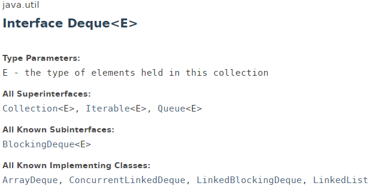
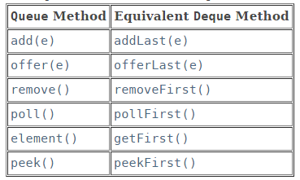
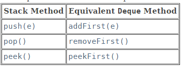

# Deque

Deque 是 `Double ended queue` (双端队列) 的缩写,读音和 `deck` 一样，蛋壳。

Deque 继承自 Queue,直接实现了它的有 LinkedList, ArayDeque, ConcurrentLinkedDeque 等。

Deque 支持容量受限的双端队列，也支持大小不固定的。一般双端队列大小不确定。

Deque 接口定义了一些从头部和尾部访问元素的方法。比如分别在头部、尾部进行插入、删除、获取元素。和 Queue类似，每个操作都有两种方法，一种在异常情况下直接抛出异常奔溃，另一种则不会抛异常，而是返回特殊的值，比如 false, null …

插入（Insert）方法的第二种是针对固定大小的双端队列设计的。大多数情况下 插入都不会失败。

Deque 继承了 Queue 接口的方法。当 Deque 当做 队列使用时（FIFO），添加元素是添加到队尾，删除时删除的是头部元素。从 Queue 接口继承的方法对应容器的方法如图所示：

Deque 也能当栈用（后进先出）。这时入栈、出栈元素都是在 双端队列的头部 进行。Deque 中和栈对应的方法如图所示：
这里写图片描述

Deque 包含的方法如下图所示：

根据名字就能看到功能，具体实现我们下篇看 LinkedList 源码时介绍。

## Deque 的实现类

Deque 的实现类主要分为两种场景：
- 一般场景 
  - LinkedList 大小可变的链表双端队列，允许元素为 null
  - ArrayDeque 大下可变的数组双端队列，不允许 null
- 并发场景 
  - LinkedBlockingDeque 如果队列为空时，获取操作将会阻塞，知道有元素添加

## Deque 与 工作密取

在并发编程 中，双端队列 Deque 还用于 “工作密取” 模式。

- 什么是工作密取呢？

在 生产者-消费者 模式中，所有消费者都从一个工作队列中取元素，一般使用阻塞队列实现；

而在 工作密取 模式中，每个消费者有其单独的工作队列，如果它完成了自己双端队列中的全部工作，那么它就可以`从其他`消费者的双端队列末尾秘密地获取工作。

工作密取 模式 对比传统的 生产者-消费者 模式，更为灵活，因为多个线程不会因为在同一个工作队列中抢占内容发生竞争。在大多数时候，它们只是访问自己的双端队列。`即使需要访问另一个队列时，也是从 队列的尾部获取工作，降低了队列上的竞争程度。`

Thanks

https://docs.oracle.com/javase/tutorial/collections/interfaces/deque.html 
https://docs.oracle.com/javase/8/docs/api/java/util/Deque.html 
http://www.nowamagic.net/librarys/veda/detail/2296 