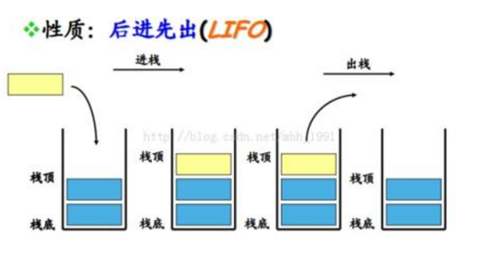
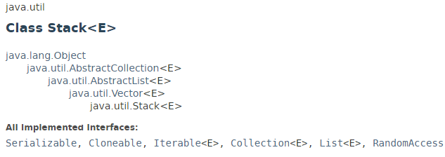
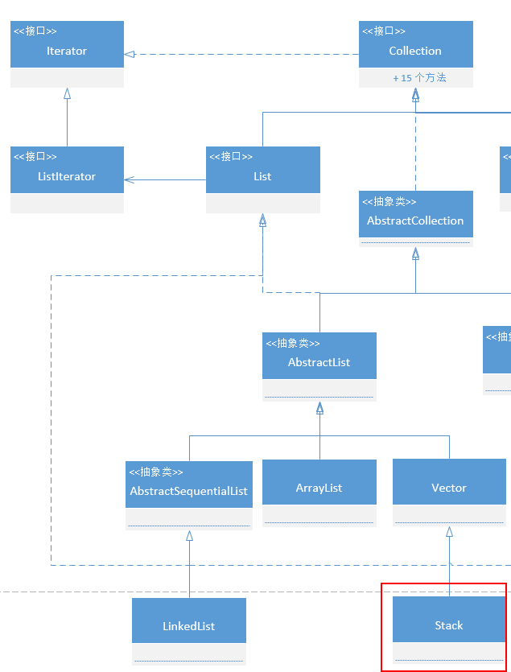
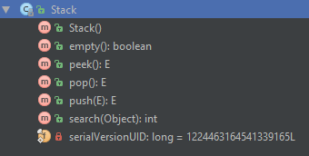
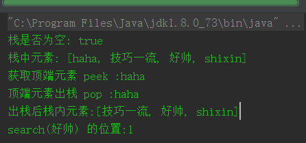

# 栈

数据结构中，栈是一种线性数据结构，遵从 LIFO（后进先出）的操作顺序，所有操作都是在顶部进行



栈通常有三种操作：

- push 入栈
- pop 栈顶元素出栈，并返回
- peek 获取栈顶元素，并不删除

我们自定义一个 栈 时只要实现上述三个主要操作即可，本文中将使用 Java 中的 LinkedList　实现一个栈。

栈的使用场景：

栈最主要的意义就在于：入栈和出栈的对称性。

在 Android 开发中，我们经常需要开启、回退一个 Activity，其实这里就有栈的应用，每次开启Activity，如果不是特殊的启动模式，就会在栈顶加入一个 Activity，点击返回后，之前的 Activity 出栈 。

其他场景比如递归（斐波那契数列，汉诺塔）。


## Java 集合框架中的栈 Stack





Java 集合框架中的 Stack 继承自 Vector：

- 由于 Vector 有 4 个构造函数，加上 Stack 本身的一种，也就是说有 5 中创建 Stack 的方法
- 跟 Vector 一样，它是 数组实现的栈。
- li: 除了自己实现了几个方法然后维护了一个UID之外，Stack 所有的东西用的都是Vector的东西

Stack 的方法
Stack 中新建的方法比较少：



1.构造函数
```java
//构建一个空栈
public Stack() {
}
```

2.入栈
```java
//调用的 Vector.addElement()
public E push(E item) {
    addElement(item);

    return item;
}
```
Vector 的 addElement() 方法，就是在数组尾部添加元素：
```java
public synchronized void addElement(E obj) {
    modCount++;
    ensureCapacityHelper(elementCount + 1);
    elementData[elementCount++] = obj;
}
```
3.获取顶端元素，但不删除
```java
public synchronized E peek() {
    //调用 Vector.size() 返回元素个数
    int     len = size();

    if (len == 0)
        throw new EmptyStackException();
    //调用 Vector.elementAt 得到栈顶元素
    return elementAt(len - 1);
}
```
Vector.elementAt(int):
```java
public synchronized E elementAt(int index) {
    if (index >= elementCount) {
        throw new ArrayIndexOutOfBoundsException(index + " >= " + elementCount);
    }

    return elementData(index);
}
```
Vector.elementData(int):
```java
E elementData(int index) {
    return (E) elementData[index];
}
```
4.出栈
```java
public synchronized E pop() {
    E       obj;
    int     len = size();

    //调用 peek() 获取顶端元素，一会儿返回
    obj = peek();
    //调用 Vector.removeElementAt 删除顶端元素
    removeElementAt(len - 1);

    return obj;
}
```
Vector.removeElementAt(int):
```java
public synchronized void removeElementAt(int index) {
    modCount++;
    if (index >= elementCount) {
        throw new ArrayIndexOutOfBoundsException(index + " >= " +
                                                 elementCount);
    }
    else if (index < 0) {
        throw new ArrayIndexOutOfBoundsException(index);
    }

    int j = elementCount - index - 1;
    if (j > 0) {
        System.arraycopy(elementData, index + 1, elementData, index, j);
    }
    elementCount--;
    elementData[elementCount] = null; /* to let gc do its work */
}
```
5.查找元素是否在栈中
```java
public synchronized int search(Object o) {
    int i = lastIndexOf(o);

    //返回的是栈顶到该元素出现的位置的距离
    if (i >= 0) {
        return size() - i;
    }
    return -1;
}
```
6.是否为空
```java
public boolean empty() {
    return size() == 0;
}
```
Vector.size():
```java
public synchronized int size() {
    return elementCount;
}
```
总结
Java 集合框架中的 Stack 具有以下特点：

- 继承自 Vector
- 有 5 种创建 Stack 的方法
- 采用数组实现
- 除了 push()，剩下的方法都是同步的

## 用链表实现一个栈？

由于 Stack　是用数组实现的，我们用链表实现一下吧，这里就选择　LinkedList 来实现：
```java
/**
 * description:LinkedList 模拟 Stack
 * <br/>
 * author: shixinzhang
 * <br/>
 * data: 10/23/2016
 */
public class LinkedListStack extends LinkedList{
    public LinkedListStack(){
        super();
    }

    @Override
    public void push(Object o) {
        super.push(o);
    }

    @Override
    public Object pop() {
        return super.pop();
    }

    @Override
    public Object peek() {
        return super.peek();
    }

    @Override
    public boolean isEmpty() {
        return super.isEmpty();
    }

    public int search(Object o){
        return indexOf(o);
    }
}
```
调用：
```java
@Test
public void testPush() throws Exception {
    LinkedListStack stack = new LinkedListStack();
    System.out.println("栈是否为空: " + stack.isEmpty());

    stack.push("shixin");
    stack.push("好帅");
    stack.push("技巧一流");
    stack.push("haha");

    System.out.println("栈中元素: " + stack);

    System.out.println("获取顶端元素 peek :" + stack.peek());

    System.out.println("顶端元素出栈 pop :" + stack.pop());

    System.out.println("出栈后栈内元素:" + stack);

    System.out.println("search(好帅) 的位置:" + stack.search("好帅"));
}
}
```
结果：



可以看到，我其实都没做什么哈哈，都是 LinkedList 内部提供的方法，操作的都是在链表头部的元素，而不是尾部。

其实 LinkedList 这个栈的特性也是继承自 双端队列 Deque，官方也推荐在使用栈时优先使用 Deque，而不是 Stack,有兴趣的可以去了解下。

Thanks
https://docs.oracle.com/javase/8/docs/api/java/util/Stack.html

http://www.cnblogs.com/kaituorensheng/archive/2013/03/02/2939690.html

http://www.nowamagic.net/librarys/veda/detail/2298