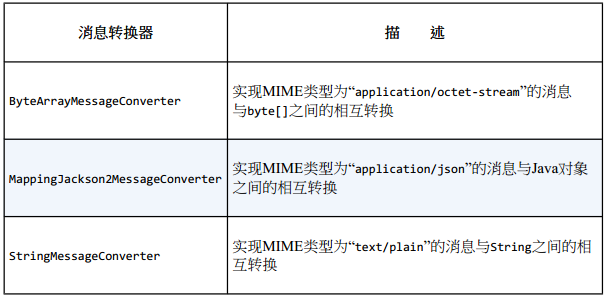

## Spring消息之STOMP

原文连接： https://www.cnblogs.com/jmcui/p/8999998.html
原文代码： https://github.com/JMCuixy/SpringWebSocket

- 阅读目录

一、STOMP 简介
二、服务端实现
三、客户端实现

## 一、STOMP 简介
    直接使用WebSocket（或SockJS）就很类似于使用TCP套接字来编写Web应用。因为没有高层级的线路协议（wire protocol），因此就需要我们定义应用之间所发送消息的语义，还需要确保连接的两端都能遵循这些语义。

    就像HTTP在TCP套接字之上添加了请求-响应模型层一样，STOMP在WebSocket之上提供了一个基于帧的线路格式（frame-based wire format）层，用来定义消息的语义。

    与HTTP请求和响应类似，STOMP帧由命令、一个或多个头信息以及负载所组成。例如，如下就是发送数据的一个STOMP帧：

复制代码
```note
>>> SEND
transaction:tx-0
destination:/app/marco
content-length:20

{"message":"Marco!"}
```
    在这个例子中，STOMP命令是send，表明会发送一些内容。紧接着是三个头信息：一个表示消息的的事务机制，一个用来表示消息要发送到哪里的目的地，另外一个则包含了负载的大小。然后，紧接着是一个空行，STOMP帧的最后是负载内容。

## 二、服务端实现
- 1、启用STOMP功能,STOMP 的消息根据前缀的不同分为三种。如下，
    - 以 /app 开头的消息都会被路由到带有@MessageMapping 或 @SubscribeMapping 注解的方法中；
    - 以/topic 或 /queue 开头的消息都会发送到STOMP代理中，根据你所选择的STOMP代理不同，目的地的可选前缀也会有所限制；
    - 以/user开头的消息会将消息重路由到某个用户独有的目的地上。


- 2、处理来自客户端的STOMP消息
    服务端处理客户端发来的STOMP消息，主要用的是 @MessageMapping 注解。如下：

```java
  @MessageMapping("/marco")
  @SendTo("/topic/marco")
  public Shout stompHandle(Shout shout){
      LOGGER.info("接收到消息：" + shout.getMessage());
      Shout s = new Shout();
      s.setMessage("Polo!");
      return s;
  }
```
  - 2.1、@MessageMapping 指定目的地是“/app/marco”（“/app”前缀是隐含的，因为我们将其配置为应用的目的地前缀）。
  - 2.2、方法接收一个Shout参数(MissionLee：这个shout没什么特别的，在我们自己的项目里面可以自定一个JavaBean什么的)，因为Spring的某一个消息转换器会将STOMP消息的负载转换为Shout对象。Spring 4.0提供了几个消息转换器，作为其消息API的一部分：
  
  - 2.3、尤其注意，这个处理器方法有一个返回值，这个返回值并`不是返回给客户端的`，而是转发给消息代理的，如果客户端想要这个返回值的话，只能从消息代理订阅。@SendTo 注解重写了消息代理的目的地，如果不指定@SendTo，帧所发往的目的地会与触发处理器方法的目的地相同，只不过会添加上“/topic”前缀。
  - 2.4、如果客户端就是想要服务端直接返回消息呢？听起来不就是HTTP做的事情！即使这样，STOMP 仍然为这种一次性的响应提供了支持，用的是@SubscribeMapping注解，与HTTP不同的是，这种请求-响应模式是异步的...

```java
   @SubscribeMapping("/getShout")
   public Shout getShout(){
       Shout shout = new Shout();
       shout.setMessage("Hello STOMP");
       return shout;
   }
```

- 3、发送消息到客户端
  - 3.1 在处理消息之后发送消息

    正如前面看到的那样，使用 @MessageMapping 或者 @SubscribeMapping 注解可以处理客户端发送过来的消息，并选择方法是否有返回值。

    如果 @MessageMapping 注解的控制器方法有返回值的话，返回值会被发送到消息代理，只不过会添加上"/topic"前缀。可以使用@SendTo 重写消息目的地；

    如果 @SubscribeMapping 注解的控制器方法有返回值的话，返回值会直接发送到客户端，不经过代理。如果加上@SendTo 注解的话，则要经过消息代理。

  - 3.2 在应用的任意地方发送消息

    spring-websocket 定义了一个 SimpMessageSendingOperations 接口（或者使用SimpMessagingTemplate ），可以实现自由的向任意目的地发送消息，并且订阅此目的地的所有用户都能收到消息。
    ```java
    @Autowired
    private SimpMessageSendingOperations simpMessageSendingOperations;


    /**
    * 广播消息，不指定用户，所有订阅此的用户都能收到消息
    * @param shout
    */
    @MessageMapping("/broadcastShout")
    public void broadcast(Shout shout) {
        simpMessageSendingOperations.convertAndSend("/topic/shouts", shout);
    }
    ```
  - 3.3 为指定用户发送消息

    3.2介绍了如何广播消息，订阅目的地的所有用户都能收到消息。如果消息只想发送给特定的用户呢？spring-websocket 介绍了两种方式来实现这种功能，一种是 基于@SendToUser注解和Principal参数，一种是SimpMessageSendingOperations 接口的convertAndSendToUser方法。

      - 基于@SendToUser注解和Principal参数

        @SendToUser 表示要将消息发送给指定的用户，会自动在消息目的地前补上"/user"前缀。如下，最后消息会被发布在  /user/queue/notifications-username。但是问题来了，这个username是怎么来的呢？就是通过 principal 参数来获得的。那么，principal 参数又是怎么来的呢？需要在spring-websocket 的配置类中重写 configureClientInboundChannel 方法，添加上用户的认证。

        ```java
        /**
         * 1、设置拦截器
         * 2、首次连接的时候，获取其Header信息，利用Header里面的信息进行权限认证
         * 3、通过认证的用户，使用 accessor.setUser(user); 方法，将登陆信息绑定在该 StompHeaderAccessor 上，在Controller方法上可以获取     StompHeaderAccessor 的相关信息
         * @param registration
         */
        @Override
        public void configureClientInboundChannel(ChannelRegistration registration) {
            registration.interceptors(new ChannelInterceptorAdapter() {
                @Override
                public Message<?> preSend(Message<?> message, MessageChannel channel) {
                    StompHeaderAccessor accessor = MessageHeaderAccessor.getAccessor(message, StompHeaderAccessor.class);
                    //1、判断是否首次连接
                    if (StompCommand.CONNECT.equals(accessor.getCommand())){
                        //2、判断用户名和密码
                        String username = accessor.getNativeHeader("username").get(0);
                        String password = accessor.getNativeHeader("password").get(0);
    
                        if ("admin".equals(username) && "admin".equals(password)){
                            Principal principal = new Principal() {
                                @Override
                                public String getName() {
                                    return userName;
                                }
                            };
                            accessor.setUser(principal);
                            return message;
                        }else {
                            return null;
                        }
                    }
                    //不是首次连接，已经登陆成功
                    return message;
                }
    
            });
        }
        ```

        ```java
        @MessageMapping("/shout")
        @SendToUser("/queue/notifications")
        public Shout userStomp(Principal principal, Shout shout) {
              String name = principal.getName();
              String message = shout.getMessage();
              LOGGER.info("认证的名字是：{}，收到的消息是：{}", name, message);
              return shout;
        }
        ```

      - convertAndSendToUser方法

        除了convertAndSend()以外，SimpMessageSendingOperations 还提供了convertAndSendToUser()方法。按照名字就可以判断出来，convertAndSendToUser()方法能够让我们给特定用户发送消息。

        ```java
        @MessageMapping("/singleShout")
        public void singleUser(Shout shout, StompHeaderAccessor stompHeaderAccessor) {
            String message = shout.getMessage();
            LOGGER.info("接收到消息：" + message);
            Principal user = stompHeaderAccessor.getUser();
            simpMessageSendingOperations.convertAndSendToUser(user.getName(), "/queue/shouts", shout);
        }
       ```

       如上，这里虽然我还是用了认证的信息得到用户名。但是，其实大可不必这样，因为 convertAndSendToUser 方法可以指定要发送给哪个用户。也就是说，完全可以把用户名的当作一个参数传递给控制器方法，从而绕过身份认证！convertAndSendToUser 方法最终会把消息发送到 /user/sername/queue/shouts 目的地上。

- 4、处理消息异常

    在处理消息的时候，有可能会出错并抛出异常。因为STOMP消息异步的特点，发送者可能永远也不会知道出现了错误。@MessageExceptionHandler标注的方法能够处理消息方法中所抛出的异常。我们可以把错误发送给用户特定的目的地上，然后用户从该目的地上订阅消息，从而用户就能知道自己出现了什么错误啦...

```java
 @MessageExceptionHandler(Exception.class)
 @SendToUser("/queue/errors")
 public Exception handleExceptions(Exception t){
     t.printStackTrace();
     return t;
 }
```
## 三、客户端实现
- 1、JavaScript 依赖
    STOMP 依赖 sockjs.js 和 stomp.min.js。stomp.min.js的下载链接：http://www.bootcdn.cn/stomp.js/
    ```js
    <script type="text/javascript" src="http://cdn.bootcss.com/sockjs-client/1.1.1/sockjs.js"></script>
    <script type="text/javascript" src="/js/stomp.min.js"></script>
    ```
- 2、JavaScript 客户端实现
```js
/*STOMP*/
var url = 'http://localhost:8080/stomp';
var sock = new SockJS(url);
var stomp = Stomp.over(sock);

var strJson = JSON.stringify({'message': 'Marco!'});

//默认的和STOMP端点连接
/*stomp.connect("guest", "guest", function (franme) {

});*/

var headers={
    username:'admin',
    password:'admin'
};

stomp.connect(headers, function (frame) {

    //发送消息
    //第二个参数是一个头信息的Map，它会包含在STOMP的帧中
    //事务支持
    var tx = stomp.begin();
    stomp.send("/app/marco", {transaction: tx.id}, strJson);
    tx.commit();


    //订阅服务端消息 subscribe(destination url, callback[, headers])
    stomp.subscribe("/topic/marco", function (message) {
        var content = message.body;
        var obj = JSON.parse(content);
        console.log("订阅的服务端消息：" + obj.message);
    }, {});


    stomp.subscribe("/app/getShout", function (message) {
        var content = message.body;
        var obj = JSON.parse(content);
        console.log("订阅的服务端直接返回的消息：" + obj.message);
    }, {});


    /*以下是针对特定用户的订阅*/
    var adminJSON = JSON.stringify({'message': 'ADMIN'});
    /*第一种*/
    stomp.send("/app/singleShout", {}, adminJSON);
    stomp.subscribe("/user/queue/shouts",function (message) {
        var content = message.body;
        var obj = JSON.parse(content);
        console.log("admin用户特定的消息1：" + obj.message);
    });
    /*第二种*/
    stomp.send("/app/shout", {}, adminJSON);
    stomp.subscribe("/user/queue/notifications",function (message) {
        var content = message.body;
        var obj = JSON.parse(content);
        console.log("admin用户特定的消息2：" + obj.message);
    });

    /*订阅异常消息*/
    stomp.subscribe("/user/queue/errors", function (message) {
        console.log(message.body);
    });

    //若使用STOMP 1.1 版本，默认开启了心跳检测机制（默认值都是10000ms）
    stomp.heartbeat.outgoing = 20000;

    stomp.heartbeat.incoming = 0; //客户端不从服务端接收心跳包
});
```