# 集群功能部署于测试记录

```java
/************************************
*   Department:BigData Group        *
*   Author:    Mingshun Li          *
*   Date:      2017-10-16           *
*   Version:   0.2                  *
*   Editor:    VS Code              *
************************************/
```

## 初始启动

- 第一次启动
  - 登陆web管理端 http://10.1.2.42:7180 (http://server-ip:7180)
  - admin admin
  - 使用本地parcel,打开配置页面,将其中各个路径改为自己使用的路径
    ```bash
    把默认的 /opt/... 全部改为 自己配置的路径
    ```
  - 重启Server服务
    ```bash
    home/opt/cm-5.12.0/etc/init.d/cloudera-scm-server restart
    ```
  - 重新登陆web管理端
    - 大多数操作都是点击下一步
    - 集群安装 CDH版本选择本地 12.0版本
    - 下一步进入下载,解压,分配页面,中间可能会出现**XX主机运行状态不良**,本次安装时未主动处理,系统自动恢复良好状态.其他未出现问题
    - 下一步进入检测页面所有参数正常,透明大页面问题报警,实际已经处理过此问题忽略
    - 下一步进入功能选择,此处仅选了hdfs与yarn
    - 下一步,安装完成进入管理界面

## 系统参数修改-2017-10-13

- [yarn] Node Manager 容器内存由 5.8G 调整为 4G
- [hdfs] Data Node 用于缓存的最大内存 4G 调整为 2G

## 增加服务与功能测试-2017-10-13

    增加Hive,Zookeeper,Hbase,Spark

- 新加功能-HIVE
  - 在cluster 1 选择添加功能 先择hive
  - 配置页面[具体根据需求改动]
    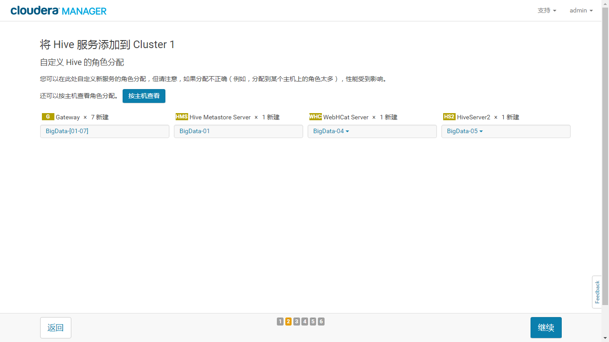
  - 因为与metastore链接需要 JDBC
    ```bash
    #BigDate-04节点
    cp mysql-connector-java-5.1.41-bin.jar  /home/opt/cm-5.12.0/share/cmf/lib/
    ```
  - 测试链接
    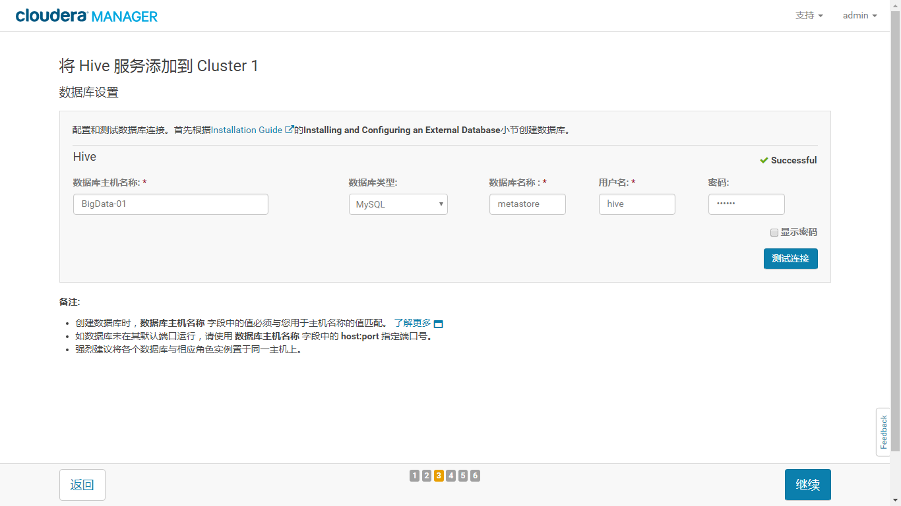
  - HIVE参数[默认]
    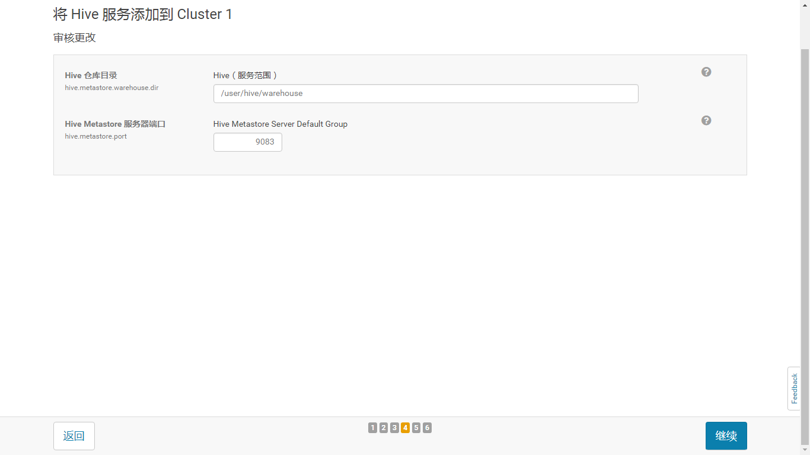
  - 出现问题
    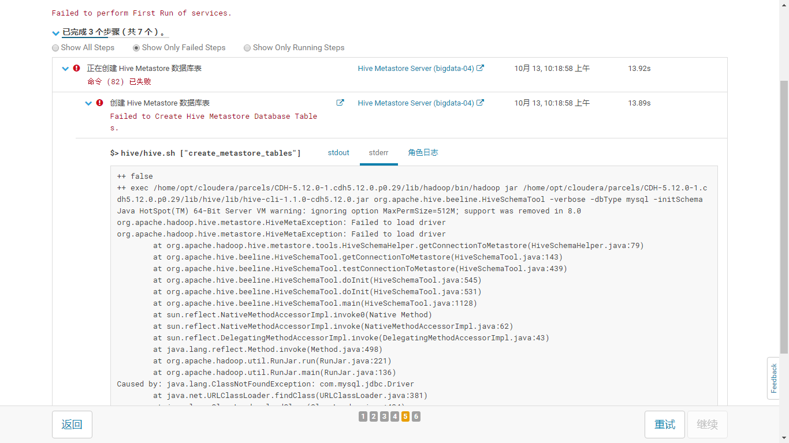

    解决方法:将准备好的JDBC包存入Hive Metastore Server所在节点 ```/usr/share/java```目录中
    ```bash
    cp -b mysql-connector-java-5.1.41-bin.jar /usr/share/java/mysql-connector-java.jar
    ```
  - HIVE配置完成
- 新加功能Zookeeper
  - 分配节点
    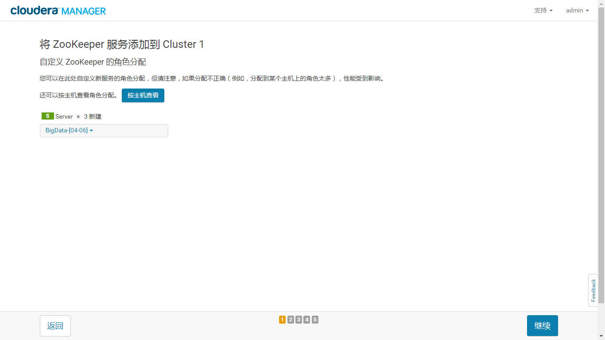
  - 服务参数
    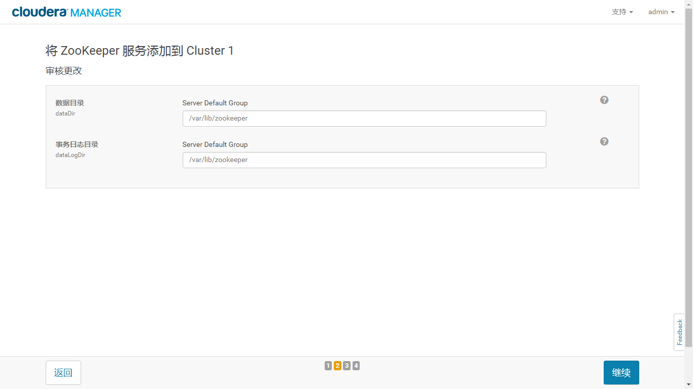
  - 点击继续并完成
  - Hbase,Spark依赖Zookeeper
- 新加功能Hbase
  - 分配节点
    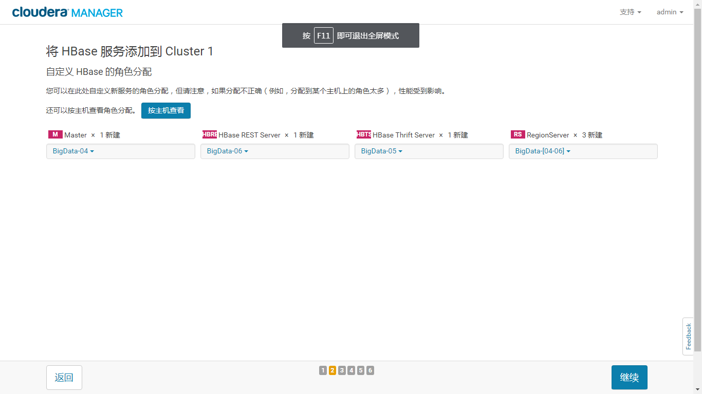
  - 配置参数
    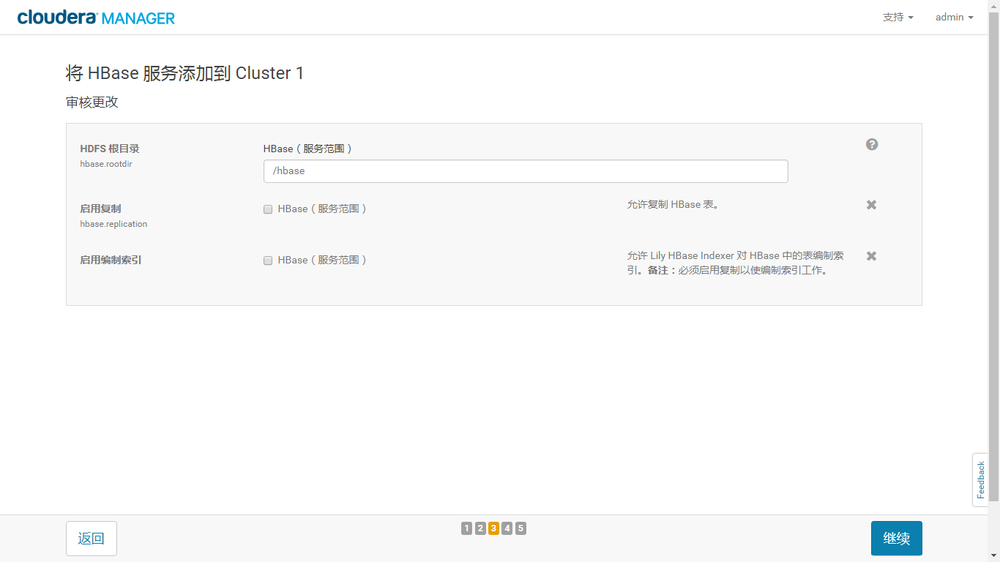
  - 点击继续并完成
- 新加功能Spark
  - 依赖关系
    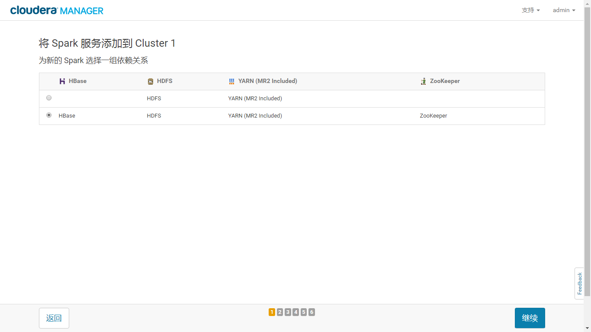
  - 分配节点
    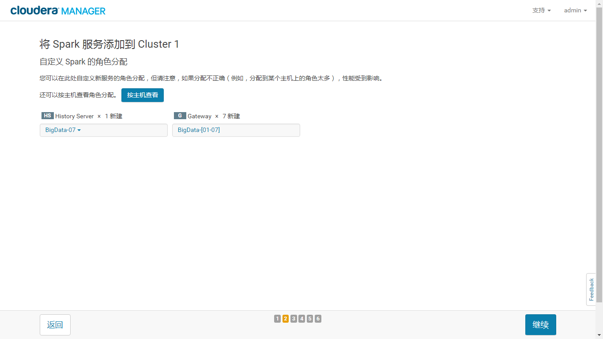
  - 配置参数[全部默认]
    
  - 点击继续并完成

## 安装SPARK2 20171014

- [CDH官方升级链接](https://www.cloudera.com/documentation/spark2/latest/topics/spark2_installing.html)
- CSD包
  - [CSD下载链接](http://archive.cloudera.com/spark2/csd/)
  - 将csd对应版本的文件(.jar)放入 `/opt/cloudera/csd`
  - 	SPARK2_ON_YARN-2.2.0.cloudera1.jar
- Parcel包
  - [parcel下载链接](http://archive.cloudera.com/spark2/parcels/2.2.0.cloudera1/)
  - 将parcel的三个文件放入`/home/opt/cloudera/parcel-repo`
  - 注意 `*.sha1`改名为`*.sha`
- 以上所有文件将权限交给 `cloudera-scm` 用户
- 安装操作
  - 管理站点,进入`主机-Parcel`,找到spark2 [如果没有请重启server]
  - 点击分配
  - 分配完成点击激活
  - 进入 `集群-添加服务` 添加SPARK2
    - 如果没有spark2选项，需要重启 cloudera-manager-server
    
  - 如果上一部找不到SPARK2 可能是以为内CSD文件与parcel文件版本不一致

  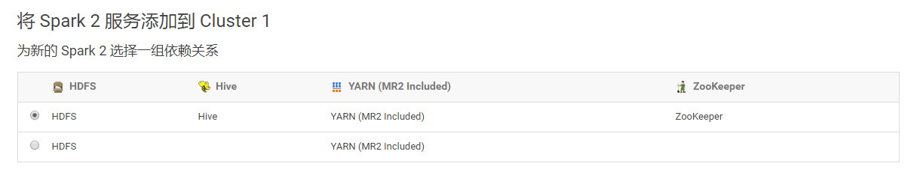
  
  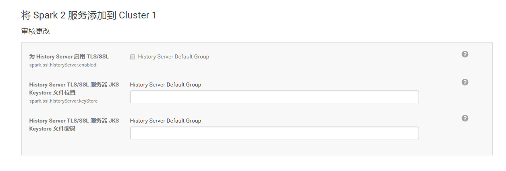
  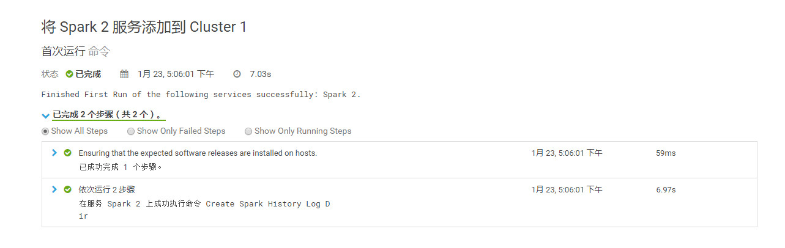
  - 因为在配置的时候，选择了和HDFS、YARN、HIVE等组件的绑定，所以Spark启动的时候，会去找YARN，但是YARN的配置没改，这时要点击部署日志，部署日志
  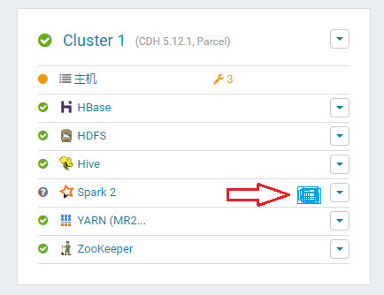
  
  测试：spark2-shell --master local[4]

## IntelliJ安装 20171016

- 安装可视化界面
- 开启VNC服务
> 以上两步骤详细内容见 VNCinstall.md
- 安装包下载地址`https://www.jetbrains.com/idea/download/previous.html` 版本:`2017.1.5`
- 解压缩 `tar -zxvf ideaIC-2017.1.5.tar.gz`
- 将解压后文件的bin目录路径加入PATH
- `idea.sh`启动 **注意:需要在图形界面启动**
- 在idea中: file-setting-plugin中搜索`Scala`并安装对应插件
    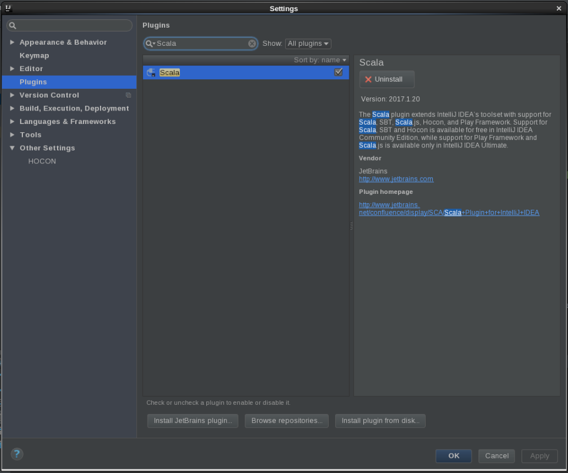
- 安装完成后重启客户端
