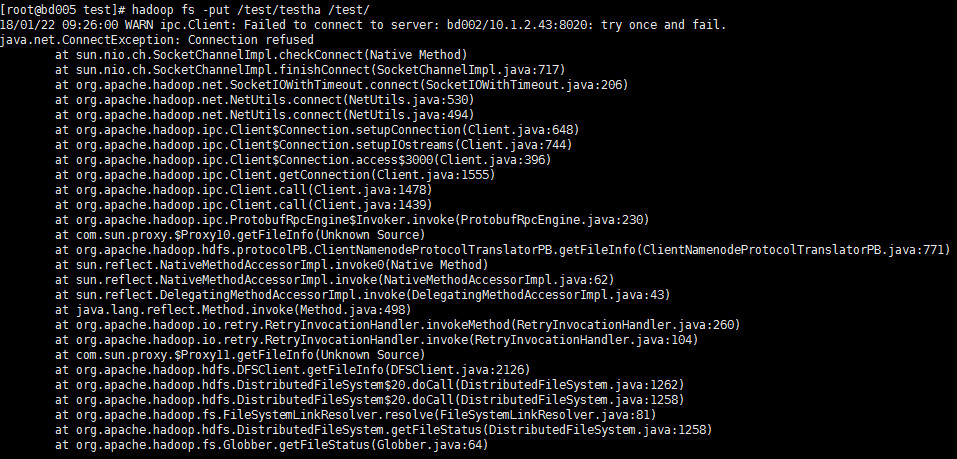
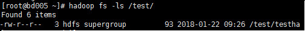
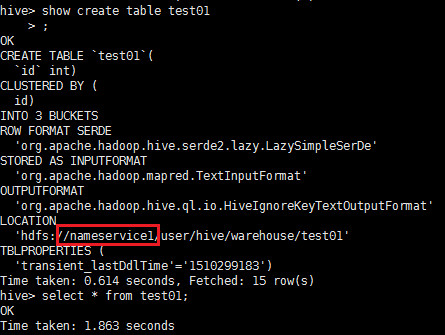
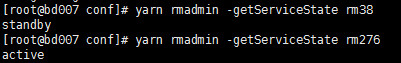
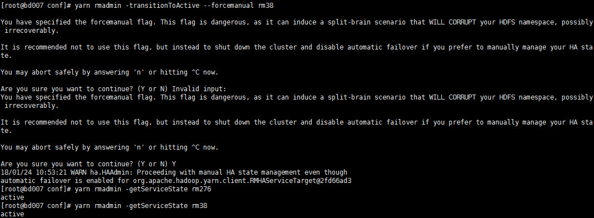

# CDH上组件的HA配置
***

```java
/************************************
*   Department:BigData Group        *
*   Author:    Hailun Huang         *
*   Date:      2018-01-22           *
*   Version:      0.1               *
*   Editor:    VS Code              *
************************************/
```

## HDFS HA 配置
- 测试向hdfs写文件
```txt
1.
向hdfs上传文件
    hdfs fs -put /test/testha /test/
  同时停止kill掉hdfs

报以下错误
```


```txt
检查目录
    hdfs fs -ls /test/
发现虽然报错，但是文件正常上传。
说明在put过程中Active状态的NameNode停止后，会自动将Standby状态的NameNode切换为Active状态，未造成HDFS任务终止。
```


- 测试hive

配置hive的元数据使用hdfs的高可用，在hive服务里，先停止hive服务，点操作，选择更新hive元数据namenode.

```txt
2.
启用hive，查询建表信息
    show create table test;
发现启用hdfs高可用之后，服务名称已经改变
```


```txt
查询时:
    select * from test;
查询正常；

查询的同时，kill掉活动namenode：
    select * from test;
查询正常；

```

- 测试hbase:
```txt
3.
scan表：
    hbase>list
    hbase>scan 'test'
    正常
kill掉namenode，再scan、put记录，正常。

```

- spark错误信息：
```txt
活动namenode变换后，spark尝试连接之前的活动namenode，日志记录以下错误信息：

FsHistoryProvider	
Exception encountered when attempting to load application log hdfs://nameservice1/user/spark/spark2ApplicationHistory/application_1513995374100_0592.inprogress
java.io.IOException: Cannot obtain block length for LocatedBlock{BP-1158784224-10.1.2.43-1507706383834:blk_1074015176_274514; getBlockSize()=301; corrupt=false; offset=0; locs=[DatanodeInfoWithStorage[10.1.2.48:50010,DS-90d7a886-7165-40a0-a8ad-bc3b63026e96,DISK], DatanodeInfoWithStorage[10.1.2.46:50010,DS-0586dc0e-3e10-4f99-8047-3312e331ad67,DISK], DatanodeInfoWithStorage[10.1.2.45:50010,DS-b45a8e70-d88c-43b9-8319-780ac2875624,DISK]]}
	at org.apache.hadoop.hdfs.DFSInputStream.readBlockLength(DFSInputStream.java:427)
	at org.apache.hadoop.hdfs.DFSInputStream.fetchLocatedBlocksAndGetLastBlockLength(DFSInputStream.java:335)
	at org.apache.hadoop.hdfs.DFSInputStream.openInfo(DFSInputStream.java:271)
	at org.apache.hadoop.hdfs.DFSInputStream.<init>(DFSInputStream.java:263)
	at org.apache.hadoop.hdfs.DFSClient.open(DFSClient.java:1588)
	at org.apache.hadoop.hdfs.DistributedFileSystem$4.doCall(DistributedFileSystem.java:335)
	at org.apache.hadoop.hdfs.DistributedFileSystem$4.doCall(DistributedFileSystem.java:331)
	at org.apache.hadoop.fs.FileSystemLinkResolver.resolve(FileSystemLinkResolver.java:81)
	at org.apache.hadoop.hdfs.DistributedFileSystem.open(DistributedFileSystem.java:331)
	at org.apache.hadoop.fs.FileSystem.open(FileSystem.java:784)
	at org.apache.spark.scheduler.EventLoggingListener$.openEventLog(EventLoggingListener.scala:335)
	at org.apache.spark.deploy.history.FsHistoryProvider.org$apache$spark$deploy$history$FsHistoryProvider$$replay(FsHistoryProvider.scala:640)
	at org.apache.spark.deploy.history.FsHistoryProvider.mergeApplicationListing(FsHistoryProvider.scala:457)
	at org.apache.spark.deploy.history.FsHistoryProvider$$anonfun$checkForLogs$3$$anon$4.run(FsHistoryProvider.scala:345)
	at java.util.concurrent.Executors$RunnableAdapter.call(Executors.java:511)
	at java.util.concurrent.FutureTask.run(FutureTask.java:266)
	at java.util.concurrent.ThreadPoolExecutor.runWorker(ThreadPoolExecutor.java:1142)
	at java.util.concurrent.ThreadPoolExecutor$Worker.run(ThreadPoolExecutor.java:617)
	at java.lang.Thread.run(Thread.java:745)

重启后，恢复正常。
```

- solr错误信息
```txt
WARN	ConnectionState	
Connection attempt unsuccessful after 30006 (greater than max timeout of 30000). Resetting connection and trying again with a new connection.


ERROR	ConnectionState	
Connection timed out for connection string (bd004:2181,bd005:2181,bd006:2181) and timeout (30000) / elapsed (15004)
org.apache.curator.CuratorConnectionLossException: KeeperErrorCode = ConnectionLoss
	at org.apache.curator.ConnectionState.checkTimeouts(ConnectionState.java:197)
	at org.apache.curator.ConnectionState.getZooKeeper(ConnectionState.java:87)
	at org.apache.curator.CuratorZookeeperClient.getZooKeeper(CuratorZookeeperClient.java:115)
	at org.apache.curator.framework.imps.CuratorFrameworkImpl.performBackgroundOperation(CuratorFrameworkImpl.java:806)
	at org.apache.curator.framework.imps.CuratorFrameworkImpl.backgroundOperationsLoop(CuratorFrameworkImpl.java:792)
	at org.apache.curator.framework.imps.CuratorFrameworkImpl.access$300(CuratorFrameworkImpl.java:62)
	at org.apache.curator.framework.imps.CuratorFrameworkImpl$4.call(CuratorFrameworkImpl.java:257)
	at java.util.concurrent.FutureTask.run(FutureTask.java:266)
	at java.util.concurrent.ThreadPoolExecutor.runWorker(ThreadPoolExecutor.java:1142)
	at java.util.concurrent.ThreadPoolExecutor$Worker.run(ThreadPoolExecutor.java:617)
	at java.lang.Thread.run(Thread.java:745)

重启后，恢复正常。
```

[CM配置参考1](https://mp.weixin.qq.com/s?__biz=MzA4OTk3NzIzMA==&mid=2652288680&idx=2&sn=470e285982f5ff7ab712e6c28e61636f&scene=19#wechat_redirect)

[CM配置参考2](http://mp.weixin.qq.com/s?src=11&timestamp=1516579627&ver=651&signature=g9xGApxkrzjZVyWmTi7aTwmCHMXy6CWAiiXsLo5ofYSoOOcmY4bcLHUoIsrBj-5Cf-v0lhB8nXYOT4nQadc5BJSyBgcdTw9AOdIlXLFVZ*PPdrqtPfKSn4gvf7GivwR6&new=1)

[非CM配置参考](https://www.cnblogs.com/smartloli/p/4298430.html)

[Cloudera产品高可用性配置（概述）](https://mp.weixin.qq.com/s?__biz=MzA4OTk3NzIzMA==&mid=404525000&idx=1&sn=9cf4495c629f523f5e88c6428474e899&scene=19#wechat_redirect)

***

## HBase的HA配置

- 配置
```txt
HBase Service -> 实例 -> 添加角色实例 -> 选择Master，配非原master主机 ->继续 -> 完成

启动 刚刚添加的 master

```

- 测试
```txt
kill掉活动master，hbase还可以正常使用；
两个master都kill掉，hbase的list命令无法使用，报以下错误信息：
	ERROR: Can't get master address from ZooKeeper; znode data == null
	List all tables in hbase. Optional regular expression parameter could
	be used to filter the output. Examples:
	hbase> list
	hbase> list 'abc.*'
	hbase> list 'ns:abc.*'
	hbase> list 'ns:.*'
启动其中一个master后，恢复正常。
```
[参考](https://www.cloudera.com/documentation/enterprise/latest/topics/cdh_hag_hbase_config.html#concept_z4r_td2_bp)

***

## YARN的HA配置

- 配置

```txt
进入YARN Service -> 操作 -> 启动 High Availability -> 选择主机 -> 继续 -> 完成 
启动备用Resource Manager.

```

- 测试
```txt
kill掉原ResourceManager,备份ResourceManager会转换为活动状态。
启动原ResourceManager,kill掉刚刚转为活动状态的ResourceManager,原ResourceManager恢复活动状态。

提交词频统计任务：
hadoop jar hadoop-mapreduce-examples-2.6.0-cdh5.12.0.jar wordcount /test/word.txt /test/output3

提交任务的时候，kill掉active状态的namenode，会报错：
18/01/22 20:01:17 INFO retry.RetryInvocationHandler: Exception while invoking getNewApplication of class ApplicationClientProtocolPBClientImpl over rm276 after 13 fail over attempts. Trying to fail over after sleeping for 2725ms.
java.net.ConnectException: Call From bd005/10.1.2.46 to bd003:8032 failed on connection exception: java.net.ConnectException: Connection refused; For more details see:  http://wiki.apache.org/hadoop/ConnectionRefused
	at sun.reflect.NativeConstructorAccessorImpl.newInstance0(Native Method)
	at sun.reflect.NativeConstructorAccessorImpl.newInstance(NativeConstructorAccessorImpl.java:62)
	at sun.reflect.DelegatingConstructorAccessorImpl.newInstance(DelegatingConstructorAccessorImpl.java:45)
	at java.lang.reflect.Constructor.newInstance(Constructor.java:423)
	at org.apache.hadoop.net.NetUtils.wrapWithMessage(NetUtils.java:791)
	at org.apache.hadoop.net.NetUtils.wrapException(NetUtils.java:731)
	at org.apache.hadoop.ipc.Client.call(Client.java:1506)
	at org.apache.hadoop.ipc.Client.call(Client.java:1439)
	at org.apache.hadoop.ipc.ProtobufRpcEngine$Invoker.invoke(ProtobufRpcEngine.java:230)
	at com.sun.proxy.$Proxy13.getNewApplication(Unknown Source)
	at org.apache.hadoop.yarn.api.impl.pb.client.ApplicationClientProtocolPBClientImpl.getNewApplication(ApplicationClientProtocolPBClientImpl.java:217)
	at sun.reflect.NativeMethodAccessorImpl.invoke0(Native Method)
	at sun.reflect.NativeMethodAccessorImpl.invoke(NativeMethodAccessorImpl.java:62)
	at sun.reflect.DelegatingMethodAccessorImpl.invoke(DelegatingMethodAccessorImpl.java:43)
	at java.lang.reflect.Method.invoke(Method.java:498)
	at org.apache.hadoop.io.retry.RetryInvocationHandler.invokeMethod(RetryInvocationHandler.java:260)
	at org.apache.hadoop.io.retry.RetryInvocationHandler.invoke(RetryInvocationHandler.java:104)
	at com.sun.proxy.$Proxy14.getNewApplication(Unknown Source)
	at org.apache.hadoop.yarn.client.api.impl.YarnClientImpl.getNewApplication(YarnClientImpl.java:206)
	at org.apache.hadoop.yarn.client.api.impl.YarnClientImpl.createApplication(YarnClientImpl.java:214)
	at org.apache.hadoop.mapred.ResourceMgrDelegate.getNewJobID(ResourceMgrDelegate.java:187)
	at org.apache.hadoop.mapred.YARNRunner.getNewJobID(YARNRunner.java:262)
	at org.apache.hadoop.mapreduce.JobSubmitter.submitJobInternal(JobSubmitter.java:157)
	at org.apache.hadoop.mapreduce.Job$10.run(Job.java:1307)
	at org.apache.hadoop.mapreduce.Job$10.run(Job.java:1304)
	at java.security.AccessController.doPrivileged(Native Method)
	at javax.security.auth.Subject.doAs(Subject.java:422)
	at org.apache.hadoop.security.UserGroupInformation.doAs(UserGroupInformation.java:1917)
	at org.apache.hadoop.mapreduce.Job.submit(Job.java:1304)
	at org.apache.hadoop.mapreduce.Job.waitForCompletion(Job.java:1325)
	at org.apache.hadoop.examples.WordCount.main(WordCount.java:87)
	at sun.reflect.NativeMethodAccessorImpl.invoke0(Native Method)
	at sun.reflect.NativeMethodAccessorImpl.invoke(NativeMethodAccessorImpl.java:62)
	at sun.reflect.DelegatingMethodAccessorImpl.invoke(DelegatingMethodAccessorImpl.java:43)
	at java.lang.reflect.Method.invoke(Method.java:498)
	at org.apache.hadoop.util.ProgramDriver$ProgramDescription.invoke(ProgramDriver.java:71)
	at org.apache.hadoop.util.ProgramDriver.run(ProgramDriver.java:144)
	at org.apache.hadoop.examples.ExampleDriver.main(ExampleDriver.java:74)
	at sun.reflect.NativeMethodAccessorImpl.invoke0(Native Method)
	at sun.reflect.NativeMethodAccessorImpl.invoke(NativeMethodAccessorImpl.java:62)
	at sun.reflect.DelegatingMethodAccessorImpl.invoke(DelegatingMethodAccessorImpl.java:43)
	at java.lang.reflect.Method.invoke(Method.java:498)
	at org.apache.hadoop.util.RunJar.run(RunJar.java:221)
	at org.apache.hadoop.util.RunJar.main(RunJar.java:136)
Caused by: java.net.ConnectException: Connection refused
	at sun.nio.ch.SocketChannelImpl.checkConnect(Native Method)
	at sun.nio.ch.SocketChannelImpl.finishConnect(SocketChannelImpl.java:717)
	at org.apache.hadoop.net.SocketIOWithTimeout.connect(SocketIOWithTimeout.java:206)
	at org.apache.hadoop.net.NetUtils.connect(NetUtils.java:530)
	at org.apache.hadoop.net.NetUtils.connect(NetUtils.java:494)
	at org.apache.hadoop.ipc.Client$Connection.setupConnection(Client.java:648)
	at org.apache.hadoop.ipc.Client$Connection.setupIOstreams(Client.java:744)
	at org.apache.hadoop.ipc.Client$Connection.access$3000(Client.java:396)
	at org.apache.hadoop.ipc.Client.getConnection(Client.java:1555)
	at org.apache.hadoop.ipc.Client.call(Client.java:1478)
	... 37 more

任务会持续尝试连接yarn，当standby ResourceManager转换为active时，任务成功执行。
往返两次，
说明，两个resource manager的状态都可以在active的resource manager出问题的时候，转换为active。
```

```txt 
当主备RM切换的时候，会报一次拒绝连接异常，但程序正常启动。是因为spark会首先去连接RM列表的第一个，但是第一个已经停掉或者切换为了standby状态，所以会拒绝连接，然后尝试连接第二个RM，这时，RM已经转换为active状态，连接成功，程序正常启动。

ROOT CAUSE:
In Yarn configs -> custom yarn-site.xml, you might have configuration for rm1 as resource-manager-A. This is the reason first attempt to connect was made to this server and then got connection refused. Then it goes to active resource manager which is resource-manager-B. This warning is not seen when resource-manager-A is active, because the property rm1 pointing to this server, first connect attempt is successful. First connection attempt is always made to the resource manager which is specified in rm1.

异常信息:
18/01/23 15:38:37 WARN ipc.Client: Failed to connect to server: bd002/10.1.2.43:8032: retries get failed due to exceeded maximum allowed retries number: 0
java.net.ConnectException: Connection refused
	at sun.nio.ch.SocketChannelImpl.checkConnect(Native Method)
	at sun.nio.ch.SocketChannelImpl.finishConnect(SocketChannelImpl.java:717)
	at org.apache.hadoop.net.SocketIOWithTimeout.connect(SocketIOWithTimeout.java:206)
	at org.apache.hadoop.net.NetUtils.connect(NetUtils.java:530)
	at org.apache.hadoop.net.NetUtils.connect(NetUtils.java:494)
	at org.apache.hadoop.ipc.Client$Connection.setupConnection(Client.java:648)
	at org.apache.hadoop.ipc.Client$Connection.setupIOstreams(Client.java:744)
	at org.apache.hadoop.ipc.Client$Connection.access$3000(Client.java:396)
	at org.apache.hadoop.ipc.Client.getConnection(Client.java:1555)
	at org.apache.hadoop.ipc.Client.call(Client.java:1478)
	at org.apache.hadoop.ipc.Client.call(Client.java:1439)
	at org.apache.hadoop.ipc.ProtobufRpcEngine$Invoker.invoke(ProtobufRpcEngine.java:230)
```
- 主备状态查看命令：
```txt
	yarn rmadmin -getServiceState rm38
	yarn rmadmin -getServiceState rm276
```

- 主备状态切换命令
```txt
	yarn rmadmin -transitionToActive --forcemanual rm38
	yarn rmadmin -transitionToStandby --forcemanual rm276
```


```sh
# 在高可用（HA）系统中，当联系2个节点的“心跳线”断开时，本来为一整体、动作协调的HA系统，就分裂成为2个独立的个体。由于相互失去了联系，都以为是对方出了故障。两个节点上的HA软件像“裂脑人”一样，争抢“共享资源”、争起“应用服务”，就会发生严重后果——或者共享资源被瓜分、2边“服务”都起不来了；或者2边“服务”都起来了，但同时读写“共享存储”，导致数据损坏（常见如数据库轮询着的联机日志出错）。

# 对付HA系统“裂脑”的对策，目前达成共识的的大概有以下几条：
# 1）添加冗余的心跳线，例如：双线条线（心跳线也HA），尽量减少“裂脑”发生几率；
# 2）启用磁盘锁。正在服务一方锁住共享磁盘，“裂脑”发生时，让对方完全“抢不走”共享磁盘资源。但使用锁磁盘也会有一个不小的问题，如果占用共享盘的一方不主动“解锁”，另一方就永远得不到共享磁盘。现实中假如服务节点突然死机或崩溃，就不可能执行解锁命令。后备节点也就接管不了共享资源和应用服务。于是有人在HA中设计了“智能”锁。即：正在服务的一方只在发现心跳线全部断开（察觉不到对端）时才启用磁盘锁。平时就不上锁了。
# 3）设置仲裁机制。例如设置参考IP（如网关IP），当心跳线完全断开时，2个节点都各自ping一下参考IP，不通则表明断点就出在本端。不仅“心跳”、还兼对外“服务”的本端网络链路断了，即使启动（或继续）应用服务也没有用了，那就主动放弃竞争，让能够ping通参考IP的一端去起服务。更保险一些，ping不通参考IP的一方干脆就自我重启，以彻底释放有可能还占用着的那些共享资源。
```

[参考](https://www.cloudera.com/documentation/enterprise/5-3-x/topics/cdh_hag_rm_ha_config.html#xd_583c10bfdbd326ba--43d5fd93-1410993f8c2--7f77)