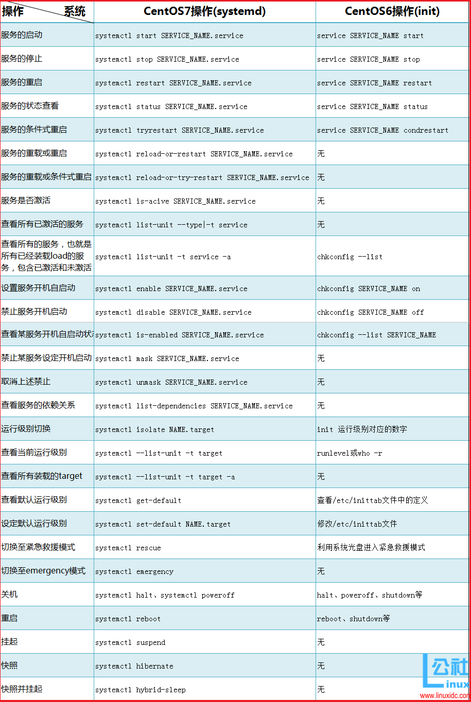

# CentOS7进程管理systemd详解

## 概述：

系统启动过程中，当内核启动完成，后加载根文件系统，后就绪的一些用户空间的服务的管理工作，就交由init进行启动和管理，在CentOS6之前的init的管理方式都类似，相关的内容我们在之前的文章中也做出过介绍。在CentOS7上，init变成了systemd，其管理方式也发生了重大的变化，本章就跟大家欧一起探讨一些关于CentOS7上的systemd的新特性的内容。具体分为一下几个方面：

1、systemd新特性简介

2、systemd如何管理系统系统上的各服务

3、systemd管理各个服务时，所依赖的unit文件的组织格式

4、systemd相关操作的实际效果展示

## 第一章    systemd新特性简介

### 1、init程序的功能介绍

init程序是当系统内核启动后，加载完根文件系统，然后就由内核加载了init程序，并将后续用户空间其他程序的启动和管理工作交由init程序进行管理，除非有需要进行内核特权级别操作时，内核才会被用户空间的各个系统调用，完成一些内核级别的操作

在CentOS5、6上，init初始化用户空间的启动流程为：/sbin/init程序主要是通过读取/etc/inittab文件来完成一定的任务，完成的任务有：

定义默认运行级别(/etc/inittab)

运行系统初始化脚本（/etc/rc.d/rc.sysinit）完成系统初始化

关闭指定运行级别下的各服务，启动指定级别下需要开启的各服务

启动mingetty虚拟终端，调用login程序，显示登录提示符，让终端进行登录

init程序的类型：

centos5：SysV init

其配置文件：/etc/inittab

centos6: Upstart

其配置文件：/etc/inittab和/etc/init/*.conf

centos7：Systemd

其配置文件：/usr/lib/systemd/system/、/etc/systemd/system/

### 2、systemd的新特性：

<1>系统引导时实现服务并行启动(前提是并行启动的服务之间没有依赖关系)

<2>按需激活进程(进程在没有访问时是不会被启动的，但是服务仍然处于半活动状态，只是服务没有启动)

<3>系统状态快照，自我保存某一时刻进程用户空间状态的快照，可以回滚到某一个时刻

<4>基于依赖关系定义的服务控制逻辑

 

CentOS7/RHEL7 systemd详解   http://www.linuxidc.com/Linux/2015-04/115937.htm

为什么systemd会被如此迅速的采用？ http://www.linuxidc.com/Linux/2014-08/105789.htm

systemd 与 sysVinit 彩版对照表 http://www.linuxidc.com/Linux/2014-09/106455.htm

太有用了！用systemd命令来管理Linux系统！  http://www.linuxidc.com/Linux/2014-09/106490.htm

浅析 Linux 初始化 init 系统，第 3 部分: Systemd  http://www.linuxidc.com/Linux/2014-12/110383.htm

### 3、systemd的关键特性：

<1>基于socket的激活机制：socket与程序分离，可以在系统启动时，先把某个服务的socket分配给该服务，但该服务可以事先不用启动

<2>基于bus的激活机制：基于总线的激活

<3>基于device的激活机制：当某个设备接入时，systemd可以自动的去激活诸如device unit、mount unit、automount unit对设备进行识别和挂载等

<4>基于path的激活机制：系统可以自动监控某个目录存不存在，文件存不存在，并根据此判断，来激活别的服务、进程等

<5>系统快照：能够保存各unit的当前状态信息于持久存储设备中；从而实现了回滚机制

<6>能向后兼容sysv init脚本：在centos5、6系统上/etc/init.d/目录下的服务脚本，systemd也能够对其进行管理

不兼容的地方：

1）：systemctl的命令是固定不变的，也就是说像在centos6上的各类服务脚本的start、stop这类我们可以通过修改服务脚本，去实现service 命令使用的时候后面的参数的变化。但是systemctl控制的时候，则无法通过修改服务脚本去实现systemctl后面参数的变化

2）：不是由systemd启动的服务，systemctl无法与之通信，也就是无法对其进行控制。在centos6上，利用服务脚本自身启动时，利用service依然能够对其进行管理，但是centos7上，如果服务脚本自身启动，而不是通过systemctl进行启动，则systemctl就无法对服务做出管理

### 4、systemd的核心概念：unit

unit由其相关的配置文件进行标识、识别和配置，也就是说一个unit到底定义与否，由其配置文件进行标识。这类配置文件中主要包含了几个类别:系统服务，监听的socket、保存的快照以及其他与init相关的信息，这些配置文件中主要保存在：

/usr/lib/systemd/system/    每个服务最主要的启动脚本设置，类似于之前的/etc/init.d/  

/run/systemd/system/    系统执行过程中所产生的服务脚本，比上面目录优先运行

/etc/systemd/system/    管理员建立的执行脚本，类似于/etc/rc.d/rcN.d/Sxx类的功能，比上面目录优先运行

blob.png

blob.png       

blob.png

unit的常见类型：

service unit：这类unit的文件扩展名为.service，主要用于定义系统服务（其扮演了在centos6上/etc/init.d/目录下的服务脚本的作用）

target unit：这类unit的文件扩展名为.target，主要用于模拟实现"运行级别"的概念

device unit：这类unit文件扩展名为.device，用于定义内核识别的设备，然后udev利用systemd识别的硬件，完成创建设备文件名

mount unit：这类unit文件扩展名为.mount，主要用于定义文件系统挂载点

socket unit：这类unit文件扩展名为.socket，用于标识进程间通信用到的socket文件

snapshot unit：这类unit文件扩展名为.snapshot，主要用于实现管理系统快照

swap unit：这类unit文件扩展名为.swap，主要用于标识管理swap设备

automount unit：这类unit文件扩展名为.automount，主要用于文件系统自动挂载设备

path unit：这类unit文件扩展名为.path，主要用于定义文件系统中的文件或目录

## 第二章    systemd如何管理系统上的各个服务

1、systemd对服务的管理（service类unit的管理）

主要是依靠service类型的unit文件进行管控的完成的

systemctl命令：

语法：systemctl [OPTIONS…] COMMAND [SERVICE_NAME.service…]

<1>启动：service SERVICE_NAME start ==>  systemctl start SERVICE_NAME.service

<2>停止：service SERVICE_NAME stop ==>  systemctl stop SERVICE_NAME.service

<3>重启：service SERVICE_NAME restart ==>  systemctl restart SERVICE_NAME.service

<4>状态：service SERVICE_NAME status ==>  systemctl status SERVICE_NAME.service

centos7里面状态信息里显示的loaded 表示是否加入到systemctl可管理的列表中(类似centos6中chkconfig –add的概念，如果是loaded，表示已经添加到列表中，后面disabled表示没有开机自动启动)

<5>条件式重启：(相当于如果服务之前启动了，则对服务进行重启，如果服务之前没启动，则不执行任何操作)

service SERVICE_NAME condrestart ==>  systemctl tryrestart SERVICE_NAME.service

<6>重载或重启服务：(相当于如果服务支持不重启而重载配置文件，就进行重载，如果服务不支持重载配置文件，就重启服务)

cenntos6不支持  

systemctl reload-or-restart SERVICE_NAME.service

<7>重载或条件是重启：(相当于如果服务支持不重启而重载配置文件，就进行重载，如果服务不支持重载配置文件，就重启服务,但重启的前提是该服务之前是开启的)

cenntos6不支持  

systemctl reload-or-try-restart SERVICE_NAME.service

<8>查看某服务当前是否激活：

centos6不支持  

systemctl is-acive SERVICE_NAME.service

<9>查看所有已激活的服务：

systemctl list-unit –type|-t service

<10>查看所有的服务，也就是所有已经装载load的服务，包含已激活和未激活的：

chkconfig –list ==> systemctl list-unit -t service -a

显示出来的信息的含义：

loaded:Unit配置文件已处理
                active(running):一次或多次持续处理的运行
                active(exited):成功完成一次性的配置
                active(waiting):运行中，等待一个事件
                inactive:不运行
                enabled:开机启动
                disabled:开机不启动
                static:开机不启动，但可被另一个启用的服务激活

<11>设置服务可以开机自动启动：

chkconfig SERVICE_NAME on ==> systemctl enable SERVICE_NAME.service

<12>禁止服务开机自动启动：

chkconfig SERVICE_NAME off ==> systemctl disable SERVICE_NAME.service

<13>查看某服务是否能够开机自启动：

chkconfig –list SERVICE_NAME ==> systemctl is-enabled SERVICE_NAME.service

<14>禁止某服务设定为开机自启：

systemctl mask SERVICE_NAME.service

<15>取消上述禁止：

systemctl unmask SERVICE_NAME.service

<16>查看服务的依赖关系：

systemctl list-dependencies SERVICE_NAME.service

 

## 2、systemd对target类unit的管理(类似于运行级别的管理)

运行级别的对应关系：

0 ==> runlevel0.target 或 poweroff.target

1 ==> runlevel1.target 或 rescue.target

2 ==> runlevel2.target 或 multi-user.target

3 ==> runlevel3.target 或 multi-user.target

4 ==> runlevel4.target 或 multi-user.target

5 ==> runlevel5.target 或 graphical.target

6 ==> runlevel6.target 或 reboot.target

<1>级别切换：

init 数字 ==> systemctl isolate NAME.target

<2>查看当前运行级别：

runlevel ==> systemctl –list-unit -t target

<3>查看所有装载的target：

systemctl –list-unit -t target -a

<4>查看默认运行级别：

systemctl get-default

<5>设定默认运行级别：

systemctl set-default NAME.target

centos6修改/etc/inittab文件

<6>切换至紧急救援模式：

systemctl rescue

<7>切换至紧急emergency模式：比紧急救援模式加载的东西更加少，紧急救援模式还会执行系统初始化脚本/etc/rc.d/rc.sysinit系统初始化脚本，但emergency不会执行系统初始化脚本，通常用于当装了某些硬件驱动后无法正常启动时，才进入该模式。

systemctl emergency

## 3、systemd相关的其他常用命令：

关机：systemctl halt、systemctl poweroff

重启：systemctl reboot

挂起：systemctl suspend

快照：systemctl hibernate

快照并挂起：systemctl hybrid-sleep

### 4、CentOS6与CentOS7上对服务的管理方式对比总结

## 4、CentOS7的启动流程详解

<1>UEFi或BIOS初始化，运行POST开机自检
<2>选择启动设备
<3>引导装载程序, centos7是grub2
<4>加载装载程序的配置文件： /etc/grub.d/   /etc/default/grub  /boot/grub2/grub.cfg
<5>加载initramfs驱动模块
<6>加载内核选项
<7>内核初始化， centos7使用systemd代替init
<8>执行initrd.target所有单元，包括挂载/etc/fstab
<9>从initramfs根文件系统切换到磁盘根目录
<10>systemd执行默认target配置，配置/etc/systemd/default.target /etc/systemd/system/
<11>systemd执行sysinit.target初始化系统及basic.target准备操统
<12>systemd启动multi-user.target下的本机与服务器服务
<13>systemd执行multi-user.target下的/etc/rc.d/rc.local
<14>systemd执行multi-user.target下的getty.target及登入服务

<15>systemd执行graphical需要的服务

更多详情见请继续阅读下一页的精彩内容： http://www.linuxidc.com/Linux/2016-09/135464p2.htm

第三章    systemd管理各个服务时，所依赖的unit文件的组织格式

1、servie unit文件的组织格式：

/etc/systemd/system/目录下的个unit文件和/usr/lib/systemd/system/下文件的关系：

当运行级别定义后，该级别下需要加载运行的服务等，会从/usr/lib/systemd/system/下的对应的unit以软链接方式映射/etc/systemd/system/目录下

如利用systemctl set-default runlevel5.target 修改默认运行级别后，原来/etc/systemd/system/default.target会重新链接到/usr/lib/systemd/system/graphical.target

service unit file文件的组成：

文件通常由三部分组成：

[Unit]：定义与Unit类型无关的通用选项，用于提供unit的描述信息，unit行为及依赖关系等;

[Service]：与特定类型相关的专用选项，此处为service类型

[Install]：定义由“systemctl enable”以及“systemctl disable”命令在实现服务启用或仅用时用到的一些选项;

unit段的常用选项：

Description：描述信息，意义性描述

After：定义unit启动次序，表示当前unit应该晚于哪些unit启动，其功能与Before相反

Requies：依赖到的其他units;强依赖，被依赖的unit无法激活时，当前unit也无法激活

Wants：指明依赖到的其他units;弱依赖，被依赖的unit无法激活时，当前unit可以被激活

Conflicts：定义units间的冲突关系

service段的常用选项：

Type：用于定义ExecStart及相关参数的功能的unit进程启动类型;

类型：

simple：默认值，表示由ExecStart启动的进程为主进程

forking：表示由ExecStart启动的进程生成的其中一个子进程将成为主进程，启动完成后，父进程会退出

oneshot：功能类似于simple，但是在启动后续的units进程之前，主进程将会退出

notify：类似于simple，表示后续的units，仅在通过sdnotify函数发送通知以后，才能运行该命令

idle：

常见的是notify、forking、simple

EnvironmentFile ：指明环境配置文件，为真正ExecStart执行之前提供环境配置或变量定义等文件

ExecStart：指明启动unit要运行的命令或脚本;ExecStartPre、ExecStartPost表示启动前或启动后要执行的命令或脚本

ExecStop：指明停止unit要运行的命令或脚本

Restart：表示进程意外终止了，会自动重启

install段的常用选项：

Alias：当前unit的别名

RequiredBy：被那些units所依赖，强依赖

WantedBy：被那些units所依赖，弱依赖

注意：对于新创建的unit文件，或修改了的unit文件，必须要让systemd重新识别此配置文件，可利用：systemctl daemon-reload 进行重载

2、unit文件示例

vim /etc/systemd/system/bak.service
            [Unit]
                Description=backup my etc
                Requires=atd.service
            [Service]
                Type=simple
                ExecStart=/bin/bash -c "echo /testdir/bak.sh|at now"
            [Install]
                WantedBy=multi-user.target

编辑完成后，执行
            systemctl daemon-reload 让systemd识别此服务配置文件
            systemctl start bak.service  启动此服务

第四章    systemd相关操作的实际效果展示

1、系统启动时，通过修改grub选项中的相关内核参数，实现启动时进入不同的模式（紧急救援模式、emergency模式）

在启动时，启动菜单项按e键，然后在linux16行后添加：(设置内核参数，只影响当次启动)

          systemd.unit=emergency.target  emergency模式

或  systemd.unit=rescure.target    紧急救援模式
            rescure.target 比emergency 支持更多的功能，例如日志等

blob.png 

blob.png

  2.png

3.png

111.png   

4.png

5.png

2、系统启动时破解root口令

启动时任意键暂停启动
        按e键进入编辑模式
        将光标移动linux16开始的行，添加内核参数rd.break
        按ctrl-x启动
        mount –o remount,rw /sysroot
        chroot /sysroot
        passwd root
        touch /.autorelabel

1.png

2.png

3.png

4.png

5.png

6.png

8.png

3、修复grub

主要配置文件 /boot/grub2/grub.cfg
        修复配置文件 grub2-mkconfig > /boot/grub2/grub.cfg
        修复grub
            grub2-install /dev/sda BIOS环境
            grub2-install UEFI环境

  blob.png

blob.png

2.png

3.png

 

破坏grub，然后进行修复

blob.png

blob.png

11.png

本文永久更新链接地址：http://www.linuxidc.com/Linux/2016-09/135464.htm