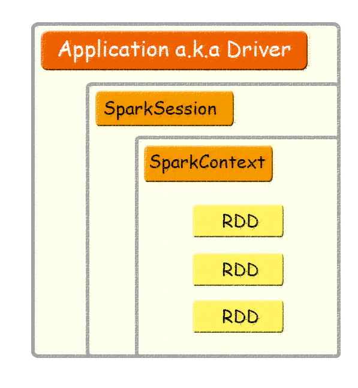
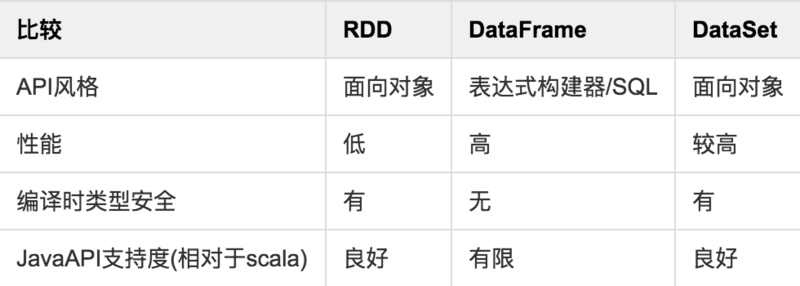

## 接触 Spark 的时候容易产生这样的疑惑

RDD 是什么，SparkContext 是什么，SparkSession 又是什么... 它们之间又是什么关系？

简介
先来个简单的一图流：



再来个粗暴的一句话描述：

- Application：用户编写的Spark应用程序，Driver 即运行上述 Application 的 main() 函数并且创建 SparkContext。
- SparkContext：整个应用的上下文，控制应用的生命周期。
- RDD：不可变的数据集合，可由 SparkContext 创建，是 Spark 的基本计算单元。

- SparkSession
可以由上节图中看出，Application、SparkSession、SparkContext、RDD之间具有包含关系，并且前三者是1对1的关系。

SparkSession 是 Spark 2.0 版本引入的新入口，在这之前，创建一个 Application 对应的上下文是这样的：
```scala
//set up the spark configuration and create contexts
val sparkConf = new SparkConf().setAppName("SparkSessionZipsExample").setMaster("local")
// your handle to SparkContext to access other context like SQLContext
val sc = new SparkContext(sparkConf).set("spark.some.config.option", "some-value")
val sqlContext = new org.apache.spark.sql.SQLContext(sc)
```

现在 SparkConf、SparkContext 和 SQLContext 都已经被封装在 SparkSession 当中，并且可以通过 builder 的方式创建：
```scala
// Create a SparkSession. No need to create SparkContext
// You automatically get it as part of the SparkSession
val warehouseLocation = "file:${system:user.dir}/spark-warehouse"
val spark = SparkSession
   .builder()
   .appName("SparkSessionZipsExample")
   .config("spark.sql.warehouse.dir", warehouseLocation)
   .enableHiveSupport()
   .getOrCreate()
```

通过 SparkSession 创建并操作 Dataset 和 DataFrame，代码中的 spark 对象既是 SparkSession
```scala
//create a Dataset using spark.range starting from 5 to 100, with increments of 5
val numDS = spark.range(5, 100, 5)
// reverse the order and display first 5 items
numDS.orderBy(desc("id")).show(5)
//compute descriptive stats and display them
numDs.describe().show()
// create a DataFrame using spark.createDataFrame from a List or Seq
val langPercentDF = spark.createDataFrame(List(("Scala", 35), ("Python", 30), ("R", 15), ("Java", 20)))
//rename the columns
val lpDF = langPercentDF.withColumnRenamed("_1", "language").withColumnRenamed("_2", "percent")
//order the DataFrame in descending order of percentage
lpDF.orderBy(desc("percent")).show(false)
```
- RDD的拓展

上面提到了 Dataset 和 DataFrame，这两者概念是 RDD 的演化版本，图表说明了它们的演进过程和主要区别：



另外 Spark 的设计本身并不支持跨应用共享RDD，想要共享数据可采取以下3种方式：

从外部存取

使用 Global Temporary View

Ignite提供了一个Spark RDD抽象的实现，他可以在内存中跨越多个Spark作业容易地共享状态

相关文章：
https://databricks.com/blog/2...
http://www.jianshu.com/p/552b...
https://spark.apache.org/docs...
https://spark.apache.org/docs...
https://apacheignite-fs.readm...
http://www.jianshu.com/p/c018...
https://stackoverflow.com/que...
https://juejin.im/entry/58591...
https://github.com/AgilData/s...