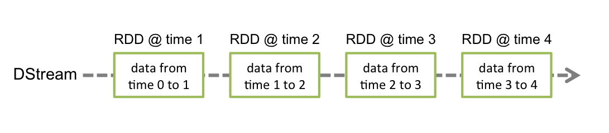

# SparkStreaming Basic Concepts

http://spark.apache.org/docs/latest/streaming-programming-guide.html

>Linking - 导入

```xml
<dependency>
    <groupId>org.apache.spark</groupId>
    <artifactId>spark-streaming_2.11</artifactId>
    <version>2.3.0</version>
</dependency>
```

```sbt
libraryDependencies += "org.apache.spark" % "spark-streaming_2.11" % "2.3.0"
```

For ingesting data from sources like Kafka, Flume, and Kinesis that are not present in the Spark Streaming core API, you will have to add the corresponding artifact spark-streaming-xyz_2.11 to the dependencies. For example, some of the common ones are as follows.

|Source	|Artifact
|-|-
|Kafka	|spark-streaming-kafka-0-10_2.11
|Flume	|spark-streaming-flume_2.11
|Kinesis| spark-streaming-kinesis-asl_2.11 [Amazon Software License]

>Initializing StreamingContext - 创建一个 StreamingContext

```java
//java
import org.apache.spark.*;
import org.apache.spark.streaming.api.java.*;

SparkConf conf = new SparkConf().setAppName(appName).setMaster(master);
JavaStreamingContext ssc = new JavaStreamingContext(conf, new Duration(1000));
```

```scala
//scala  - 新建一个StreamingContext
import org.apache.spark._
import org.apache.spark.streaming._

val conf = new SparkConf().setAppName(appName).setMaster(master)
val ssc = new StreamingContext(conf, Seconds(1))
```

A streamingContext object can also be created form an existing SparkContext object - 

```scala
// scala  - 也可以从sc 创建 ，差别就是 直接创建要提供 conf，实际上没啥差别
import org.apache.spark.streaming._

val sc = ...                // existing SparkContext
val ssc = new StreamingContext(sc, Seconds(1))
```

After a context is defined , you have to do the following - 创建流之后，要做如下操作
- 1. Define the input source by creating input - 指定数据源
- 2. Define the streaming computations by applying treansformation and output operations to DStreams - 编写DStream数据处理过程
- 3. Start receiving data and processing it using `streamingContext.start` - 开始接收数据
- 4. Wait for the processing to be stopped(manually or due to any error) using streamingContext.awaitTermination - 等待程序结束
- 5. The processing can be muanually stopped using streamingContext.stop - 手动结束

Point to remember:  - 要注意一下几点
- Once a context has been started,no new streaming computations can be set up or added to it
- `context开始之后，无法在设置或者加入新的计算`
- Once a context has been stopped,it cannot be restarted
- `context停止后，没法重启`
- Only one StreamingContext can be acitve in a JVM at the same time.
- `在一个JVM中只能有一个StreamingContext活动`
- stop() on StreamingContext also stops the SparkContext.To stop only the StreamingContext,set the optional parameter of stop() called stopSParkContext to false
- `StreamingContext的stop会同时停止SparkContext，如果想仅停止StreamingContext，需要设置可选参数`
- A SparkContext can be re-used to create multiple StreamingContexts,as long as the previous StreamingContext is stopped (without stopping the SparkContext) before the next StreamingContext is created
- `一个SparkContext可以被重复用来创建多个StreamingContext，只要遵循先停止前一个，再创建后一个的顺序`

>Discretized Streams - DStream

DStream 是Sparkstreaming 提供的底层抽象。它代表连续的数据流——从数据源获取的数据流，或者从输入流转换得来。在内部，DStream用连续的RDD表示，每个RDD包含一个特定时间段内的数据



所有对DStream的操作都会在底层被转换成对RDD的操作。


>Input DStreams and Receivers - SparkStreaming的：input dstreams 和 receivers

Spark Streaming provides two categories of built-in streaming sources.
- Basic sources : Sources directly available in the StreamingContext . Examples : file systems ,and socket connections.
- Advanced sources : Sources like kafka , flume ,Kinesis, etc. are availbable through extra utility classes. These require linking against extra dependecies as discussed in the linking section

Note that, if you want to receive multiple streams of data in parallel in your streaming application, you can create multiple input DStreams (discussed further in the Performance Tuning section). This will create multiple receivers which will simultaneously receive multiple data streams. But note that a Spark worker/executor is a long-running task, hence it occupies one of the cores allocated to the Spark Streaming application. Therefore, it is important to remember that a Spark Streaming application needs to be allocated enough cores (or threads, if running locally) to process the received data, as well as to run the receiver(s).

注意： 如果希望平行接受多个数据流的数据，那么就需要创建多个DStreams——创建多个接收器。`但是，要注意的是：Spark worker/executor 是一个长期执行的任务，因此会占用一个分配给 Spark Streaming application的核心，因此，必须给这个任务足够的核心（或者线程(本地)），来在接收数据的同时处理数据`

- Points to remember
  - `要给足够的核心`When running a Spark Streaming program locally, do not use “local” or “local[1]” as the master URL. Either of these means that only one thread will be used for running tasks locally. If you are using an input DStream based on a receiver (e.g. sockets, Kafka, Flume, etc.), then the single thread will be used to run the receiver, leaving no thread for processing the received data. Hence, when running locally, always use “local[n]” as the master URL, where n > number of receivers to run (see Spark Properties for information on how to set the master).
  - `核心数量要大于接收器的数量`Extending the logic to running on a cluster, the number of cores allocated to the Spark Streaming application must be more than the number of receivers. Otherwise the system will receive data, but not be able to process it.

>Basic Sources 基础数据源

We have already taken a look at the ssc.socketTextStream(...) in the quick example which creates a DStream from text data received over a TCP socket connection. Besides sockets, the StreamingContext API provides methods for creating DStreams from files as input sources.

- File Streams

For reading data from files on any file system compatible with the `HDFS API (that is, HDFS, S3, NFS, etc.)`, a DStream can be created as via `StreamingContext.fileStream[KeyClass, ValueClass, InputFormatClass]`.

`File streams do not require running a receiver so there is no need to allocate any cores for receiving file data.`

文件流不需要单独运行一个receiver，所以不需要额外的核心

For simple text files, the easiest method is StreamingContext.textFileStream(dataDirectory).

```Scala
streamingContext.fileStream[KeyClass, ValueClass, InputFormatClass](dataDirectory)

//For text files
streamingContext.textFileStream(dataDirectory)
```

- How Directories are Monitored 如何监控一个目录

Spark Streaming will monitor the directory `dataDirectory` and process any files created in that directory.

Spark Streaming 会监听给定的目录，并处理目录中创建的文件。

- A simple directory can be monitored, such as "hdfs://namenode:8040/logs/". All files directly under such a path will be processed as they are discovered.
- `监控一个目录，所有直接放置在这个目录下面的文件回被监听`
- A POSIX glob pattern can be supplied, such as "hdfs://namenode:8040/logs/2017/*". Here, the DStream will consist of all files in the directories matching the pattern. That is: it is a pattern of directories, not of files in directories.
- `给一个正则，可以监听名称匹配的文件`
- All files must be in the same data format.
- `所有的文件必须是相同的格式`
- A file is considered part of a time period based on its modification time, not its creation time.
- `文件会以更新日期为依据`
- Once processed, changes to a file within the current window will not cause the file to be reread. That is: updates are ignored.
- 当一个文件被处理过后，`更新是无法触发二次处理的！！！ 更新是被忽略的！！！`
- The more files under a directory, the longer it will take to scan for changes — even if no files have been modified.
- `目录下的文件数量直接影响扫描时间，即使没有任何文件更改`
- If a wildcard is used to identify directories, such as "hdfs://namenode:8040/logs/2016-*", renaming an entire directory to match the path will add the directory to the list of monitored directories. Only the files in the directory whose modification time is within the current window will be included in the stream.
- 如果使用 百搭牌（通配符），可以通过，更改整个目录来满足路径匹配。但是`目录下只有修改时间在当前窗口的才会被流取到`
- Calling FileSystem.setTimes() to fix the timestamp is a way to have the file picked up in a later window, even if its contents have not changed.
- 用 FileSystem.setTimes() 调整时间戳可以让文件在之后的时间窗口内被采集到，即便其内容没有任何变化。

- Using Object Stores as a source of data

“Full” Filesystems such as HDFS tend to set the modification time on their files as soon as the output stream is created. When a file is opened, even before data has been completely written, it may be included in the DStream - after which updates to the file within the same window will be ignored. That is: changes may be missed, and data omitted from the stream.`入HDFS这样的文件系统同，通常会在创建文件同时设置修改时间。当一个文件被打开，即使数据还没有完全写入，就可能被放入一个时间窗口，而在同一个是时间窗口的后续更新，会再当前时间窗口内被忽略。  造成遗漏`

To guarantee that changes are picked up in a window, write the file to an unmonitored directory, then, immediately after the output stream is closed, rename it into the destination directory. Provided the renamed file appears in the scanned destination directory during the window of its creation, the new data will be picked up.
- `为了确保文件能够正确的读如时间窗口（纯 文件系统 入HDFS）`
  - 1.把文件写到一个不被监控的文件夹
  - 2.输入完成的时候，立刻重命名这个文件路径，把他置于监控目录下

In contrast, Object Stores such as Amazon S3 and Azure Storage usually have slow rename operations, as the data is actually copied. Furthermore, renamed object may have the time of the rename() operation as its modification time, so may not be considered part of the window which the original create time implied they were.
- 与之不同的是
  - Amazon S3 / Azure Storage 这种Object Stores 会在数据完全复制完成之后才进行rename操作
  - 并且 会把`更名的时间`设置为调整时间

Careful testing is needed against the target object store to verify that the timestamp behavior of the store is consistent with that expected by Spark Streaming. It may be that writing directly into a destination directory is the appropriate strategy for streaming data via the chosen object store.`如果使用Object store，需要对时间戳的行为表现进行认真的测试`

For more details on this topic, consult the Hadoop [Filesystem Specification](https://hadoop.apache.org/docs/stable2/hadoop-project-dist/hadoop-common/filesystem/introduction.html).

- Streams based on Custom Receivers

DStreams can be created with data streams received through custom receivers. See the [Custom Receiver Guide](http://spark.apache.org/docs/latest/streaming-custom-receivers.html) for more details.

- Queue of RDDs as a Stream

For testing a Spark Streaming application with test data, one can also create a DStream based on a queue of RDDs, using streamingContext.queueStream(queueOfRDDs). Each RDD pushed into the queue will be treated as a batch of data in the DStream, and processed like a stream.

For more details on streams from sockets and files, see the API documentations of the relevant functions in StreamingContext for Scala, JavaStreamingContext for Java, and StreamingContext for Python.

>Advanced Sources - 高级数据源

Python API As of Spark 2.3.0, out of these sources, Kafka, Kinesis and Flume are available in the Python API.

This category of sources require interfacing with external non-Spark libraries, some of them with complex dependencies (e.g., Kafka and Flume). Hence, to minimize issues related to version conflicts of dependencies, the functionality to create DStreams from these sources has been moved to separate libraries that can be linked to explicitly when necessary.

Note that these advanced sources are not available in the Spark shell, hence applications based on these advanced sources cannot be tested in the shell. If you really want to use them in the Spark shell you will have to download the corresponding Maven artifact’s JAR along with its dependencies and add it to the classpath.

Some of these advanced sources are as follows.

- Kafka: Spark Streaming 2.3.0 is compatible with Kafka broker versions 0.8.2.1 or higher. See the [Kafka Integration Guide](http://spark.apache.org/docs/latest/streaming-kafka-integration.html) for more details.

- Flume: Spark Streaming 2.3.0 is compatible with Flume 1.6.0. See the [Flume Integration Guide](http://spark.apache.org/docs/latest/streaming-flume-integration.html) for more details.

- Kinesis: Spark Streaming 2.3.0 is compatible with Kinesis Client Library 1.2.1. See the [Kinesis Integration Guide](http://spark.apache.org/docs/latest/streaming-kinesis-integration.html) for more details.

>Custom Sources

Python API This is not yet supported in Python.

Input DStreams can also be created out of custom data sources. All you have to do is implement a user-defined receiver (see next section to understand what that is) that can receive data from the custom sources and push it into Spark. See the Custom Receiver Guide for details.

>Receiver Reliability

There can be two kinds of data sources based on their reliability. Sources (like Kafka and Flume) allow the transferred data to be acknowledged. If the system receiving data from these reliable sources acknowledges the received data correctly, it can be ensured that no data will be lost due to any kind of failure. This leads to two kinds of receivers:

- Reliable Receiver - A reliable receiver correctly sends acknowledgment to a reliable source when the data has been received and stored in Spark with replication.
- Unreliable Receiver - An unreliable receiver does not send acknowledgment to a source. This can be used for sources that do not support acknowledgment, or even for reliable sources when one does not want or need to go into the complexity of acknowledgment.
The details of how to write a reliable receiver are discussed in the Custom Receiver Guide.