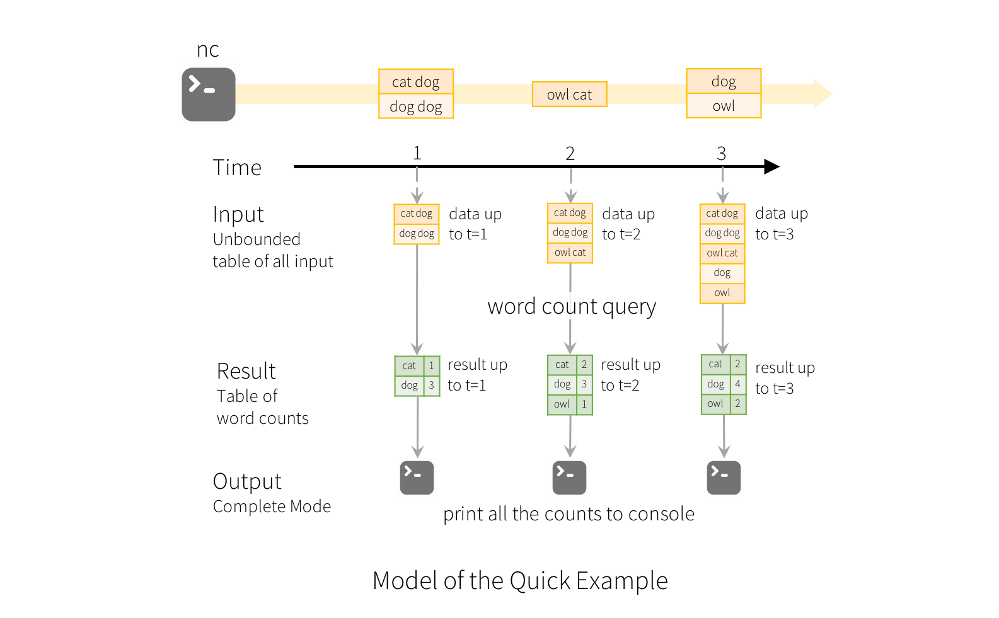

# Structured Streaming Programming Guide

官方文档的阅读记录 

[Structured Streaming Programming Guide](http://spark.apache.org/docs/latest/structured-streaming-programming-guide.html#structured-streaming-programming-guide)

- Overview
- Quick Example
- Programming Model
  - Basic Concepts
  - Handling Event-time and Late Data
  - Fault Tolerance Semantics
- API using Datasets and DataFrames
  - Creating streaming DataFrames and streaming Datasets
    - Input Sources
    - Schema inference and partition of streaming DataFrames/Datasets
  - Operations on streaming DataFrames/Datasets
    - Basic Operations - Selection, Projection, Aggregation
    - Window Operations on Event Time
      - Handling Late Data and Watermarking
    - Join Operations
      - Stream-static Joins
      - Stream-stream Joins
        - Inner Joins with optional Watermarking
        - Outer Joins with Watermarking
        - Support matrix for joins in streaming queries
    - Streaming Deduplication
    - Arbitrary Stateful Operations
    - Unsupported Operations
  - Starting Streaming Queries
    - Output Modes
    - Output Sinks
      - Using Foreach
    - Triggers
  - Managing Streaming Queries
  - Monitoring Streaming Queries
    - Reading Metrics Interactively
    - Reporting Metrics programmatically using Asynchronous APIs
    - Reporting Metrics using Dropwizard
  - Recovering from Failures with Checkpointing
- Continuous Processing
- Additional Information

## Overview

Structured Streaming is a scalable and fault-tolerant stream processing engine built on the Spark SQL engine. You can express your streaming computation the same way you would express a batch computation on static data. The Spark SQL engine will take care of running it incrementally and continuously and updating the final result as streaming data continues to arrive. You can use the Dataset/DataFrame API in Scala, Java, Python or R to express streaming aggregations, event-time windows, stream-to-batch joins, etc. The computation is executed on the same optimized Spark SQL engine. Finally, the system ensures end-to-end exactly-once fault-tolerance guarantees through checkpointing and Write Ahead Logs. In short, Structured Streaming provides fast, scalable, fault-tolerant, end-to-end exactly-once stream processing without the user having to reason about streaming.

Structured Streaming 是一个可扩展，容错的流处理引擎，构建再SparkSQL之上。你可以像批量处理静态数据一样处理流数据。Spark-SQL引擎会逐渐的，连续的处理数据，所这数据流的到达，更新最终结果。

Internally, by default, Structured Streaming queries are processed using a micro-batch processing engine, which processes data streams as a series of small batch jobs thereby achieving end-to-end latencies as low as 100 milliseconds and exactly-once fault-tolerance guarantees. However, since Spark 2.3, we have introduced a new low-latency processing mode called Continuous Processing, which can achieve end-to-end latencies as low as 1 millisecond with at-least-once guarantees. Without changing the Dataset/DataFrame operations in your queries, you will be able to choose the mode based on your application requirements.

在内部，默认情况下，Structured Streaming 用micro-batch处理引擎，把数据流当作小的批量任务进行处理，以获取100ms级别的延迟和单次执行，容错保证。但是从Spark2.3开始，可以做到1ms延迟，最少一次保证。而不用坐其他的修改。可以通过选择合适自己应用的模式。

In this guide, we are going to walk you through the programming model and the APIs. We are going to explain the concepts mostly using the default micro-batch processing model, and then later discuss Continuous Processing model. First, let’s start with a simple example of a Structured Streaming query - a streaming word count.

## Quick Example
Let’s say you want to maintain a running word count of text data received from a data server listening on a TCP socket. Let’s see how you can express this using Structured Streaming. You can see the full code in Scala/Java/Python/R. And if you download Spark, you can directly run the example. In any case, let’s walk through the example step-by-step and understand how it works. First, we have to import the necessary classes and create a local SparkSession, the starting point of all functionalities related to Spark.

```Scala

import org.apache.spark.sql.functions._
import org.apache.spark.sql.SparkSession

val spark = SparkSession
  .builder
  .appName("StructuredNetworkWordCount")
  .getOrCreate()
  
import spark.implicits._
```

Next, let’s create a streaming DataFrame that represents text data received from a server listening on localhost:9999, and transform the DataFrame to calculate word counts.

```scala
// Create DataFrame representing the stream of input lines from connection to localhost:9999
val lines = spark.readStream
  .format("socket")
  .option("host", "localhost")
  .option("port", 9999)
  .load()

// Split the lines into words
val words = lines.as[String].flatMap(_.split(" "))

// Generate running word count
val wordCounts = words.groupBy("value").count()
```
This lines DataFrame represents an `unbounded table[无边界的表]` containing the streaming text data. This table contains one column of strings named “value”, and each line in the streaming text data becomes a row in the table. Note, that this is not currently receiving any data as we are just setting up the transformation, and have not yet started it.`[到这里，我们还有有接收到任何的数据，我们仅仅设置好了数据的处理流程，还没有启动它]` Next, `we have converted the DataFrame to a Dataset of String using` .as[String], `[之后我们用as..把DataFrame转换成Dataset]`so that we can apply the flatMap operation to split each line into multiple words. The resultant words Dataset contains all the words. Finally, we have defined the wordCounts DataFrame by grouping by the unique values in the Dataset and counting them. Note that this is a streaming DataFrame which represents the running word counts of the stream.

We have now set up the query on the streaming data. All that is left is to actually start receiving data and computing the counts. To do this, we set it up to print the complete set of counts (specified by outputMode("complete")) to the console every time they are updated. And then start the streaming computation using start().`我们已经对这些streaming data设置好了query，之后就可以开始进行计算。`

```Scala

// Start running the query that prints the running counts to the console
val query = wordCounts.writeStream
  .outputMode("complete")
  .format("console")
  .start()

query.awaitTermination()
```
After this code is executed, the streaming computation will have started in the background. The query object is a handle to that active streaming query, and we have decided to wait for the termination of the query using awaitTermination() to prevent the process from exiting while the query is active.`当这部分代码执行后，后台会启动流计算，query对象是数据的处理者`

To actually execute this example code, you can either compile the code in your own Spark application, or simply run the example once you have downloaded Spark. We are showing the latter. You will first need to run Netcat (a small utility found in most Unix-like systems) as a data server by using

$ nc -lk 9999
Then, in a different terminal, you can start the example by using

```Scala
$ ./bin/run-example org.apache.spark.examples.sql.streaming.StructuredNetworkWordCount localhost 9999
```

Then, any lines typed in the terminal running the netcat server will be counted and printed on screen every second. It will look something like the following.

```scala
// console log ，omit!!
```

## Programming Model

The key idea in Structured Streaming is to treat a live data stream as a table that is being continuously appended. This leads to a new stream processing model that is very similar to a batch processing model. You will express your streaming computation as standard batch-like query as on a static table, and Spark runs it as an incremental query on the unbounded input table. Let’s understand this model in more detail.

Structured Streaming 的核心思想是把数据流当成一个不断增长的表。这是一个与批处理模型相似的模型。你可以用批处理的方式来处理流式数据，Spark会在这个无边界的表上执行递进式的query。

- Basic Concepts
Consider the input data stream as the “Input Table”. Every data item that is arriving on the stream is like a new row being appended to the Input Table.


A query on the input will generate the “Result Table”. Every trigger interval (say, every 1 second), new rows get appended to the Input Table, which eventually updates the Result Table. Whenever the result table gets updated, we would want to write the changed result rows to an external sink.对于这张表的查询会生成结果表，每次触发（每秒），新的行会添加到input table里面，最终更新result table。每次结果更新，我们希望把更新的内容写道外部的存储中。


- The “Output” is defined as what gets written out to the external storage. The output can be defined in a different mode:

  - `Complete Mode` - The entire updated Result Table will be written to the external storage. It is up to the storage connector to decide how to handle writing of the entire table.会将完整的更新后的结果表传递给外部存储

  - `Append Mode` - Only the new rows appended in the Result Table `since the last trigger` will be written to the external storage. This is applicable only on the queries where existing rows in the Result Table are not expected to change.将上一次trigger的数据结果发送给改不存储->只有在不会对（Result table）旧数据进行改变的时候才能使用

  - `Update Mode` - Only the rows that were updated in the Result Table since the last trigger will be written to the external storage (available since Spark 2.1.1). Note that this is different from the Complete Mode in that this mode only outputs the rows that have changed since the last trigger. If the query doesn’t contain aggregations, it will be equivalent to Append mode.从上次触发之后，如果Result table中有更新，就会有新的触发。只输出更新的部分。如果query中没有aggreagations，那么这个方法和Append mode一样。

`Note that each mode is applicable on certain types of queries. This is discussed in detail later.`

To illustrate the use of this model, let’s understand the model in context of the Quick Example above. The first lines DataFrame is the input table, and the final wordCounts DataFrame is the result table. Note that the query on streaming lines DataFrame to generate wordCounts is exactly the same as it would be a static DataFrame. However, when this query is started, Spark will continuously check for new data from the socket connection. If there is new data, Spark will run an “incremental” query that combines the previous running counts with the new data to compute updated counts, as shown below.



`Note that Structured Streaming does not materialize[使具体化，实现] the entire table.` It reads the latest available data from the streaming data source, processes it incrementally to update the result, and then `discards` the source data. It only keeps around the minimal intermediate state data as required to update the result (e.g. intermediate counts in the earlier example).

This model is significantly different from many other stream processing engines. Many streaming systems require the user to maintain running aggregations themselves, thus having to reason about fault-tolerance, and data consistency (at-least-once, or at-most-once, or exactly-once). In this model, Spark is responsible for updating the Result Table when there is new data, thus relieving the users from reasoning about it. As an example, let’s see how this model handles event-time based processing and late arriving data.在很多其他流处理引擎中，要求用户自行处理聚合操作,因此必须要推导（考虑）容错和一致性。在这个模型中，Spark负责更新result table，因此用户不用再考虑这些

## Handling Event-time and Late Data 处理事件时间与数据的迟到（数据内部记录的，数据产生的事件）

Event-time is the time embedded in the data itself. For many applications, you may want to operate on this event-time. For example, if you want to get the number of events generated by IoT devices every minute, then you probably want to use the time when the data was generated (that is, event-time in the data), rather than the time Spark receives them. This event-time is very naturally expressed in this model – `each event from the devices is a row in the table, and event-time is a column value in the row`. This allows window-based aggregations (e.g. number of events every minute) to be just a special type of grouping and aggregation on the event-time column – `each time window is a group` and `each row can belong to multiple windows/groups`. Therefore, such event-time-window-based aggregation queries can be defined consistently on both a static dataset (e.g. from collected device events logs) as well as on a data stream, making the life of the user much easier.事件时间是数组记录在自身中的时间，对于很多application，我们需要操作的是事件时间，而不是Spark接收到他们的时间。在这个模型中，event-time相当于表中的一个列，对于window-based aggregation 来说，就是以某一列（时间的那一列）做聚合操作。因此，这种 event-time-window-based 聚合操作可以很轻松的在静态/动态模型中处理，极大方便了开发。

Furthermore, this model naturally handles data that has arrived later than expected based on its event-time. Since Spark is updating the Result Table, it has full control over updating old aggregates when there is late data, as well as cleaning up old aggregates to limit the size of intermediate state data. `Since Spark 2.1, we have support for watermarking` which allows the user to specify the threshold of late data, and allows the engine to accordingly clean up old state. These are explained later in more detail in the Window Operations section.

## Fault Tolerance Semantics

Delivering end-to-end exactly-once semantics was one of key goals behind the design of Structured Streaming. To achieve that, we have designed the Structured Streaming sources, the sinks and the execution engine to reliably track the exact progress of the processing so that it can handle any kind of failure by restarting and/or reprocessing. Every streaming source is assumed to have offsets (similar to Kafka offsets, or Kinesis sequence numbers) to track the read position in the stream. The engine uses checkpointing and write ahead logs to record the offset range of the data being processed in each trigger. The streaming sinks are designed to be idempotent for handling reprocessing. Together, using replayable sources and idempotent sinks, Structured Streaming can ensure end-to-end exactly-once semantics under any failure.简历Structured Streaming的另一个重要目标就是实现端到端-exactly-once。为了实现这些，我们涉及了 sources/sink和 execution engine 来可靠的跟踪具体的（精确的）流程，来确保出错后restart或reporcessing。每个streaming 源都有offsetss来追踪读取位置。engine用checkpoint和 WAL来记录正在处理中的数据的offset range。streaming sinks设计成幂等的处理数据。

## API using Datasets and DataFrames

Since Spark 2.0, DataFrames and Datasets can represent static, bounded data, as well as streaming, unbounded data. Similar to static Datasets/DataFrames, you can use the common entry point SparkSession (Scala/Java/Python/R docs) to create streaming DataFrames/Datasets from streaming sources, and apply the same operations on them as static DataFrames/Datasets. If you are not familiar with Datasets/DataFrames, you are strongly advised to familiarize yourself with them using the DataFrame/Dataset Programming Guide.

### Creating streaming DataFrames and streaming Datasets | 创建流

Streaming DataFrames can be created through the `DataStreamReader interface` (Scala/Java/Python docs) returned by `SparkSession.readStream()`. In R, with the read.stream() method. Similar to the read interface for creating static DataFrame, you can specify the details of the source – data format, schema, options, etc.

- Input Sources
There are a few built-in sources.

  - `File source` - Reads files written in a directory as a stream of data. Supported file formats are `text, csv, json, orc, parquet`. See the docs of the DataStreamReader interface for a more up-to-date list, and supported options for each file format. Note that the files must be atomically placed in the given directory, which in most file systems, can be achieved by file move operations.

  - `Kafka source` - Reads data from Kafka. It’s compatible with Kafka broker versions 0.10.0 or higher. See the Kafka Integration Guide for more details.

  - Socket source (for testing) - Reads UTF8 text data from a socket connection. The listening server socket is at the driver. Note that this should be used only for testing as this does not provide end-to-end fault-tolerance guarantees.

  - Rate source (for testing) - Generates data at the specified number of rows per second, each output row contains a timestamp and value. Where timestamp is a Timestamp type containing the time of message dispatch, and value is of Long type containing the message count, starting from 0 as the first row. This source is intended for testing and benchmarking.

Some sources are not fault-tolerant because they do not guarantee that data can be replayed using checkpointed offsets after a failure. See the earlier section on fault-tolerance semantics. Here are the details of all the sources in Spark.

<table class="table">
  <tbody><tr>
    <th>Source</th>
    <th>Options</th>
    <th>Fault-tolerant</th>
    <th>Notes</th>
  </tr>
  <tr>
    <td><b>File source</b></td>
    <td>
        <code>path</code>: path to the input directory, and common to all file formats.
        <br>
        <code>maxFilesPerTrigger</code>: maximum number of new files to be considered in every trigger (default: no max)
        <br>
        <code>latestFirst</code>: whether to processs the latest new files first, useful when there is a large backlog of files (default: false)
        <br>
        <code>fileNameOnly</code>: whether to check new files based on only the filename instead of on the full path (default: false). With this set to `true`, the following files would be considered as the same file, because their filenames, "dataset.txt", are the same:
        <br>
        "file:///dataset.txt"<br>
        "s3://a/dataset.txt"<br>
        "s3n://a/b/dataset.txt"<br>
        "s3a://a/b/c/dataset.txt"<br>
        <br><br>
        For file-format-specific options, see the related methods in <code>DataStreamReader</code>
        (<a href="api/scala/index.html#org.apache.spark.sql.streaming.DataStreamReader">Scala</a>/<a href="api/java/org/apache/spark/sql/streaming/DataStreamReader.html">Java</a>/<a href="api/python/pyspark.sql.html#pyspark.sql.streaming.DataStreamReader">Python</a>/<a href="api/R/read.stream.html">R</a>).
        E.g. for "parquet" format options see <code>DataStreamReader.parquet()</code>.
        <br><br>
        In addition, there are session configurations that affect certain file-formats. See the <a href="sql-programming-guide.html">SQL Programming Guide</a> for more details. E.g., for "parquet", see <a href="sql-programming-guide.html#configuration">Parquet configuration</a> section.
        </td>
    <td>Yes</td>
    <td>Supports glob paths, but does not support multiple comma-separated paths/globs.</td>
  </tr>
  <tr>
    <td><b>Socket Source</b></td>
    <td>
        <code>host</code>: host to connect to, must be specified<br>
        <code>port</code>: port to connect to, must be specified
    </td>
    <td>No</td>
    <td></td>
  </tr>
  <tr>
    <td><b>Rate Source</b></td>
    <td>
        <code>rowsPerSecond</code> (e.g. 100, default: 1): How many rows should be generated per second.<br><br>
        <code>rampUpTime</code> (e.g. 5s, default: 0s): How long to ramp up before the generating speed becomes <code>rowsPerSecond</code>. Using finer granularities than seconds will be truncated to integer seconds. <br><br>
        <code>numPartitions</code> (e.g. 10, default: Spark's default parallelism): The partition number for the generated rows. <br><br>
        The source will try its best to reach <code>rowsPerSecond</code>, but the query may be resource constrained, and <code>numPartitions</code> can be tweaked to help reach the desired speed.
    </td>
    <td>Yes</td>
    <td></td>
  </tr>
  <tr>
    <td><b>Kafka Source</b></td>
    <td>
        See the <a href="structured-streaming-kafka-integration.html">Kafka Integration Guide</a>.
    </td>
    <td>Yes</td>
    <td></td>
  </tr>
  <tr>
    <td></td>
    <td></td>
    <td></td>
    <td></td>
  </tr>
</tbody></table>	

Here are some examples.

```Scala

val spark: SparkSession = ...

// Read text from socket
val socketDF = spark
  .readStream
  .format("socket")
  .option("host", "localhost")
  .option("port", 9999)
  .load()

socketDF.isStreaming    // Returns True for DataFrames that have streaming sources

socketDF.printSchema

// Read all the csv files written atomically in a directory
val userSchema = new StructType().add("name", "string").add("age", "integer")
val csvDF = spark
  .readStream
  .option("sep", ";")
  .schema(userSchema)      // Specify schema of the csv files
  .csv("/path/to/directory")    // Equivalent to format("csv").load("/path/to/directory")
```

These examples generate streaming DataFrames that are untyped, meaning that the schema of the DataFrame is not checked at compile time, only checked at runtime when the query is submitted. Some operations like map, flatMap, etc. need the type to be known at compile time. `To do those, you can convert these untyped streaming DataFrames to typed streaming Datasets using the same methods as static DataFrame`. See the SQL Programming Guide for more details. Additionally, more details on the supported streaming sources are discussed later in the document.这些例子生成的streaming DataFrames是无类型的，意味着在编译的时候，DataFrame的schema是不被检测的，只有在运行时才会发生检测（query submitted），有些操作，例如map，flatMap等需要在编译的时候就知道类型。为了满足需求，需要进行转换，做法和 static DataFrame一样。

### Schema inference and partition of streaming DataFrames/Datasets | 针对file sources

By default, Structured Streaming from `file based sources` requires you to specify the schema, rather than rely on Spark to infer it automatically. This restriction ensures a consistent schema will be used for the streaming query, even in the case of failures. For ad-hoc use cases, you can reenable schema inference by setting spark.sql.streaming.schemaInference to true.

Partition discovery does occur when subdirectories that are named /key=value/ are present and listing will automatically recurse into these directories. If these columns appear in the user provided schema, they will be filled in by Spark based on the path of the file being read. The directories that make up the partitioning scheme must be present when the query starts and must remain static. For example, it is okay to add /data/year=2016/ when /data/year=2015/ was present, but it is invalid to change the partitioning column (i.e. by creating the directory /data/date=2016-04-17/).当key=value子目录出现的时候，会触发新的分区，并且列表会自动迪轨道这些目录下。组成分区方案的目录在查询开始时必须存在，并且必须保持静态。

## Operations on streaming DataFrames/Datasets

You can apply all kinds of operations on streaming DataFrames/Datasets – ranging from untyped, SQL-like operations (e.g. select, where, groupBy), to typed RDD-like operations (e.g. map, filter, flatMap). See the SQL programming guide for more details. Let’s take a look at a few example operations that you can use.你可以在streaming DataFrames/Datasets上使用任何operations，从 无类型的SQL-like的操作（如 select where gourpBy）到有类型的RDD-like的操作（例如： map，filter，flatMap）。

- Basic Operations - Selection, Projection, Aggregation

Most of the common operations on DataFrame/Dataset are supported for streaming. The few operations that are not supported are discussed later in this section.

```Scala

case class DeviceData(device: String, deviceType: String, signal: Double, time: DateTime)

val df: DataFrame = ... // streaming DataFrame with IOT device data with schema { device: string, deviceType: string, signal: double, time: string }
val ds: Dataset[DeviceData] = df.as[DeviceData]    // streaming Dataset with IOT device data

// Select the devices which have signal more than 10
df.select("device").where("signal > 10")      // using untyped APIs   
ds.filter(_.signal > 10).map(_.device)         // using typed APIs

// Running count of the number of updates for each device type
df.groupBy("deviceType").count()                          // using untyped API

// Running average signal for each device type
import org.apache.spark.sql.expressions.scalalang.typed
ds.groupByKey(_.deviceType).agg(typed.avg(_.signal))    // using typed API
```

You can also register a streaming DataFrame/Dataset as a temporary view and then apply SQL commands on it.也可以把df注册成一个表

```Scala

df.createOrReplaceTempView("updates")
spark.sql("select count(*) from updates")  // returns another streaming DF
```
Note, you can identify whether a DataFrame/Dataset has streaming data or not by using df.isStreaming.

```Scala

df.isStreaming
```

## Window Operations on Event Time

Aggregations over a sliding event-time window are straightforward with Structured Streaming and are very similar to grouped aggregations. In a grouped aggregation, aggregate values (e.g. counts) are maintained for each unique value in the user-specified grouping column. In case of window-based aggregations, aggregate values are maintained for each window the event-time of a row falls into. Let’s understand this with an illustration.

Imagine our quick example is modified and the stream now contains lines along with the time when the line was generated. Instead of running word counts, we want to count words within 10 minute windows, updating every 5 minutes. That is, word counts in words received between 10 minute windows 12:00 - 12:10, 12:05 - 12:15, 12:10 - 12:20, etc. Note that 12:00 - 12:10 means data that arrived after 12:00 but before 12:10. Now, consider a word that was received at 12:07. This word should increment the counts corresponding to two windows 12:00 - 12:10 and 12:05 - 12:15. So the counts will be indexed by both, the grouping key (i.e. the word) and the window (can be calculated from the event-time).

The result tables would look something like the following.


Since this windowing is similar to grouping, in code, you can use groupBy() and window() operations to express windowed aggregations. You can see the full code for the below examples in Scala/Java/Python.

```Scala

import spark.implicits._

val words = ... // streaming DataFrame of schema { timestamp: Timestamp, word: String }

// Group the data by window and word and compute the count of each group
// 下面这个 window 函数 是需要 import org.apache.spark.sql.functions._ 的，这个东西没有只能提示，这就很生气了，所以说，还是要多看API-doc才行
val windowedCounts = words.groupBy(
  window($"timestamp", "10 minutes", "5 minutes"),
  $"word"
).count()
```

### Handling Late Data and Watermarking

Now consider what happens if one of the events arrives late to the application. For example, say, a word generated at 12:04 (i.e. event time) could be received by the application at 12:11. The application should use the time 12:04 instead of 12:11 to update the older counts for the window 12:00 - 12:10. This occurs naturally in our window-based grouping – Structured Streaming can maintain the intermediate state for partial aggregates for a long period of time such that late data can update aggregates of old windows correctly, as illustrated below.


However, to run this query for days, it’s necessary for the system to bound the amount of intermediate in-memory state it accumulates. 

`如果这个query运行了好几天，系统就有必要限制in-memory内存累积量` 

This means the system needs to know when an old aggregate can be dropped from the in-memory state because the application is not going to receive late data for that aggregate any more.

 `所以系统需要知道什么时候旧的aggregate可以被从内存中去除，程序不会再收到这个aggreagate的更多内容。`
 
 To enable this, in Spark 2.1, we have introduced watermarking, which lets the engine automatically track the current event time in the data and attempt to clean up old state accordingly.
 
 `Spark2.1引入watermarking，让engine自动的跟踪current event time，并以此为依据自动尝试清除old state` 
 
 You can define the watermark of a query by `specifying the event time column and the threshold on how late the data is expected to be in terms of event time`. For a specific window starting at time T, the engine will maintain state and allow late data to update the state until (max event time seen by the engine - late threshold > T). In other words, late data within the threshold will be aggregated, but data later than the threshold will start getting dropped (see later in the section for the exact guarantees). Let’s understand this with an example. We can easily define watermarking on the previous example using `withWatermark()` as shown below.

```Scala

import spark.implicits._

val words = ... // streaming DataFrame of schema { timestamp: Timestamp, word: String }

// Group the data by window and word and compute the count of each group
val windowedCounts = words
    .withWatermark("timestamp", "10 minutes")
    .groupBy(
        window($"timestamp", "10 minutes", "5 minutes"),
        $"word")
    .count()
```
In this example, we are defining the watermark of the query on the value of the column “timestamp”, and also defining “10 minutes” as the threshold of how late is the data allowed to be. If this query is run in Update output mode (discussed later in Output Modes section), the engine will keep updating counts of a window in the Result Table until the window is older than the watermark, which lags behind the current event time in column “timestamp” by 10 minutes. Here is an illustration.


As shown in the illustration, the maximum event time tracked by the engine is the blue dashed line, and the watermark set as (max event time - '10 mins') at the beginning of every trigger is the red line For example, when the engine observes the data (12:14, dog), it sets the watermark for the next trigger as 12:04. This watermark lets the engine maintain intermediate state for additional 10 minutes to allow late data to be counted. For example, the data (12:09, cat) is out of order and late, and it falls in windows 12:00 - 12:10 and 12:05 - 12:15. Since, it is still ahead of the watermark 12:04 in the trigger, the engine still maintains the intermediate counts as state and correctly updates the counts of the related windows. However, when the watermark is updated to 12:11, the intermediate state for window (12:00 - 12:10) is cleared, and all subsequent data (e.g. (12:04, donkey)) is considered “too late” and therefore ignored. Note that after every trigger, the updated counts (i.e. purple rows) are written to sink as the trigger output, as dictated by the Update mode.

Some sinks (e.g. files) may not supported fine-grained updates that Update Mode requires. To work with them, we have also support Append Mode, where only the final counts are written to sink. This is illustrated below.

Note that using withWatermark on a non-streaming Dataset is no-op(无操作). As the watermark should not affect any batch query in any way, we will ignore it directly.


Similar to the Update Mode earlier, the engine maintains intermediate counts for each window. However, the partial counts are not updated to the Result Table and not written to sink. The engine waits for “10 mins” for late date to be counted, then drops intermediate state of a window < watermark, and appends the final counts to the Result Table/sink. For example, the final counts of window 12:00 - 12:10 is appended to the Result Table only after the watermark is updated to 12:11.

>Conditions for watermarking to clean aggregation state

It is important to note that the following conditions must be satisfied for the watermarking to clean the state in aggregation queries (as of Spark 2.1.1, subject to change in the future).

- Output mode must be Append or Update. Complete mode requires all aggregate data to be preserved, and hence cannot use watermarking to drop intermediate state. See the Output Modes section for detailed explanation of the semantics of each output mode.

- The aggregation must have either the event-time column, or a window on the event-time column.

- withWatermark must be called on the same column as the timestamp column used in the aggregate. For example, df.withWatermark("time", "1 min").groupBy("time2").count() is invalid in Append output mode, as watermark is defined on a different column from the aggregation column.

- withWatermark must be called before the aggregation for the watermark details to be used. For example, df.groupBy("time").count().withWatermark("time", "1 min") is invalid in Append output mode.

>Semantic Guarantees of Aggregation with Watermarking
- A watermark delay (set with withWatermark) of “2 hours” guarantees that the engine will never drop any data that is less than 2 hours delayed. In other words, any data less than 2 hours behind (in terms of event-time) the latest data processed till then is guaranteed to be aggregated.

- However, the guarantee is strict only in one direction. Data delayed by more than 2 hours is not guaranteed to be dropped; it may or may not get aggregated. More delayed is the data, less likely is the engine going to process it.

## Join Operations | 支持与静态DF/DS或者动态DF/DS的join操作

Structured Streaming supports joining a streaming Dataset/DataFrame with a static Dataset/DataFrame as well as another streaming Dataset/DataFrame. The result of the streaming join is generated incrementally, similar to the results of streaming aggregations in the previous section. In this section we will explore what type of joins (i.e. inner, outer, etc.) are supported in the above cases. Note that in all the supported join types, the result of the join with a streaming Dataset/DataFrame will be the exactly the same as if it was with a static Dataset/DataFrame containing the same data in the stream.

### Stream-static Joins
Since the introduction in Spark 2.0, Structured Streaming has supported joins (inner join and some type of outer joins) between a streaming and a static DataFrame/Dataset. Here is a simple example.

```Scala

val staticDf = spark.read. ...
val streamingDf = spark.readStream. ...

streamingDf.join(staticDf, "type")          // inner equi-join with a static DF
streamingDf.join(staticDf, "type", "right_join")  // right outer join with a static DF  
```
Note that stream-static joins are not stateful, so no state management is necessary. However, a few types of stream-static outer joins are not yet supported. These are listed at the end of this Join section.

### Stream-stream Joins
In Spark 2.3, we have added support for stream-stream joins, that is, you can join two streaming Datasets/DataFrames. The challenge of generating join results between two data streams is that, at any point of time, the view of the dataset is incomplete for both sides of the join making it much harder to find matches between inputs. Any row received from one input stream can match with any future, yet-to-be-received row from the other input stream. Hence, for both the input streams, we buffer past input as streaming state, so that we can match every future input with past input and accordingly generate joined results. Furthermore, similar to streaming aggregations, we automatically handle late, out-of-order data and can limit the state using watermarks. Let’s discuss the different types of supported stream-stream joins and how to use them.

#### Inner Joins with optional Watermarking

Inner joins on any kind of columns along with any kind of join conditions are supported. However, as the stream runs, the size of streaming state will keep growing indefinitely as all past input must be saved as any new input can match with any input from the past. To avoid unbounded state, you have to define additional join conditions such that indefinitely old inputs cannot match with future inputs and therefore can be cleared from the state. In other words, you will have to do the following additional steps in the join.

- Define watermark delays on both inputs such that the engine knows how delayed the input can be (similar to streaming aggregations)

- Define a constraint on event-time across the two inputs such that the engine can figure out when old rows of one input is not going to be required (i.e. will not satisfy the time constraint) for matches with the other input. This constraint can be defined in one of the two ways.

  - Time range join conditions (e.g. ...JOIN ON leftTime BETWEN rightTime AND rightTime + INTERVAL 1 HOUR),

  - Join on event-time windows (e.g. ...JOIN ON leftTimeWindow = rightTimeWindow).

Let’s understand this with an example.

Let’s say we want to join a stream of advertisement impressions (when an ad was shown) with another stream of user clicks on advertisements to correlate when impressions led to monetizable clicks. To allow the state cleanup in this stream-stream join, you will have to specify the watermarking delays and the time constraints as follows.

  - Watermark delays: Say, the impressions and the corresponding clicks can be late/out-of-order in event-time by at most 2 and 3 hours, respectively.

  - Event-time range condition: Say, a click can occur within a time range of 0 seconds to 1 hour after the corresponding impression.

The code would look like this.

```Scala

import org.apache.spark.sql.functions.expr

val impressions = spark.readStream. ...
val clicks = spark.readStream. ...

// Apply watermarks on event-time columns
val impressionsWithWatermark = impressions.withWatermark("impressionTime", "2 hours")
val clicksWithWatermark = clicks.withWatermark("clickTime", "3 hours")

// Join with event-time constraints
impressionsWithWatermark.join(
  clicksWithWatermark,
  expr("""
    clickAdId = impressionAdId AND
    clickTime >= impressionTime AND
    clickTime <= impressionTime + interval 1 hour
    """)
)
```
Semantic Guarantees of Stream-stream Inner Joins with Watermarking

This is similar to the guarantees provided by watermarking on aggregations. A watermark delay of “2 hours” guarantees that the engine will never drop any data that is less than 2 hours delayed. But data delayed by more than 2 hours may or may not get processed.

#### Outer Joins with Watermarking

While the watermark + event-time constraints is optional for inner joins, for left and right outer joins they must be specified. This is because for generating the NULL results in outer join, the engine must know when an input row is not going to match with anything in future. Hence, the watermark + event-time constraints must be specified for generating correct results. Therefore, a query with outer-join will look quite like the ad-monetization example earlier, except that there will be an additional parameter specifying it to be an outer-join.

```Scala

impressionsWithWatermark.join(
  clicksWithWatermark,
  expr("""
    clickAdId = impressionAdId AND
    clickTime >= impressionTime AND
    clickTime <= impressionTime + interval 1 hour
    """),
  joinType = "leftOuter"      // can be "inner", "leftOuter", "rightOuter"
 )
 ```
Semantic Guarantees of Stream-stream Outer Joins with Watermarking

Outer joins have the same guarantees as inner joins regarding watermark delays and whether data will be dropped or not.

>Caveats | 警告 注意

There are a few important characteristics to note regarding how the outer results are generated.

- The outer NULL results will be generated with a delay that depends on the specified watermark delay and the time range condition. This is because the engine has to wait for that long to ensure there were no matches and there will be no more matches in future.

- In the current implementation in the micro-batch engine, watermarks are advanced at the end of a micro-batch, and the next micro-batch uses the updated watermark to clean up state and output outer results. Since we trigger a micro-batch only when there is new data to be processed, the generation of the outer result may get delayed if there no new data being received in the stream. In short, if any of the two input streams being joined does not receive data for a while, the outer (both cases, left or right) output may get delayed.

>Support matrix for joins in streaming queries
<table class="table">
  <tbody><tr>
    <th>Left Input</th>
    <th>Right Input</th>
    <th>Join Type</th>
    <th></th>
  </tr>
  <tr>
      <td style="vertical-align: middle;">Static</td>
      <td style="vertical-align: middle;">Static</td>
      <td style="vertical-align: middle;">All types</td>
      <td style="vertical-align: middle;">
        Supported, since its not on streaming data even though it
        can be present in a streaming query
      </td>
  </tr>
  <tr>
    <td rowspan="4" style="vertical-align: middle;">Stream</td>
    <td rowspan="4" style="vertical-align: middle;">Static</td>
    <td style="vertical-align: middle;">Inner</td>
    <td style="vertical-align: middle;">Supported, not stateful</td>
  </tr>
  <tr>
    <td style="vertical-align: middle;">Left Outer</td>
    <td style="vertical-align: middle;">Supported, not stateful</td>
  </tr>
  <tr>
    <td style="vertical-align: middle;">Right Outer</td>
    <td style="vertical-align: middle;">Not supported</td>
  </tr>
  <tr>
    <td style="vertical-align: middle;">Full Outer</td>
    <td style="vertical-align: middle;">Not supported</td>
  </tr>
  <tr>
    <td rowspan="4" style="vertical-align: middle;">Static</td>
    <td rowspan="4" style="vertical-align: middle;">Stream</td>
    <td style="vertical-align: middle;">Inner</td>
    <td style="vertical-align: middle;">Supported, not stateful</td>
  </tr>
  <tr>
    <td style="vertical-align: middle;">Left Outer</td>
    <td style="vertical-align: middle;">Not supported</td>
  </tr>
  <tr>
    <td style="vertical-align: middle;">Right Outer</td>
    <td style="vertical-align: middle;">Supported, not stateful</td>
  </tr>
  <tr>
    <td style="vertical-align: middle;">Full Outer</td>
    <td style="vertical-align: middle;">Not supported</td>
  </tr>
  <tr>
    <td rowspan="4" style="vertical-align: middle;">Stream</td>
    <td rowspan="4" style="vertical-align: middle;">Stream</td>
    <td style="vertical-align: middle;">Inner</td>
    <td style="vertical-align: middle;">
      Supported, optionally specify watermark on both sides +
      time constraints for state cleanup
    </td>
  </tr>
  <tr>
    <td style="vertical-align: middle;">Left Outer</td>
    <td style="vertical-align: middle;">
      Conditionally supported, must specify watermark on right + time constraints for correct
      results, optionally specify watermark on left for all state cleanup
    </td>
  </tr>
  <tr>
    <td style="vertical-align: middle;">Right Outer</td>
    <td style="vertical-align: middle;">
      Conditionally supported, must specify watermark on left + time constraints for correct
      results, optionally specify watermark on right for all state cleanup
    </td>
  </tr>
  <tr>
    <td style="vertical-align: middle;">Full Outer</td>
    <td style="vertical-align: middle;">Not supported</td>
  </tr>
 <tr>
    <td></td>
    <td></td>
    <td></td>
    <td></td>
  </tr>
</tbody></table>


Additional details on supported joins:

- Joins can be cascaded, that is, you can do df1.join(df2, ...).join(df3, ...).join(df4, ....).
- `join可以级联，也就是可以连续join`
- As of Spark 2.3, you can use joins only when the query is in Append output mode. Other output modes are not yet supported.
- `在2.3版本中，只能在append模式下使用join，其他模式还没有支持`
- As of Spark 2.3, you cannot use other non-map-like operations before joins. Here are a few examples of what cannot be used.

  - Cannot use streaming aggregations before joins.

  - Cannot use mapGroupsWithState and flatMapGroupsWithState in Update mode before joins.

### Streaming Deduplication | 劈分，两分  -》 重复数据的删除 de-duplication

You can deduplicate records in data streams using a unique identifier in the events. This is exactly same as deduplication on static using a unique identifier column. The query will store the necessary amount of data from previous records such that it can filter duplicate records. Similar to aggregations, you can use deduplication with or without watermarking.

- With watermark - If there is a upper bound on how late a duplicate record may arrive, then you can define a watermark on a event time column and deduplicate using both the guid and the event time columns. The query will use the watermark to remove old state data from past records that are not expected to get any duplicates any more. This bounds the amount of the state the query has to maintain.

- Without watermark - Since there are no bounds on when a duplicate record may arrive, the query stores the data from all the past records as state.

```Scala

val streamingDf = spark.readStream. ...  // columns: guid, eventTime, ...

// Without watermark using guid column
streamingDf.dropDuplicates("guid")

// With watermark using guid and eventTime columns
streamingDf
  .withWatermark("eventTime", "10 seconds")
  .dropDuplicates("guid", "eventTime")
```
### Arbitrary Stateful Operations

Many usecases require more advanced stateful operations than aggregations. For example, in many usecases, you have to track sessions from data streams of events. For doing such sessionization, you will have to save arbitrary types of data as state, and perform arbitrary operations on the state using the data stream events in every trigger. Since Spark 2.2, this can be done using the operation mapGroupsWithState and the more powerful operation flatMapGroupsWithState. Both operations allow you to apply user-defined code on grouped Datasets to update user-defined state. For more concrete details, take a look at the API documentation (Scala/Java) and the examples (Scala/Java).

#### Unsupported Operations

There are a few DataFrame/Dataset operations that are not supported with streaming DataFrames/Datasets. Some of them are as follows.

- Multiple streaming aggregations (i.e. a chain of aggregations on a streaming DF) are not yet supported on streaming Datasets.

- Limit and take first N rows are not supported on streaming Datasets.

- Distinct operations on streaming Datasets are not supported.

- Sorting operations are supported on streaming Datasets only after an aggregation and in Complete Output Mode.

- Few types of outer joins on streaming Datasets are not supported. See the support matrix in the Join Operations section for more details.

In addition, there are some Dataset methods that will not work on streaming Datasets. They are actions that will immediately run queries and return results, which does not make sense on a streaming Dataset. Rather, those functionalities can be done by explicitly starting a streaming query (see the next section regarding that).

- count() - Cannot return a single count from a streaming Dataset. Instead, use ds.groupBy().count() which returns a streaming Dataset containing a running count.

- foreach() - Instead use ds.writeStream.foreach(...) (see next section).

- show() - Instead use the console sink (see next section).

If you try any of these operations, you will see an `AnalysisException` like “operation XYZ is not supported with streaming DataFrames/Datasets”. While some of them may be supported in future releases of Spark, there are others which are fundamentally hard to implement on streaming data efficiently. For example, sorting on the input stream is not supported, as it requires keeping track of all the data received in the stream. This is therefore fundamentally hard to execute efficiently.

## Starting Streaming Queries | 启动程序

Once you have defined the final result DataFrame/Dataset, all that is left is for you to start the streaming computation. To do that, you have to use the `DataStreamWriter `(Scala/Java/Python docs) returned through `Dataset.writeStream().` You will have to specify one or more of the following in this interface.

需要设置以下的内容以启动程序：
- `Details of the output sink`: Data format, location, etc.

- `Output mode`: Specify what gets written to the output sink.

- `Query name`: Optionally, specify a unique name of the query for identification.

- `Trigger interval`: Optionally, specify the trigger interval. If it is not specified, the system will check for availability of new data as soon as the previous processing has completed. If a trigger time is missed because the previous processing has not completed, then the system will trigger processing immediately.

- `Checkpoint location`: For some output sinks where the end-to-end fault-tolerance can be guaranteed, specify the location where the system will write all the checkpoint information. This should be a directory in an HDFS-compatible fault-tolerant file system. The semantics of checkpointing is discussed in more detail in the next section.

### Output Modes

There are a few types of output modes.

- `Append mode (default)` - This is the default mode, where only the new rows added to the Result Table since the last trigger will be outputted to the sink. This is supported for only those queries where rows added to the Result Table is never going to change. Hence, this mode guarantees that each row will be output only once (assuming fault-tolerant sink). For example, queries with only select, where, map, flatMap, filter, join, etc. will support Append mode.

- `Complete mode` - The whole Result Table will be outputted to the sink after every trigger. This is supported for aggregation queries.

- `Update mode` - (Available since Spark 2.1.1) Only the rows in the Result Table that were updated since the last trigger will be outputted to the sink. More information to be added in future releases.

Different types of streaming queries support different output modes. Here is the compatibility matrix.

<table class="table">
  <tbody><tr>
    <th>Query Type</th>
    <th></th>
    <th>Supported Output Modes</th>
    <th>Notes</th>        
  </tr>
  <tr>
    <td rowspan="2" style="vertical-align: middle;">Queries with aggregation</td>
    <td style="vertical-align: middle;">Aggregation on event-time with watermark</td>
    <td style="vertical-align: middle;">Append, Update, Complete</td>
    <td>
        Append mode uses watermark to drop old aggregation state. But the output of a 
        windowed aggregation is delayed the late threshold specified in `withWatermark()` as by
        the modes semantics, rows can be added to the Result Table only once after they are 
        finalized (i.e. after watermark is crossed). See the
        <a href="#handling-late-data-and-watermarking">Late Data</a> section for more details.
        <br><br>
        Update mode uses watermark to drop old aggregation state.
        <br><br>
        Complete mode does not drop old aggregation state since by definition this mode
        preserves all data in the Result Table.
    </td>    
  </tr>
  <tr>
    <td style="vertical-align: middle;">Other aggregations</td>
    <td style="vertical-align: middle;">Complete, Update</td>
    <td>
        Since no watermark is defined (only defined in other category), 
        old aggregation state is not dropped.
        <br><br>
        Append mode is not supported as aggregates can update thus violating the semantics of 
        this mode.
    </td>  
  </tr>
  <tr>
    <td colspan="2" style="vertical-align: middle;">Queries with <code>mapGroupsWithState</code></td>
    <td style="vertical-align: middle;">Update</td>
    <td style="vertical-align: middle;"></td>
  </tr>
  <tr>
    <td rowspan="2" style="vertical-align: middle;">Queries with <code>flatMapGroupsWithState</code></td>
    <td style="vertical-align: middle;">Append operation mode</td>
    <td style="vertical-align: middle;">Append</td>
    <td style="vertical-align: middle;">
      Aggregations are allowed after <code>flatMapGroupsWithState</code>.
    </td>
  </tr>
  <tr>
    <td style="vertical-align: middle;">Update operation mode</td>
    <td style="vertical-align: middle;">Update</td>
    <td style="vertical-align: middle;">
      Aggregations not allowed after <code>flatMapGroupsWithState</code>.
    </td>
  </tr>
  <tr>
      <td colspan="2" style="vertical-align: middle;">Queries with <code>joins</code></td>
      <td style="vertical-align: middle;">Append</td>
      <td style="vertical-align: middle;">
        Update and Complete mode not supported yet. See the
        <a href="#support-matrix-for-joins-in-streaming-queries">support matrix in the Join Operations section</a>
         for more details on what types of joins are supported.
      </td>
    </tr>
  <tr>
    <td colspan="2" style="vertical-align: middle;">Other queries</td>
    <td style="vertical-align: middle;">Append, Update</td>
    <td style="vertical-align: middle;">
      Complete mode not supported as it is infeasible to keep all unaggregated data in the Result Table.
    </td>
  </tr>
  <tr>
    <td></td>
    <td></td>
    <td></td>
    <td></td>
  </tr>
</tbody></table>

### Output Sinks

There are a few types of built-in output sinks.
```scala
//File sink - Stores the output to a directory.
writeStream
    .format("parquet")        // can be "orc", "json", "csv", etc.
    .option("path", "path/to/destination/dir")
    .start()
//Kafka sink - Stores the output to one or more topics in Kafka.
writeStream
    .format("kafka")
    .option("kafka.bootstrap.servers", "host1:port1,host2:port2")
    .option("topic", "updates")
    .start()
//Foreach sink - Runs arbitrary computation on the records in the output. See later in the section for more details.
writeStream
    .foreach(...)
    .start()
//Console sink (for debugging) - Prints the output to the console/stdout every time there is a trigger. Both, Append and Complete output modes, are supported. This should be used for debugging purposes on low data volumes as the entire output is collected and stored in the driver’s memory after every trigger.
writeStream
    .format("console")
    .start()
//Memory sink (for debugging) - The output is stored in memory as an in-memory table. Both, Append and Complete output modes, are supported. This should be used for debugging purposes on low data volumes as the entire output is collected and stored in the driver’s memory. Hence, use it with caution.
writeStream
    .format("memory")
    .queryName("tableName")
    .start()
```

Some sinks are not fault-tolerant because they do not guarantee persistence of the output and are meant for debugging purposes only. See the earlier section on fault-tolerance semantics. Here are the details of all the sinks in Spark.

<table class="table">
  <tbody><tr>
    <th>Sink</th>
    <th>Supported Output Modes</th>
    <th>Options</th>
    <th>Fault-tolerant</th>
    <th>Notes</th>
  </tr>
  <tr>
    <td><b>File Sink</b></td>
    <td>Append</td>
    <td>
        <code>path</code>: path to the output directory, must be specified.
        <br><br>
        For file-format-specific options, see the related methods in DataFrameWriter
        (<a href="api/scala/index.html#org.apache.spark.sql.DataFrameWriter">Scala</a>/<a href="api/java/org/apache/spark/sql/DataFrameWriter.html">Java</a>/<a href="api/python/pyspark.sql.html#pyspark.sql.DataFrameWriter">Python</a>/<a href="api/R/write.stream.html">R</a>).
        E.g. for "parquet" format options see <code>DataFrameWriter.parquet()</code>
    </td>
    <td>Yes (exactly-once)</td>
    <td>Supports writes to partitioned tables. Partitioning by time may be useful.</td>
  </tr>
  <tr>
    <td><b>Kafka Sink</b></td>
    <td>Append, Update, Complete</td>
    <td>See the <a href="structured-streaming-kafka-integration.html">Kafka Integration Guide</a></td>
    <td>Yes (at-least-once)</td>
    <td>More details in the <a href="structured-streaming-kafka-integration.html">Kafka Integration Guide</a></td>
  </tr>
  <tr>
    <td><b>Foreach Sink</b></td>
    <td>Append, Update, Complete</td>
    <td>None</td>
    <td>Depends on ForeachWriter implementation</td>
    <td>More details in the <a href="#using-foreach">next section</a></td>
  </tr>
  <tr>
    <td><b>Console Sink</b></td>
    <td>Append, Update, Complete</td>
    <td>
        <code>numRows</code>: Number of rows to print every trigger (default: 20)
        <br>
        <code>truncate</code>: Whether to truncate the output if too long (default: true)
    </td>
    <td>No</td>
    <td></td>
  </tr>
  <tr>
    <td><b>Memory Sink</b></td>
    <td>Append, Complete</td>
    <td>None</td>
    <td>No. But in Complete Mode, restarted query will recreate the full table.</td>
    <td>Table name is the query name.</td>
  </tr>
  <tr>
    <td></td>
    <td></td>
    <td></td>
    <td></td>
    <td></td>
  </tr>
</tbody></table>

Note that you have to call `start()` to actually start the execution of the query. This returns a StreamingQuery object which is a handle to the continuously running execution. You can use this object to manage the query, which we will discuss in the next subsection. For now, let’s understand all this with a few examples.

```Scala

// ========== DF with no aggregations ==========
val noAggDF = deviceDataDf.select("device").where("signal > 10")   

// Print new data to console
noAggDF
  .writeStream
  .format("console")
  .start()

// Write new data to Parquet files
noAggDF
  .writeStream
  .format("parquet")
  .option("checkpointLocation", "path/to/checkpoint/dir")
  .option("path", "path/to/destination/dir")
  .start()

// ========== DF with aggregation ==========
val aggDF = df.groupBy("device").count()

// Print updated aggregations to console
aggDF
  .writeStream
  .outputMode("complete")
  .format("console")
  .start()

// Have all the aggregates in an in-memory table
aggDF
  .writeStream
  .queryName("aggregates")    // this query name will be the table name
  .outputMode("complete")
  .format("memory")
  .start()

spark.sql("select * from aggregates").show()   // interactively query in-memory table
```
Using Foreach\
The `foreach` operation allows arbitrary[任意的] operations to be computed on the output data. As of Spark 2.1, this is available only for Scala and Java. To use this, you will have to implement the interface `ForeachWriter` (Scala/Java docs), which has methods that get called whenever there is a sequence of rows generated as output after a trigger. Note the following important points.

foreach操作允许在其中对输出数据进行任意操作。你必须implement interface `ForeachWriter`.下面有几点注意：

- The writer must be serializable, as it will be serialized and sent to the executors for execution.
- writer可序列化
- All the three methods, open, process and close will be called on the executors.
- 三个方法在executors里都会被调用
- The writer must do all the initialization (e.g. opening connections, starting a transaction, etc.) only when the open method is called. Be aware that, if there is any initialization in the class as soon as the object is created, then that initialization will happen in the driver (because that is where the instance is being created), which may not be what you intend.
- writer在调用open的时候必须完成所有的初始化操作。注意：如果创建对象的时候，class里面有任何初始化操作，这些初始化操作都会发生在executors里面（因为 实例是在那里被创建的），这可能和你预期的不同
- `version` and `partition` are two parameters in open that uniquely represent a set of rows that needs to be pushed out. version is a monotonically increasing id that increases with every trigger. partition is an id that represents a partition of the output, since the output is distributed and will be processed on multiple executors.

- `open` can use the version and partition to choose whether it needs to write the sequence of rows. Accordingly, it can return true (proceed with writing), or false (no need to write). `If false is returned, then process will not be called on any row`. For example, after a partial failure, some of the output partitions of the failed trigger may have already been committed to a database. Based on metadata stored in the database, the writer can identify partitions that have already been committed and accordingly return false to skip committing them again.
- open根据情况判断有没有需要处理的数据，并影响是否调用process
- `Whenever open is called, close will also be called` (unless the JVM exits due to some error). This is true even if open returns false. If there is any error in processing and writing the data, close will be called with the error. It is your responsibility to clean up state (e.g. connections, transactions, etc.) that have been created in open such that there are no resource leaks.
- 不管open是否调用了，close都会被调用，除非JVM报错退出了

### Triggers | 使用Trigger来决定query的运作方式：微批次/间隔/连续

The trigger settings of a streaming query defines the timing of streaming data processing, whether the query is going to executed as micro-batch query with a fixed batch interval or as a continuous processing query. Here are the different kinds of triggers that are supported.

<table class="table">
  <tbody><tr>
    <th>Trigger Type</th>
    <th>Description</th>
  </tr>
  <tr>
    <td><i>unspecified (default)</i></td>
    <td>
        If no trigger setting is explicitly specified, then by default, the query will be
        executed in micro-batch mode, where micro-batches will be generated as soon as
        the previous micro-batch has completed processing.
    </td>
  </tr>
  <tr>
    <td><b>Fixed interval micro-batches</b></td>
    <td>
        The query will be executed with micro-batches mode, where micro-batches will be kicked off
        at the user-specified intervals.
        <ul>
          <li>If the previous micro-batch completes within the interval, then the engine will wait until
          the interval is over before kicking off the next micro-batch.</li>
          <li>If the previous micro-batch takes longer than the interval to complete (i.e. if an
          interval boundary is missed), then the next micro-batch will start as soon as the
          previous one completes (i.e., it will not wait for the next interval boundary).</li>
          <li>If no new data is available, then no micro-batch will be kicked off.</li>
        </ul>
    </td>
  </tr>
  <tr>
    <td><b>One-time micro-batch</b></td>
    <td>
        The query will execute *only one* micro-batch to process all the available data and then
        stop on its own. This is useful in scenarios you want to periodically spin up a cluster,
        process everything that is available since the last period, and then shutdown the
        cluster. In some case, this may lead to significant cost savings.
    </td>
  </tr>
  <tr>
    <td><b>Continuous with fixed checkpoint interval</b><br><i>(experimental)</i></td>
    <td>
        The query will be executed in the new low-latency, continuous processing mode. Read more
        about this in the <a href="#continuous-processing-experimental">Continuous Processing section</a> below.
    </td>
  </tr>
</tbody></table>

Here are a few code examples.

```Scala

import org.apache.spark.sql.streaming.Trigger

// Default trigger (runs micro-batch as soon as it can)
df.writeStream
  .format("console")
  .start()

// ProcessingTime trigger with two-seconds micro-batch interval
df.writeStream
  .format("console")
  .trigger(Trigger.ProcessingTime("2 seconds"))
  .start()

// One-time trigger
df.writeStream
  .format("console")
  .trigger(Trigger.Once())
  .start()

// Continuous trigger with one-second checkpointing interval
df.writeStream
  .format("console")
  .trigger(Trigger.Continuous("1 second"))
  .start()
```

## Managing Streaming Queries

The StreamingQuery object created when a query is started can be used to monitor and manage the query.

```Scala

val query = df.writeStream.format("console").start()   // get the query object

query.id          // get the unique identifier of the running query that persists across restarts from checkpoint data

query.runId       // get the unique id of this run of the query, which will be generated at every start/restart

query.name        // get the name of the auto-generated or user-specified name

query.explain()   // print detailed explanations of the query

query.stop()      // stop the query

query.awaitTermination()   // block until query is terminated, with stop() or with error

query.exception       // the exception if the query has been terminated with error

query.recentProgress  // an array of the most recent progress updates for this query

query.lastProgress    // the most recent progress update of this streaming query
```

You can start any number of queries in a single SparkSession. `They will all be running concurrently sharing the cluster resources`. You can use `sparkSession.streams() to get the StreamingQueryManager` (Scala/Java/Python docs) that can be used to manage the currently active queries.

在一个SparkSession中可以启动多个queries，他们共享集群资源。

```Scala

val spark: SparkSession = ...

spark.streams.active    // get the list of currently active streaming queries

spark.streams.get(id)   // get a query object by its unique id

spark.streams.awaitAnyTermination()   // block until any one of them terminates
```
## Monitoring Streaming Queries

There are multiple ways to monitor active streaming queries. You can either push metrics to external systems using Spark’s Dropwizard Metrics support, or access them programmatically.

### Reading Metrics Interactively |以交互方式阅读指标
You can directly get the current status and metrics of an active query using streamingQuery.lastProgress() and streamingQuery.status(). lastProgress() returns a StreamingQueryProgress object in Scala and Java and a dictionary with the same fields in Python. It has all the information about the progress made in the last trigger of the stream - what data was processed, what were the processing rates, latencies, etc. There is also streamingQuery.recentProgress which returns an array of last few progresses.

【google 翻译】
您可以使用streamingQuery.lastProgress（）和streamingQuery.status（）直接获取活动查询的当前状态和指标。 lastProgress（）返回Scala和Java中的StreamingQueryProgress对象以及Python中具有相同字段的字典。 它包含关于流的最后一次触发所取得的进展的所有信息 - 处理了哪些数据，处理速率，延迟等。还有streamingQuery.recentProgress，它返回最后几个进度的数组。

In addition, streamingQuery.status() returns a StreamingQueryStatus object in Scala and Java and a dictionary with the same fields in Python. It gives information about what the query is immediately doing - is a trigger active, is data being processed, etc.

Here are a few examples.

```Scala

val query: StreamingQuery = ...

println(query.lastProgress)

/* Will print something like the following.

{
  "id" : "ce011fdc-8762-4dcb-84eb-a77333e28109",
  "runId" : "88e2ff94-ede0-45a8-b687-6316fbef529a",
  "name" : "MyQuery",
  "timestamp" : "2016-12-14T18:45:24.873Z",
  "numInputRows" : 10,
  "inputRowsPerSecond" : 120.0,
  "processedRowsPerSecond" : 200.0,
  "durationMs" : {
    "triggerExecution" : 3,
    "getOffset" : 2
  },
  "eventTime" : {
    "watermark" : "2016-12-14T18:45:24.873Z"
  },
  "stateOperators" : [ ],
  "sources" : [ {
    "description" : "KafkaSource[Subscribe[topic-0]]",
    "startOffset" : {
      "topic-0" : {
        "2" : 0,
        "4" : 1,
        "1" : 1,
        "3" : 1,
        "0" : 1
      }
    },
    "endOffset" : {
      "topic-0" : {
        "2" : 0,
        "4" : 115,
        "1" : 134,
        "3" : 21,
        "0" : 534
      }
    },
    "numInputRows" : 10,
    "inputRowsPerSecond" : 120.0,
    "processedRowsPerSecond" : 200.0
  } ],
  "sink" : {
    "description" : "MemorySink"
  }
}
*/


println(query.status)

/*  Will print something like the following.
{
  "message" : "Waiting for data to arrive",
  "isDataAvailable" : false,
  "isTriggerActive" : false
}
*/
```
### Reporting Metrics programmatically using Asynchronous APIs

You can also asynchronously monitor all queries associated with a SparkSession by attaching a StreamingQueryListener (Scala/Java docs). Once you attach your custom StreamingQueryListener object with sparkSession.streams.attachListener(), you will get callbacks when a query is started and stopped and when there is progress made in an active query. Here is an example,

```Scala

val spark: SparkSession = ...

spark.streams.addListener(new StreamingQueryListener() {
    override def onQueryStarted(queryStarted: QueryStartedEvent): Unit = {
        println("Query started: " + queryStarted.id)
    }
    override def onQueryTerminated(queryTerminated: QueryTerminatedEvent): Unit = {
        println("Query terminated: " + queryTerminated.id)
    }
    override def onQueryProgress(queryProgress: QueryProgressEvent): Unit = {
        println("Query made progress: " + queryProgress.progress)
    }
})
```
### Reporting Metrics using Dropwizard

Spark supports reporting metrics using the Dropwizard Library. To enable metrics of Structured Streaming queries to be reported as well, you have to explicitly enable the configuration spark.sql.streaming.metricsEnabled in the SparkSession.

```Scala

spark.conf.set("spark.sql.streaming.metricsEnabled", "true")
// or
spark.sql("SET spark.sql.streaming.metricsEnabled=true")
```

All queries started in the SparkSession after this configuration has been enabled will report metrics through Dropwizard to whatever sinks have been configured (e.g. Ganglia, Graphite, JMX, etc.).

### Recovering from Failures with Checkpointing

In case of a failure or intentional shutdown, you can recover the previous progress and state of a previous query, and continue where it left off. This is done using checkpointing and write ahead logs. You can configure a query with a checkpoint location, and the query will save all the progress information (i.e. range of offsets processed in each trigger) and the running aggregates (e.g. word counts in the quick example) to the checkpoint location. This checkpoint location has to be a path in an HDFS compatible file system, and can be set as an option in the DataStreamWriter when starting a query.

```Scala

aggDF
  .writeStream
  .outputMode("complete")
  .option("checkpointLocation", "path/to/HDFS/dir")
  .format("memory")
  .start()
```
## Continuous Processing | 实时流！ - 实验

[Experimental]

`Continuous processing` is a new, experimental streaming execution mode introduced in Spark 2.3 that enables low (~1 ms) end-to-end latency with at-least-once fault-tolerance guarantees. Compare this with the default micro-batch processing engine which can achieve exactly-once guarantees but achieve latencies of ~100ms at best. For some types of queries (discussed below), `you can choose which mode to execute them in without modifying the application logic` (i.e. without changing the DataFrame/Dataset operations).

To run a supported query in continuous processing mode, `all you need to do is specify a continuous trigger` with the desired checkpoint interval as a parameter. For example,

用实时模式运行，你要做的只有一件事，用你想要的 checkpoint interval作为参数定义一个 continuous trigger
```Scala

import org.apache.spark.sql.streaming.Trigger

spark
  .readStream
  .format("rate")
  .option("rowsPerSecond", "10")
  .option("")

spark
  .readStream
  .format("kafka")
  .option("kafka.bootstrap.servers", "host1:port1,host2:port2")
  .option("subscribe", "topic1")
  .load()
  .selectExpr("CAST(key AS STRING)", "CAST(value AS STRING)")
  .writeStream
  .format("kafka")
  .option("kafka.bootstrap.servers", "host1:port1,host2:port2")
  .option("topic", "topic1")
  .trigger(Trigger.Continuous("1 second"))  // only change in query
  .start()
```
A checkpoint interval of 1 second means that the continuous processing engine will `records the progress of the query every second`. The resulting checkpoints are in a format compatible with the micro-batch engine, hence any query can be restarted with any trigger. For example, a supported query started with the micro-batch mode can be restarted in continuous mode, and vice versa. Note that any time you switch to continuous mode, you will get at-least-once fault-tolerance guarantees.

### Supported Queries

As of Spark 2.3, only the following type of queries are supported in the continuous processing mode.

- Operations: Only map-like Dataset/DataFrame operations are supported in continuous mode, that is, only projections (select, map, flatMap, mapPartitions, etc.) and selections (where, filter, etc.).
  - All SQL functions are supported except aggregation functions (since aggregations are not yet supported), current_timestamp() and current_date() (deterministic computations using time is challenging).
- Sources:
  - Kafka source: All options are supported.
  - Rate source: Good for testing. Only options that are supported in the continuous mode are numPartitions and rowsPerSecond.
- Sinks:
  - Kafka sink: All options are supported.
  - Memory sink: Good for debugging.
  - Console sink: Good for debugging. All options are supported. Note that the console will print every checkpoint interval that you have specified in the continuous trigger.

See Input Sources and Output Sinks sections for more details on them. While the console sink is good for testing, the end-to-end low-latency processing can be best observed with Kafka as the source and sink, as this allows the engine to process the data and make the results available in the output topic within milliseconds of the input data being available in the input topic.

### Caveats  警告/说明

- Continuous processing engine `launches multiple long-running tasks that continuously read data from sources`, process it and continuously write to sinks. The number of tasks required by the query depends on `how many partitions the query can read from the sources in parallel`. Therefore, before starting a continuous processing query, you must ensure there are enough cores in the cluster to all the tasks in parallel. For example, `if you are reading from a Kafka topic that has 10 partitions, then the cluster must have at least 10 cores for the query to make progress`.
- Stopping a continuous processing stream may produce spurious task termination warnings. These can be safely ignored.
- There are currently no automatic retries of failed tasks. Any failure will lead to the query being stopped and it needs to be `manually restarted from the checkpoint.`
## Additional Information

Further Reading

- See and run the Scala/Java/Python/R examples. https://github.com/apache/spark/tree/v2.3.0/examples/src/main/scala/org/apache/spark/examples/sql/streaming
  - Instructions on how to run Spark examples
- Read about integrating with Kafka in the Structured Streaming Kafka Integration Guide
- Read more details about using DataFrames/Datasets in the Spark SQL Programming Guide
- Third-party Blog Posts
  - Real-time Streaming ETL with Structured Streaming in Apache Spark 2.1 (Databricks Blog)
  - Real-Time End-to-End Integration with Apache Kafka in Apache Spark’s Structured Streaming (Databricks Blog)
  - Event-time Aggregation and Watermarking in Apache Spark’s Structured Streaming (Databricks Blog)
Talks

Spark Summit Europe 2017

Easy, Scalable, Fault-tolerant Stream Processing with Structured Streaming in Apache Spark - Part 1 slides/video, Part 2 slides/video
Deep Dive into Stateful Stream Processing in Structured Streaming - slides/video
Spark Summit 2016
A Deep Dive into Structured Streaming - slides/video