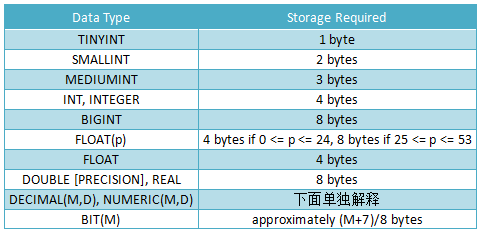
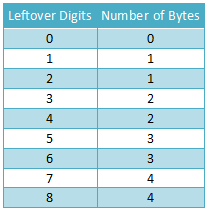
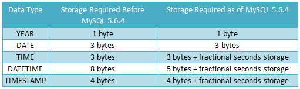
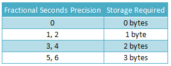
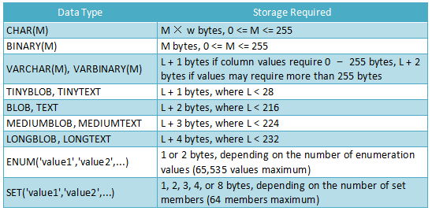

# MySQL 数据类型测试

```sql
-- 数值类型集中测试
create table lms_num(
    t_int int(3) ,
    t_tint tinyint(3),
    t_uint int(3) UNSIGNED,
    t_flo float(10),
    t_dob double,
    t_dci decimal(3,1)
);
insert into lms_num values(1234,1234,1234,1234,1234,1234);
--Out of range value
insert into lms_num values(1234,123,300,1234,1234,12.34);
insert into lms_num values(1234,123,123456,1234,1234,12.34);
--+-------+--------+--------+-------+-------+-------+
--| t_int | t_tint | t_uint | t_flo | t_dob | t_dci |
--+-------+--------+--------+-------+-------+-------+
--|  1234 |    123 |    300 |  1234 |  1234 |  12.3 |
--|  1234 |    123 | 123456 |  1234 |  1234 |  12.3 |
--+-------+--------+--------+-------+-------+-------+
-- !!!!数值类型后面跟随的大小,实际上不影响数值的存取
create table lms_tinum(
    t_t  tinyint,
    t_t1 tinyint(1),
    t_t3 tinyint(3)
);
insert into lms_tinum values(255,255,255);
--Out of range value for column 't_t' at row 1
insert into lms_tinum values(1,1,1);
insert into lms_tinum values(9,9,9);
insert into lms_tinum values(99,99,99);
insert into lms_tinum values(127,127,127);
--+------+------+------+
--| t_t  | t_t1 | t_t3 |
--+------+------+------+
--|    1 |    1 |    1 |
--|    9 |    9 |    9 |
--|   99 |   99 |   99 |
--|  127 |  127 |  127 |
--+------+------+------+

-- 数值类型后面的数字代表显示位数,而实际可存储位数是由数据类型本身决定的
-- tinyint 一个字节 一个字节是8位,1111,1111 - 0111,1111 =>-128 - 127 
create table lms_tiunum(
    t_t  tinyint,
    t_t1 tinyint UNSIGNED
);
INSERT INTO lms_tiunum VALUES(255,255);
-- Out of range value for column 't_t' at row 1
INSERT INTO lms_tiunum VALUES(-128,255);
--+------+------+
--| t_t  | t_t1 |
--+------+------+
--| -128 |  255 |
--+------+------+

-- smallint 两个字节

-- decimal(M,D) 不带任何参数的时候默认为 decimal(10,0)
-- M表示十进制数字总个数,D表示小数点后面的数字的位数
-- 注意: M表示总个数
-- 整数超限会报错,小数超限会舍入
-- FLOAT(M,D),REAL(M,D),DOUBLE PRECISION(M,D)
-- !!!!!!!注意 Double 不能指定长度
-- REAL就是DOUBLE,如果SQL服务器模式包括REAL_AS_FLOAT选项,REAL是FLOAT的同义词而不是DOUBLE的同义词
-- DOUBLE FLOAT 的M和D默认都是0!!!,即除了最大最小值,不限制位数.允许理论极限
-- M 0-255 D 0-30 M>=D 内存中 FLOATR 占4byte DOUBLE占8byte

insert into lms values()

-- 时间类型 DATA,DATATIME,TIMESTAMP
create table lms_date(
    t_dte date,
    t_dtm datetime,
    t_tsp timestamp
)
-- 可以给时间类型互相赋值,不过会产生'舍入'
-- 另有 TIME YEAR

-- 字符类型测试
create table lms_str(
    t_vc5 varchar(5),
    t_vc10 varchar(10),
    t_char char(5)
);
insert into lms_str values('一二三四五六','一二三四五六','一二三四五六');
-- Data too long for column 't_vc5' at row 1
insert into lms_str values('一二三四五','一二三四五六','一二三四五六');
--Data too long for column 't_char' at row 1
insert into lms_str values('一二三四五','一二三四五六','一二三四五');
selsect * from lms_str;

--+-----------------+--------------------+-----------------+
--| t_vc5           | t_vc10             | t_char          |
--+-----------------+--------------------+-----------------+
--| 一二三四五       | 一二三四五六        | 一二三四五       |
--+-----------------+--------------------+-----------------+
insert into lms_str values('123456','123456','123456');
--Data too long for column 't_vc5' at row 1
insert into lms_str values('12345','123456','12345');
select * from lms_str;
--+-----------------+--------------------+-----------------+
--| t_vc5           | t_vc10             | t_char          |
--+-----------------+--------------------+-----------------+
--| 一二三四五      | 一二三四五六         | 一二三四五       |
--| 12345           | 123456             | 12345           |
--+-----------------+--------------------+-----------------+
-- 结论5.7版本中,VARCHAR中不论存储汉字还是普通字符,参数与字符个数是对应的与字符类型五官

-- char 0-255类型右侧填充空格存储,查询时去除空格
-- varchar 0-65535 实际可指定长度与编码和其他字段有关.使用utf-8编码,大小为标准格式的的两倍,能存储的字符为标准的一半,其他字段长度会压缩varchar的长度.varchar只保存需要的字符数,另外加要给字节(超过255长度则使用两个字节)来记录长度.
-- 超出指定长度会报错(严格模式),警告(普通模式)

-- BIT
create table lms_bit(
    t_bit bit(3)
);
-- bit(M) M:1-64 默认为 1 如果存入少于M未 那么 左补0;
-- 如果超过M位 普通模式 裁剪数值 严格模式 报错
insert into lms_bit set t_bit = b'111';
SELECT t_bit+0,BIN(t_bit+0),OCT(t_bit+0),HEX(b+0) FROM lms_bit;

-- BINAEY / VAEBINARY
-- 二进制串 类似 char varchar

-- BLOB / TEXT

-- ENUM()
-- SET()

```

- 各种数据类型占用的存储
  - 数值类型\
  
  - 数值类型中,定点数比较特殊,而且版本有关`使用二进制格式将9个十进制数位压缩为四个字节来表示DECIMAL列值.每个值的整数和分数部分的存储分别确定.每个九位数的倍数需要4个字节,并且"剩余的"位需要4个字节的一部分.`下表给出超出数位的存储需求\
  
  - 时间日期\
  \
  从5.6.4开始,存储需求有所改变,根据精度而定.不确定部分需要的存储如下:\
  \
  比如，TIME(0), TIME(2), TIME(4), 和TIME(6) 分别使用3, 4, 5, 6 bytes
  - 字符串\
  
- 类型的选择\
  为了优化存储,任何情况下均应使用最精确的类型.
- 更多相关内容 http://dev.mysql.com/doc/refman/5.7/en/data-types.html