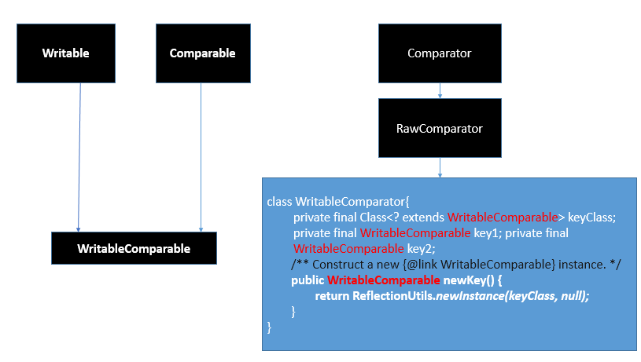
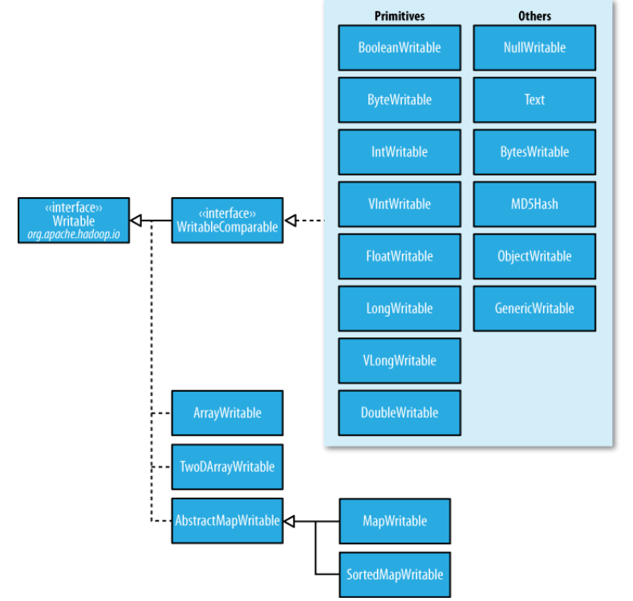
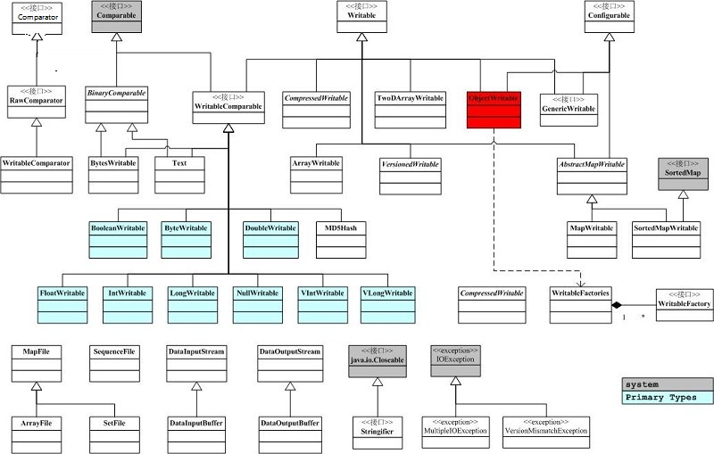
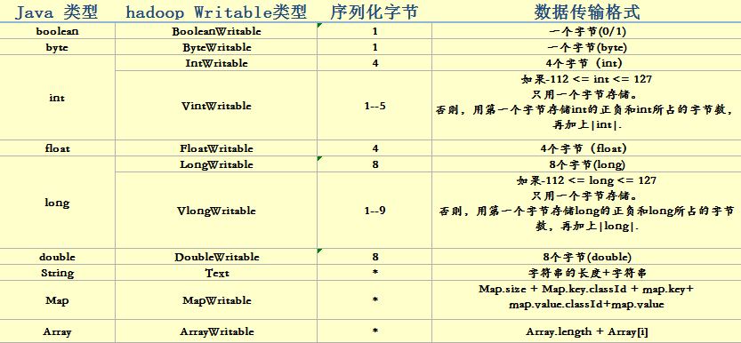

#  几篇关于Hadoop序列化文章的收藏

- 传送门
  - [Hadoop序列化机制及实例](#Hadoop序列化机制及实例)
    - 
    - 原文：[Hadoop序列化机制及实例](https://blog.csdn.net/scgaliguodong123_/article/details/46385761)
  - [hadoop数据类型以及序列化和反序列化](#hadoop数据类型以及序列化和反序列化)
    - 原文：[hadoop数据类型以及序列化和反序列化](https://blog.csdn.net/zhang0558/article/details/53444533)
  - [hadoop深入研究:(十一)——序列化与Writable实现](https://blog.csdn.net/lastsweetop/article/details/9249411)


## <span id="Hadoop序列化机制及实例">Hadoop序列化机制及实例</span>

- 序列化
  - 1、什么是序列化？ 
将结构化对象转换成字节流以便于进行网络传输或写入持久存储的过程。 
  - 2、什么是反序列化？ 
将字节流转换为一系列结构化对象的过程。

序列化用途：
  - 1、作为一种持久化格式。 
  - 2、作为一种通信的数据格式。 
  - 3、作为一种数据拷贝、克隆机制。

Java序列化和反序列化
  - 1、创建一个对象实现了Serializable 
  - 2、序列化：ObjectOutputStream.writeObject(序列化对象) 

  - 3.反序列化：ObjectInputStream.readObject()返回序列化对象 

具体实现，可参考如下文章： 
http://blog.csdn.net/scgaliguodong123_/article/details/45938555

- 为什么Hadoop不直接使用java序列化？
Hadoop的序列化机制与java的序列化机制不同，它将对象序列化到流中，值得一提的是java的序列化机制是不断的创建对象，但在Hadoop的序列化机制中，用户可以复用对象，这样就减少了java对象的分配和回收，提高了应用效率。

- Hadoop序列化

Hadoop的序列化不采用java的序列化，而是实现了自己的序列化机制。 
Hadoop通过Writable接口实现的序列化机制，不过没有提供比较功能，所以和java中的Comparable接口合并，提供一个接口WritableComparable。（自定义比较）

Writable接口提供两个方法(write和readFields)。
```java
package org.apache.hadoop.io;
public interface Writable {
  void write(DataOutput out) throws IOException;
  void readFields(DataInput in) throws IOException;
}
```
需要进行比较的话，要实现WritableComparable接口。
```java
public interface WritableComparable<T> extends Writable, Comparable<T>{
}
```
比如mapreduce中需要对key值进行相应的排序。可参考下面的例子： 
http://blog.csdn.net/scgaliguodong123_/article/details/46010947

- Hadoop提供了几个重要的序列化接口与实现类：

  - 外部集合的比较器
```java
//RawComparator<T>、WritableComparator

package org.apache.hadoop.io;
public interface RawComparator<T> extends Comparator<T> {
  public int compare(byte[] b1, int s1, int l1, byte[] b2, int s2, int l2);
}

public class WritableComparator implements RawComparator {
  private final Class<? extends WritableComparable> keyClass;
  private final WritableComparable key1;
  private final WritableComparable key2;
}
```
  - 实现了WritableComparable接口的类（自定义比较）
  ```java
org.apache.hadoop.io 
接口
WritableComparable<T>
父接口
Comparable<T>, Writable 
基础实现类
BooleanWritable, ByteWritable, ShortWritable,IntWritable,
VIntWritable,LongWritable, VLongWritable , FloatWritable, DoubleWritable
高级实现类
MD5Hash, NullWritable,Text, BytesWritable,ObjectWritable,GenericWritable
```

  - 仅实现了Writable接口的类
```java
org.apache.hadoop.io 
Interface(接口) Writable
All Known Subinterfaces（子接口）: 
Counter, CounterGroup, CounterGroupBase<T>, InputSplit, InputSplitWithLocationInfo, WritableComparable<T> 

仅实现了Writable接口的类
数组：AbstractWritable、TwoDArrayWritable
映射：AbstractMapWritable、MapWritable、SortedMapWritable
```



Writable接口



- Text 
Text是UTF-8的Writable，可以理解为java.lang.String相类似的Writable。Text类替代了UTF-8类。Text是可变的，其值可以通过调用set(）方法改变。最大可以存储2GB的大小。

- NullWritable 
NullWritable是一种特殊的Writable类型，它的序列化长度为零，可以用作占位符。

- BytesWritable 
BytesWritable是一个二进制数据数组封装，序列化格式是一个int字段。 
例如：一个长度为2，值为3和5的字节数组序列后的结果是：
```java
@Test  
public void testByteWritableSerilizedFromat() throws IOException {  
    BytesWritable bytesWritable=new BytesWritable(new byte[]{3,5});  
    byte[] bytes=SerializeUtils.serialize(bytesWritable);
    Assert.assertEquals(StringUtils.byteToHexString(bytes),"000000020305"); //true
}  
```
BytesWritable是可变的，其值可以通过调用set()方法来改变。

- ObjectWritable 
ObjectWritable适用于字段使用多种类型时。

- Writable集合 
  - 1、ArrayWritable和TwoDArrayWritable是针对数组和二维数组。 
  - 2、MapWritable和SortedMapWritable是针对Map和SortMap。

- 自定义Writable
  - 1、实现WritableComparable接口 
  - 2、实现相应的接口方法： 
    - A.write() //将对象转换为字节流并写入到输出流out中。 
    - B.readFileds() //从输入流in中读取字节流并发序列化为对象。 
    - C.compareTo(o) //将this对象和对象o进行比较。 

可参考下面的例子，自定义NewK2类： 
http://blog.csdn.net/scgaliguodong123_/article/details/46010947
```java
package Writable;

import java.io.BufferedInputStream;
import java.io.BufferedOutputStream;
import java.io.DataInput;
import java.io.DataInputStream;
import java.io.DataOutput;
import java.io.DataOutputStream;
import java.io.File;
import java.io.FileInputStream;
import java.io.FileNotFoundException;
import java.io.FileOutputStream;
import java.io.IOException;

import org.apache.hadoop.io.IntWritable;
import org.apache.hadoop.io.Text;
import org.apache.hadoop.io.WritableComparable;

public class DefineWritable {
    public static void main(String[] args) throws IOException {
        Student student = new Student("liguodong", 22, "男");
        BufferedOutputStream bos = new BufferedOutputStream(
                new FileOutputStream(new File("g:/liguodong.txt")));
        DataOutputStream dos = new DataOutputStream(bos);
        student.write(dos);
        dos.flush();
        dos.close();
        bos.close();

        Student student2 = new Student();
        BufferedInputStream bis = new BufferedInputStream(
                new FileInputStream(new File("g:/liguodong.txt")));
        DataInputStream dis = new DataInputStream(bis);
        student2.readFields(dis);
        System.out.println("name="+student2.getName()
                +",age="+student2.getAge()+",sex="+student2.getSex());

    }


}


class Student implements WritableComparable<Student>{
    private Text name = new Text();
    private IntWritable age = new IntWritable();
    private Text sex = new Text();

    public Student() {
    }

    public Student(String name, int age, String sex) {
        super();
        this.name = new Text(name);
        this.age = new IntWritable(age);
        this.sex = new Text(sex);
    }

    public Text getName() {
        return name;
    }

    public void setName(Text name) {
        this.name = name;
    }

    public IntWritable getAge() {
        return age;
    }

    public void setAge(IntWritable age) {
        this.age = age;
    }

    public Text getSex() {
        return sex;
    }

    public void setSex(Text sex) {
        this.sex = sex;
    }

    @Override
    public void write(DataOutput out) throws IOException {
        name.write(out);
        age.write(out);
        sex.write(out);
    }

    @Override
    public void readFields(DataInput in) throws IOException {
        //如果使用Java数据类型，比如String name; 
        //this.name = in.readUTF();只能使用这种类型。
        name.readFields(in);
        age.readFields(in);
        sex.readFields(in);

    }

    @Override
    public int compareTo(Student o) {   
        int result=0;
        if((result=this.name.compareTo(o.getName())) != 0 ){
            return result;
        }
        if((result=this.age.compareTo(o.getAge())) != 0 ){
            return result;
        }
        if((result=this.sex.compareTo(o.getSex())) != 0 ){
            return result;
        }
        return 0;
    }

}
```
运行结果：
```note
name=liguodong,age=22,sex=男
```
Hadoop序列化优势：

  - 1、紧凑：Hadoop中最稀缺的资源是宽带，所以紧凑的序列化机制可以充分的利用宽带。 
  - 2、快速：通信时大量使用序列化机制，因此，需要减少序列化和反序列化的开销。 
  - 3、可扩展：随着通信协议的升级而可升级。 
  - 4、互操作：支持不同开发语言的通信。 
  
`Hadoop1.x 序列化仅满足了紧凑和快速的特点。`

Hadoop序列化的作用

序列化在分布式环境的两大作用：进程间通信，永久存储。 
Hadoop节点间通信。

序列化框架

`Apache Avro `
  - 1、丰富的数据结构类型 
  - 2、快速可压缩的二进制数据形式 
  - 3、存储持久数据的文件容器 
  - 4、远程过程调用RPC 
  - 5、简单的动态语言结合功能，Avro和动态语言结合后，读写数据文件和使用RPC协议都不需要生成代码，而代码生成作为一种可选的优化，只值得在静态类型语言中实现。

`Facebook Thrift` 
  - 1、是一种可伸缩的跨语言服务的发展软件框架。 
  - 2、它结合了功能强大的软件堆栈的代码生成引擎，以建设服务，工作效率和无缝地与C++,C#,.Java,Python和PHP和Ruby结合。 
  - 3、允许定义一个简单的定义文件中的数据类型和服务接口，以作为输入文件，编 
译器生成代码用来方便地生成RPC客户端和服务器通信的无缝跨编程语言。

`Google Protocolbuffer `
PB是Google开源的一种轻量级的结构化数据存储格式，可以用于结构化数据的序 \
列化与反序列化，很适合做数据存储或RPC数据交换格式。 
- 优点： \
与 XML相比，它`更小、更快、也更简单`。你可以定义自己的数据结构，然后使用代码生成器生成的代码来读写这个数据结构。你甚至可以在无需重新部署程序的情况下更新数据结构。`只需`使用 Protobuf 对数据结构进行一次描述，即可利用各种不同语言或从各种不同数据流中对你的结构化数据轻松读写。

它有一个非常棒的特性，即`“向后”兼容性好`，人们不必破坏已部署的、依靠”老”数据格式的程序就可以对数据结构进行升级。这样您的程序就可以不必担心因为消息结构的改变而造成的大规模的代码重构或者迁移的问题。因为添加新的消息中的 field 并不会引起已经发布的程序的任何改变。

`Protocolbuffer语义更清晰，无需类似 XML 解析器的东西`（因为 Protobuf 编译器会将 .proto 文件编译生成对应的数据访问类以对 Protobuf 数据进行序列化、反序列化操作）。使用 Protobuf 无需学习复杂的文档对象模型，Protobuf 的编程模式比较友好，简单易学，同时它拥有良好的文档和示例，对于喜欢简单事物的人们而言，Protobuf 比其他的技术更加有吸引力。

- 不足： \
Protbuf 与 XML 相比也有不足之处。它功能简单，`无法用来表示复杂的概念`。

由于文本`并不适合用来描述数据结构`，所以 Protobuf 也不适合用来对基于文本的标记文档（如 HTML）建模。另外，由于 XML 具有某种程度上的自解释性，它可以被人直接读取编辑，在这一点上 Protobuf 不行，它以二进制的方式存储，除非你有 .proto 定义，否则你没法直接读出 Protobuf 的任何内容。

Hadoop2.X用到的Protocolbuffer 
hadoop-2.6.0-src/hadoop-hdfs-project/hadoop-hdfs/src/main/proto

## hadoop数据类型以及序列化和反序列化

### 序列化和反序列化以及hadoop数据类型
- 1.什么是序列化和反序列化

序列化就是把内存中的对象，转换成 字节序列（或其他数据传输协议）以便于存储（持久化）和网络传输。 
反序列化就是将收到 字节序列（或其他数据传输协议）或者是硬盘的持久化数据，转换成 内存中的对象。

- 2.JDK序列化和反序列化 \
Serialization（序列化）是一种将对象转换为字节流；反序列化deserialization是一种将这些字节流生成一个对象。

  - a）当你想把的内存中的对象保存到一个文件中或者数据库中时候； 
  - b）当你想用套接字在网络上传送对象的时候； 
  - c）当你想通过RMI传输对象的时候；

将需要序列化的类实现Serializable接口就可以了，Serializable接口中没有任何方法，可以理解为一个标记，即表明这个类可以序列化。

- 3.Hadoop序列化和反序列化 \
在hadoop中，hadoop实现了一套自己的序列化框架，hadoop的序列化相对于JDK的序列化来说是比较简洁而且更节省存储空间。在集群中信息的传递主要就是靠这些序列化的字节序列来传递的所以更快速度更小的容量就变得非常地重要了。

- 4.同样的数据在JDK和Hadoop中序列化的字节数比较

Jdk序列化：

People.java（POJO）
```java
package com.seriable;
import java.io.Serializable;
public class People implements Serializable {
    private static final long serialVersionUID = 1L;
    private int age;
    private String name;
    public int getAge() {
        return age;
    }
    public void setAge(int age) {
        this.age = age;
    }
    public String getName() {
        return name;
    }
    public void setName(String name) {
        this.name = name;
    }
    public People(){}
    public People(int age, String name) {
        super();
        this.age = age;
        this.name = name;
    }

}

package com.seriable;

import java.io.ByteArrayOutputStream;
import java.io.IOException;
import java.io.ObjectOutputStream;

public class TestJDKSeriable {

    public static void main(String[] args) {


        try {
            ByteArrayOutputStream baos = new ByteArrayOutputStream();

            ObjectOutputStream oos = new ObjectOutputStream(baos);
            oos.writeObject(new People(19, "zhangsan"));
            System.out.println("字节大小："+baos.size());
            oos.close();
            baos.close();

        } catch (IOException e) {
            e.printStackTrace();
        }   
    }
}
//JDK Serialization
//输出结果：字节大小：89

Hadoop序列化：

PeopleWritable.java（POJO）
```java
package com.seriable;

import java.io.DataInput;
import java.io.DataOutput;
import java.io.IOException;
import org.apache.hadoop.io.IntWritable;
import org.apache.hadoop.io.Text;
import org.apache.hadoop.io.WritableComparable;
public class PeopleWritable implements WritableComparable<PeopleWritable> {
    private IntWritable age;
    private Text name;
    public PeopleWritable(){
    }
    public PeopleWritable(IntWritable age, Text name) {
        super();
        this.age = age;
        this.name = name;
    }
    public IntWritable getAge() {
        return age;
    }
    public void setAge(IntWritable age) {
        this.age = age;
    }
    public Text getName() {
        return name;
    }
    public void setName(Text name) {
        this.name = name;
    }
    public void write(DataOutput out) throws IOException {
        age.write(out);
        name.write(out);
    }
    public void readFields(DataInput in) throws IOException {
        age.readFields(in);
        name.readFields(in);
    }
    public int compareTo(PeopleWritable o) {
        int cmp = age.compareTo(o.getAge());
        if(0 !=cmp)return cmp;
        return name.compareTo(o.getName());
    }
}

package com.seriable;
import java.io.IOException;

import org.apache.hadoop.io.DataOutputBuffer;
import org.apache.hadoop.io.IntWritable;
import org.apache.hadoop.io.Text;
public class TestHadoopSeriable {
    public static void main(String[] args) {

        try {
            DataOutputBuffer dob = new DataOutputBuffer();
            PeopleWritable pw = new PeopleWritable(new IntWritable(19), new Text("zhangsan"));
            pw.write(dob);
            System.out.println("字节大小："+dob.getLength());
            dob.close();

        } catch (IOException e) {
            e.printStackTrace();
        }
    }
}
//Hadoop Serialization
//输出 字节大小：13
```
由此可以看出同样的数据，在Jdk 序列化字节占用了89个，而在hadoop序列化中却只使用了13个字节。大大节省了空间和集群传输效率。

- 5. Hadoop序列化框架

主要有4个接口，分别是Comparator（字节比较器）, Comparable（对象比较）, Writable（序列化）, Configurable（参数配置）。

hadoop的序列化的特点是： 
- 1、节省资源：由于带宽和存储是集群中的最宝贵的资源所以我们必须想法设法缩小传递信息的大小和存储大小，hadoop的序列化就为了更好地坐到这一点而设计的。 
- 2、对象可重用：JDK的反序列化会不断地创建对象，这肯定会造成一定的系统开销，但是在hadoop的反序列化中，能重复的利用一个对象的readField方法来重新产生不同的对象。 
- 3、可扩展性：当前hadoop的序列化有多中选择可以利用实现hadoop的WritableComparable接口。 
也可使用开源的序列化框架protocol Buffers，Avro等框架。我们可以注意到的是hadoop2.X之后是实现一个YARN，所有应用（mapreduce，或者其他spark实时或者离线的计算框架都可以运行在YARN上），YARN还负责对资源的调度等等。`YARN的序列化就是用Google开发的序列化框架protocol Buffers`，proto目前支持支持三种语言C++，java，Python所以RPC这一层我们就可以利用其他语言来做文章，满足其他语言开发者的需求。



Hadoop序列化框架 

- 6. Hadoop Writable框架解析 
序列化和反序列化只是在对象和字节转换的过程中定义了一个数据格式传输协议，只要在序列化和反序列化过程中，严格遵守这个数据格式传输协议就能成功的转换，当然也可以自行完全实现hadoop序列化框架，像avro框架一样。
```java
// ------Writable.java

@InterfaceAudience.Public
@InterfaceStability.Stable
public interface Writable {
  /** 
   * 序列化一个对象，将一个对象按照某个数据传输格式写入到out流中
   * Serialize the fields of this object to <code>out</code>.
   * @throws IOException
   */
  void write(DataOutput out) throws IOException;

  /** 
   * 反序列化，从in流中读入字节，按照某个数据传输格式读出到一个对象中
   * Deserialize the fields of this object from <code>in</code>.  
   * @throws IOException
   */
  void readFields(DataInput in) throws IOException;
}

//-------------Comparable.java

public interface Comparable<T> {

    /**
     * 比较对象，这个在mapreduce中对key的对象进行比较
     * Compares this object with the specified object for order.  Returns a
     * negative integer, zero, or a positive integer as this object is less
     * than, equal to, or greater than the specified object.
     */
    public int compareTo(T o);
}

//-----------RawComparator.java

@InterfaceAudience.Public
@InterfaceStability.Stable
public interface RawComparator<T> extends Comparator<T> {

  /**
   * 在mapreduce，spill过程中，当spill的缓存达到一个值时，会将key-value写入到本地磁盘，并在此过程中sort和patition,如果实现了该接口，就可以直接以序列化的字节的状态比较key，而不需要再临时反序列化成对象再比较，这样提高了效率节省了时间。
   * Compare two objects in binary.
   * @param b1 The first byte array.
   * @param s1 The position index in b1. The object under comparison's starting index.
   * @param l1 The length of the object in b1.
   * @param b2 The second byte array.
   * @param s2 The position index in b2. The object under comparison's starting index.
   * @param l2 The length of the object under comparison in b2.
   * @return An integer result of the comparison.
   */
  public int compare(byte[] b1, int s1, int l1, byte[] b2, int s2, int l2);

}
```

各个数据类型的数据序列化格式 



- 6. 利用hadoop数据传输格式序列化自定义对象

People.java
```java
package com.test;

import java.io.DataInput;
import java.io.DataOutput;
import java.io.IOException;

import org.apache.hadoop.classification.InterfaceAudience;
import org.apache.hadoop.classification.InterfaceStability;
import org.apache.hadoop.io.WritableComparable;
import org.apache.hadoop.io.WritableComparator;
import org.apache.hadoop.io.WritableUtils;


@InterfaceAudience.Public
@InterfaceStability.Stable
public class People implements WritableComparable<People> {

    private String name;
    private int age;
    private int deptId;

    public People() {
    }

    public People(String name, int age, int deptId) {
        super();
        this.name = name;
        this.age = age;
        this.deptId = deptId;
    }

    public void write(DataOutput out) throws IOException {
        WritableUtils.writeVInt(out, this.name.length());

        out.write(this.name.getBytes(), 0, this.name.length());

//      out.writeUTF(name);
        out.writeInt(age);
        out.writeInt(deptId);;
    }

    public void readFields(DataInput in) throws IOException {

        int newLength = WritableUtils.readVInt(in);
        byte[] bytes = new byte[newLength];
        in.readFully(bytes, 0, newLength);
        this.name = new String(bytes, "UTF-8");
        this.age = in.readInt();
        this.deptId = in.readInt();
    }

    public int compareTo(People o) {

        int cmp = this.name.compareTo(o.getName());
        if(cmp !=0)return cmp;
        cmp = this.age - o.getAge();
        if(cmp !=0)return cmp;
        return this.deptId - o.getDeptId();
    }

    @Override
    public boolean equals(Object obj) {
        if(obj instanceof People){
            People people = (People)obj;
            return (this.getName().equals(people.getName()) && this.getAge()==people.getAge()&&this.getDeptId() == people.getDeptId());
        }
        return false;
    }


    @Override
    public String toString() {
        return "People [name=" + name + ", age=" + age +"deptid"+deptId+"]";
    }

    @Override
    public int hashCode() {
        return this.name.hashCode() *163 + this.age+this.deptId;
    }

    public String getName() {
        return name;
    }

    public void setName(String name) {
        this.name = name;
    }

    public int getAge() {
        return age;
    }

    public void setAge(int age) {
        this.age = age;
    }

    public void setDeptId(int deptId) {
        this.deptId = deptId;
    }
    public int getDeptId() {
        return deptId;
    }

    public static class Comparator extends WritableComparator{


        @Override
        public int compare(byte[] b1, int s1, int l1, byte[] b2, int s2, int l2) {

            int firstL1=0 ,firstL2 = 0;
            System.out.println("len:"+b1.length);

            int n1 = WritableUtils.decodeVIntSize(b1[s1]);  //Vint所占字节数
            int n2 = WritableUtils.decodeVIntSize(b2[s2]);  //vint所占字节数

            try {
                firstL1 = WritableComparator.readVInt(b1, s1);  //字符串长度
                firstL2 = WritableComparator.readVInt(b2, s2);  //字符串长度
            } catch (IOException e) {
                e.printStackTrace();
            }

            int cmp = WritableComparator.compareBytes(b1, s1+n1, firstL1,b2, s2+n2, firstL2);

            if(0 != cmp)return cmp;

            int thisValue = readInt(b1, firstL1+n1);
            int thatValue = readInt(b2, firstL2+n2);
            System.out.println("value:"+thisValue);
            cmp = thisValue - thatValue;
            if(0!=cmp)return cmp;

             thisValue = readInt(b1, firstL1+n1+4);
             thatValue = readInt(b2, firstL2+n2+4);
             System.out.println("value:"+thisValue);
            return thisValue - thatValue;
        }
    }

    static{
        WritableComparator.define(People.class, new Comparator());
    }
}
```

MainDept.java 统计部门员工数
```java
package com.test;

import java.io.IOException;

import org.apache.hadoop.conf.Configuration;
import org.apache.hadoop.fs.Path;
import org.apache.hadoop.io.Text;
import org.apache.hadoop.mapreduce.Job;
import org.apache.hadoop.mapreduce.Mapper;
import org.apache.hadoop.mapreduce.Reducer;
import org.apache.hadoop.mapreduce.lib.input.FileInputFormat;
import org.apache.hadoop.mapreduce.lib.output.FileOutputFormat;
import org.apache.hadoop.util.GenericOptionsParser;

public class MainDept {

  public static class TokenizerMapper 
       extends Mapper<Object, Text, Text, People>{

    private Text outKey = null;
    private People people = null;

    public void map(Object key, Text value, Context context
                    ) throws IOException, InterruptedException {

        String[] splits = value.toString().split(" ");
        System.out.println("每次map："+splits.length);
        people = new People(splits[0],Integer.valueOf(splits[1]),Integer.valueOf(splits[2]));
        outKey = new Text(String.valueOf(people.getDeptId()));

        context.write(outKey, people);
//        context.write(word, one);

    }
  }

  public static class IntSumReducer 
       extends Reducer<Text, People,Text,Text> {
//    private Text outKey = new Text();
    private Text result = null;

    public void reduce(Text key, Iterable<People> values, 
                       Context context
                       ) throws IOException, InterruptedException {
      int sum = 0;
      for (People val : values) {
          System.out.println(val.getName());
        sum ++;
      }
      result = new Text();
//      outKey.set(String.valueOf(key)+"部门的人数:");
      result.set(String.valueOf(sum));
      context.write(key, result);
    }
  }

  public static void main(String[] args) throws Exception {
    Configuration conf = new Configuration();
    String[] otherArgs = new GenericOptionsParser(conf, args).getRemainingArgs();
    if (otherArgs.length < 2) {
      System.err.println("Usage: wordcount <in> [<in>...] <out>");
      System.exit(2);
    }
    Job job = Job.getInstance(conf);

    job.setJarByClass(MainDept.class);
    job.setMapperClass(TokenizerMapper.class);
    job.setMapOutputKeyClass(Text.class);
    job.setMapOutputValueClass(People.class);

    //job.setCombinerClass(IntSumReducer.class);


    job.setReducerClass(IntSumReducer.class);

    job.setOutputKeyClass(Text.class);
    job.setOutputValueClass(Text.class);

    for (int i = 0; i < otherArgs.length - 1; ++i) {
      FileInputFormat.addInputPath(job, new Path(otherArgs[i]));
    }
    FileOutputFormat.setOutputPath(job,
      new Path(otherArgs[otherArgs.length - 1]));
    System.exit(job.waitForCompletion(true) ? 0 : 1);
  }
}
```