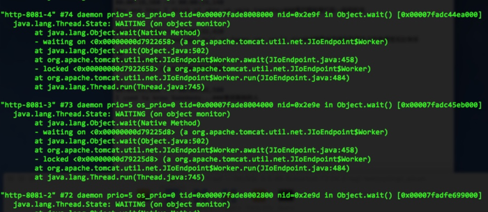
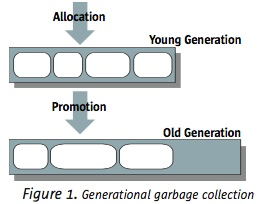
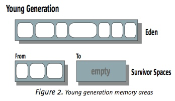
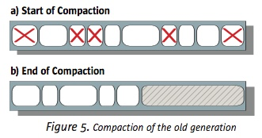
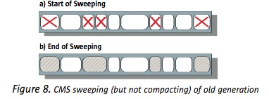
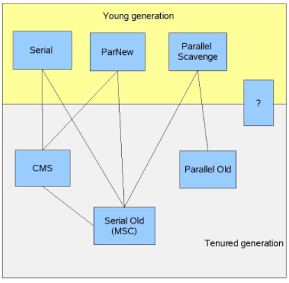
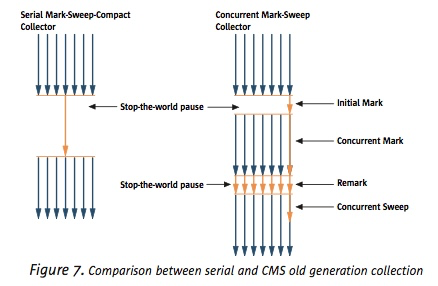
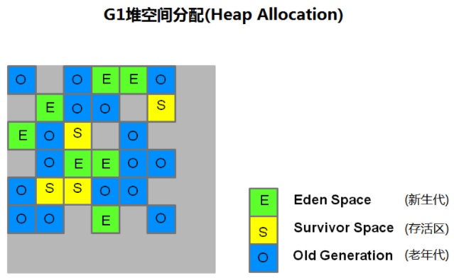
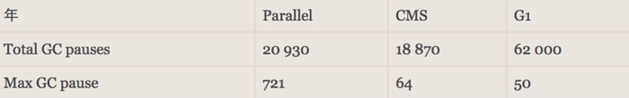

让我们不厌其烦的从内存模型开始说起：作为一般人需要了解到的，JVM的内存区域可以被分为：线程栈，堆，静态方法区（实际上还有更多功能的区域，并且这里说的是JVM的内存区域，实际上Java程序还可以调用native方法使用直接内存）。
本文接下来就重点说说这三个区域。

## 1. 线程栈   - 程序指令以及局部变量表

- 简介

注意这个栈和数据结构中的stack有相似之处，但`并不是用户态`的。准确的讲它压入的每个栈帧（Stack Frame）是`程序指令以及局部变量表`，每个方法调用对应一个栈帧。局部变量表包括各种基本数据类型：boolean、byte、char、short、int、float、long、double以及对象的引用。我们需要注意到`每个线程都有独立的栈并且是互相隔离`的。

- 栈的大小

栈的大小可以受到几个因素影响，一个是jvm参数 -XSS，默认值随着虚拟机版本以及操作系统影响，从Oracle官网上我们可以找到：

In Java SE 6, the default on Sparc is 512k in the 32-bit VM, and 1024k in the 64-bit VM. On x86 Solaris/Linux it is 320k in the 32-bit VM and 1024k in the 64-bit VM.

我们可以认为64位linux默认是1m的样子。
除了JVM设置，我们还可以在创建Thread的时候手工指定大小：

```java
public Thread(ThreadGroup group, Runnable target, String name , long stackSize)
```

栈的大小影响到了线程的最大数量，尤其在大流量的server中，我们很多时候的并发数受到的是线程数的限制，这时候需要了解限制在哪里。
第一个限制在操作系统，以ubuntu为例，/proc/sys/kernel/threads-max 和/proc/sys/vm/max_map_count 定义了总的最大线程数（根据资料windows总的来说线程数会更少）和mmap这个system_call的最大数量（也就是从内存方面限制了线程数）
第二个限制自然是在JVM，理论上我们能分配给线程的内存除以单个线程占用的内存就是最大线程数。所以说对Java进程来讲，既然分配给了堆，栈和静态方法区（或叫永久代，perm区），我们可以大致认为

线程数 = （系统空闲内存-堆内存（-Xms, -Xmx）- perm区内存(-XX:MaxPermSize)) / 线程栈大小(-Xss)
注意这只是帮助我们树立一个概念，实际上还有许多因素影响。

栈的大小还影响到一个就是如果单个栈超过了这个大小，就会抛出StackOverflowError，一般来说递归调用是常见的原因。

- 如何查看线程栈

使用命令 jstack <pid>可以列出当前pid对应jvm的所有线程栈描述，描述主要包括了每个线程的状态以及堆栈内各栈帧的方法全限定名，代码位置。注意这只是为了可阅读性，并不是说栈里存着的就是这些字符串。
截取一段tomcat的jstack输出（线程方面的知识可以参考另一篇拙作《Java多线程你只需要看这一篇就够了》，本文不再赘述）：

tomcat的jstack输出片段



2.堆和垃圾收集
堆的结构
对于大多数应用来说，Java 堆（Java Heap）是Java 虚拟机所管理的内存中最大的一块。Java 堆是被所有线程共享的一块内存区域，在虚拟机启动时创建。此内存区域的唯一目的就是存放对象实例，几乎所有的对象实例都在这里分配内存。



分代的内存管理

首先堆可以划分为新生代和老年代。



新生代

然后新生代又可以划分为一个`Eden区`和两个`Survivor（幸存）区`。
按照规定，新对象会首先分配在Eden中（如果对象过大，比如大数组，将会直接放到老年代）。在GC中，Eden中的对象会被移动到survivor中，直至对象满足一定的年纪（定义为熬过minor GC的次数），会被移动到老年代。

新生代 ( Young ) 与老年代 ( Old ) 的比例的值为 1:2 ( 该值可以通过参数 –XX:NewRatio 来指定 )
默认的，Eden : from : to = 8 : 1 : 1 ( 可以通过参数 –XX:SurvivorRatio 来设定 )，即： Eden = 8/10 的新生代空间大小，from = to = 1/10 的新生代空间大小。

## 然后讲讲垃圾收集

堆内存和垃圾收集是密不可分的两个主题，讲垃圾收集的资料很多，但总的来说讲的比较混乱，在这里我试图从一个系统的视角展示垃圾收集。

- 垃圾收集的意义

  - 垃圾收集的出现解放了C++中手工对内存进行管理的大量繁杂工作，手工malloc,free不仅增加程序复杂度，还增加了bug数量。
  - 分代收集。即在新生代和老生代使用不同的收集方式。在垃圾收集上，目标主要有：加大系统吞吐量（减少总垃圾收集的资源消耗）；减少最大STW（Stop-The-World）时间；减少总STW时间。不同的系统需要不同的达成目标。而分代这一里程碑式的进步首先极大减少了STW，然后可以自由组合来达到预定目标。

- 可达性检测

  - 引用计数：一种在jdk1.2之前被使用的垃圾收集算法，我们需要了解其思想。其主要思想就是维护一个counter，当counter为0的时候认为对象没有引用，可以被回收。缺点是无法处理循环引用。目前iOS开发中的一个常见技术ARC（Automatic Reference Counting）也是采用类似的思路。在当前的JVM中应该是没有被使用的。
  - 根搜算法：思想是从gc root根据引用关系来遍历整个堆并作标记，称之为mark，等会在具体收集器中介绍并行标记和单线程标记。之后回收掉未被mark的对象，好处是解决了循环依赖这种『孤岛效应』。这里的gc root主要指：
    - a.虚拟机栈(栈桢中的本地变量表)中的引用的对象
    - b.方法区中的类静态属性引用的对象
    - c.方法区中的常量引用的对象
    - d.本地方法栈中JNI的引用的对象

## 整理策略

- 复制：主要用在新生代的回收上，通过from区和to区的来回拷贝。需要特定的结构（也就是Young区现在的结构）来支持，对于新生成的对象来说，频繁的去复制可以最快的找到那些不用的对象并回收掉空间。所以说在JVM里YGC一定承担了最大量的垃圾清除任务。
- 标记清除/标记整理：主要用在老生代回收上，通过根搜的标记然后清除或者整理掉不需要的对象。



整理的过程



清除的过程

这里可以看到清除会产生碎片空间，对内存利用不是很好，但不是说整理优于清除，毕竟整理会更慢。比如CMSGC就是使用清除而不是整理的。

>思考一下复制和标记清除/整理的区别，为什么新生代要用复制？因为对新生代来讲，一次垃圾收集要回收掉绝大部分对象，我们通过冗余空间的办法来加速整理过程（不冗余空间的整理操作要做swap，而冗余只需要做move）。同时可以记录下每个对象的『年龄』从而优化『晋升』操作使得中年对象不被错误放到老年代。而反过来老年代偏稳定，我们哪怕是用清除，也不会产生太多的碎片，并且整理的代价也并不会太大。

- 具体的垃圾收集器
  - 新生代收集器：有Serial收集器、ParNew收集器、Parallel Scavenge收集器
  - 老生代收集器：Serial Old收集器、Parallel Old收集器、CMS收集器、G1收集器
  

垃圾收集器大家庭

以上所有的垃圾收集器都会发生STW，只不过FGC的STW时间更长。

几款重点研究的垃圾收集器：

- CMSGC：
CMS(Concurrent Mark-Sweep)是以牺牲吞吐量为代价来获得最短回收停顿时间的垃圾回收器。对于要求服务器响应速度的应用上，这种垃圾回收器非常适合，因此我们又叫它低延迟垃圾收集器。在启动JVM参数加上-XX:+UseConcMarkSweepGC ，这个参数表示对于老年代的回收采用CMS，注意此时新生代默认使用的是ParNew。CMS采用的基础算法是：标记—清除。



MSCGC vs CMSGC

和普通序列化整理（MSC）区别在于有三个mark阶段（实际上还有个预清理过程，但对于解释清楚CMSGC没有帮助就忽略了）。CMSGC的精髓在于因为做到了不STW的情况下进行mark，我们得到了更短的总STW时间，代价是因为并行mark产生了『脏数据』即在mark的同时又生成了需要mark的对象，我们必须再进行一次STW，并收尾（remark）。
同时，我们要注意到得到更短的STW的同时，我们牺牲了系统吞吐量，CMSGC总吞吐量比ParOld要更低。

- G1GC
作为最新的垃圾收集器，有可能在jdk9中成为默认的垃圾收集器。
主要思路是将新生代老生代进一步分为多个region，每次gc可以针对部分region而不是整个堆内存。由此可以降低stw的单次最长时间，代价是可能在总时间上会更高。
G1GC让系统在整体吞吐量略降的情况下变得更加平滑稳定。



为了比较ParOld,CMSGC和G1GC，附上从某篇博客上转载的评测截图：



## 静态方法区

最后讲一讲静态方法区，又称为永久代（Perm Generation）。它用于存储已被虚拟机加载的类信息、常量、静态变量、即时编译器编译后的代码等数据。
常见的JVM配置包括：

-XX:MaxPermSize=512m
我们有时候会看到java进程报一个错误类似

Exception in thread "State Saver" java.lang.OutOfMemoryError: PermGen space
说明我们此时要调整配置了，或者说代码中有一些bug导致大量的perm区被占用，可能是用到了太多的静态变量（一般怀疑map）或者说用到ASM框架导致产生了大量的类信息。

## 附录

- 1.JVM的GC日志的主要参数

-XX:+PrintGC 输出GC日志
-XX:+PrintGCDetails 输出GC的详细日志
-XX:+PrintGCTimeStamps 输出GC的时间戳（以基准时间的形式）
-XX:+PrintGCDateStamps 输出GC的时间戳（以日期的形式，如 2013-05-04T21:53:59.234+0800）
-XX:+PrintHeapAtGC 在进行GC的前后打印出堆的信息
-XX:+PrintGCApplicationStoppedTime // 输出GC造成应用暂停的时间
-Xloggc:../logs/gc.log 日志文件的输出路径
-XX:+HeapDumpOnOutOfMemoryError //发生OOM的时候自动dump堆栈方便分析

- 2.如何看垃圾收集策略

jmap -heap <pid>

- 3.如何实时看堆内存的使用情况

jstat -gcutil [pid] [interval] //实时打印gc情况以及各代内存占用比例
jmap -dump:format=b,file=f1 <pid> //dump内存到二进制文件
jmap -histo [pid] //按占大小倒序列出内存中的实例类型

- 4.关于晋升到老年代的条件

对象有两种可能会进入old区：

存活对象过多。在s1和s2都已经溢出了。如果从eden迁往survior区时，发现放不下，则直接进入 old Gen
从eden到s区来回拷贝次数达到一定的数量，总没有回收掉，进入old区。(从eden到survior1迁到，引用持有中，s1中放不下新迁对象，则清理s1,存活对象，晋升入s2;再下次或继续迁移，就把s2中的。准备说，可能是，这些个对象从s1<->s2来回拷贝一定次数后，会进入old Gen)。这块Servivor Space 调整合适的存活次数 Threshold 通过-XX:MaxTenuringThreshold。但也只是一个建议，最终仍由虚拟机决定

作者：纳达丶无忌
链接：https://www.jianshu.com/p/c9ac99b87d56
來源：简书
著作权归作者所有。商业转载请联系作者获得授权，非商业转载请注明出处。