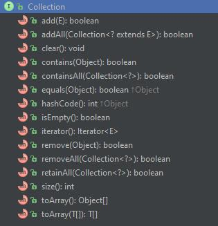

```note
我的
collection实际上是已经经过实践检验的
数据结构和相关操作的一个框架
```

# 什么是集合？

- 集合，或者叫容器，是一个包含多个元素的对象；
- 集合可以对数据进行存储，检索，操作；
- 它们可以把许多个体组织成一个整体： 
  - 比如一副扑克牌（许多牌组成的集合）;
  - 比如一个电话本（许多姓名和号码的映射）。

## 什么是集合框架？

集合框架是一个代表、操作集合的统一架构。所有的集合框架都包含以下几点：

- 接口：表示集合的抽象数据类型。接口允许我们操作集合时不必关注具体实现，从而达到“多态”。在面向对象编程语言中，接口通常用来形成规范。
- 实现类：集合接口的具体实现，是重用性很高的数据结构。
- 算法：用来根据需要对实体类中的对象进行计算，比如查找，排序。 
  - 同一种算法可以对不同的集合实现类进行计算，这是利用了“多态”。
  - 重用性很高。

不仅 Java，其他语言也有一些集合框架，比如 C++ 的 STL（标准模板库），Smalltalk 的集合层次结构。不同于他们陡峭的学习曲线，Java 集合框架设计的更加合理，学习起来更加轻松。

## 使用集合框架有什么好处呢?

使用 Java 集合框架能有以下几点好处：
- 编码更轻松：Java 集合框架为我们提供了方便使用的数据结构和算法，让我们不用从头造轮子，直接操心上层业务就好了。
- 代码质量更上一层楼：Java 集合框架经过几次升级迭代，数据结构和算法的性能已经优化地很棒了。由于是针对接口编程，不同实现类可以轻易互相替换。这么优雅的设计，省下你自己磨练多少工夫，恩？！
- 减少学习新 API 的成本：过去每个集合 API 下还有子 API 来对 API 进行操作，你得学好几层才能知道怎么使用，而且还容易出错。现在好了!有了标准的 Java 集合框架，每个 API 都继承自己顶层 API，只负责具体实现，一口气学 5 个集合，不费劲！
- 照猫画虎也容易多了：由于顶层接口已经把基础方法都定义好了，你只要实现接口，把具体实现方法填好，再也不用操心架构设计。

## Java 集合框架主要结构图


如上图所示，Java 的集合主要按两种接口分类：Collection, Map.
Collection 接口
Collection 作为集合的一个根接口，定义了一组对象和它的子类需要实现的 15 个方法：

>在JDK 1.8中 有 18个方法了



- 对集合的基础操作，比如 :
  - int size() 
获取元素个数
  - boolean isEmpty()
是否个数为 0
  - boolean contains(Object element)
是否包含指定元素
  - boolean add(E element)
添加元素，成功时返回 true
  - boolean remove(Object element)
删除元素，成功时返回 true
  - Iterator<E> iterator()
获取迭代器
- 还有一些操作整个集合的方法，比如 :
  - boolean containsAll(Collection<?> c) 
是否包含指定集合 c 的全部元素
  - boolean addAll(Collection<? extends E> c) 
添加集合 c 中所有的元素到本集合中，如果集合有改变就返回 true
  - boolean removeAll(Collection<?> c) 
删除本集合中和 c 集合中一致的元素，如果集合有改变就返回 true
  - boolean retainAll(Collection<?> c) 
保留本集合中 c 集合中两者共有的，如果集合有改变就返回 true
  - void clear() 
删除所有元素
- 还有对数组操作的方法：
  - Object[] toArray() 
返回一个包含集合中所有元素的数组
  - <T> T[] toArray(T[] a) 

- 返回一个包含集合中所有元素的数组，运行时根据集合元素的类型指定数组的类型
在 JDK 8 以后，Collection 接口还提供了从集合获取连续的或者并行流：
  - Stream<E> stream()
  - Stream<E> parallelStream()

- 遍历 Collection 的几种方式：
  - for-each语法

```java
Collection<Person> persons = new ArrayList<Person>();
for (Person person : persons) { 
    System.out.println(person.name);  
}  
```

  - 使用 Iterator 迭代器

```java
Collection<Person> persons = new ArrayList<Person>();
Iterator iterator = persons.iterator();
while (iterator.hasNext) { 
    System.out.println(iterator.next());  
}  
```

  - 使用 aggregate operations 聚合操作

```java
Collection<Person> persons = new ArrayList<Person>();
persons
    .stream()
    .forEach(new Consumer<Person>() {  
        @Override  
        public void accept(Person person) {  
            System.out.println(person.name);  
        }  
}); 
```

## Aggregate Operations 聚合操作

在 JDK 8 以后，推荐使用聚合操作对一个集合进行操作。聚合操作通常和 lambda 表达式结合使用，让代码看起来更简洁（因此可能更难理解）。下面举几个简单的栗子：

- 1.使用流来遍历一个 ShapesCollection，然后输出红色的元素：

```java
myShapesCollection.stream()
    .filter(e -> e.getColor() == Color.RED)
    .forEach(e -> System.out.println(e.getName()));
```

- 2.你还可以获取一个并行流（parallelStream），当集合元素很多时使用并发可以提高效率：

```java
myShapesCollection.parallelStream()
    .filter(e -> e.getColor() == Color.RED)
    .forEach(e -> System.out.println(e.getName()));                         
```

- 3.聚合操作还有很多操作集合的方法，比如说你想把 Collection 中的元素都转成 String 对象，然后把它们 连起来：

```java
String joined = elements.stream()
    .map(Object::toString)
    .collect(Collectors.joining(", "));
```

看起来是不是非常简洁呢！

https://docs.oracle.com/javase/tutorial/collections/streams/index.html

聚合操作还有很多功能，这里仅做介绍，想要了解更多可以查看Aggregate Operations 官方指引。

## Iterator 迭代器

在`Java 集合解析：Iterator` 和 `Java 集合解析：ListIterator` 介绍了 Collection 的迭代器 Iterator 以及用于 List 的迭代器 ListIterator。

结合 Collection 和 Iterator 可以实现一些复用性很强的方法，比如这样：

```java
public static void filter(Collection<?> c) {
    for (Iterator<?> it = c.iterator(); it.hasNext(); )
        if (!condition(it.next()))
            it.remove();
}
```

这个 filter 方法是多态的，可以用于所有 Collection 的子类、实现类。 这个例子说明了`使用 Java 集合框架我们可以很随便就写出 “优雅，可拓展，复用性强” 的代码~`

总结

Collection 接口是类集框架的基础之一。
它创建所有类集都将拥有的 15 个核心方法。
因为几乎所有集合类集都实现了 Collection接口，所以熟悉它对于清楚地理解框架是必要的。
接下来将逐步了解集合框架的各个子接口及实现类。

感谢 密哥 提醒，parallel 应该是并行，而不是并发。

并发与并行的概念区别还是挺大的。

```note
并行”是指无论从微观还是宏观，二者都是一起执行的，就好像两个人各拿一把铁锨在挖坑，一小时后，每人一个大坑。 
而“并发”在微观上不是同时执行的，只是把时间分成若干段，使多个进程快速交替的执行，从宏观外来看，好像是这些进程都在执行，这就好像两个人用同一把铁锨，轮流挖坑，一小时后，两个人各挖一个小一点的坑，要想挖两个大一点得坑，一定会用两个小时。 
从以上本质不难看出，“并发”执行，在多个进程存在资源冲突时，并没有从根本提高执行效率。 
http://zhidao.baidu.com/link?url=1L6YSAULAhjLH4ZYfO0yCbKlvo8DJeQMtCmCLKYpENStbpxNDiFCwaJf4iZaNDr7cho37GctXOddek3LhrO3_K
```

这里 看到的一幅生动形象图：
这里写图片描述

Thanks
https://docs.oracle.com/javase/tutorial/collections/intro/index.html

https://docs.oracle.com/javase/tutorial/collections/interfaces/collection.html

http://joearms.github.io/2013/04/05/concurrent-and-parallel-programming.html