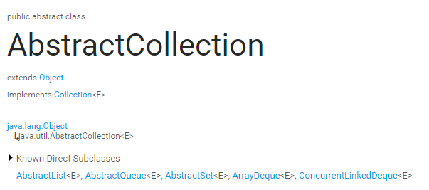
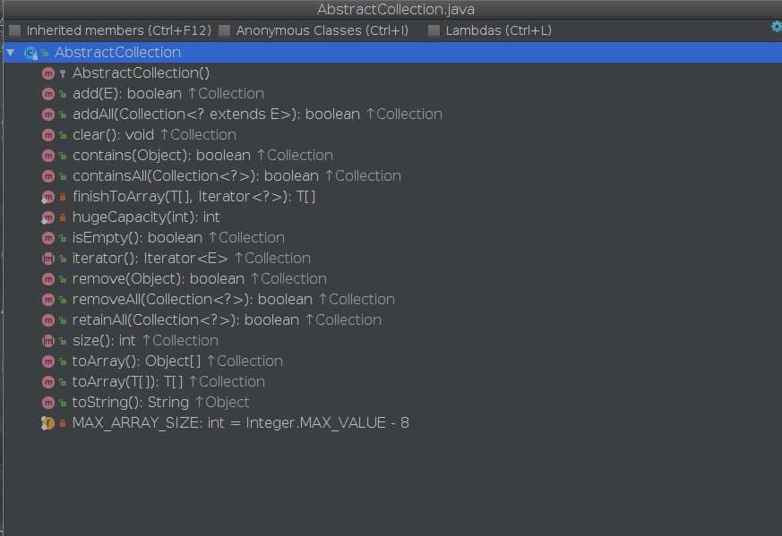
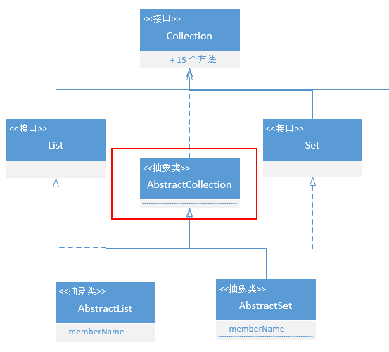

# AbstractCollection





## 什么是 AbstractCollection

AbstractCollection 是 Java 集合框架中 Collection 接口 的一个直接实现类， Collection 下的大多数子类都继承 AbstractCollection ，比如 List 的实现类, Set的实现类。



它实现了一些方法，也定义了几个抽象方法留给子类实现，因此它是一个抽象类。

## 抽象方法

- public abstract Iterator<E> iterator();
- public abstract int size();

子类必须以自己的方式实现这两个方法。除此外，AbstractCollection 中默认不支持添加单个元素，如果直接调用 add(E) 方法，会报错：

```java
// TODO : 必须在 实现类里面实现 add 方法！！！！
public boolean add(E object) {
    throw new UnsupportedOperationException();
}
```

因此，如果子类是可添加的数据结构，需要自己实现 add(E) 方法。

## 实现的方法

1.addAll() 添加一个集合内的全部元素:（这个是旧版的，jdk1.8 里面用的 增强 for 循环 来完成这个内容）

```java
// 旧版
public boolean addAll(Collection<? extends E> collection) {
    boolean result = false;
    //获取待添加对象的迭代器
    Iterator<? extends E> it = collection.iterator();
    while (it.hasNext()) {
        //挨个遍历，调用 add() 方法添加，因此如果没有实现 add(E) 方法，addAll() 也不能用
        if (add(it.next())) {
            result = true;
        }
    }
    return result;
}
// 新版
public boolean addAll(Collection<? extends E> c) {
    boolean modified = false;
    // 这里直接用 增强 for循环，而不是 iterator
    for (E e : c)
        if (add(e))
            modified = true;
    return modified;
}
```

2.clear() 删除所有元素：

```java
public void clear() {
    //获取子类实现的迭代器，挨个遍历，删除
    Iterator<E> it = iterator();
    //在这个抽象类里面  iterator 是个抽象方法，是需要 实现类来实现的
    while (it.hasNext()) {
        it.next();
        //单线程使用迭代器的 remove() 方法不会导致 fail-fast
        it.remove();
    }
}
```

3.contains() 是否包含某个元素：

```java
public boolean contains(Object object) {
    //获取子类实现的迭代器，挨个遍历，比较
    Iterator<E> it = iterator();
    if (object != null) {
        while (it.hasNext()) {
            //这个元素的类 需要重写 equals() 方法，不然结果够呛
            if (object.equals(it.next())) {
                return true;
            }
        }
    } else {
        //目标元素是空也能查找，说明 AbstractCollection 默认是支持元素为 null 的
        while (it.hasNext()) {
            if (it.next() == null) {
                return true;
            }
        }
    }
    return false;
}
```

4.containsAll() 是否包含指定集合中的全部元素:

```java
public boolean containsAll(Collection<?> collection) {
    Iterator<?> it = collection.iterator();
    //挨个遍历指定集合
    while (it.hasNext()) {
        //contails 里也是遍历，双重循环，O(n^2)
        if (!contains(it.next())) {
            return false;
        }
    }
    return true;
}
```

5.isEmpty() 是否为空:

```java
public boolean isEmpty() {
    //调用子类实现的 size() 方法
    return size() == 0;
}
```

6.remove() 删除某个元素:

```java
public boolean remove(Object object) {
    //获取子类实现的 迭代器
    Iterator<?> it = iterator();
    if (object != null) {
        while (it.hasNext()) {
            if (object.equals(it.next())) {
                it.remove();
                return true;
            }
        }
    } else {
        while (it.hasNext()) {
            if (it.next() == null) {
                it.remove();
                return true;
            }
        }
    }
    return false;
}
```

受不了了，又是 if-else，直接写成这样看着不是更舒服吗：

```java
public boolean remove(Object object) {
    Iterator<?> it = iterator();
    while (it.hasNext()) {
       if (object != null ? object.equals(it.next()) : it.next() == null) {
           it.remove();
           return true;
        }
    }
    return false;
}
```

7.removeAll() 删除指定集合中包含在本集合的元素：

```java
public boolean removeAll(Collection<?> collection) {
    boolean result = false;
    Iterator<?> it = iterator();
    while (it.hasNext()) {
        //双重循环
        if (collection.contains(it.next())) {
            it.remove();
            result = true;
        }
    }
    return result;
}
```

8.retainAll() 保留共有的，删除指定集合中不共有的：

```java
public boolean retainAll(Collection<?> collection) {
    boolean result = false;
    Iterator<?> it = iterator();
    while (it.hasNext()) {
        //排除异己，不在我集合中的统统 886
        if (!collection.contains(it.next())) {
            it.remove();
            result = true;
        }
    }
    return result;
}
```

9.toArray(), toArray(T[] contents) 转换成数组：

```java
public Object[] toArray() {
//把集合转换成 ArrayList，然后再调用 ArrayList.toArray() 
    return toArrayList().toArray();
}

public <T> T[] toArray(T[] contents) {
    return toArrayList().toArray(contents);
}

@SuppressWarnings("unchecked")
private ArrayList<Object> toArrayList() {
    ArrayList<Object> result = new ArrayList<Object>(size());
    for (E entry : this) {
        result.add(entry);
    }
    return result;
}
```
ArrayList, 集合与数组的桥梁。

10.toString() 把内容转换成一个 String 进行展示:

```java
public String toString() {
    if (isEmpty()) {
        return "[]";
    }
    //注意默认容量是 size() 的 16 倍，为什么是 16 呢?
    StringBuilder buffer = new StringBuilder(size() * 16);
    buffer.append('[');
    //仍旧用到了迭代器
    Iterator<?> it = iterator();
    while (it.hasNext()) {
        Object next = it.next();
        if (next != this) {
            //这个 Object 也得重写 toString() 方法，不然不能输出内容
            buffer.append(next);
        } else {
            buffer.append("(this Collection)");
        }
        if (it.hasNext()) {
            buffer.append(", ");
        }
    }
    buffer.append(']');
    return buffer.toString();
}
```

我们之所以可以使用 System.out.print() 直接输出集合的全部内容，而不用挨个遍历输出，全都是 AbstractCollection 的功劳！

```java
    List list = new LinkedList();
    System.out.println(list);
```

其他

1.AbstractCollection 默认的构造函数是 protected:

```java
/**
 * Sole constructor.  (For invocation by subclass constructors, typically
 * implicit.)
 */
protected AbstractCollection() {
}
```

因此，官方推荐子类自己创建一个 无参构造函数：

```note
The programmer should generally provide a void (no argument) and Collection constructor, as per the recommendation in the Collection interface specification.
```

2.AbstractCollection 的 add(E) 方法默认是抛出异常，这样会不会容易导致问题？为什么不定义为抽象方法？

答案译自 stackoverflow :

- 如果你想修改一个不可变的集合时，抛出 UnsupportedOperationException 是标准的行为，比如 当你用 Collections.unmodifiableXXX() 方法对某个集合进行处理后，再调用这个集合的 修改方法（add,remove,set…），都会报这个错；
- 因此 AbstractCollection.add(E) 抛出这个错误是准从标准；

那为什么会有这个标准呢？

在 Java 集合总，很多方法都提供了有用的默认行为，比如：

- Iterator.remove()
- AbstractList.add(int, E)
- AbstractList.set(int, E)
- AbstractList.remove(int)
- AbstractMap.put(K, V)
- AbstractMap.SimpleImmutableEntry.setValue(V)

而之所以没有定义为 抽象方法，是因为可能有很多地方用不到这个方法，用不到还必须实现，这岂不是让人很困惑么。

个人觉得原因跟和设计模式中的 `接口隔离原则` 有些相似：

`不要给客户端暴露不需要的方法。`