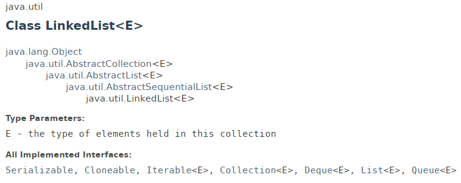
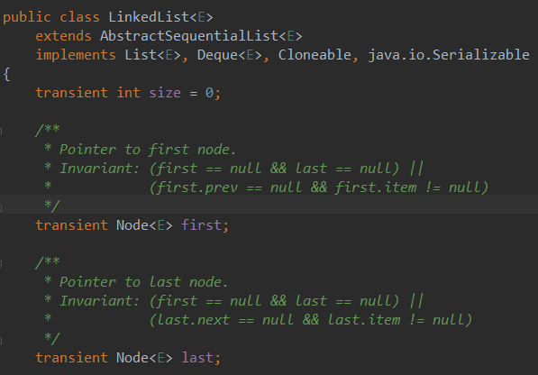
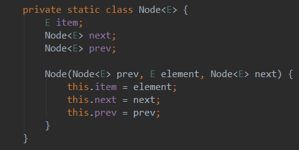
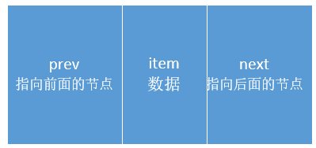
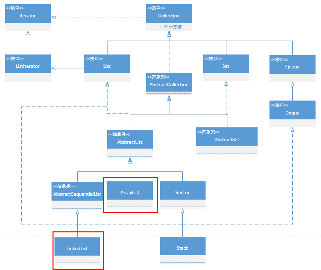

# LinkedList

日常开发中，保存一组数据使用的最多的就是 ArrayList， 其次就是 LinkedList 了。
我们知道 ArrayList 是以数组实现的，遍历时很快，但是插入、删除时都需要移动后面的元素，效率略差些。
而LinkedList 是以链表实现的，插入、删除时只需要改变前后两个节点指针指向即可，省事不少。
今天来看下 LinkedList 源码。

```note
LinkedList 在内部有一个 Node 内部类，这个Node内部类是基础
其他操作，例如 添加操作，就是 新建一个 Node，把这个Node 和之前的连接起来
```

#

LinkedList 继承结构



LinkedList 继承自 AbstractSequentialList 接口，同时了还实现了 Deque, Queue(Deque 集成自Queue) 接口。
LinkedList 双向链表实现



可以看到， LinkedList 的成员变量只有三个：

- 头节点 first（）
- 尾节点 last
- 容量 size

节点是一个双向节点： 



用一副图表示节点：



## LinkedList 的方法

- 1.关键的几个`内部方法`（头部添加删除，尾部添加删除，获取指定节点，指定节点的添加删除）

```java
//插入到头部
private void linkFirst(E e) {
    //获取头节点
    final Node<E> f = first;
    //新建一个节点，尾部指向之前的 头元素 first
    final Node<E> newNode = new Node<>(null, e, f);
    //first 指向新建的节点
    first = newNode;
    //如果之前是空链表，新建的节点 也是最后一个节点
    if (f == null)
        last = newNode;
    else
        //原来的第一个节点（现在的第二个）头部指向新建的头结点
        f.prev = newNode;
    size++;
    modCount++;
}

//插入到尾部
void linkLast(E e) {
    //获取尾部节点
    final Node<E> l = last;
    //新建一个节点，头部指向之前的 尾节点 last
    final Node<E> newNode = new Node<>(l, e, null);
    //last 指向新建的节点
    last = newNode;
    //如果之前是空链表， 新建的节点也是第一个节点
    if (l == null)
        first = newNode;
    else
        //原来的尾节点尾部指向新建的尾节点
        l.next = newNode;
    size++;
    modCount++;
}

//在 指定节点 前插入一个元素，这里假设 指定节点不为 null
void linkBefore(E e, Node<E> succ) {
    // 获取指定节点 succ 前面的一个节点
    final Node<E> pred = succ.prev;
    //新建一个节点，头部指向 succ 前面的节点，尾部指向 succ 节点，数据为 e
    final Node<E> newNode = new Node<>(pred, e, succ);
    //让 succ 节点头部指向 新建的节点
    succ.prev = newNode;
    //如果 succ 前面的节点为空，说明 succ 就是第一个节点，那现在新建的节点就变成第一个节点了
    if (pred == null)
        first = newNode;
    else
        //如果前面有节点，让前面的节点
        pred.next = newNode;
    size++;
    modCount++;
}

//删除头节点并返回该节点上的数据，假设不为 null
private E unlinkFirst(Node<E> f) {
    // 获取数据，一会儿返回
    final E element = f.item;
    //获取头节点后面一个节点
    final Node<E> next = f.next;
    //使头节点上数据为空，尾部指向空
    f.item = null;
    f.next = null; // help GC
    //现在头节点后边的节点变成第一个了
    first = next;
    //如果头节点后面的节点为 null，说明移除这个节点后，链表里没节点了
    if (next == null)
        last = null;
    else
        next.prev = null;
    size--;
    modCount++;
    return element;
}

//删除尾部节点并返回，假设不为空
private E unlinkLast(Node<E> l) {

    final E element = l.item;
    //获取倒数第二个节点
    final Node<E> prev = l.prev;
    //尾节点数据、尾指针置为空
    l.item = null;
    l.prev = null; // help GC
    //现在倒数第二变成倒数第一了
    last = prev;
    if (prev == null)
        first = null;
    else
        prev.next = null;
    size--;
    modCount++;
    return element;
}

//删除某个指定节点
E unlink(Node<E> x) {
    // 假设 x 不为空
    final E element = x.item;
    //获取指定节点前面、后面的节点
    final Node<E> next = x.next;
    final Node<E> prev = x.prev;

    //如果前面没有节点，说明 x 是第一个
    if (prev == null) {
        first = next;
    } else {
        //前面有节点，让前面节点跨过 x 直接指向 x 后面的节点
        prev.next = next;
        x.prev = null;
    }

    //如果后面没有节点，说 x 是最后一个节点
    if (next == null) {
        last = prev;
    } else {
        //后面有节点，让后面的节点指向 x 前面的
        next.prev = prev;
        x.next = null;
    }

    x.item = null;
    size--;
    modCount++;
    return element;
}

//获取指定位置的节点
Node<E> node(int index) {
    // 假设指定位置有元素

    //二分一下，如果小于 size 的一半，从头开始遍历
    if (index < (size >> 1)) {
        Node<E> x = first;
        for (int i = 0; i < index; i++)
            x = x.next;
        return x;
    } else {
        //大于 size 一半，从尾部倒着遍历
        Node<E> x = last;
        for (int i = size - 1; i > index; i--)
            x = x.prev;
        return x;
    }
}
```

这些内部方法实现了对 链表节点的 基本修改操作，每次操作都只要修改前后节点的指针，时间复杂度为 O(1)。

很多公开方法都是通过调用它们实现的。

- 2.公开的添加方法：

```java
//普通的在尾部添加元素
public boolean add(E e) {
    linkLast(e);
    return true;
}

//在指定位置添加元素
public void add(int index, E element) {
    checkPositionIndex(index);
    //指定位置也有可能是在尾部
    if (index == size)
        linkLast(element);
    else
        linkBefore(element, node(index));
}

//添加一个集合的元素
public boolean addAll(Collection<? extends E> c) {
    return addAll(size, c);
}

public boolean addAll(int index, Collection<? extends E> c) {
    checkPositionIndex(index);

    //把 要添加的集合转成一个 数组
    // li:  Collection 的实现类应该有已经实现的 toArray
    // li:  LinkedList 的 toArray 就有一个实现
    Object[] a = c.toArray();
    int numNew = a.length;
    if (numNew == 0)
        return false;

    //创建两个节点，分别指向要插入位置前面和后面的节点
    Node<E> pred, succ;
    //要添加到尾部
    if (index == size) {
        succ = null;
        pred = last;
    } else {
        //要添加到中间， succ 指向 index 位置的节点，pred 指向它前一个
        succ = node(index);
        pred = succ.prev;
    }

    //遍历要添加内容的数组
    for (Object o : a) {
        @SuppressWarnings("unchecked") E e = (E) o;
        //创建新节点，头指针指向 pred
        Node<E> newNode = new Node<>(pred, e, null);
        //如果 pred 为空，说明新建的这个是头节点
        if (pred == null)
            first = newNode;
        else
            //pred 指向新建的节点
            pred.next = newNode;
        //pred 后移一位
        pred = newNode;
    }

    //添加完后需要修改尾指针 last
    if (succ == null) {
        //如果 succ 为空，说明要插入的位置就是尾部，现在 pred 已经到最后了
        last = pred;
    } else {
        //否则 pred 指向后面的元素
        pred.next = succ;
        succ.prev = pred;
    }

    //元素个数增加
    size += numNew;
    modCount++;
    return true;
}

//添加到头部，时间复杂度为 O(1)
public void addFirst(E e) {
    linkFirst(e);
}

//添加到尾部，时间复杂度为 O(1)
public void addLast(E e) {
    linkLast(e);
}
```

继承自双端队列的添加方法：

```java
//入栈，其实就是在头部添加元素
public void push(E e) {
    addFirst(e);
}

//安全的添加操作，在尾部添加
public boolean offer(E e) {
    return add(e);
}

//在头部添加
public boolean offerFirst(E e) {
    addFirst(e);
    return true;
}

//尾部添加
public boolean offerLast(E e) {
    addLast(e);
    return true;
}
```

- 3.删除方法：

```java
//删除头部节点
public E remove() {
    return removeFirst();
}

//删除指定位置节点
public E remove(int index) {
    checkElementIndex(index);
    return unlink(node(index));
}

//删除包含指定元素的节点，这就得遍历了
public boolean remove(Object o) {
    if (o == null) {
        //遍历终止条件，不等于 null
        for (Node<E> x = first; x != null; x = x.next) {
            if (x.item == null) {
                unlink(x);
                return true;
            }
        }
    } else {
        for (Node<E> x = first; x != null; x = x.next) {
            if (o.equals(x.item)) {
                unlink(x);
                return true;
            }
        }
    }
    return false;
}

//删除头部元素
public E removeFirst() {
    final Node<E> f = first;
    if (f == null)
        throw new NoSuchElementException();
    return unlinkFirst(f);
}

//删除尾部元素
public E removeLast() {
    final Node<E> l = last;
    if (l == null)
        throw new NoSuchElementException();
    return unlinkLast(l);
}

//删除首次出现的指定元素，从头遍历
public boolean removeFirstOccurrence(Object o) {
    return remove(o);
}

//删除最后一次出现的指定元素，倒过来遍历
public boolean removeLastOccurrence(Object o) {
    if (o == null) {
        for (Node<E> x = last; x != null; x = x.prev) {
            if (x.item == null) {
                unlink(x);
                return true;
            }
        }
    } else {
        for (Node<E> x = last; x != null; x = x.prev) {
            if (o.equals(x.item)) {
                unlink(x);
                return true;
            }
        }
    }
    return false;
}
```

继承自双端队列的删除方法：

```java
public E pop() {
    return removeFirst();
}

public E pollFirst() {
    final Node<E> f = first;
    return (f == null) ? null : unlinkFirst(f);
}

public E pollLast() {
    final Node<E> l = last;
    return (l == null) ? null : unlinkLast(l);
}
```

清除全部元素其实只需要把首尾都置为 null, 这个链表就已经是空的，因为无法访问元素。 
但是为了避免浪费空间，需要把中间节点都置为 null：

```java
public void clear() {
    for (Node<E> x = first; x != null; ) {
        Node<E> next = x.next;
        x.item = null;
        x.next = null;
        x.prev = null;
        x = next;
    }
    first = last = null;
    size = 0;
    modCount++;
}
```

- 3.公开的修改方法，只有一个 set :

```java
//set 很简单，找到这个节点，替换数据就好了
public E set(int index, E element) {
    checkElementIndex(index);
    Node<E> x = node(index);
    E oldVal = x.item;
    x.item = element;
    return oldVal;
}
```

4.公开的查询方法：

```java
//挨个遍历，获取第一次出现位置
public int indexOf(Object o) {
    int index = 0;
    if (o == null) {
        for (Node<E> x = first; x != null; x = x.next) {
            if (x.item == null)
                return index;
            index++;
        }
    } else {
        for (Node<E> x = first; x != null; x = x.next) {
            if (o.equals(x.item))
                return index;
            index++;
        }
    }
    return -1;
}

//倒着遍历，查询最后一次出现的位置
public int lastIndexOf(Object o) {
    int index = size;
    if (o == null) {
        for (Node<E> x = last; x != null; x = x.prev) {
            index--;
            if (x.item == null)
                return index;
        }
    } else {
        for (Node<E> x = last; x != null; x = x.prev) {
            index--;
            if (o.equals(x.item))
                return index;
        }
    }
    return -1;
}

//是否包含指定元素
public boolean contains(Object o) {
    return indexOf(o) != -1;
}

//获取指定位置的元素，需要遍历
public E get(int index) {
    checkElementIndex(index);
    return node(index).item;
}

//获取第一个元素，很快
public E getFirst() {
    final Node<E> f = first;
    if (f == null)
        throw new NoSuchElementException();
    return f.item;
}

//获取第一个，同时删除它
public E poll() {
    final Node<E> f = first;
    return (f == null) ? null : unlinkFirst(f);
}

//也是获取第一个，和 poll 不同的是不删除
public E peek() {
    final Node<E> f = first;
    return (f == null) ? null : f.item;
}

//长得一样嘛
public E peekFirst() {
    final Node<E> f = first;
    return (f == null) ? null : f.item;
 }

//最后一个元素，也很快
public E getLast() {
    final Node<E> l = last;
    if (l == null)
        throw new NoSuchElementException();
    return l.item;
}

public E peekLast() {
    final Node<E> l = last;
    return (l == null) ? null : l.item;
}
```

## 关键方法介绍完了，接下来是内部实现的迭代器，需要注意的是 LinkedList 实现了一个倒序迭代器 DescendingIterator；还实现了一个 ListIterator ，名叫 ListItr

迭代器

- 1.DescendingIterator 倒序迭代器

```java
//很简单，就是游标直接在 迭代器尾部，然后颠倒黑白，说是向后遍历，实际是向前遍历
private class DescendingIterator implements Iterator<E> {
    private final ListItr itr = new ListItr(size());
    public boolean hasNext() {
        return itr.hasPrevious();
    }
    public E next() {
        return itr.previous();
    }
    public void remove() {
        itr.remove();
    }
}
2. ListItr 操作基本都是调用的内部关键方法，没什么特别的
private class ListItr implements ListIterator<E> {
    private Node<E> lastReturned;
    private Node<E> next;
    private int nextIndex;
    private int expectedModCount = modCount;

    ListItr(int index) {
        // 二分遍历，指定游标位置
        next = (index == size) ? null : node(index);
        nextIndex = index;
    }

    public boolean hasNext() {
        return nextIndex < size;
    }

    public E next() {
        checkForComodification();
        if (!hasNext())
            throw new NoSuchElementException();
        //很简单，后移一位
        lastReturned = next;
        next = next.next;
        nextIndex++;
        return lastReturned.item;
    }

    public boolean hasPrevious() {
        return nextIndex > 0;
    }

    public E previous() {
        checkForComodification();
        if (!hasPrevious())
            throw new NoSuchElementException();

        lastReturned = next = (next == null) ? last : next.prev;
        nextIndex--;
        return lastReturned.item;
    }

    public int nextIndex() {
        return nextIndex;
    }

    public int previousIndex() {
        return nextIndex - 1;
    }

    public void remove() {
        checkForComodification();
        if (lastReturned == null)
            throw new IllegalStateException();

        Node<E> lastNext = lastReturned.next;
        unlink(lastReturned);
        if (next == lastReturned)
            next = lastNext;
        else
            nextIndex--;
        lastReturned = null;
        expectedModCount++;
    }

    public void set(E e) {
        if (lastReturned == null)
            throw new IllegalStateException();
        checkForComodification();
        lastReturned.item = e;
    }

    public void add(E e) {
        checkForComodification();
        lastReturned = null;
        if (next == null)
            linkLast(e);
        else
            linkBefore(e, next);
        nextIndex++;
        expectedModCount++;
    }

    public void forEachRemaining(Consumer<? super E> action) {
        Objects.requireNonNull(action);
        while (modCount == expectedModCount && nextIndex < size) {
            action.accept(next.item);
            lastReturned = next;
            next = next.next;
            nextIndex++;
        }
        checkForComodification();
    }

    final void checkForComodification() {
        if (modCount != expectedModCount)
            throw new ConcurrentModificationException();
    }
}
```

还有个 LLSpliterator 继承自 Spliterator， JDK 8 出来的新东东，这里暂不研究
Spliterator 是 Java 8 引入的新接口，顾名思义，Spliterator 可以理解为 Iterator 的 Split 版本（但用途要丰富很多）。

使用 Iterator 的时候，我们可以顺序地遍历容器中的元素，使用 Spliterator 的时候，我们可以将元素分割成多份，分别交于不于的线程去遍历，以提高效率。

使用 Spliterator 每次可以处理某个元素集合中的一个元素 — 不是从 Spliterator 中获取元素，而是使用 tryAdvance() 或 forEachRemaining() 方法对元素应用操作。

但 Spliterator 还可以用于估计其中保存的元素数量，而且还可以像细胞分裂一样变为一分为二。这些新增加的能力让流并行处理代码可以很方便地将工作分布到多个可用线程上完成。

转自 http://blog.sina.com.cn/s/blog_3fe961ae0102wxdb.html

总结
吐个槽，估计是很多人维护的，有些方法功能代码完全一样
比如：

```java
private boolean isElementIndex(int index) {
    return index >= 0 && index < size;
}

private boolean isPositionIndex(int index) {
    return index >= 0 && index <= size;
}
```

## LinkedList 特点
- 双向链表实现
- 元素时有序的，输出顺序与输入顺序一致
- 允许元素为 null
- 所有指定位置的操作都是从头开始遍历进行的
- 和 ArrayList 一样，不是同步容器

## 并发访问注意事项

linkedList 和 ArrayList 一样，不是同步容器。所以需要外部做同步操作，或者直接用 Collections.synchronizedList 方法包一下，最好在创建时就报一下：

```java
List list = Collections.synchronizedList(new LinkedList(...));
```

LinkedList 的迭代器都是 fail-fast 的: 如果在并发环境下，其他线程使用迭代器以外的方法修改数据，会导致 ConcurrentModificationException.

ArrayList VS LinkedList



ArrayList

- 基于数组，在数组中搜索和读取数据是很快的。因此 ArrayList 获取数据的时间复杂度是O(1);
- 但是添加、删除时该元素后面的所有元素都要移动，所以添加/删除数据效率不高；
- 另外其实还是有容量的，每次达到阈值需要扩容，这个操作比较影响效率。

LinkedList

- 基于双端链表，添加/删除元素只会影响周围的两个节点，开销很低；
- 只能顺序遍历，无法按照索引获得元素，因此查询效率不高；
- 没有固定容量，不需要扩容；
- 需要更多的内存，如文章开头图片所示 LinkedList 每个节点中需要多存储前后节点的信息，占用空间更多些。

## 拓展

两个队列实现一个栈 ？

http://www.cnblogs.com/kaituorensheng/archive/2013/03/02/2939690.html

Thanks

http://www.kutear.com/post/java/2016-08-16-think_in_java_11_and_17

https://segmentfault.com/a/1190000002516799

http://blog.csdn.net/mynameishuangshuai/article/category/6438276

http://blog.csdn.net/u011518120/article/details/51984405

http://blog.csdn.net/u010370082/article/details/45046755

http://www.lai18.com/content/1257052.html