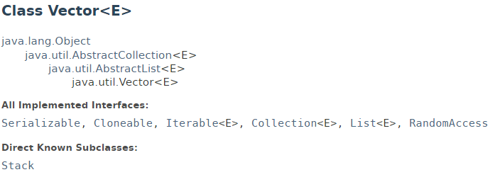
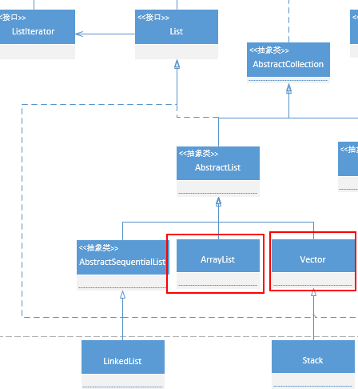
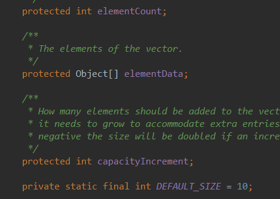

# Vector

都说 Vector 是线程安全的 ArrayList，今天来根据源码看看是不是这么相似。

什么是 Vector



Vector 和 ArrayList 一样，都是继承自 AbstractList。它是 Stack 的父类。英文的意思是 “矢量”。



Vector 成员变量



1.底层也是个数组

```java
protected Object[] elementData;
```

2.数组元素个数，为啥不就叫 size 呢？奇怪
```java
protected int elementCount;
```

3.扩容时增长数量，允许用户自己设置。如果这个值是 0 或者 负数，扩容时会扩大 2 倍，而不是 1.5
```java
protected int capacityIncrement;
```

4.默认容量
```java
private static final int DEFAULT_SIZE = 10;
```

Vector 的 4 种构造方法
```java
//创建默认容量 10 的数组，同时增长量为 0 
public Vector() {
    this(DEFAULT_SIZE, 0);
}

//创建一个用户指定容量的数组，同时增长量为 0 
public Vector(int capacity) {
    this(capacity, 0);
}

//创建指定容量大小的数组，设置增长量。如果增长量为 非正数，扩容时会扩大两倍
public Vector(int capacity, int capacityIncrement) {
    if (capacity < 0) {
        throw new IllegalArgumentException("capacity < 0: " + capacity);
    }
    elementData = newElementArray(capacity);
    elementCount = 0;
    this.capacityIncrement = capacityIncrement;
}

//创建一个包含指定集合的数组
public Vector(Collection<? extends E> c) {
    //转成数组，赋值
    elementData = c.toArray();
    elementCount = elementData.length;

    // c.toArray might (incorrectly) not return Object[] (see 6260652)
    //可能有这个神奇的 bug，用 Arrays.copyOf 重新创建、复制
    if (elementData.getClass() != Object[].class)
        elementData = Arrays.copyOf(elementData, elementCount, Object[].class);
}
```

一个内部方法，返回一个新数组：
```java
private E[] newElementArray(int size) {
    return (E[]) new Object[size];
}
```

## Vector 的成员方法

1.先来看 JDK 7 中 Vector 的 3 种扩容方式：

```java
//根据指定的容量进行扩容   
private void grow(int newCapacity) {
    //创建个指定容量的新数组，这里假设指定的容量比当前数组元素个数多
    E[] newData = newElementArray(newCapacity);
    //把当前数组复制到新创建的数组
    System.arraycopy(elementData, 0, newData, 0, elementCount);
    //当前数组指向新数组
    elementData = newData;
}

//默认增长一倍的扩容
private void growByOne() {
    int adding = 0;
    //扩容量 capacityIncrement 不大于 0，就增长一倍
    if (capacityIncrement <= 0) {
        if ((adding = elementData.length) == 0) {
            adding = 1;
        }
    } else {
        //否则按扩容量走
        adding = capacityIncrement;
    }

    //创建个新数组，大小为当前容量加上 adding
    E[] newData = newElementArray(elementData.length + adding);
    //复制，赋值
    System.arraycopy(elementData, 0, newData, 0, elementCount);
    elementData = newData;
}

//指定默认扩容数量的扩容
private void growBy(int required) {
    int adding = 0;
    //扩容量 capacityIncrement 不大于 0
    if (capacityIncrement <= 0) {
        //如果当前数组内没有元素，就按指定的数量扩容
        if ((adding = elementData.length) == 0) {
            adding = required;
        }
        //增加扩容数量到 指定的以上
        while (adding < required) {
            adding += adding;
        }
    } else {
        //扩容量大于 0 ，还是按指定的扩容数量走啊
        adding = (required / capacityIncrement) * capacityIncrement;
        //不过也可能出现偏差，因为是 int 做除法，所以扩容值至少是 指定扩容量的一倍以上
        if (adding < required) {
            adding += capacityIncrement;
        }
    }
    //创建，复制，赋值一条龙
    E[] newData = newElementArray(elementData.length + adding);
    System.arraycopy(elementData, 0, newData, 0, elementCount);
    elementData = newData;
}
```
- 2.（我能说一开始看错了，看成 JDK7 的了吗 - -）再来看JDK 8 中的扩容机制，变成一种了：

```java
//扩容，传入最小容量，跟 ArrayList.grow(int) 很相似，只是扩大量不同 
private void grow(int minCapacity) {
    int oldCapacity = elementData.length;
    //如果增长量 capacityIncrement 不大于 0 ，就扩容 2 倍
    int newCapacity = oldCapacity + ((capacityIncrement > 0) ?
                                     capacityIncrement : oldCapacity);
    if (newCapacity - minCapacity < 0)
        newCapacity = minCapacity;
    if (newCapacity - MAX_ARRAY_SIZE > 0)
        newCapacity = hugeCapacity(minCapacity);
    //
    elementData = Arrays.copyOf(elementData, newCapacity);
}

private static int hugeCapacity(int minCapacity) {
    if (minCapacity < 0) // overflow
        throw new OutOfMemoryError();
    return (minCapacity > MAX_ARRAY_SIZE) ?
        Integer.MAX_VALUE :
        MAX_ARRAY_SIZE;
}
```

- 3.Vector中的 5 种添加元素的方法
```java
//扩容前兆，检查数量
private void ensureCapacityHelper(int minCapacity) {
    if (minCapacity - elementData.length > 0)
        grow(minCapacity);
}

//在指定位置插入一个元素，同步的
public synchronized void insertElementAt(E obj, int index) {
    modCount++;
    if (index > elementCount) {
        throw new ArrayIndexOutOfBoundsException(index
                                                 + " > " + elementCount);
    }
    ensureCapacityHelper(elementCount + 1);
    //扩容后就把插入点后面的元素统一后移一位
    System.arraycopy(elementData, index, elementData, index + 1, elementCount - index);
    //赋值
    elementData[index] = obj;
    elementCount++;
}

//尾部插入元素，同步的
public synchronized void addElement(E obj) {
    modCount++;
    ensureCapacityHelper(elementCount + 1);
    elementData[elementCount++] = obj;
}

public void add(int index, E element) {
    insertElementAt(element, index);
}

//添加一个集合到尾部，同步的
public synchronized boolean addAll(Collection<? extends E> c) {
    modCount++;
    //转成数组
    Object[] a = c.toArray();
    int numNew = a.length;
    //扩容，复制到数组后面
    ensureCapacityHelper(elementCount + numNew);
    System.arraycopy(a, 0, elementData, elementCount, numNew);
    elementCount += numNew;
    return numNew != 0;
}

//添加一个结合到指定位置，同步的
public synchronized boolean addAll(int index, Collection<? extends E> c) {
    modCount++;
    if (index < 0 || index > elementCount)
        throw new ArrayIndexOutOfBoundsException(index);

    Object[] a = c.toArray();
    int numNew = a.length;
    ensureCapacityHelper(elementCount + numNew);

    //要移动多少个元素
    int numMoved = elementCount - index;
    if (numMoved > 0)
        //把插入位置后面的元素后移这么多位
        System.arraycopy(elementData, index, elementData, index + numNew,
                         numMoved);
    //复制元素到数组中
    System.arraycopy(a, 0, elementData, index, numNew);
    elementCount += numNew;
    return numNew != 0;
}
```

  - 最后还有个 ListIterator 的添加方法
```java
    public void add(E e) {
        int i = cursor;
        synchronized (Vector.this) {
            checkForComodification();
            Vector.this.add(i, e);
            expectedModCount = modCount;
        }
        cursor = i + 1;
        lastRet = -1;
    }
```
- 4.Vector 中的 9 种删除方法
```java
//删除指定位置的元素，同步的
public synchronized void removeElementAt(int index) {
    modCount++;
    if (index >= elementCount) {
        throw new ArrayIndexOutOfBoundsException(index + " >= " +
                                                 elementCount);
    }
    else if (index < 0) {
        throw new ArrayIndexOutOfBoundsException(index);
    }
    int j = elementCount - index - 1;
    if (j > 0) {
        //把删除位置后面的元素往前移一位
        System.arraycopy(elementData, index + 1, elementData, index, j);
    }
    elementCount--;
    //最后多余的一位置为 null
    elementData[elementCount] = null; /* to let gc do its work */
}

//删除指定元素，同步的
public synchronized boolean removeElement(Object obj) {
    modCount++;
    int i = indexOf(obj);
    if (i >= 0) {
        removeElementAt(i);
        return true;
    }
    return false;
}

E elementData(int index) {
    return (E) elementData[index];
}

//删除指定位置的元素
public synchronized E remove(int index) {
    modCount++;
    if (index >= elementCount)
        throw new ArrayIndexOutOfBoundsException(index);
    E oldValue = elementData(index);

    //找到删除该元素后，后面有多少位元素需要前移一位
    int numMoved = elementCount - index - 1;
    if (numMoved > 0)
        //迁移一位
        System.arraycopy(elementData, index+1, elementData, index,
                         numMoved);
    //最后一位置为 null，不浪费空间
    elementData[--elementCount] = null; // Let gc do its work

    return oldValue;
}

public boolean remove(Object o) {
    return removeElement(o);
}

//删除指定集合的所有元素，同步的
public synchronized boolean removeAll(Collection<?> c) {
    //直接调用 AbstractCollection 的 removeAll 方法，用迭代器挨个删除
    return super.removeAll(c);
}

//删除所有元素，同步的
public synchronized void removeAllElements() {
    modCount++;
    // 挨个置为空，Let gc do its work
    for (int i = 0; i < elementCount; i++)
        elementData[i] = null;

    elementCount = 0;
}

//删除指定范围的元素,同步的
protected synchronized void removeRange(int fromIndex, int toIndex) {
    modCount++;
    //把结束位置以后的元素向前移动 指定数量个位置，覆盖
    int numMoved = elementCount - toIndex;
    System.arraycopy(elementData, toIndex, elementData, fromIndex,
                     numMoved);

    // 把多余的位置置为 null
    int newElementCount = elementCount - (toIndex-fromIndex);
    while (elementCount != newElementCount)
        elementData[--elementCount] = null;
}

//排除异己，同步的
public synchronized boolean retainAll(Collection<?> c) {
    return super.retainAll(c);
}

//JDK 1.8 新增的
public synchronized boolean removeIf(Predicate<? super E> filter) {
    Objects.requireNonNull(filter);
    // 将要删除的内容加入 removeSet
    int removeCount = 0;
    final int size = elementCount;
    final BitSet removeSet = new BitSet(size);
    final int expectedModCount = modCount;
    for (int i=0; modCount == expectedModCount && i < size; i++) {
        @SuppressWarnings("unchecked")
        final E element = (E) elementData[i];
        if (filter.test(element)) {
            removeSet.set(i);
            removeCount++;
        }
    }
    if (modCount != expectedModCount) {
        throw new ConcurrentModificationException();
    }

    // 遍历，删除
    final boolean anyToRemove = removeCount > 0;
    if (anyToRemove) {
        final int newSize = size - removeCount;
        for (int i=0, j=0; (i < size) && (j < newSize); i++, j++) {
            i = removeSet.nextClearBit(i);
            elementData[j] = elementData[i];
        }
        for (int k=newSize; k < size; k++) {
            elementData[k] = null;  // Let gc do its work
        }
        elementCount = newSize;
        if (modCount != expectedModCount) {
            throw new ConcurrentModificationException();
        }
        modCount++;
    }

    return anyToRemove;
}
```

写“同步的”写的手抽筋，还是统计不是同步的方法吧 - -。

5. Vector 中的修改方法
```java
//修改指定位置为指定元素
public synchronized E set(int index, E element) {
    if (index >= elementCount)
        throw new ArrayIndexOutOfBoundsException(index);
    //找到这个元素，直接设置新值
    E oldValue = elementData(index);
    elementData[index] = element;
    return oldValue;
}

//修改指定位置为指定元素
public synchronized void setElementAt(E obj, int index) {
    if (index >= elementCount) {
        throw new ArrayIndexOutOfBoundsException(index + " >= " +
                                                 elementCount);
    }
    //数组就是方便，直接更新就好了
    elementData[index] = obj;
}

//修改数组容量
public synchronized void setSize(int newSize) {
    modCount++;
    //元素个数超出容量就要扩容
    if (newSize > elementCount) {
        ensureCapacityHelper(newSize);
    } else {
        //新增 elementCount - newSize 个元素
        for (int i = newSize ; i < elementCount ; i++) {
            elementData[i] = null;
        }
    }
    elementCount = newSize;
}

//排序，修改顺序
public synchronized void sort(Comparator<? super E> c) {
    final int expectedModCount = modCount;
    //用的是 Arrays.sort 
    Arrays.sort((E[]) elementData, 0, elementCount, c);
    if (modCount != expectedModCount) {
        throw new ConcurrentModificationException();
    }
    modCount++;
}

//缩小数组容量，减少占用资源
public synchronized void trimToSize() {
    modCount++;
    int oldCapacity = elementData.length;
    if (elementCount < oldCapacity) {
        //新建个小点的数组，赋值
        elementData = Arrays.copyOf(elementData, elementCount);
    }
}
```

- 6. Vector 中的查询
```java
//查找 o 从指定位置 index 开始第一次出现的位置
public synchronized int indexOf(Object o, int index) {
    if (o == null) {
        for (int i = index ; i < elementCount ; i++)
            if (elementData[i]==null)
                return i;
    } else {
        for (int i = index ; i < elementCount ; i++)
            if (o.equals(elementData[i]))
                return i;
    }
    return -1;
}

//查找 o 在数组中首次出现的位置
public int indexOf(Object o) {
    return indexOf(o, 0);
}

//是否包含 O 
public boolean contains(Object o) {
    return indexOf(o, 0) >= 0;
}

//是否包含整个集合
public synchronized boolean containsAll(Collection<?> c) {
    //调用 AbstractCollection 的方法，使用迭代器挨个遍历查找，两重循环
    return super.containsAll(c);
}

//第一个元素，其实提供了 get() 方法就够了
public synchronized E firstElement() {
    if (elementCount == 0) {
        throw new NoSuchElementException();
    }
    return elementData(0);
}

//最后一个元素，其实提供了 get() 方法就够了
public synchronized E lastElement() {
    if (elementCount == 0) {
        throw new NoSuchElementException();
    }
    return elementData(elementCount - 1);
}

public synchronized boolean isEmpty() {
    return elementCount == 0;
}

//实际包含元素个数
public synchronized int size() {
    return elementCount;
}

//数组大小，>= 元素个数
public synchronized int capacity() {
    return elementData.length;
}
7. Vector 也可以转成数组
public synchronized Object[] toArray() {
    return Arrays.copyOf(elementData, elementCount);
}

//跟 ArrayList 简直一样
public synchronized <T> T[] toArray(T[] a) {
    if (a.length < elementCount)
        return (T[]) Arrays.copyOf(elementData, elementCount, a.getClass());

    System.arraycopy(elementData, 0, a, 0, elementCount);

    if (a.length > elementCount)
        a[elementCount] = null;

    return a;
}
```

- 8. Vector 中的迭代器
普通迭代器　Iterator:
```java
public synchronized Iterator<E> iterator() {
    return new Itr();
}

private class Itr implements Iterator<E> {
    int cursor;       // index of next element to return
    int lastRet = -1; // index of last element returned; -1 if no such
    int expectedModCount = modCount;

    public boolean hasNext() {
        // 调用 next() 前的检查
        return cursor != elementCount;
    }

    public E next() {
        //注意了，Vector 连迭代器的方法也加了同步
        synchronized (Vector.this) {
            checkForComodification();
            int i = cursor;
            if (i >= elementCount)
                throw new NoSuchElementException();
            cursor = i + 1;
            return elementData(lastRet = i);
        }
    }

    public void remove() {
        if (lastRet == -1)
            throw new IllegalStateException();
        //注意了，Vector 连迭代器的方法也加了同步
        synchronized (Vector.this) {
            checkForComodification();
            Vector.this.remove(lastRet);
            expectedModCount = modCount;
        }
        cursor = lastRet;
        lastRet = -1;
    }

    //大概看下这个 1.8 的方法
    @Override
    public void forEachRemaining(Consumer<? super E> action) {
        Objects.requireNonNull(action);
        synchronized (Vector.this) {
            final int size = elementCount;
            int i = cursor;
            if (i >= size) {
                return;
            }
    @SuppressWarnings("unchecked")
            final E[] elementData = (E[]) Vector.this.elementData;
            if (i >= elementData.length) {
                throw new ConcurrentModificationException();
            }
            while (i != size && modCount == expectedModCount) {
                action.accept(elementData[i++]);
            }
            // update once at end of iteration to reduce heap write traffic
            cursor = i;
            lastRet = i - 1;
            checkForComodification();
        }
    }

    final void checkForComodification() {
        if (modCount != expectedModCount)
            throw new ConcurrentModificationException();
    }
}
```

ListIterator:
```java
public synchronized ListIterator<E> listIterator(int index) {
    if (index < 0 || index > elementCount)
        throw new IndexOutOfBoundsException("Index: "+index);
    return new ListItr(index);
}

final class ListItr extends Itr implements ListIterator<E> {
    ListItr(int index) {
        super();
        cursor = index;
    }

    public boolean hasPrevious() {
        return cursor != 0;
    }

    public int nextIndex() {
        return cursor;
    }

    public int previousIndex() {
        return cursor - 1;
    }

    public E previous() {
        synchronized (Vector.this) {
            checkForComodification();
            int i = cursor - 1;
            if (i < 0)
                throw new NoSuchElementException();
            cursor = i;
            return elementData(lastRet = i);
        }
    }

    public void set(E e) {
        if (lastRet == -1)
            throw new IllegalStateException();
        synchronized (Vector.this) {
            checkForComodification();
            Vector.this.set(lastRet, e);
        }
    }

    public void add(E e) {
        int i = cursor;
        synchronized (Vector.this) {
            checkForComodification();
            Vector.this.add(i, e);
            expectedModCount = modCount;
        }
        cursor = i + 1;
        lastRet = -1;
    }
}

//1.8 新增的略过。。。

//还多了个 sort 方法，自己传入的集合需要实现比较器
@SuppressWarnings("unchecked")
@Override
public synchronized void sort(Comparator<? super E> c) {
    final int expectedModCount = modCount;
    Arrays.sort((E[]) elementData, 0, elementCount, c);
    if (modCount != expectedModCount) {
        throw new ConcurrentModificationException();
    }
    modCount++;
}
```

Vector 还支持 Enumeration　迭代：
```java
public Enumeration<E> elements() {
    return new Enumeration<E>() {
        int count = 0;

        public boolean hasMoreElements() {
            return count < elementCount;
        }

        public E nextElement() {
            synchronized (Vector.this) {
                if (count < elementCount) {
                    return elementData(count++);
                }
            }
            throw new NoSuchElementException("Vector Enumeration");
        }
    };
}
```
## 总结
Vector 特点
- 底层由一个可以增长的数组组成
- Vector 通过 capacity (容量) 和 capacityIncrement (增长数量) 来尽量少的占用空间
- 扩容时默认扩大两倍
- 最好在插入大量元素前增加 vector 容量，那样可以减少重新申请内存的次数
- 通过 iterator 和 lastIterator 获得的迭代器是 fail-fast 的
- 通过 elements 获得的老版迭代器 Enumeration 不是 fail-fast 的
- 同步类，每个方法前都有同步锁 synchronized
- 在 JDK 2.0 以后，经过优化，Vector 也加入了 Java 集合框架大家族

## Vector VS ArrayList
共同点：

- 都是基于数组
- 都支持随机访问
- 默认容量都是 10
- 都有扩容机制

区别：

- Vector 出生的比较早，JDK 1.0 就出生了，ArrayList JDK 1.2 才出来
- Vector 比 ArrayList 多一种迭代器 Enumeration
- Vector 是线程安全的，ArrayList 不是
- Vector 默认扩容 2 倍，ArrayList 是 1.5

如果没有线程安全的需求，一般推荐使用 ArrayList，而不是 Vector，因为每次都要获取锁，效率太低。

Thanks
https://docs.oracle.com/javase/8/docs/api/java/util/Vector.html

http://blog.csdn.net/u011518120/article/details/52192680

