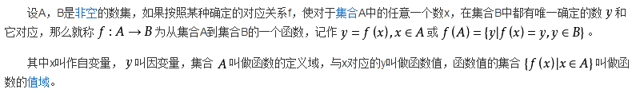
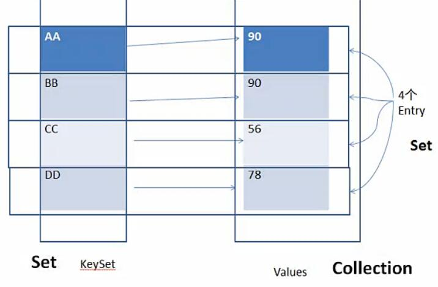
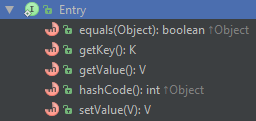
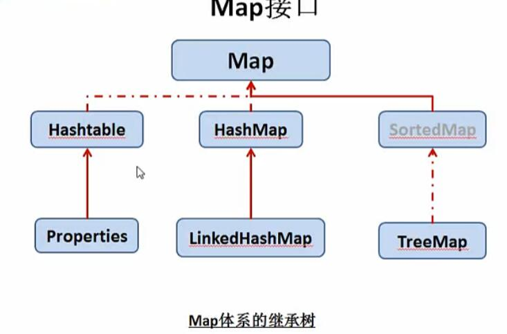

# Map

Java 中的 Map 接口 是和 Collection 接口 同一等级的集合根接口，它 表示一个键值对 (key-value) 的映射。类似数学中 函数 的概念。

数学中的函数：



一个 Map 中，任意一个 key 都有唯一确定的 value 与其对应，这个 key-value 的映射就是 map。

Map 中元素的顺序`取决于迭代器迭代时的顺序`，有的实现类保证了元素输入输出时的顺序，比如说 TreeMap；有的实现类则是无序的，比如 HashMap。

Map 的三个 collection 视图：



Map 接口提供了三种角度来分析 Map:

- KeySet

- Values

- Entry

- 1.KeySet
KeySet 是一个 Map 中键（key）的集合，以 Set 的形式保存，不允许重复，因此键`存储的对象需要重写 equals() 和 hashCode() 方法`。

    在上图就是保存 AA, BB, CC, DD… 等键的集合。

    可以通过 Map.keySet() 方法获得。

- 2.Values
Values 是一个 Map 中值 (value) 的集合，以 Collection 的形式保存，因此可以重复。

    在上图就是保存 90,90,56,78… 等值的集合。

    通过 Map.values() 方法获得。

- 3.Entry
Entry 是 Map 接口中的静态内部接口，表示一个键值对的映射，例如上图中 AA-90 这一组映射关系。

    

Entry 具有上图中的方法：

- getKey() , 获取这组映射中的键 key
- getValue() , 获取这组映射中的值 value
- setValue() , 修改这组映射中的值
- hashCode() , 返回这个 Entry 的哈希值
- equals() , 对比 key-value 是否相等

通过 Map.entrySet() 方法获得的是一组 Entry 的集合，保存在 Set 中，所以 Map 中的 Entry 也不能重复。
```java
public Set<Map.Entry<K,V>> entrySet();
```

## Map 的三种遍历方式
根据 Map 提供的三种视图，可以有三种 map 遍历方式 :

1.使用 keySet 遍历：
```java
    Set set = map.keySet();
    for (Object key : set) {
        System.out.println(map.get(key));
    }
```
2.使用 values 遍历：
```java
    Collection values = map.values();
    Iterator iterator = values.iterator();
    while (iterator.hasNext()){
        System.out.println("value " + iterator.next());
    }
```
3.使用 Entry 遍历
```java
    Set entrySet = map.entrySet();
    for (Object o : entrySet) {
        Map.Entry entry = (Map.Entry) o;
        System.out.println(entry);      //key=value
        System.out.println(entry.getKey() + " / " + entry.getValue());
    }
```

## Map 的实现类



Map 的实现类主要有 4 种：

- Hashtable 
古老，线程安全
- HashMap 
速度很快，但没有顺序
- TreeMap 
有序的，效率比 HashMap 低
- LinkedHashMap 
结合 HashMap 和 TreeMap 的优点，有序的同时效率也不错，仅比 HashMap 慢一点

其中后三个的区别很类似 Set 的实现类：

- HashSet
- TreeSet
- LinkedHashSet

Map 的每个实现类都应该实现 2 个构造方法：

- 无参构造方法，用于创建一个空的 map
- 参数是 Map 的构造方法，用于创建一个包含参数内容的新 map

第二种构造方法允许我们复制一个 map。

虽然没有强制要求，但自定义 Map 实现类时最好都这样来。

## 总结

Map 有以下特点：

- 没有重复的 key
- 每个 key 只能对应一个 value, 多个 key 可以对应一个 value
- key,value 都可以是任何引用类型的数据，包括 null
- Map 取代了古老的 Dictionary 抽象类

注意： 

可以使用 Map 作为 Map 的值，但禁止使用 Map 作为 Map 的键。因为在这么复杂的 Map 中，equals() 方法和 hashCode() 比较难定义。

另一方面，你应该尽量避免使用“可变”的类作为 Map 的键。如果你将一个对象作为键值并保存在 Map 中，之后又改变了其状态，那么 Map 就会产生混乱，你所保存的值可能丢失。

Thanks
- https://docs.oracle.com/javase/8/docs/api/java/util/Map.html 
- https://docs.oracle.com/javase/tutorial/collections/interfaces/map.html 
- https://docs.oracle.com/javase/tutorial/collections/implementations/map.html 
- http://www.cnblogs.com/skywang12345/p/3308931.html 
- http://www.nowamagic.net/librarys/veda/detail/1202