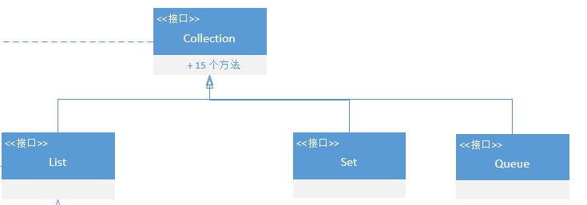
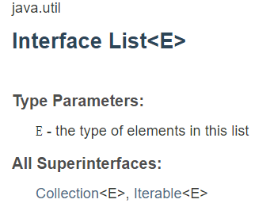
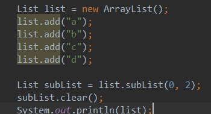

# List<E>



在 Java 集合深入理解：Collection 中我们熟悉了 Java 集合框架的基本概念和优点，也了解了根接口之一的 Collection，这篇文章来加深 Collection 的子接口之一 List 的熟悉。



## List 接口

一个 List 是一个元素`有序的`、`可以重复`、`可以为 null` 的集合（有时候我们也叫它“`序列`”）。

Java 集合框架中最常使用的几种 List 实现类是 `ArrayList`，`LinkedList` 和 `Vector`。在各种 List 中，最好的做法是`以 ArrayList 作为默认选择`。 `当插入、删除频繁时`，使用 LinkedList，Vector 总是比 ArrayList 慢，所以要尽量避免使用它，具体实现后续文章介绍。

## 为什么 List 中的元素 “有序”、“可以重复”呢?

首先，List 的数据结构就是一个序列，`存储内容时直接在内存中开辟一块连续的空间，然后将空间地址与索引对应`。
其次根据官方文档 ：

```note
The user of this interface has precise/精确的 control over where in the list each element is inserted. The user can access elements by their `integer index` (position in the list), and search for elements in the list.
```

可以看到，List 接口的实现类在实现插入元素时，都会根据索引进行排列。
比如 ArrayList，本质是一个数组：


LinkedList, 双向链表：


由于 List 的元素在存储时互不干扰，没有什么依赖关系，自然可以重复（这点与 Set 有很大区别）。

## List 接口定义的方法

### List 中除了继承 Collection 的一些方法，还提供以下操作：

- 位置相关：List 和 数组一样，都是从 0 开始，我们可以根据元素在 list 中的位置进行操作，比如说 get, set, add, addAll, remove;
- 搜索：从 list 中查找某个对象的位置，比如 indexOf, lastIndexOf;
- 迭代：使用 Iterator 的拓展版迭代器 ListIterator 进行迭代操作;
- 范围性操作：使用 subList 方法对 list 进行任意范围的操作。

Collection 中 提供的一些方法就不介绍了，不熟悉的可以去看一下。

### 集合的操作

- remove(Object) 
用于删除 list 中头回出现的 指定对象；

- add(E), addAll(Collection<? extends E>)

用于把新元素添加到 list 的尾部，下面这段语句使得 list3 等于 list1 与 list2 组合起来的内容：

List list3 = new ArrayList(list1); 
list3.addAll(list2);

注意：上述使用了 ArrayList 的转换构造函数:

public ArrayList(Collection

## Object 的 equlas() 方法默认和 == 一样，比较的是地址是否相等。

```java
public boolean equals(Object o) {
    return this == o;
}
```

因此和 Set，Map 一样，List 中如果想要根据两个对象的内容而不是地址比较是否相等时，需要重写 equals() 和 hashCode() 方法。 remove(), contains(), indexOf() 等等方法都需要依赖它们：
```java
@Override 
public boolean contains(Object object) {
    Object[] a = array;
    int s = size;
    if (object != null) {
        for (int i = 0; i < s; i++) {
            //需要重载 Object 默认的 equals 
            if (object.equals(a[i])) {
                return true;
            }
        }
    } else {
        for (int i = 0; i < s; i++) {
            if (a[i] == null) {
                return true;
            }
        }
    }
    return false;
}

@Override
 public int indexOf(Object object) {
    Object[] a = array;
    int s = size;
    if (object != null) {
        for (int i = 0; i < s; i++) {
            if (object.equals(a[i])) {
                return i;
            }
        }
    } else {
        for (int i = 0; i < s; i++) {
            if (a[i] == null) {
                return i;
            }
        }
    }
    return -1;
}
```

两个 List 对象的所有位置上元素都一样才能相等。

## 位置访问，搜索

基础的位置访问操作方法有：

get, set, add, remove 
set, remove 方法返回的是 被覆盖 或者 被删除 的元素；
indexOf, lastIndexOf 
返回指定元素在 list 中的首次出现/最后一次出现的位置（获取 lastIndexOf 是通过倒序遍历查找）;
addAll(int,Collection) 
在特定位置插入指定集合的所有元素。这些元素按照迭代器 Iterator 返回的先后顺序进行插入；

## 下面是一个简单的 List 中的元素交换方法：

public static <E> void swap(List<E> a, int i, int j) {
    E tmp = a.get(i);
    a.set(i, a.get(j));
    a.set(j, tmp);
}
不同的是它是多态的，允许任何 List 的子类使用。 Collections 中的 shuffle 就有用到和下面这种相似的交换方法：
```java
public static void shuffle(List<?> list, Random rnd) {
    for (int i = list.size(); i > 1; i--)
        swap(list, i - 1, rnd.nextInt(i));
}
```
这种算法使用指定的随机算法，从后往前重复的进行交换。和一些其他底层 shuffle 算法不同，这个算法更加公平（随机方法够随机的话，所有元素的被抽到的概率一样），同时够快（只要 list.size() -1 ）次交换。

## 局部范围操作

List.subList(int fromIndex, int toIndex) 方法返回 List 在 fromIndex 与 toIndex 范围内的子集。注意是左闭右开，[fromIndex,toIndex)。

注意！ List.subList 方法并没有像我们想的那样：创建一个新的 List，然后把旧 List 的指定范围子元素拷贝进新 List，根！本！不！是！ 
subList 返回的扔是 List 原来的引用，只不过把开始位置 offset 和 size 改了下，见 List.subList() 在 AbstractList 抽象类中的实现：
```java
public List<E> subList(int start, int end) {
    if (start >= 0 && end <= size()) {
        if (start <= end) {
            if (this instanceof RandomAccess) {
                return new SubAbstractListRandomAccess<E>(this, start, end);
            }
            return new SubAbstractList<E>(this, start, end);
        }
        throw new IllegalArgumentException();
    }
    throw new IndexOutOfBoundsException();
}
```
SubAbstractListRandomAccess 最终也是继承 SubAbstractList,直接看 SubAbstractList：
```java
    SubAbstractList(AbstractList<E> list, int start, int end) {
        fullList = list;
        modCount = fullList.modCount;
        offset = start;
        size = end - start;
    }
```
可以看到，的确是保持原来的引用。

所以，重点来了！

由于 subList 持有 List 同一个引用，所以对 subList 进行的操作也会影响到原有 List，举个栗子：



你猜运行结果是什么？


验证了上述重点。

所以，我们可以使用 subList 对 List 进行范围操作，比如下面的代码，一句话实现了删除 shixinList 部分元素的操作：
shixinList.subList(fromIndex, toIndex).clear();
还可以查找某元素在局部范围内的位置：

int i = list.subList(fromIndex, toIndex).indexOf(o);
int j = list.subList(fromIndex, toIndex).lastIndexOf(o);

## List 与 Array 区别？

List 在很多方面跟 Array 数组感觉很相似，尤其是 ArrayList，那 List 和数组究竟哪个更好呢？

- 相似之处： 
  - 都可以表示一组同类型的对象
  - 都使用下标进行索引
- 不同之处： 
  - 数组可以存任何类型元素
  - List 不可以存基本数据类型，必须要包装
  - 数组容量固定不可改变；List 容量可动态增长
  - 数组效率高; List 由于要维护额外内容，效率相对低一些

容量固定时优先使用数组，容纳类型更多，更高效。

在容量不确定的情景下， List 更有优势，看下 ArrayList 和 LinkedList 如何实现容量动态增长：

ArrayList 的扩容机制:
```java
public boolean add(E object) {
    Object[] a = array;
    int s = size;
    //当放满时，扩容
    if (s == a.length) {
        //MIN_CAPACITY_INCREMENT 为常量，12
        Object[] newArray = new Object[s +
                (s < (MIN_CAPACITY_INCREMENT / 2) ?
                 MIN_CAPACITY_INCREMENT : s >> 1)];
        System.arraycopy(a, 0, newArray, 0, s);
        array = a = newArray;
    }
    a[s] = object;
    size = s + 1;
    modCount++;
    return true;
}
```
可以看到：
- 当 ArrayList 的元素个数小于 6 时，容量达到最大时，元素容量会扩增 12；
- 反之，增加 当前元素个数的一半。

LinkedList 的扩容机制：
```java
public boolean add(E object) {
    return addLastImpl(object);
}

private boolean addLastImpl(E object) {
    Link<E> oldLast = voidLink.previous;
    Link<E> newLink = new Link<E>(object, oldLast, voidLink);
    voidLink.previous = newLink;
    oldLast.next = newLink;
    size++;
    modCount++;
    return true;
}
```
可以看到，没！有！扩容机制！
这是由于 LinedList 实际上是一个双向链表，不存在元素个数限制，使劲加就行了。
```java
transient Link<E> voidLink;

private static final class Link<ET> {
    ET data;

    Link<ET> previous, next;

    Link(ET o, Link<ET> p, Link<ET> n) {
        data = o;
        previous = p;
        next = n;
    }
}
```
## List 与 Array 之间的转换

在 List 中有两个转换成 数组 的方法：

- Object[] toArray() 
返回一个包含 List 中所有元素的数组；
- T[] toArray(T[] array) 
作用同上，不同的是当 参数 array 的长度比 List 的元素大时，会使用参数 array 保存 List 中的元素；否则会创建一个新的 数组存放 List 中的所有元素；

## ArrayList 中的实现：
```java
public Object[] toArray() {
    int s = size;
    Object[] result = new Object[s];
    //这里的 array 就是 ArrayList 的底层实现，直接拷贝
    //System.arraycopy 是底层方法，效率很高
    System.arraycopy(array, 0, result, 0, s);
    return result;
}

public <T> T[] toArray(T[] contents) {
    int s = size;
    //先判断参数能不能放下这么多元素
    if (contents.length < s) {
        //放不下就创建个新数组
        @SuppressWarnings("unchecked") T[] newArray
            = (T[]) Array.newInstance(contents.getClass().getComponentType(), s);
            // !!!!!
            // arrayObj.getClass().getComponentType();
            // 通过反射 获取 数据类型 然后再用这个数据类型 和 长度 创建 数组
        contents = newArray;
    }
    System.arraycopy(this.array, 0, contents, 0, s);
    if (contents.length > s) {
        contents[s] = null;
    }
    return contents;
}
```
- 从这个代码 可以了解到 实际情况下 ArrayList的 toArray 方法要怎么用
```java
// ------------- 1. 错误方法
String[] desc = new String[]{};
list.toArray(desc);
output(desc)
// ------------- 2. 丑陋方法
String[] desc = new String[]{};
desc = list.toArray(desc);
output(desc);
// ------------  3. 优化方法
String[] desc = new String[list.size()];
list.toArray(desc);
output(desc);
```

## LinkedList 的实现：
```java
public Object[] toArray() {
    int index = 0;
    Object[] contents = new Object[size];
    Link<E> link = voidLink.next;
    while (link != voidLink) {
        //挨个赋值，效率不如 ArrayList
        contents[index++] = link.data;
        link = link.next;
    }
    return contents;
}

@Override
@SuppressWarnings("unchecked")
public <T> T[] toArray(T[] contents) {
    int index = 0;
    if (size > contents.length) {
        Class<?> ct = contents.getClass().getComponentType();
        contents = (T[]) Array.newInstance(ct, size);
    }
    Link<E> link = voidLink.next;
    while (link != voidLink) {
        //还是比 ArrayList 慢
        contents[index++] = (T) link.data;
        link = link.next;
    }
    if (index < contents.length) {
        contents[index] = null;
    }
    return contents;
}
```
## 数组工具类 Arrays 提供了数组转成 List 的方法 asList :
```java
@SafeVarargs
public static <T> List<T> asList(T... array) {
    return new ArrayList<T>(array);
}
```
使用的是 Arrays 内部创建的 ArrayList 的转换构造函数：
```java
private final E[] a;
ArrayList(E[] storage) {
    if (storage == null) {
        throw new NullPointerExceptio("storage == null");
    }
    //直接复制
    a = storage;
}
```
## 迭代器 Iterator, ListIterator

List 继承了 Collection 的 iterator() 方法，可以获取 Iterator，使用它可以进行向后遍历。
在此基础上，List 还可以通过 listIterator(), listIterator(int location) 方法（后者指定了游标的位置）获取更强大的迭代器 ListIterator。
使用 ListIterator 可以对 List 进行向前、向后双向遍历，同时还允许进行 add, set, remove 等操作。
List 的实现类中许多方法都使用了 ListIterator，比如 List.indexOf() 方法的一种实现：
public int indexOf(E e) {
    for (ListIterator<E> it = listIterator(); it.hasNext(); )
        if (e == null ? it.next() == null : e.equals(it.next()))
            return it.previousIndex();
    // Element not found
    return -1;
}
ListIterator 提供了 add, set, remove 操作，他们都是对迭代器刚通过 next(), previous()方法迭代的元素进行操作。下面这个栗子中，List 通过结合 ListIterator 使用，可以实现一个多态的方法，对所有 List 的实现类都适用：
public static <E> void replace(List<E> list, E val, E newVal) {
    for (ListIterator<E> it = list.listIterator(); it.hasNext(); )
        if (val == null ? it.next() == null : val.equals(it.next()))
            it.set(newVal);
}


## List 的相关算法：

集合的工具类 Collections 中包含很多 List 的相关操作算法：
- sort ，归并排序
- shuffle ，随机打乱
- reverse ，反转元素顺序
- swap ，交换
- binarySearch ，二分查找
- ……

具体实现我们后续介绍，感谢关注！
关联： 
Collection, ListIterator, Collections

Thanks:
http://docs.oracle.com/javase/1.5.0/docs/api/java/util/List.html

https://docs.oracle.com/javase/tutorial/collections/interfaces/list.html

http://blog.csdn.net/mazhimazh/article/details/17759579#comments

http://www.blogjava.net/flysky19/articles/92775.html