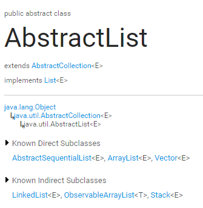
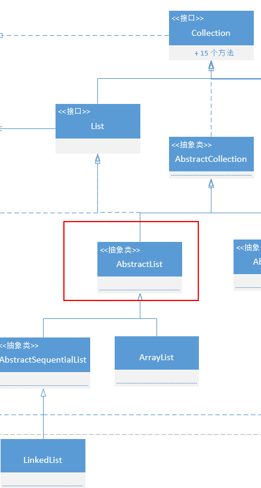

# 来学学 AbstractList 吧！



什么是 AbstractList




AbstractList 继承自 `AbstractCollection` 抽象类，实现了 `List` 接口 ，是 `ArrayList` 和 `AbstractSequentiaList` 的父类。

它实现了 List 的一些位置相关操作(比如 get,set,add,remove)，是第一个实现随机访问方法的集合类，但不支持添加和替换。

在 AbstractCollection 抽象类 中我们知道，AbstractCollection 要求子类必须实现两个方法： `iterator()` 和 size()。 `AbstractList` 实现了 iterator()方法：

```java
public Iterator<E> iterator() {
    return new Itr();
}
```

但没有实现 `size()` 方法，此外还提供了一个抽象方法 `get()`：

```java
public abstract E get(int location);
```

因此子类必须要实现 get(), size() 方法。

另外，如果子类想要能够修改元素，还需要`重写 add(), set(), remove()` 方法，否则会报 `UnsupportedOperationException` 错。

## 实现的方法

- 1.默认不支持的 add(), set(),remove(): 需要实现类重写

```java
public boolean add(E e) {
    add(size(), e);
    return true;
}

public void add(int index, E element) {
    throw new UnsupportedOperationException();
}

public E set(int index, E element) {
    throw new UnsupportedOperationException();
}

public E remove(int index) {
    throw new UnsupportedOperationException();
}
```

- 2.indexOf(Object) 获取指定对象 首次出现 的索引：

```java
public int indexOf(Object o) {
    //获取 ListIterator，此时游标位置为 0 
    ListIterator<E> it = listIterator();
    if (o==null) {
        // 如果传入的对象是 null
        //向后遍历
        while (it.hasNext())
            if (it.next()==null)
                //找到 
                //返回游标的前面元素索引
                return it.previousIndex();
    } else {
        while (it.hasNext())
            if (o.equals(it.next()))
            // 这里 其实要求 .equal() 能够按照要求判断！！！
                return it.previousIndex();
    }
    return -1;
}
```

在 ListIterator 中我们介绍了 游标 的概念，每次调用 `listIterator.next()` 方法 游标 都会后移一位，当 listIterator.next() == o 时（即找到我们需要的的元素），游标已经在 o 的后面，所以需要返回 游标的 previousIndex().

- 3.lastIndexOf(Object) 获取指定对象最后一次出现的位置:

```java
public int lastIndexOf(Object o) {
    //获取 ListIterator，此时游标在最后一位
    ListIterator<E> it = listIterator(size());
    if (o==null) {
        //向前遍历
        while (it.hasPrevious())
            if (it.previous()==null)
                //返回 it.nextIndex() 原因类似 2
                return it.nextIndex();
    } else {
        while (it.hasPrevious())
            if (o.equals(it.previous()))
                return it.nextIndex();
    }
    return -1;
}
```

- 4.clear(), removeRange(int, int), 全部/范围 删除元素：

```java
public void clear() {
    //传入由子类实现的 size()
    removeRange(0, size());
}

protected void removeRange(int fromIndex, int toIndex) {
    //获取 ListIterator 来进行迭代删除
    ListIterator<E> it = listIterator(fromIndex);
    for (int i=0, n=toIndex-fromIndex; i<n; i++) {
        it.next();
        it.remove();
    }
}
```

- 5.public boolean addAll(int index, Collection<? extends E> c)

```java
public boolean addAll(int index, Collection<? extends E> c) {
    rangeCheckForAdd(index);//超限 报错
    boolean modified = false;
    for (E e : c) {
        add(index++, e);// 这个 add()也是要 实现类完成的内容
        modified = true;
    }
    return modified;
}
```

两种内部迭代器
与其他集合实现类不同，AbstractList 内部已经提供了 Iterator, ListIterator 迭代器的实现类，分别为 Itr, ListItr, 不需要我们去帮他实现。

Itr 代码分析：

```java
/**
limingshun： 这里最重要的 就是维护了  cursor 游标 和 lastRet 上次访问 两个值
*/
private class Itr implements Iterator<E> {
    //游标
    int cursor = 0;

    //上一次迭代到的元素的位置，每次使用完就会置为 -1
    int lastRet = -1;

    //用来判断是否发生并发操作的标示，如果这两个值不一致，就会报错
    int expectedModCount = modCount;

    public boolean hasNext() {
        return cursor != size();
    }

    public E next() {
        //时刻检查是否有并发修改操作
        //并发修改 会 报错
        checkForComodification();
        try {
            int i = cursor;
            //调用 子类实现的 get() 方法获取元素
            E next = get(i);
            //有迭代操作后就会记录上次迭代的位置
            lastRet = i;
            cursor = i + 1;
            return next;
        } catch (IndexOutOfBoundsException e) {
            checkForComodification();
            throw new NoSuchElementException();
        }
    }

    public void remove() {
        if (lastRet < 0)
            throw new IllegalStateException();
        checkForComodification();

        try {
            //调用需要子类实现的 remove()方法
            AbstractList.this.remove(lastRet);
            if (lastRet < cursor)
                cursor--;
            //删除后 上次迭代的记录就会置为 -1
            lastRet = -1;
            expectedModCount = modCount;
        } catch (IndexOutOfBoundsException e) {
            throw new ConcurrentModificationException();
        }
    }

    //检查是否有并发修改
    final void checkForComodification() {
        if (modCount != expectedModCount)
            throw new ConcurrentModificationException();
    }
}
```

可以看到 Itr 只是简单实现了 Iterator 的 next, remove 方法。

ListItr 代码分析:

```java
//ListItr 是 Itr 的增强版
private class ListItr extends Itr implements ListIterator<E> {
    //多了个指定游标位置的构造参数，怎么都不检查是否越界！
    ListItr(int index) {
        cursor = index;
    }

    //除了一开始都有前面元素
    public boolean hasPrevious() {
        return cursor != 0;
    }

    public E previous() {
        checkForComodification();
        try {
            //获取游标前面一位元素
            int i = cursor - 1;
            E previous = get(i);
            //
            lastRet = cursor = i;
            return previous;
        } catch (IndexOutOfBoundsException e) {
            checkForComodification();
            throw new NoSuchElementException();
        }
    }

    //下一个元素的位置就是当前游标所在位置
    public int nextIndex() {
        return cursor;
    }

    public int previousIndex() {
        return cursor-1;
    }

    public void set(E e) {
        if (lastRet < 0)
            throw new IllegalStateException();
        checkForComodification();

        try {
            //子类得检查 lasRet 是否为 -1
            AbstractList.this.set(lastRet, e);
            expectedModCount = modCount;
        } catch (IndexOutOfBoundsException ex) {
            throw new ConcurrentModificationException();
        }
    }

    public void add(E e) {
        checkForComodification();

        try {
            int i = cursor;
            AbstractList.this.add(i, e);
            //又置为 -1 了
            lastRet = -1;
            cursor = i + 1;
            expectedModCount = modCount;
        } catch (IndexOutOfBoundsException ex) {
            throw new ConcurrentModificationException();
        }
    }
}
```

ListItr 在 Itr 基础上多了 向前 和 set 操作。

两种内部类
在 subList 方法中我们发现在切分 子序列时会分为两类，RandomAccess or not：

```java
/**
一个 sublist内部类  和 一个 sublist 方法 返回这个内部类
*/
public List<E> subList(int fromIndex, int toIndex) {
    return (this instanceof RandomAccess ?
            new RandomAccessSubList<>(this, fromIndex, toIndex) :
            new SubList<>(this, fromIndex, toIndex));
}
RandomAccess
public interface RandomAccess {
}
/**
*************************************************
jdk1.8 里面 看到的 SubList 内部类的样子
*/
//--------------------- 这是 主 类方法
public List<E> subList(int fromIndex, int toIndex) {
    return (this instanceof RandomAccess ?
            new RandomAccessSubList<>(this, fromIndex,toIndex) :
            new SubList<>(this, fromIndex, toIndex));
}
//---------------------这是内部类
class SubList<E> extends AbstractList<E> {
    private final AbstractList<E> l;
    private final int offset;
    private int size;

    SubList(AbstractList<E> list, int fromIndex, int toIndex) {
        if (fromIndex < 0)
            throw new IndexOutOfBoundsException("fromIndex = " + fromIndex);
        if (toIndex > list.size())
            throw new IndexOutOfBoundsException("toIndex = " + toIndex);
        if (fromIndex > toIndex)
            throw new IllegalArgumentException("fromIndex(" + fromIndex +
                                               ") > toIndex(" + toIndex + ")");
        l = list;
        offset = fromIndex;
        size = toIndex - fromIndex;
        this.modCount = l.modCount;
    }

    public E set(int index, E element) {
        rangeCheck(index);
        checkForComodification();
        return l.set(index+offset, element);
    }

    public E get(int index) {
        rangeCheck(index);
        checkForComodification();
        return l.get(index+offset);
    }

    public int size() {
        checkForComodification();
        return size;
    }

    public void add(int index, E element) {
        rangeCheckForAdd(index);
        checkForComodification();
        l.add(index+offset, element);
        this.modCount = l.modCount;
        size++;
    }

    public E remove(int index) {
        rangeCheck(index);
        checkForComodification();
        E result = l.remove(index+offset);
        this.modCount = l.modCount;
        size--;
        return result;
    }

    protected void removeRange(int fromIndex, int toIndex) {
        checkForComodification();
        l.removeRange(fromIndex+offset, toIndex+offset);
        this.modCount = l.modCount;
        size -= (toIndex-fromIndex);
    }

    public boolean addAll(Collection<? extends E> c) {
        return addAll(size, c);
    }

    public boolean addAll(int index, Collection<? extends E> c) {
        rangeCheckForAdd(index);
        int cSize = c.size();
        if (cSize==0)
            return false;

        checkForComodification();
        l.addAll(offset+index, c);
        this.modCount = l.modCount;
        size += cSize;
        return true;
    }

    public Iterator<E> iterator() {
        return listIterator();
    }

    public ListIterator<E> listIterator(final int index) {
        checkForComodification();
        rangeCheckForAdd(index);

        return new ListIterator<E>() {
            private final ListIterator<E> i = l.listIterator(index+offset);

            public boolean hasNext() {
                return nextIndex() < size;
            }

            public E next() {
                if (hasNext())
                    return i.next();
                else
                    throw new NoSuchElementException();
            }

            public boolean hasPrevious() {
                return previousIndex() >= 0;
            }

            public E previous() {
                if (hasPrevious())
                    return i.previous();
                else
                    throw new NoSuchElementException();
            }

            public int nextIndex() {
                return i.nextIndex() - offset;
            }

            public int previousIndex() {
                return i.previousIndex() - offset;
            }

            public void remove() {
                i.remove();
                SubList.this.modCount = l.modCount;
                size--;
            }

            public void set(E e) {
                i.set(e);
            }

            public void add(E e) {
                i.add(e);
                SubList.this.modCount = l.modCount;
                size++;
            }
        };
    }

    public List<E> subList(int fromIndex, int toIndex) {
        return new SubList<>(this, fromIndex, toIndex);
    }

    private void rangeCheck(int index) {
        if (index < 0 || index >= size)
            throw new IndexOutOfBoundsException(outOfBoundsMsg(index));
    }

    private void rangeCheckForAdd(int index) {
        if (index < 0 || index > size)
            throw new IndexOutOfBoundsException(outOfBoundsMsg(index));
    }

    private String outOfBoundsMsg(int index) {
        return "Index: "+index+", Size: "+size;
    }

    private void checkForComodification() {
        if (this.modCount != l.modCount)
            throw new ConcurrentModificationException();
    }
}

class RandomAccessSubList<E> extends SubList<E> implements RandomAccess {
    RandomAccessSubList(AbstractList<E> list, int fromIndex, int toIndex) {
        super(list, fromIndex, toIndex);
    }

    public List<E> subList(int fromIndex, int toIndex) {
        return new RandomAccessSubList<>(this, fromIndex, toIndex);
    }
}

```

RandomAccess 是一个空的接口，它用来标识某个类是否支持 随机访问（随机访问，相对比“按顺序访问”）。一个支持随机访问的类明显可以使用更加高效的算法。

List 中支持随机访问最佳的例子就是 ArrayList, 它的数据结构使得 get(), set(), add()等方法的时间复杂度都是 O(1);

反例就是 LinkedList, 链表结构使得它不支持随机访问，只能按序访问，因此在一些操作上性能略逊一筹。

通常在操作一个 List 对象时，通常会判断是否支持 随机访问，也就是* 是否为 RandomAccess 的实例*，从而使用不同的算法。

比如遍历，实现了 RandomAccess 的集合使用 get():

```java
for (int i=0, n=list.size(); i &lt; n; i++)
          list.get(i);
```

比用迭代器更快：

```java
  for (Iterator i=list.iterator(); i.hasNext(); )
      i.next();
```

实现了 RandomAccess 接口的类有： 
ArrayList, AttributeList, CopyOnWriteArrayList, Vector, Stack 等。

SubList 源码：

```java
// ---------------- 这里是 原文 提供的 sublist，不清楚是jdk1.x？
// AbstractList 的子类，表示父 List 的一部分
class SubList<E> extends AbstractList<E> {
    private final AbstractList<E> l;
    private final int offset;
    private int size;

//构造参数:
//list ：父 List
//fromIndex : 从父 List 中开始的位置
//toIndex : 在父 List 中哪里结束
SubList(AbstractList<E> list, int fromIndex, int toIndex) {
    if (fromIndex < 0)
        throw new IndexOutOfBoundsException("fromIndex = " + fromIndex);
    if (toIndex > list.size())
        throw new IndexOutOfBoundsException("toIndex = " + toIndex);
    if (fromIndex > toIndex)
        throw new IllegalArgumentException("fromIndex(" + fromIndex +
                                           ") > toIndex(" + toIndex + ")");
    l = list;
    offset = fromIndex;
    size = toIndex - fromIndex;
    //和父类使用同一个 modCount
    this.modCount = l.modCount;
}

//使用父类的 set()
public E set(int index, E element) {
    rangeCheck(index);
    checkForComodification();
    return l.set(index+offset, element);
}

//使用父类的 get()
public E get(int index) {
    rangeCheck(index);
    checkForComodification();
    return l.get(index+offset);
}

//子 List 的大小
public int size() {
    checkForComodification();
    return size;
}

public void add(int index, E element) {
    rangeCheckForAdd(index);
    checkForComodification();
    //根据子 List 开始的位置，加上偏移量，直接在父 List 上进行添加
    l.add(index+offset, element);
    this.modCount = l.modCount;
    size++;
}

public E remove(int index) {
    rangeCheck(index);
    checkForComodification();
    //根据子 List 开始的位置，加上偏移量，直接在父 List 上进行删除
    E result = l.remove(index+offset);
    this.modCount = l.modCount;
    size--;
    return result;
}

protected void removeRange(int fromIndex, int toIndex) {
    checkForComodification();
    //调用父类的 局部删除
    l.removeRange(fromIndex+offset, toIndex+offset);
    this.modCount = l.modCount;
    size -= (toIndex-fromIndex);
}

public boolean addAll(Collection<? extends E> c) {
    return addAll(size, c);
}

public boolean addAll(int index, Collection<? extends E> c) {
    rangeCheckForAdd(index);
    int cSize = c.size();
    if (cSize==0)
        return false;

    checkForComodification();
    //还是使用的父类 addAll()
    l.addAll(offset+index, c);
    this.modCount = l.modCount;
    size += cSize;
    return true;
}

public Iterator<E> iterator() {
    return listIterator();
}

public ListIterator<E> listIterator(final int index) {
    checkForComodification();
    rangeCheckForAdd(index);

    //创建一个 匿名内部 ListIterator，指向的还是 父类的 listIterator
    return new ListIterator<E>() {
        private final ListIterator<E> i = l.listIterator(index+offset);

        public boolean hasNext() {
            return nextIndex() < size;
        }

        public E next() {
            if (hasNext())
                return i.next();
            else
                throw new NoSuchElementException();
        }

        public boolean hasPrevious() {
            return previousIndex() >= 0;
        }

        public E previous() {
            if (hasPrevious())
                return i.previous();
            else
                throw new NoSuchElementException();
        }

        public int nextIndex() {
            return i.nextIndex() - offset;
        }

        public int previousIndex() {
            return i.previousIndex() - offset;
        }

        public void remove() {
            i.remove();
            SubList.this.modCount = l.modCount;
            size--;
        }

        public void set(E e) {
            i.set(e);
        }

        public void add(E e) {
            i.add(e);
            SubList.this.modCount = l.modCount;
            size++;
        }
    };
}

public List<E> subList(int fromIndex, int toIndex) {
    return new SubList<>(this, fromIndex, toIndex);
}

private void rangeCheck(int index) {
    if (index < 0 || index >= size)
        throw new IndexOutOfBoundsException(outOfBoundsMsg(index));
}

private void rangeCheckForAdd(int index) {
    if (index < 0 || index > size)
        throw new IndexOutOfBoundsException(outOfBoundsMsg(index));
}

private String outOfBoundsMsg(int index) {
    return "Index: "+index+", Size: "+size;
}

private void checkForComodification() {
    if (this.modCount != l.modCount)
        throw new ConcurrentModificationException();
}
}
```

总结：SubList 就是吭老族，虽然自立门户，等到要干活时，使用的都是父类的方法，父类的数据。
所以可以通过它来间接操作父 List。

RandomAccessSubList 源码：

```java
class RandomAccessSubList<E> extends SubList<E> implements RandomAccess {
    RandomAccessSubList(AbstractList<E> list, int fromIndex, int toIndex) {
        super(list, fromIndex, toIndex);
    }

    public List<E> subList(int fromIndex, int toIndex) {
        return new RandomAccessSubList<>(this, fromIndex, toIndex);
    }
}
```

RandomAccessSubList 只不过是在 SubList 之外加了个 RandomAccess 的标识，表明他可以支持随机访问而已，别无他尔。
总结：
这里写图片描述

AbstractList 作为 List 家族的中坚力量
既实现了 List 的期望
也继承了 AbstractCollection 的传统
还创建了内部的迭代器 Itr, ListItr
还有两个内部子类 SubList 和 RandomAccessSublist；
百废俱兴，AbstractList 博采众长，制定了 List 家族的家规，List 家族基础已经搭建的差不多了。

List 家族在 AbstractList 的指导下出了几个英豪，成为了 Java 世界的栋梁之才，具体细节，我们下回再续。