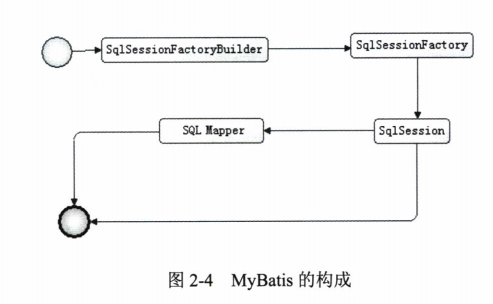

# MyBatis 基本构成

>核心组件
- SqlSessionFactoryBuilder 构造器：根据配置信息或者代码来生成SqlSessionFactory
- SqlSessionFactory 工厂结构：生成SqlSession
- SqlSession 会话： 可以发送sql去执行并返回加国，也可以获取Mapper接口
- SQL Mapper： 它是MyBatis新设计的组建，由一个Java接口和XML文件（或注解）构成，需要给出对应的SQL和映射规则。它负责发送SQL去执行，并返回结果。



> 构建SqlSessionFactory 

SqlSessionFactory通过对应的Builder获得：注意，SqlSessionFactory是一个工厂接口而不是实现类，他的任务是创建SqlSession（类似JDBC的Connection对象）。可用用配置文件和代码两种方式来创建，只推荐第一种。

```java
String resource = "mybatis-config.xml";
InputStream input = Resources.getResourceAsStream(resource);
SqlSessionFactory sqlSessionFactory = new SqlSessionFactoryBuilder().build(input);
SqlSession session = sqlSessionFactory.openSession();
//创建一个输入流，读取配置文件，放到Configuration里面，然后用其创建Factory和session

// code  do something

session.close();
```


```note
LMS
这里涉及到一个知识点。SqlSessionFactory是个接口，接口是不能用new方法创建对象的。父类引用指向子类对象，父类引用在这里就是父类接口引用。
```

- MyBatis又一个Configuration类用来存储配置参数。
- SqlSessionFactory有两个实现类
  - DefaultSqlSessionFactory - 正在使用
  - SqlSessionManager - 未被使用

SqlSession有两种用途
- `SqlSession通过update,insert,select,delete等方法，带上SQL的id来操作XML中配置好的SQL，同时支持事物，commit，rollback`
- 获取映射器，让映射器通过命名空间和方法找到对应的SQL，发送给数据库获得返回结果

### 1.映射器

- 1.由Java接口和XML文件（或注解）组成，作用：
  - 定义参数类型
  - 描述缓存
  - 描述SQL语句
  - 定义查询结果和POJO的映射关系

展示我自己的一套内容

```xml
<!-- LogMapper.xml -->
<?xml version="1.0" encoding="UTF-8"?>
<!DOCTYPE mapper
        PUBLIC "-//mybatis.org//DTD Mapper 3.0//EN"
        "http://mybatis.org/dtd/mybatis-3-mapper.dtd">

<mapper namespace="com.lms.etl.spark.mapper.LogMapper">
    <select id="getLog" parameterType="long" resultType="HiveETLLogs">
        select * from hiveetllogs where input_num=#{input_num} limit 1
    </select>
</mapper>

```

```xml
<!-- mybatis-config.xml片段 -->
    <mappers>
        <mapper resource="mybatisXML/HiveETLLogs.xml"/>
        <mapper resource="mybatisXML/LogMapper.xml"/>
        <!-- can not find when ~ running <mapper resource="com/lms/etl/spark/pojo/HiveETLLogs.xml"/>-->

    </mappers>
```

```java
// interface
package com.lms.etl.spark.mapper;

import com.lms.etl.spark.pojo.HiveETLLogs;

/**
 * @author: MissingLi
 * @date: 26/03/18 15:05
 * @Description: todo : this is a test for MyBatis
 * @Modified by:
 */
public interface LogMapper {
    public HiveETLLogs getLog(Long input_num);
}
```

```java
//测试代码
package com.lms.etl.spark.test;

import com.lms.etl.spark.pojo.HiveETLLogs;
import com.lms.etl.spark.mapper.LogMapper;
import org.apache.ibatis.io.Resources;
import org.apache.ibatis.session.SqlSession;
import org.apache.ibatis.session.SqlSessionFactory;
import org.apache.ibatis.session.SqlSessionFactoryBuilder;


import java.io.IOException;
import java.io.InputStream;


/**
 * @author: MissingLi
 * @date: 3/25/18 3:13 PM
 * @Description:
 * @Modified by:
 */
public class TestMyBatis {
    public static void main(String[] args) throws IOException {
        //HiveETLLogs log = new HiveETLLogs();
        String resource = "mybatis-config.xml";
        InputStream input = Resources.getResourceAsStream(resource);
        SqlSessionFactory sqlSessionFactory = new SqlSessionFactoryBuilder().build(input);
        SqlSession session = sqlSessionFactory.openSession();

        /**
         * test for interface pojo.LogMapper
         **/
        LogMapper logMapper = session.getMapper(LogMapper.class);
        HiveETLLogs log =logMapper.getLog(5L);
        System.out.println(log.getInput_num());
        session.close();

    }
}

```


## Mapper

Mapper是一个接口，没有任何实现类，它的作用是发送SQL，然后返回我们需要的结果，或者至执行SQL从而修改数据库数据。因此它应该在一个SqlSession事务方法之内，是一个方法级别的东西。