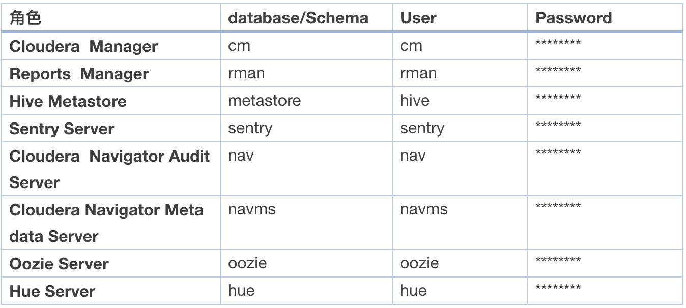

# CDH集群与高可用

```java
分为三大部分
1.CDH安装前置准备
2.CDH高可用配置-概述
3.CDH高可用配置-操作
```

## CDH安装前置准备

- 环境准备
  - 节点数量\
    最小规模`[开发/测试]`四台服务器,一台用作管理节点Cloudera Manager和NameNode,另外三台用于工作节点\
    `生产环境最小规模,最少6台`,三台管理节点(Cloudera Manager,NameNode*2),三个工作节点\
    常见较小生产系统10-20台
  - 操作系统\
    CDH支持主流64位linux系统,最常见部署选择为Redhat6.5/7.2
  - 安装用户`root或拥有sudo权限用户`
  - OS目录要求\
    - 磁盘建议`raid1或者raid10`
    - 如果只有一个根目录`/`,建议最少100GB(所有节点)
    - 方案1
    ```bash
    #一下容量均为建议最小容量
    / 10GB
    /opt 50GB
    /usr 50GB
    /var 20GB
    /var/log 50GB
    /var/lib 50GB
    /tmp 20GB
    # 总计250GB
    ```
    - 方案2
    ```bash
    / 10Gb
    /opt 50GB
    /usr 50GB
    /var 50GB
    /tmp 20GB
    ```
  - 硬件要求(所有系欸但相同)
    ```bash
    CPU:4 cores,推荐2路8核,2路10核,2路12核
    内存:最小16GB,推荐128GB-256GB
    网络:最小千兆,推荐两张万兆绑定
    磁盘:OS参考上方建议,DataNode数据盘推荐12块1TB-4TB的SATA/SAS盘
  - 磁盘要求
    - DataNode/NodeManager:
    `OS盘`可以使用raid1或者raid10,数据盘不适用raid,应为JBOD;`管理节点(NameNode,Zookeeper,JournalNode)`,可以使用raid或者JBOD,因为管理节点对I/O延迟标胶敏感,建议将`NN,ZK,JN`存放数据的目录配置为不同的目录,并对应到不同的磁盘.
    - DataNode数据盘建议选择ext4或xfs,并配置noatime
    - DataNode数据盘确认`没有配置分区卷`(LogicalVolume Manager-LVM)
    - 确保BIOS配置正确,比如使用SATA,确保没有开启IDE emulation
    - 确保controller firmware是最新的,校验磁盘是否有潜在问题
      - 磁盘读写速度应当不小于70MB/s `常见SATA读写速度在150MB/s~180MB/s`
      - 确保磁盘没有坏扇区
  - 网络要求
    - 关闭IPv6
    - 拥有静态IP
  - 全部配置`hostname`
  - 网卡-Network Interface Cards(NICs)`确保网卡双工(duplex)模式开启,保证速度正常`
  - `JDK` CDH支持JDK包括JDK7以及JDK8。Cloudera提供相应JDK包，并可有CM自动在集群中部署安装。CDH的版本都能提供对Oracle JDK7的支持，而JDK8的支持则需要CDH5.3之后的版本。目前在CDH发行版中自带的JDK版本为1.7.0_67版本。
  - `外部数据库选择`
  ```bash
  CM底层自动部署安装数据库进行系统配置、schema等并进行相应管理。同时CM也支持使用外部数据库作为系统配置、数据表结构等的底层存储，具体支持的数据库包括：
  MySQL：5.1、5.5、5.6、5.7
  PostgreSQL：8.1、8.3、8.4、9.1、9.2、9.3、9.4
  Oracle：11gR2、12c
      一般来说外部元数据库都会采用系统自带的MySQL服务。 确保以下配置：
  增加数据库的最大连接数
  确保数据库支持UTF-8编码
  配置为主备模式，参考如何实现CDH元数据库MySQL的主备

  为了元数据存放相互隔离，部署Cloudera Hadoop集群需要建立以下的数据库，同同时建议为每个数据库建   立单独的用户，隔离相互之间的访问。Cloudera提供的组件中需要使用到元数据库的，以及建议的对应命     名的规则和用户，如下表中所示。其中实际的数据库和用户名，需要最终进行确认。
  ```
  
  - OS安装包
  - `之后配置步骤同-集群部署CDH12安装.md`

## Cloudera产品高可用性配置(概述)

Apache Hadoop*集群中通常有多个用户长时间地运行多个作业。这些作业生成的数据分析具有商业上的重要性，可帮助公司节省大笔开支或产生收入。因此，集群的高可用性至关重要，几分钟、几小时或几天的宕机可能花费大量的金钱。

系统管理员面对的问题主要是Primary NameNode的单点故障。如果其中一个服务失败，则在问题解决前集群功能将不可用。而且，这些故障可能需要花费大量的时间和人力去解决，这将导致长时间宕机，这对公司业务尤其是关键业务来说是不可接受的。

要解决这些问题，Cloudera产品支持HDFS的高可用性（High Availability）功能。HDFS高可用性是Apache Hadoop*实施的一个开源解决方案。

本文将介绍如何为Cloudera产品设置高可用性。

### 高可用性架构

高可用性功能支持`Primary NameNod`e的a`ctive-standby`配置。这表示Primary NameNode在另一个节点上有一个`完全冗余的对象`，它只有当Primary NameNode发生故障时会被激活。`Primary NameNode的冗余对象被称为Standby NameNode`。

Primary NameNode负责集群中的HDFS操作，比如从HDFS读取文件并写入文件到HDFS。`Standby Namenode的作用是维护HDFS集群的状态，以便提供热备份`。热备份是指如果Primary NameNode发生故障时，能立即切换到Standby NameNode而不会产生服务中断的情况。

- 高可用性设计概述 \
    要成为热备份，Standby Namenode必须对以下数据有连续的、即时的读取权限：
    HDFS命名空间的更改，比如重命名、删除或创建文件。

    Primary NameNode存储编辑日志到一个名为Shared Edits的特定目录下。Standby NameNode对此目录的文件有读的权限，因此可根据存储在编辑日志中的数据来更新HDFS结构。这意味着对Primary NameNode命名空间做出的任何更改都将被复制到Standby NameNode的命名空间。

    DataNode已被配置为可同时发送块位置信息到Primary NameNode和Standby NameNode。

- 处理HDFS命名空间的更改 \
    当客户端在HDFS上执行写操作时，这一事件将首先被记录在预写式日志，或编辑日志。一旦编辑日志更改成功，Primary NameNode的文件系统结构的内存中信息将被更新。Standby NameNode文件系统结构必须和Primary NameNode的文件系统结构完全相同。这意味着`Standby Namenode必须对Primary NameNode的编辑日志有读的权限`。

    高可用性设计`使用shared edits目录`来达到这一要求。此目录是Primary NameNode存储和更新编辑日志文件的目录，也是Standby NameNode读取编辑日志的目录。Standby NameNode使用编辑日志中的信息来更新HDFS命名空间的内存中信息。此外，Standby NameNode不可改动编辑日志，只能读取。通过这些操作，Standby NameNode确保了HDFS文件结构会一直和Primary　NameNode保持一致。

    如果发生故障切换，Standby NameNode将确认在激活前它已读取所有编辑日志中的信息并更新了命名空间。因此，Standby NameNode在成为Primary NameNode之前，它的命名空间将保持和Primary NameNode同步。

- 访问Shared Edits目录的机制
    Shared Edits目录必须可被二个NameNode访问，且都对此目录的文件有读/写权限。此外，NameNode必须能不间断地读／写此目录，且二个NameNode都能一直访问同样的数据。高可用性HDFS支持以下二种授权NameNode访问Shared Edits目录的方式：\
    🔹  网络文件共享（NFS）\
    🔹  Quorum Journal Manager

- 为共享存储使用NFS\
    Shared Edits目录可被放在服务器的某个目录，即NFS挂载NameNode的服务器。你可能只有一个Shared Edits目录，因此NFS将会成为HDFS单点故障所在点。如果NFS出现问题，则HDFS客户端将不能写入数据到HDFS。因此，存储Shared Edits目录的服务器应被配置为高可用、高质量的专用NAS设备。

- 为共享存储使用Quorum Journal Manager\
    在多数组织中，将Shared Edits目录存放在挂载的NFS上是可被接受的方式，这通常也符合公司现存的整体架构。但是，对有些组织来说，NFS挂载选项可能造成以下问题。

    🔹  成本和客户硬件问题 — 由于NFS挂载可能是HDFS单点故障（SPOF）所在点，强烈建议用户将Shared Edits目录放在NAS设备上。NAS设备通常很昂贵，而且要求特别的设备用于维护和操作。

    🔹  操作、实施和管理 —除了部署HDFS外，NFS挂载还要求额外的配置、监控和维护。这将增加高可用性设置的复杂性，并可能导致NFS配置错误。如果NFS配置错误，这将导致HDFS不能工作。最后，存放Shared Edits目录的服务器或NAS设备将增加机构对外部设备的依赖性，这一点对管理和维护NameNode影响重大。

    🔹  NFS客户端有很多缺陷—在Linux操作系统中，NFS客户端尚有很多缺陷，且难以配置。而且，每个客户端的具体实施可能不尽相同，也就是说，预测客户端的行为将很困难，而且每个客户端的行为都不相同。因此，将NFS客户端挂载在Shared Edits目录很容易导致错误，这将使得NameNode不能读或写该目录。

`要解决这一问题`，Apache Hadoop*社区用QuorumJournalManager （QJM）作为NFS选项外的另一个选择。QuorumJournalManager是一个分布式应用程序，它将相同的HDFS编辑日志存储在集群的多个节点上。

- QuorumJournalManager的功能
    QuorumJournalManager设计具有NFS不具备的以下优点：

    🔹  没有单点故障 — 如果QuorumJournalManager集群中的一个或多个节点宕机，则HDFS编辑日志的备份将在集群中的另一个节点上变为可用。QJM集群中允许失败且失败后可继续提供服务的节点数量根据以下算法计算： (N - 1) / 2
    例如，如果集群中有5个JournalNode，则允许失败的节点数量是 2，且失败后可继续提供服务。例如，如果集群中有3个JournalNode，则允许失败且的节点数量是1，且失败后可继续提供服务。

    🔹  无需特殊硬件或外部依赖 — 不像NFS通常要求有NAS设备，这一选项对硬件或服务无特殊要求。Quorum Journal Manager可部署在部署了饢的同一标准硬件上。实际操作中，推荐将Quorum Journal Manager安装在已安装饢软件的同一节点上。

    🔹  无需硬件隔离 — 在故障恢复中，隔离之前运行的NameNode是通过软件完成的。

    🔹  用户可定义故障恢复节点数 — QuorumJournalManager可定义集群中的故障恢复节点数。每个节点上都有和其它节点上一样的数据备份。因此，你可指定集群的大小，且可指定可用节点数目以提供服务。

    🔹  网络延迟将影响所有节点 — QuorumJournalManager集群中节点的编辑日志数据的复制不会影响对编辑日志数据的读／写速度。而且，增加要复制编辑日志数据的节点数会在NameNode读取数据时造成网络延迟。

- QuorumJournalManager设计概述
    应用程序包含由数个节点组成的集群，HDFS编辑日志存储在每个节点上。在QuorumJournalManager集群中，节点被称为JournalNode。QuorumJournalManager使用分布式协议来确保每个节点上的数据在任何时候都和其他节点同步，且只有激活的NameNode可编辑HDFS编辑日志。

    NameNode是消耗QuorumJournalManager资源的客户端。每个NameNode上都运行QuorumJournalManager服务。Primary NameNode使用QJM服务来对一组JournalNode（JN）进行写入编辑操作。QJM在多数节点返回成功消息后，将认为写入编辑已成功。一旦集群确认编辑完成，编辑日志的某一部分可能只能从QuorumJournalManager集群读取。因此，Standby NameNode可使用QJM来读取集群中任何节点上的编辑日志复制数据，并确保该复制数据和集群中其他的复制数据完全一致。

- 发送块位置信息到NameNode
    要让Standby NameNode成为热备份，`必须保证它有最新的所有DataNode上所有文件的块位置信息`。在HDFS中，DataNode负责向NameNode周期性报告存储在其中的快信息。NameNode不负责也不读取编辑日志的块位置信息。因此，高可用性设计中将通过改变DataNode报告块信息的方式来完成这一点。

    在高可用性配置中，Primary NameNode和Standby NameNode的网络地址在每个节点的`hdfs-site.xml`文件中被定义。通过配置文件中定义的网络地址，DataNode发出数据块报告、块位置更新信息和心跳到这二个NameNode。但是，DataNode仅执行Primary NameNode发出的数据块有关命令。

- 和NameNode的客户端通信
    HDFS高可用性不支持NameNode的active-active配置模式。这表示在任何时候，只能有一个NameNode用于管理HDFS命名空间和处理HDFS客户端请求。为确保HDFS客户端仅和active状态的NameNode通讯，客户端将会：

    🔹  HDFS客户端有存储在配置文件中的每个NameNode的网络地址。
    🔹  客户端将尝试和配置文件中的第一个地址通信。
    🔹  如果客户端返回Standby NameNode的消息，则服务将返回消息表示这是一个Standby NameNode，客户端需要尝试和另一个NameNode通信。
    🔹  如果客户端收到上一步所述消息，则它将放弃和Standby NameNode的通信，然后和另一个NameNode建立通信。

    `以上过程将重复直至找到active状态的NameNode。如果客户端不能找到active状态的NameNode，则通信将失败并终止。`

- NameNode故障恢复
    故障恢复从Primary NameNode切换到Standby NameNode时，可以是人工或自动操作。以下内容描述了每种故障恢复模式。

- 人工故障恢复
    在高可用性HDFS集群中，管理员可使用以下新命令：`hdfs haadmin`。这一命令有一个名为 `-failover`的子命令。failover子命令有二个额外的参数。第一个参数是当前active状态的NameNode的逻辑名，第二个参数是当前Standby NameNode的逻辑名。执行命令后，故障恢复尝试从Primary NameNode切换到Standby NameNode。

- 自动故障恢复
    热备份的一个重要特征是当active状态的节点不能提供服务时进行实时故障恢复。要达到这一要求，高可用性HDFS功能支持自动故障恢复。自动故障恢复是指当服务探测到active状态的节点不能提供服务时，通过程序或服务立即触发故障恢复。

    `如果启用了自动故障恢复，高可用性配置中将增加二个组件。这些组件负责处理自动故障恢复。`\
    🔹  `ZooKeeper quorum`\
    🔹  `ZKFailoverController （ZKFC）`

- `Apache ZooKeeper (ZK) *是一个高可用性协调服务`\
    用于维护分布式应用程序的状态、进程和配置数据。ZooKeeper quorum是ZooKeeper集群中的一组节点，用来存储单个应用程序的数据。在高可用性自动故障恢复中，ZooKeeper quorum提供以下功能：\
    🔹  探测NameNode的失败 — 每个NameNode的状态在ZK quorum都作为持续进程进行维护。如果有NameNode进入无法提供服务的状态，则ZK进程将失效，并通知另一NameNode此状态。如果无法提供服务的NameNode之前为active状态，则其他NameNode将触发故障恢复，使自己成为active状态的节点。\
    🔹  为NameNode的推选和状态设置锁 — 要表示哪个NameNode是active状态的，当前active状态的NameNode会在ZK quorum中被锁定。锁定表示了二个NameNode中哪个NameNode是active 状态的。NameNode只有在获得此ZK锁之后才会将状态改变为非active或active。

    如果active状态的NameNode进入非服务状态（OOS），这将导致另一个NameNode触发故障恢复。如果active状态的NameNode失败，则Standby NameNode将获得ZK锁然后成为active状态的NameNode。因此 ，如果active状态的NameNode进入非服务状态 （OOS），Standby NameNode开始故障恢复，且active状态的NameNode在故障恢复过程中重新回到服务状态，在此情形下由于有ZK锁，Standby NameNode仍将成为active状态的NameNode。

- ZKFC是指ZooKeeper客户端\
    用于运行二个NameNode。ZK客户端提供以下功能：\
    🔹  状态监控 — 定期发送心跳到NameNode，以检查NameNode是否运行状态良好。如果NameNode及时对发送的心跳返回状态良好的信息，则ZKFC将认为NameNode可用且状态良好。如果NameNode没有在一定的时间内返回信息或返回的状态为非良好状态，则ZKFC将认为NameNode状态错误。\
    🔹  ZooKeeper进程和锁定管理 — 一旦ZKFC认为NameNode状态良好，则ZKFC将在ZK quorum中对此维护一个持续进程。此进程表示NameNode状态良好且可用。如果ZKFC判定NameNode状态错误，则ZKFC将在ZK quorum中终止这一进程。如果进程终止且NameNode当前为active状态，则用于active状态的ZK锁将被释放。\
    🔹  锁必须永远在其中一个NameNode上。\
    🔹  Active状态的NameNode推选 —如果ZKFC判定NameNode运行状态良好，且其他NameNode没有ZK锁，则ZKFC将为NameNode尝试获取锁。如果ZKFC成功获得锁，则ZKFC必须触发一个故障恢复以使得NameNode成为active状态的NameNode。

- 通过隔离防止脑裂现象\
    高可用性HDFS不支持双机热配置，也就是说，同一时间内只有一个NameNode可成为active状态。如果二个NameNode同时成为active状态，则每个节点上的HDFS命名空间将与对方快速分离。如果HDFS结构分离，则很有可能HDFS上的数据会丢失或损坏。而且，HDFS客户端可在二个NameNode上执行同一操作，但从一个NameNode返回的结果可能和另一个NameNode返回的结果明显不同。

    脑裂现象的产生是由于二个节点都认为在active-standby集群中自己是active状态的节点。以HDFS为例，这意味这二个NameNode都认为自己是active状态的节点，其他节点是Standby NameNode。要确保高可用性HDFS中没有数据丢失、损坏或不一致，防止脑裂现象非常重要。

    在集群中，隔离进程用于将工作不正常的服务孤立起来，以防止该服务访问共享资源。在高可用性HDFS中，隔离进程发生在NameNode推选之后，新的active状态的NameNode会验证之前为active状态的NameNode将不能编辑HDFS命名空间。

- Fencing of the Shared Edit Directory on a NFS\
    为防止脑裂现象，高可用性HDFS在故障恢复成功前将执行以下隔离进程：
    🔹  尝试验证之前为active状态的NameNode已不再是active状态。如果成功验证之前为active状态的NameNode已不再是active状态，则其他NameNode将成为active状态。\
    🔹  如果不能验证之前为active状态的NameNode是否还是active状态，则启用隔离机制。隔离操作将`尝试找到并终止之前为active状态的NameNode服务`，从而防止之前为active状态的NameNode访问Shared Edits目录。\
    🔹  如果隔离机制成功，则其他NameNode将成为active状态。如果隔离机制不成功，则故障恢复不会发生。

- Fencing of the Shared Edit Directory in QuorumJournalManager
    `隔离是建立在QJM上的`，它不需要额外的或特别的硬件和软件。在QJM中，NameNode被认为是写入者，即对编辑日志进行更改的节点。要确保只有active状态的NameNode被允许更改编辑日志，当NameNode成为active时，`QJM将会被分配一个纪元号（epoch number）`。而且，写入者将不可写入编辑日志，直至确认之前所有的写入者都已停止写入该编辑日志文件。

- 纪元号是指带有以下属性的整数：
    🔹  纪元号同时存储在QJM和所有的JournalNode上。\
    🔹  对于二个NameNode来说，纪元号具有唯一性。二个NameNode永远不可能有同一个纪元号。\
    🔹  要生成纪元号，NameNode的QJM从所有的JournalNode上获取纪元号。QJM将找出最高的纪元号，加上1，结果即为新的纪元号。\
    🔹  纪元号定义了写入者的顺序，这样QJM和JN可决定写入者比之前的写入者新还是旧。如果NameNode的纪元号比其他NameNode的纪元号高，则纪元号较高的NameNode相对于另一个NameNode，被认为是新的写入者。

- QJM通过以下方式使用纪元号：\
    🔹  在NameNode被允许更改编辑日志前，QJM必须已被成功分配纪元号。\
    🔹  当NameNode成为active状态时，纪元号会生成并分配给该NameNode。HDFS命名空间第一次被格式化后，第一个active状态的NameNode将被分配纪元号1。任何故障恢复都将导致纪元号的增加。\
    🔹  在纪元号被成功分配给QJM前，QJM必须发送纪元号到集群中的所有JournalNode上。多数JournalNode必须返回一个消息，标明纪元号已成功收到，否则QJM将不能使用该纪元号。\
    🔹  如果QJM回应纪元号的消息请求，它将存储这一纪元号以便日后参考。无论何时QJM发送写请求到JN，纪元号都包含在请求中。\
    🔹  当JN收到QJM发送的写请求时，JN会将消息请求中的纪元号和存储在本地的纪元号进行对比。如果请求中的纪元号低于JN的纪元号，JN将拒绝写请求。如果请求中的纪元号高于JN的纪元号，JN将更新纪元号以使之和请求中的纪元号匹配并允许写入。

- 根据QJM使用纪元号的方式，脑裂现象将通过以下方式处理：\
    🔹  如果NameNode能成功写入到多数JournalNode，NameNode只可写入到编辑日志。因此，多数JournalNode必须接受NameNode的纪元号作为新的纪元号。\
    🔹  当NameNode成为active状态时，它的纪元号总是比其他之前曾是active状态的NameNode高。\
    🔹  如果二个NameNode都认为自己是active状态，则允许写入编辑日志的唯一NameNode是纪元号最新的那个NameNode。纪元号较旧的NameNode将被禁止更改HDFS命名空间。

## 设置高可用性的要求

- 在通过QJM方式配置HDFS高可用性前，你需要了解或准备以下事项：\
    🔹  Standby NameNode和Primary NameNode必须具有相同的硬件配置，包括CPU、内存和磁盘大小。\
    🔹  Cloudera推荐你把JournalNode部署在元数据节点上（Primary NameNode、Standby NameNode、JobTracker等）\
    🔹  为避免某个机架成为单点故障，高可用性配置中的任一节点（Primary NameNode、Standby NameNode、JobTracker和Backup JobTracker）不能和高可用性配置中的其他节点位于同一机架上。\
    🔹  你需要决定是否启用自动故障恢复。如果自动故障恢复被启用，你必须已在集群中安装了ZooKeeper组件，并指定一个ZooKeeper quorum来处理自动故障恢复。ZooKeeper组必须包含奇数个节点，且必须包含至少三个节点。\
    🔹  如果高可用性被启用，则集群内`不必有secondary namenode`或其他检查点的服务。原因在于Standby NameNode可提供此类检查点的服务。\
    🔹  `如果你有非高可用性集群`且在HDFS中存有数据，则你需要决定在启用高可用性时是否保留这些HDFS数据。如果你需要进行这一操作，你需要知道如下限制：\
       ·  来自非高可用性集群的DataNode和NameNode不可从集群中删除。\
       ·  来自非高可用性集群的DataNode和NameNode在启用高可用性后，不可从之前所在机架中删除。\
       ·  来自非高可用性集群的DataNode的之前所在目录不可被删除。\
    🔹  如果你选择使用Quorum Journal Manager（QJM），则你必须决定QJM集群中有多少节点。节点数量决定了集群是如何容错的。QJM集群中允许失败且失败后可继续提供服务的节点数量根据以下算法计算： (N - 1) / 2\
    🔹  例如，如果集群中有5个JournalNode，则允许失败的节点数量是 2，且失败后可继续提供服务。例如，如果集群中有3个JournalNode，则允许失败且的节点数量是1，且失败后可继续提供服务。

## 高可用操作

参考链接:http://www.cloudera.com/documentation/enterprise/latest/topics/cdh_hag_hdfs_ha_config.html