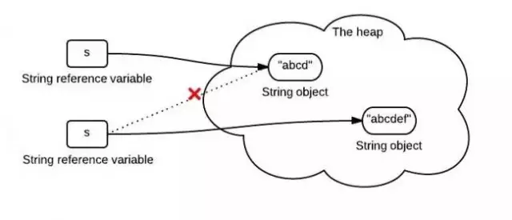
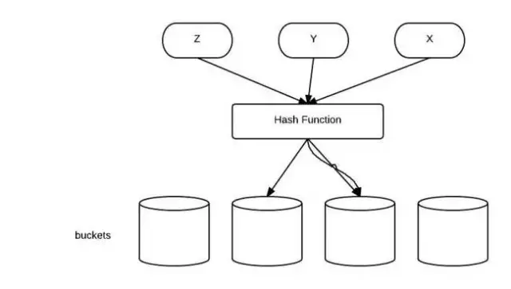
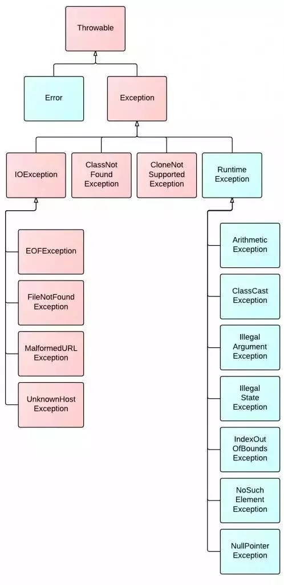
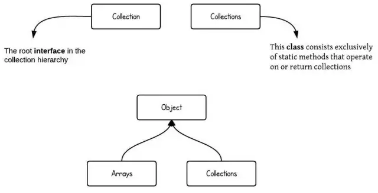
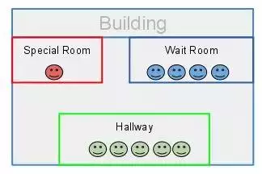
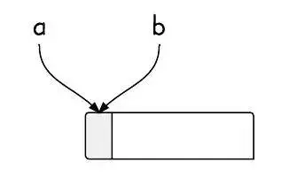
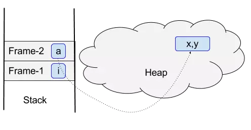
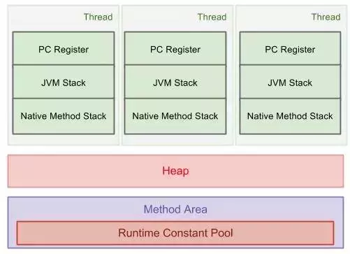

# Java

### 字符串不变性

下面这张图展示了这段代码做了什么 

String s = "abcd"; 
s = s.concat("ef");

### equals()方法、hashCode()方法的区别

HashCode被设计用来提高性能。equals()方法与hashCode()方法的区别在于：

1. 如果两个对象相等(equal)，那么他们一定有相同的哈希值。
2. 如果两个对象的哈希值相同，但他们未必相等(equal)。

### Java异常类的层次结构

图中红色部分为受检查异常。它们必须被捕获，或者在函数中声明为抛出该异常。 

### 集合类的层次结构

注意Collections和Collection的区别。（Collections包含有各种有关集合操作的静态多态方法）

### Java同步

> MissionLee : 这里需要参考其他多线程同步的相关文章

Java同步机制可通过类比建筑物来阐明。

### 别名

别名意味着有多个变量指向同一可被更新的内存块，这些别名分别是不同的对象类型。

### 堆和栈

图解表明了方法和对象在运行时内存中的位置。 

### Java虚拟机运行时数据区域

图解展示了整个虚拟机运行时数据区域的情况。 

> MissionLee： 补充了一下内容的说明

- 栈区
  - PC Register (Program Counter Register) 程序计数器寄存器 
    - JVM支持同一时间同时运行多个线程,每一个线程都有它们自己的pc register。在同一个时刻,JVM的线程只能运行一个单独方法中的代码,此方法称为该线程的当前方法(Current Method)。 如果这个当前方法不是native的,PC register就指向正在被执行的JVM指令的地址。而如果一个当前方法是native的,则pc register中的值是不确定的。Pc register有足够的空间来存储returnAddress或者native指针。
  - JVM stacks 
    - 每一个JVM线程均有一个私有的栈,与线程是同时创建的。一个JVM的栈中存放了很多frames,JVM的栈和C语言中的栈的概念很类似,它是用来存放本地变量和partial结果的(partial results),并且在方法调用和返回时起到一定作用。由于对栈的操作只有push和pop,所以可以用堆分配。JVM的栈在内存中不要求连续存放。 
    - JVM的规范中允许栈可以是固定尺寸的,也可以根据需要动态扩展或收缩其尺寸。开发或者用户可以设定栈的初始尺寸,对于动态栈空间的情况,也可以设定栈的最大和最小值。 
      下面是与栈操作的一些相关异常: 
      1.如果一个线程所需的栈空间大于允许值,则抛出StackOverFlowError; 
      2.如果一个线程的栈可以动态扩展,但当需要扩展栈空间时发现内存空间不足;或者在初始化栈空间时,就发现内存不足了,则抛出OutOfMemoryError; 
  - Native Method Stack 运行时数据区域——本地方法栈
    -  本地方法栈（Native Method Stack）与虚拟机栈所发挥的作用是非常相似的，他们之间的区别不过是虚拟机栈为虚拟机执行Java方法（也就是字节码）服务，而本地方法栈则为虚拟机使用到的Native方法服务。在虚拟机规范中对本地方法栈中方法使用的语言、使用方式与数据结构并没有强制规定，因此具体的虚拟机剋有自由实现它。甚至有的虚拟机（譬如Sun HotSpot虚拟机）直接就把本地方法栈和虚拟机栈合二为一。与虚拟机栈一样，本地方法栈区域也会抛出StackOverflowError和OutOfMemoryError异常。

- Heap 堆区
  - 1.存储的全部是对象，每个对象都包含一个与之对应的class的信息。(class的目的是得到操作指令)
  - 2.jvm只有堆区(heap)和方法区(下面)被所有线程共享，堆中不存放基本类型和对象引用，只存放对象本身.
  - 3.一般由程序员分配释放， 若程序员不释放，程序结束时可能由OS回收 。
- 静态区/方法区
  - 1.方法区又叫静态区，跟堆一样，被所有的线程共享。方法区包含所有的class和static变量。
  - 2.方法区中包含的都是在整个程序中永远唯一的元素，如class，static变量。
  - 3.全局变量和静态变量的存储是放在一块的，初始化的全局变量和静态变量在一块区域， 未初始化的全局变量和未初始化的静态变量在相邻的另一块区域。

- 方法区中，每个类存储的数据
  - a.类及其父类的全限定名（java.lang.Object没有父类）
  - b.类的类型（Class or Interface）
  - c.访问修饰符（public, abstract, final）
  - d.实现的接口的全限定名的列表
  - e.常量池
  - f.字段信息
  - g.方法信息
  - h.静态变量
  - i.ClassLoader引用
  - j.Class引用

> 可见类的所有信息都存储在方法区中。由于方法区是所有线程共享的，所以必须保证线程安全，举例来说，如果两个类同时要加载一个尚未被加载的类，那么一个类会请求它的ClassLoader去加载需要的类，另一个类只能等待而不会重复加载。
>
> 此外为了加快调用方法的速度，通常还会为每个非抽象类创建私有的方法表，方法表是一个数组，存放了实例可能被调用的实例方法的直接引用。方法表对于多态有非常重要的意义，具体可以参照《[**浅谈多态机制的意义及实现**](http://blog.hesey.net/2010/12/significance-and-implementation-of-polymorphism.html)》一文中“多态的实现”一节。

