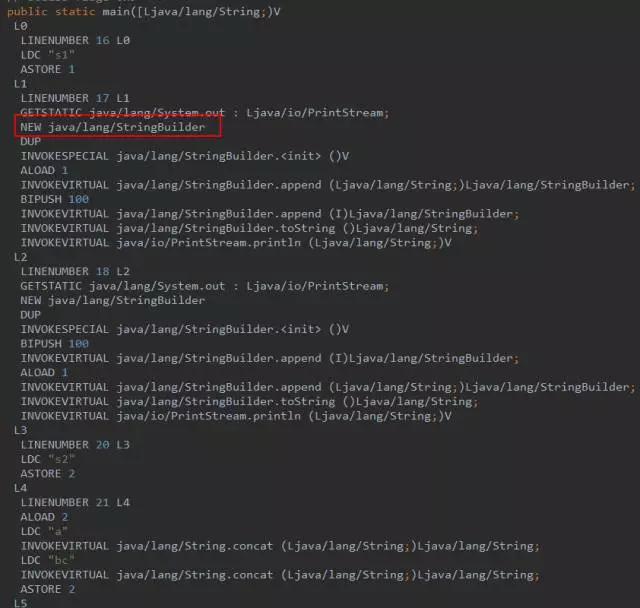

+和concat都可以用来拼接字符串，但在使用上有什么区别呢，先来看看这个例子。

```java
public static void main(String[] args) {    
    // example1    
    String str1 = "s1";    
    System.out.println(str1 + 100);
    //s1100    
    System.out.println(100 + str1);
    //100s1    
    String str2 = "s2";    
    str2 = str2.concat("a").concat("bc");    
    System.out.println(str2);
    //s2abc

    // example2    
    String str3 = "s3";    
    System.out.println(str3 + null);
    //s3null    
    System.out.println(null + str3);
    //nulls3    
    String str4 = null;    
    System.out.println(str4.concat("a"));
    //NullPointerException    
    System.out.println("a".concat(str4));
    //NullPointerException}
```

concat源码：

```java
public String concat(String str) {    
    int otherLen = str.length();    
    if (otherLen == 0) {        return this;    }    
    int len = value.length;    
    char buf[] = Arrays.copyOf(value, len + otherLen);    
    str.getChars(buf, len);    
    return new String(buf, true);
}
```

看下生成的字节码：



#### 所以可以得出以下结论：

- +可以是字符串或者数字及其他基本类型数据，而concat只能接收字符串。
- +左右可以为null，concat为会空指针。
- 如果拼接空字符串，concat会稍快，在速度上两者可以忽略不计，如果拼接更多字符串建议用StringBuilder。
- 从字节码来看+号编译后就是使用了StringBuiler来拼接，所以一行+++的语句就会创建一个StringBuilder，多条+++语句就会创建多个，所以为什么建议用StringBuilder的原因。