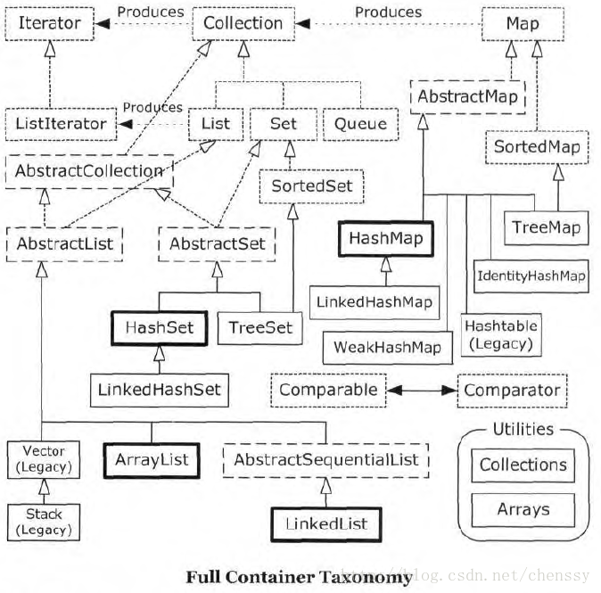
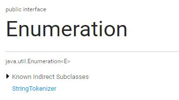
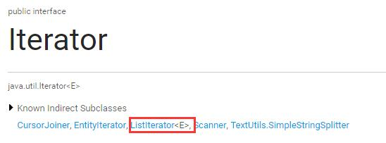

## collection

```note
我的总结
iterator是 collection默认规定各个实现类都要又的一个组成部分，
每个部分的实现方式思路基本相同，其速度也和底层存储数据的机构有关
必须实现的又四个方法
next()  返回下一个
hasNext() 判断是否还有下一个
remove()  删除当前指向的元素
foreachRemaining() 对每个元素执行 传入的操作
```


## 1.Iterator 迭代器

Java 提供的 集合类都在 Java.utils 包下，其中包含了很多 List, Set, Map, Queue… 它们的关系如下面这张类图所示：



可以看到，Java 集合主要分为两类：Collection 和 Map. 而 Collection 又继承了 Iterable< E > 接口，Iterable 接口内只有一个 iterator 方法，返回一个 Iterator 迭代器:

```java
public interface Iterable<T> {

    /**
    * Returns an {@link Iterator} for the elements in this object.
    *
    * @return An {@code Iterator} instance.
    */
    Iterator<T> iterator();
}
```

本篇文章将介绍 Iterator 迭代器。 在介绍 Iterator 之前不得不提一下被它替代的 Enumeration< E >:

Enumeration< E >



```java
public interface Enumeration<E> {

/**
 * Returns whether this {@code Enumeration} has more elements.
 *
 * @return {@code true} if there are more elements, {@code false} otherwise.
 * @see #nextElement
 */
    public boolean hasMoreElements();

/**
 * Returns the next element in this {@code Enumeration}.
 *
 * @return the next element..
 * @throws NoSuchElementException
 * if there are no more elements.
 * @see #hasMoreElements
 */
    public E nextElement();
}
```

- Enumeration 是一个很古老的迭代器，有两个方法：
  - hasMoreElements() //是否还有元素
  - nextElement() //返回下一个元素
- Enumeration 的实现类会生成一系列子元素，比如 StringTokenizer；通过 Enumeration 的上述两个方法可以用来遍历它实现类的元素，比如这样：

```java
    //StringTokenizer : 切割, Breaks a string into tokens; new code should probably use {@link String#split}.
    Enumeration enumeration = new StringTokenizer("A-B-C", "-");
    while (enumeration.hasMoreElements()){
        System.out.println(enumeration.nextElement());
    }
```

运行结果： A B C


Enumeration 接口早在 JDK 1.0 时就推出了，当时比较早的容器比如 Hashtable, Vector 都使用它作为遍历工具。
那 Enumeration 为什么会被废弃呢？

`根据官方文档:`
NOTE: The functionality of this interface is duplicated by the Iterator interface. In addition, Iterator adds an optional remove operation, and has shorter method names. New implementations should consider using Iterator in preference to Enumeration.

可以大胆猜一下，应该是当初设计没有考虑全，只有两个方法，而且名字还太长了 - -。 后来在 JDK 1.2 推出了 Iterator 替代它的功能。虽然 Enumeration 在 JDK 1.5 后增加了泛型的应用，依旧大势已去。


### Iterator




Iterator 是一个集合上的迭代器，用来替代 Enumeration 进行遍历、迭代。

它 和 Enumeration 有什么不同呢？

`根据官方文档:`
Iterators differ from enumerations in two ways:
Iterators `allow the caller to remove elements` from the underlying collection during the iteration `with well-defined semantics`.
Method names have been improved.

- 首先是名字缩短了，看来大家都懒得输入那么长的方法名。 
- 其次是 `允许调用者在遍历过程中语法正确地删除元素。`

注意这个 [语法正确]，事实上我们在使用 Iterator 对容器进行迭代时如果修改容器 可能会报 ConcurrentModificationException 的错。

官方称这种情况下的迭代器是 `fail-fast 迭代器。`

>fail-fast 机制是java集合(Collection)中的一种错误机制。当多个线程对同一个集合的内容进行操作时，就可能会产生fail-fast事件。例如：当某一个线程A通过iterator去遍历某集合的过程中，若该集合的内容被其他线程所改变了；那么线程A访问集合时，就会抛出ConcurrentModificationException异常，产生fail-fast事件。

>要了解fail-fast机制，我们首先要对ConcurrentModificationException 异常有所了解。当方法检测到对象的并发修改，但不允许这种修改时就抛出该异常。同时需要注意的是，该异常不会始终指出对象已经由不同线程并发修改，如果单线程违反了规则，同样也有可能会抛出改异常。

>诚然，迭代器的快速失败行为无法得到保证，它不能保证一定会出现该错误，但是快速失败操作会尽最大努力抛出ConcurrentModificationException异常，所以因此，为提高此类操作的正确性而编写一个依赖于此异常的程序是错误的做法，正确做法是：ConcurrentModificationException 应该仅用于检测 bug

fail-fast 与 ConcurrentModificationException
以 ArrayList 为例，在调用迭代器的 next，remove 方法时：

```java
// li : 这里也是 就版本的 jdk 里面的方法了 ， jdk1.8里面有一个专门的函数来判断是否 出现了 并发修改的情况,原理是一样的，后面有这个函数的内容
    public E next() {
        // 这个代码是 Arrayist 下面的代码
        // 这里的 E 是 ArrayList 类传入的泛型
        if (expectedModCount == modCount) {
            // expectedModCount 应该是 当前线程 拿到的时候记录下来的版本号
            // modCount 是一个静态 变量 ，所以线程 进行操作的时候都会更新这个值
            try {
                E result = get(pos + 1);
                lastPosition = ++pos;
                return result;
            } catch (IndexOutOfBoundsException e) {
                throw new NoSuchElementException();
            }
        }
        // 如果（其他线程）改动了 modCount 那么 就不能操作了
        throw new ConcurrentModificationException();
    }
/**
下面这个小函数是从 1.8 里面复制过来的 并发修改的判断函数
*/
    final void checkForComodification() {
        // li ：  expectedModCount 是 这个 iterator 创建的时候记录下来的 modCount ，用这个值 ，和进行操作时候的 实时modCount 进行对比，从而得到 是否出现并发修改的结论
        
        if (modCount != expectedModCount)
            throw new ConcurrentModificationException();
    }

    public void remove() {
        if (this.lastPosition == -1) {
            throw new IllegalStateException();
        }

        if (expectedModCount != modCount) {
            throw new ConcurrentModificationException();
        }

        try {
            AbstractList.this.remove(lastPosition);
        } catch (IndexOutOfBoundsException e) {
            throw new ConcurrentModificationException();
        }

        expectedModCount = modCount;
        if (pos == lastPosition) {
            pos--;
        }
        lastPosition = -1;
    }
```

可以看到在调用迭代器的 next，remove 方法时都会比较 `expectedModCount` 和 `modCount` 是否相等，如果不相等就会抛出 `ConcurrentModificationException` ，也就是成为了 `fail-fast`。

而 modCount 在 add, clear, remove 时都会被修改：

```java
public boolean add(E object) {
    //...
    modCount++;
    return true;
}

public void clear() {
    if (size != 0) {
        //...
        modCount++;
    }
}

public boolean remove(Object object) {
    Object[] a = array;
    int s = size;
    if (object != null) {
        for (int i = 0; i < s; i++) {
            if (object.equals(a[i])) {
                //...
                modCount++;
                return true;
            }
        }
    } else {
        for (int i = 0; i < s; i++) {
            if (a[i] == null) {
                //...
                modCount++;
                return true;
            }
        }
    }
    return false;
}
```

因此我们知道了 fail-fast 即 ConcurrentModificationException 出现的原因，怎么解决呢？

- 方法一:

用 `CopyOnWriteArrayList`，`ConcurrentHashMap` 替换 ArrayList， HashMap，它们的功能和名字一样，在写入时会创建一个 copy，然后在这个 copy 版本上进行修改操作，这样就不会影响原来的迭代。不过坏处就是浪费内存。

- 方法二：

使用 `Collections.synchronizedList` 加 同步锁，不过这样有点粗暴。

- 可能得方法三（待考究，目前我还没搞清楚）：

在学习 ListView （安卓中的）中的观察者模式 时，我注意到 DataSetObservable 的 notifyChanged 方法中有如下注释：

```java
public void notifyChanged() {
    synchronized(mObservers) {
        // since onChanged() is implemented by the app, it could do anything, including
        // removing itself from {@link mObservers} - and that could cause problems if
        // an iterator is used on the ArrayList {@link mObservers}.
        // to avoid such problems, just march thru the list in the reverse order.
        for (int i = mObservers.size() - 1; i >= 0; i--) {
            mObservers.get(i).onChanged();
        }
    }
}
```

to avoid such problems, just march thru the list in the reverse order

为了避免影响 ArrayList 迭代，倒序处理。 待考究，目前我还没搞清楚。

不过意外的发现了，原来 `for-each 的循环内部也是使用了 Iterator 来遍历Collection`，它也调用了 `Iterator.next()`，所以在修改元素时会检查(元素的)变化并抛出 `ConcurrentModificationException`。

在从任何 Collection中删除对象时总要使用 `Iterator 的remove` 方法， for-each 循环只是标准 Iterator 代码标准用法之上的一种语法糖（syntactic sugar）而已。
差点忘了 Iterator 的使用

所有 Collection 的子类都有 iterator() 方法来获得 Iterator，通过 Iterator 的标准操作方法，可以让我们不必关心具体集合的类型，从而避免向客户端暴露出集合的内部结构。
不使用 Iterator 遍历集合是这样的：
```java
    for(int i=0; i<集合的大小;i++){  
        // ... 
    } 
```
使用 Iterator 遍历集合是这样的：
```java
    Iterator iterator = list.iterator();
    while (iterator.hasNext()){
        System.out.println(iterator.next());
    }
```

对比而言，后者客户端代码与具体集合类型耦合性弱，复用性更强。缺点就是无法获取指定的元素，只能挨个遍历。

Thanks

https://docs.oracle.com/javase/8/docs/api/java/util/Enumeration.html

https://docs.oracle.com/javase/8/docs/api/java/util/Iterator.html

http://javahungry.blogspot.com/2014/04/fail-fast-iterator-vs-fail-safe-iterator-difference-with-example-in-java.html

http://www.cnblogs.com/dolphin0520/p/3933551.html

http://blog.csdn.net/chenssy/article/details/38151189

http://blog.csdn.net/mazhimazh/article/details/17730517

http://javarevisited.blogspot.jp/2014/04/for-each-loop-puzzle-in-java-example.html