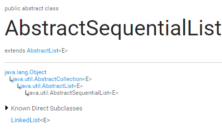
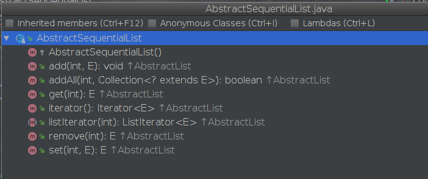

# AbstractSequentialList 

没有什么特别的，这里介绍是为了理解 LinkedList 更容易。



什么是 AbstractSequentialList
（ Sequential 相继的，按次序的）

AbstractSequentialList 继承自 AbstractList，是 LinkedList 的父类，是 List 接口 的简化版实现。

简化在哪儿呢？简化在 AbstractSequentialList `只支持按次序访问`，而不像 AbstractList 那样支持随机访问。

想要实现一个支持按次序访问的 List的话，只需要继承这个抽象类，然后把指定的抽象方法实现就好了。需要实现的方法：

- size()
- listIterator()，返回一个 ListIterator

你需要实现一个 ListIterator, 实现它的 hasNext(), hasPrevious(), next(), previous(), 还有那几个 获取位置 的方法，这样你就得到一个不可变的 ListIterator 了。如果你想让它可修改，还需要实现 add(), remove(), set() 方法。

正如在 每个 Collection 接口 中提倡的那样，AbstractSequentialList 的子类需要提供两个构造函数，一个无参，一个以 Collection 为参数。

成员函数

- AbstractSequentialList 在 AbstractList 的基础上实现了以下方法：



1.获取迭代器：

```java
// ----------------这几个是不知道哪个版本jdk的----------------
public Iterator<E> iterator() {
    //调用继承自
    return listIterator();
}

//继承 AbstractList 的 listIterator()
public ListIterator<E> listIterator() {
    return listIterator(0);
}

//需要实现类实现的方法
public abstract ListIterator<E> listIterator(int index);

//-------------------------下面      1.8版本的
    // Iterators
    // ！！！  这里可以看到 个别细节思路实际上是不一样的
    //        上面那个版本，在 抽象类里面就实现了对于 有/无 参的 iterator 的支持
    // 1.8版本里面， 调用 iterator 直接返回一个 空参的
    public Iterator<E> iterator() {
        return listIterator();
    }
    public abstract ListIterator<E> listIterator(int index);
```

2.add(int, E) 添加元素到指定位置，将当前处于该位置（如果有的话）和任何后续元素的元素移到右边（添加一个到它们的索引）：

```java
public void add(int index, E element) {
    try {
        //调用 ListIterator.add()
        listIterator(index).add(element);
    } catch (NoSuchElementException exc) {
        throw new IndexOutOfBoundsException("Index: "+index);
    }
}

```

如果 Listerator 的实现类实现 add() 方法，会报 UnsupportedOperationException 错。

3.addAll(int index, Collection<? extends E> c)

```java
    public boolean addAll(int index, Collection<? extends E> c) {
        try {
            boolean modified = false;
            ListIterator<E> e1 = listIterator(index);
            Iterator<? extends E> e2 = c.iterator();
            while (e2.hasNext()) {
                e1.add(e2.next());
                modified = true;
            }
            return modified;
        } catch (NoSuchElementException exc) {
            throw new IndexOutOfBoundsException("Index: "+index);
        }
    }
```
用获取到的 listIterator 逐个添加集合中的元素,这就要考验 ListIterator.add 方法的实现效率了，总不能每次都后移一位吧
的确在目前集合框架中 AbstractSequentialList 的唯一实现类 LinkedList 实现的 ListIterator 中，由于 LinkedList 的双休链表特性，每次 add 只需要调整指针指向就可以了。

4.get(int index) 获取指定位置的元素：

```java
public E get(int index) {
    try {
        return listIterator(index).next();
    } catch (NoSuchElementException exc) {
        throw new IndexOutOfBoundsException("Index: "+index);
    }
}
```

5.set(int index, E element) 修改指定位置的元素为新的：

```java
public E set(int index, E element) {
    try {
        ListIterator<E> e = listIterator(index);
        E oldVal = e.next();
        e.set(element);
        return oldVal;
    } catch (NoSuchElementException exc) {
        throw new IndexOutOfBoundsException("Index: "+index);
    }
}
```

6.remove(int index) 删除指定位置的元素：
```java
public E remove(int index) {
    try {
        ListIterator<E> e = listIterator(index);
        E outCast = e.next();
        e.remove();
        return outCast;
    } catch (NoSuchElementException exc) {
        throw new IndexOutOfBoundsException("Index: "+index);
    }
}
```

总结
可以看到， AbstractSequentialList 把父类 AbstractList 中没有实现或者没有支持的操作都实现了，而且都是调用的 ListIterator 相关方法进行操作。
在 Java 集合深入理解：AbstractList 中我们介绍了 RandomAccess，里面提到，支持 RandomAccess 的对象，遍历时使用 get 比 迭代器更快。
而 AbstractSequentialList 只支持迭代器按顺序 访问，不支持 RandomAccess，所以遍历 AbstractSequentialList 的子类，使用 for 循环 get() 的效率要 <= 迭代器遍历：
```java
int i=0, n=list.size(); i &lt; n; i++)
      list.get(i);
```
get()太慢，还不如用迭代器：
```java
for (Iterator i=list.iterator(); i.hasNext(); )
     i.next();
```

Thanks
http://www.trinea.cn/android/arraylist-linkedlist-loop-performance/