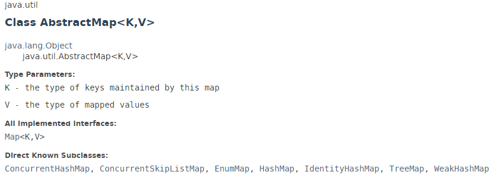
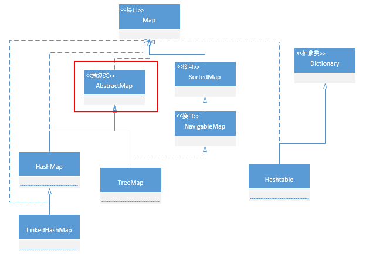

# AbstractMap。



什么是 AbstractMap
AbstractMap 是 Map 接口的的实现类之一，也是 HashMap, TreeMap, ConcurrentHashMap 等类的父类。



AbstractMap 提供了 Map 的基本实现，使得我们以后要实现一个 Map 不用从头开始，只需要继承 AbstractMap, 然后按需求实现/重写对应方法即可。

AbstarctMap 中唯一的抽象方法：

```java
public abstract Set<Entry<K,V>> entrySet();
```

当我们要实现一个 `不可变的 Map 时`，只需要继承这个类，然后实现 entrySet() 方法，这个方法返回一个保存所有 key-value 映射的 set。 通常这个 Set 不支持 add(), remove() 方法，Set 对应的迭代器也不支持 remove() 方法。

`如果想要实现一个 可变的 Map`,我们需要在上述操作外，重写 put() 方法，因为 默认不支持 put 操作：
```java
public V put(K key, V value) {
    throw new UnsupportedOperationException();
}
```

而且 entrySet() 返回的 Set 的迭代器，也得实现 remove() 方法，因为 AbstractMap 中的 删除相关操作都需要调用该迭代器的 remove() 方法。

正如其他集合推荐的那样，比如 AbstractCollection 接口 ，实现类最好提供两种构造方法：

- 一种是不含参数的，返回一个空 map
- 一种是以一个 map 为参数，返回一个和参数内容一样的 map

## AbstractMap 的成员变量
```java
transient volatile Set<K>        keySet;
transient volatile Collection<V> values;
```

有两个成员变量：

- keySet, 保存 map 中所有键的 Set
- values, 保存 map 中所有值的集合

他们都是 transient, volatile, 分别表示`不可序列化`、并发环境下变量的修改能够保证`线程可见性`。

需要注意的是 volatile 只能保证可见性，不能保证原子性，需要保证操作是原子性操作，才能保证使用 volatile 关键字的程序在并发时能够正确执行。

## AbstractMap 的成员方法

AbstractMap 中实现了许多方法，实现类会根据自己不同的要求选择性的覆盖一些。

接下来根据看看 AbstractMap 中的方法。

1.添加
```java
public V put(K key, V value) {
    throw new UnsupportedOperationException();
}

public void putAll(Map<? extends K, ? extends V> m) {
    for (Map.Entry<? extends K, ? extends V> e : m.entrySet())
        put(e.getKey(), e.getValue());
}
```

可以看到默认是不支持添加操作的，实现类需要重写 put() 方法。

2.删除
```java
public V remove(Object key) {
    //获取保存 Map.Entry 集合的迭代器
    Iterator<Entry<K,V>> i = entrySet().iterator();
    Entry<K,V> correctEntry = null;
    //遍历查找，当某个 Entry 的 key 和 指定 key 一致时结束
    if (key==null) {
        while (correctEntry==null && i.hasNext()) {
            Entry<K,V> e = i.next();
            if (e.getKey()==null)
                correctEntry = e;
        }
    } else {
        while (correctEntry==null && i.hasNext()) {
            Entry<K,V> e = i.next();
            if (key.equals(e.getKey()))
                correctEntry = e;
        }
    }

    //找到了，返回要删除的值
    V oldValue = null;
    if (correctEntry !=null) {
        oldValue = correctEntry.getValue();
        //调用迭代器的 remove 方法
        i.remove();
    }
    return oldValue;
}

//调用 Set.clear() 方法清除
public void clear() {
    entrySet().clear();
}
```

3.获取

```java
//时间复杂度为 O(n)
//许多实现类都重写了这个方法
public V get(Object key) {
    //使用 Set 迭代器进行遍历，根据 key 查找
    Iterator<Entry<K,V>> i = entrySet().iterator();
    if (key==null) {
        while (i.hasNext()) {
            Entry<K,V> e = i.next();
            if (e.getKey()==null)
                return e.getValue();
        }
    } else {
        while (i.hasNext()) {
            Entry<K,V> e = i.next();
            if (key.equals(e.getKey()))
                return e.getValue();
        }
    }
    return null;
}
```

4.查询状态

```java
//是否存在指定的 key
//时间复杂度为 O(n)
//许多实现类都重写了这个方法
public boolean containsKey(Object key) {
    //还是迭代器遍历，查找 key，跟 get() 很像啊
    Iterator<Map.Entry<K,V>> i = entrySet().iterator();
    if (key==null) {
        while (i.hasNext()) {
            Entry<K,V> e = i.next();
            //getKey()
            if (e.getKey()==null)
                return true;
        }
    } else {
        while (i.hasNext()) {
            Entry<K,V> e = i.next();
            if (key.equals(e.getKey()))
                return true;
        }
    }
    return false;
}


//查询是否存在指定的值
public boolean containsValue(Object value) {
    Iterator<Entry<K,V>> i = entrySet().iterator();
    if (value==null) {
        while (i.hasNext()) {
            Entry<K,V> e = i.next();
            //getValue()
            if (e.getValue()==null)
                return true;
        }
    } else {
        while (i.hasNext()) {
            Entry<K,V> e = i.next();
            if (value.equals(e.getValue()))
                return true;
        }
    }
    return false;
}


public int size() {
    //使用 Set.size() 获取元素个数
    return entrySet().size();
}

public boolean isEmpty() {
    return size() == 0;
}
```

5.用于比较的 equals(), hashCode()
```java
//内部用来测试 SimpleEntry, SimpleImmutableEntry 是否相等的方法
private static boolean eq(Object o1, Object o2) {
    return o1 == null ? o2 == null : o1.equals(o2);
}

//判断指定的对象是否和当前 Map 一致
//为什么参数不是泛型而是 对象呢
//据说是创建这个方法时还没有泛型 - -
public boolean equals(Object o) {
    //引用指向同一个对象
    if (o == this)
        return true;

    //必须是 Map 的实现类
    if (!(o instanceof Map))
        return false;
    //强转为 Map
    Map<?,?> m = (Map<?,?>) o;
    //元素个数必须一致
    if (m.size() != size())
        return false;

    try {
        //还是需要一个个遍历，对比
        Iterator<Entry<K,V>> i = entrySet().iterator();
        while (i.hasNext()) {
            //对比每个 Entry 的 key 和 value
            Entry<K,V> e = i.next();
            K key = e.getKey();
            V value = e.getValue();
            if (value == null) {
                //对比 key, value
                if (!(m.get(key)==null && m.containsKey(key)))
                    return false;
            } else {
                if (!value.equals(m.get(key)))
                    return false;
            }
        }
    } catch (ClassCastException unused) {
        return false;
    } catch (NullPointerException unused) {
        return false;
    }

    return true;
}

//整个 map 的 hashCode() 
public int hashCode() {
    int h = 0;
    //是所有 Entry 哈希值的和
    Iterator<Entry<K,V>> i = entrySet().iterator();
    while (i.hasNext())
        h += i.next().hashCode();
    return h;
}
```

6.获取三个主要的视图

- 获取所有的键:
```java
public Set<K> keySet() {
    //如果成员变量 keySet 为 null,创建个空的 AbstractSet
    if (keySet == null) {
        keySet = new AbstractSet<K>() {
            public Iterator<K> iterator() {
                return new Iterator<K>() {
                    private Iterator<Entry<K,V>> i = entrySet().iterator();

                    public boolean hasNext() {
                        return i.hasNext();
                    }

                    public K next() {
                        return i.next().getKey();
                    }

                    public void remove() {
                        i.remove();
                    }
                };
            }

            public int size() {
                return AbstractMap.this.size();
            }

            public boolean isEmpty() {
                return AbstractMap.this.isEmpty();
            }

            public void clear() {
                AbstractMap.this.clear();
            }

            public boolean contains(Object k) {
                return AbstractMap.this.containsKey(k);
            }
        };
    }
    return keySet;
}
```
- 获取所有的值:
```java
public Collection<V> values() {
    if (values == null) {
        //没有就创建个空的 AbstractCollection 返回
        values = new AbstractCollection<V>() {
            public Iterator<V> iterator() {
                return new Iterator<V>() {
                    private Iterator<Entry<K,V>> i = entrySet().iterator();

                    public boolean hasNext() {
                        return i.hasNext();
                    }

                    public V next() {
                        return i.next().getValue();
                    }

                    public void remove() {
                        i.remove();
                    }
                };
            }

            public int size() {
                return AbstractMap.this.size();
            }

            public boolean isEmpty() {
                return AbstractMap.this.isEmpty();
            }

            public void clear() {
                AbstractMap.this.clear();
            }

            public boolean contains(Object v) {
                return AbstractMap.this.containsValue(v);
            }
        };
    }
    return values;
}
```

- 获取所有键值对，需要子类实现：
```java
public abstract Set<Entry<K,V>> entrySet();
```

## AbstractMap 中的内部类

正如 Map 接口 中有内部类 Map.Entry 一样， AbstractMap 也有两个内部类：

- SimpleImmutableEntry, 表示一个不可变的键值对
- SimpleEntry, 表示可变的键值对

### SimpleImmutableEntry，不可变的键值对,实现了 Map.Entry < K,V> 接口：
```java
public static class SimpleImmutableEntry<K,V>
    implements Entry<K,V>, java.io.Serializable
{
    private static final long serialVersionUID = 7138329143949025153L;
    //key-value
    private final K key;
    private final V value;

    //构造函数，传入 key 和 value
    public SimpleImmutableEntry(K key, V value) {
        this.key   = key;
        this.value = value;
    }

    //构造函数2，传入一个 Entry，赋值给本地的 key 和 value
    public SimpleImmutableEntry(Entry<? extends K, ? extends V> entry) {
        this.key   = entry.getKey();
        this.value = entry.getValue();
    }

    //返回 键
    public K getKey() {
        return key;
    }

    //返回 值
    public V getValue() {
        return value;
    }

    //修改值，不可修改的 Entry 默认不支持这个操作
    public V setValue(V value) {
        throw new UnsupportedOperationException();
    }

    //比较指定 Entry 和本地是否相等
    //要求顺序，key-value 必须全相等
    //只要是 Map 的实现类即可，不同实现也可以相等
    public boolean equals(Object o) {
        if (!(o instanceof Map.Entry))
            return false;
        Map.Entry<?,?> e = (Map.Entry<?,?>)o;
        return eq(key, e.getKey()) && eq(value, e.getValue());
    }

    //哈希值
    //是键的哈希与值的哈希的 异或
    public int hashCode() {
        return (key   == null ? 0 :   key.hashCode()) ^
               (value == null ? 0 : value.hashCode());
    }

    //返回一个 String
    public String toString() {
        return key + "=" + value;
    }

}
```

### SimpleEntry, 可变的键值对:
```java
public static class SimpleEntry<K,V>
    implements Entry<K,V>, java.io.Serializable
{
    private static final long serialVersionUID = -8499721149061103585L;

    private final K key;
    private V value;

    public SimpleEntry(K key, V value) {
        this.key   = key;
        this.value = value;
    }

    public SimpleEntry(Entry<? extends K, ? extends V> entry) {
        this.key   = entry.getKey();
        this.value = entry.getValue();
    }

    public K getKey() {
        return key;
    }

    public V getValue() {
        return value;
    }

    //支持 修改值
    public V setValue(V value) {
        V oldValue = this.value;
        this.value = value;
        return oldValue;
    }

    public boolean equals(Object o) {
        if (!(o instanceof Map.Entry))
            return false;
        Map.Entry<?,?> e = (Map.Entry<?,?>)o;
        return eq(key, e.getKey()) && eq(value, e.getValue());
    }

    public int hashCode() {
        return (key   == null ? 0 :   key.hashCode()) ^
               (value == null ? 0 : value.hashCode());
    }

    public String toString() {
        return key + "=" + value;
    }

}
```

SimpleEntry 与 SimpleImmutableEntry 唯一的区别就是支持 setValue() 操作。

## 总结

和 AbstractCollection 接口，AbstractList 接口 作用相似， AbstractMap 是一个基础实现类，实现了 Map 的主要方法，默认不支持修改。

常用的几种 Map, 比如 HashMap, TreeMap, LinkedHashMap 都继承自它。

Thanks
https://docs.oracle.com/javase/8/docs/api/java/util/AbstractMap.html

