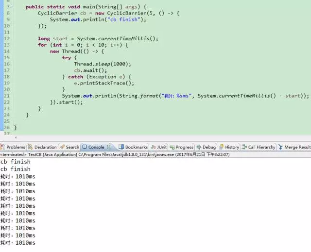

昨天我讲了倒计时器CountDownLatch的应用，它是阻塞线程直到计时器归0的一种等待方式。今天讲的这个循环栅栏CyclicBarrier与倒计时器非常类似，但它比倒时器更加强大且稍微复杂，它也是并发控制中非常实用的工具。

循环栅栏CyclicBarrier，从英语字义可以理解为它是可以循环利用的，且栅栏是用来阻止线程在栅栏外等待的，它同样是阻止线程等待，它和CountDownLatch倒底有什么区别呢？

给你出道题，5个线程同时执行，当每个线程都执行了某段代码后再继续往下执行，如果5个线程未到齐，否则其他线程一直等待。

从上面的题目，我们来看下面的例子，理解什么是循环栅栏。

首先CyclicBarrier构造方法接受5个线程数和线程聚齐时的回调线程。什么意思呢？就是当5个线程都调用了await()方法，这5个线程才继续往下执行，执行前先运行到齐时的回调线程。

从例子输出的结果可以看出cb finish先运行的，说明到齐运行了回调线程，再输出了每个线程的耗时，我们控制10个线程来阻塞等待，而循环栅栏只有5个，说明它是可以循环利用的，每到齐5个线程阻塞的线程就继续执行。

需要注意的await方法会抛出异常，一个是中断异常InterruptedException，即是其他线程中断了这个线程，另外一个是BrokenBarrierException，如果1个线程被打断出现InterruptedException，其他等待在循环栅栏外面的线程就会出现BrokenBarrierException。因为一个线程被打断了，即打破了循环栅栏的完整性，导致线程不能到齐其他线程永远不能继续执行，这个异常也就避免了线程永远等待的情况。

希望对你有用，有什么问题也欢迎到下面留言，文章所示代码请加下面的QQ群文件下载。