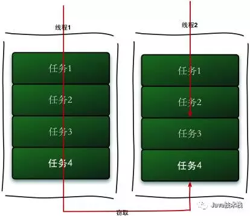

Fork/Join是什么？

> MissionLee : 这里加上我的一些对 ForkJoin的阅读解析

- 首先是基础类 ForkJoinTask
  - 有两个子类
    - RecursiveAction 无返回的任务
    - RecursiveTask 又返回的任务
  - fork() : 把任务放入当前线程所处的pool里面。

```java
   /**
     * Arranges to asynchronously execute this task in the pool the
     * current task is running in, if applicable, or using the {@link
     * ForkJoinPool#commonPool()} if not {@link #inForkJoinPool}.  While
     * it is not necessarily enforced, it is a usage error to fork a
     * task more than once unless it has completed and been
     * reinitialized.  Subsequent modifications to the state of this
     * task or any data it operates on are not necessarily
     * consistently observable by any thread other than the one
     * executing it unless preceded by a call to {@link #join} or
     * related methods, or a call to {@link #isDone} returning {@code
     * true}.
     * 
     * @return {@code this}, to simplify usage
     */
    public final ForkJoinTask<V> fork() {
        Thread t;
        if ((t = Thread.currentThread()) instanceof ForkJoinWorkerThread)
            ((ForkJoinWorkerThread)t).workQueue.push(this);
        else
            ForkJoinPool.common.externalPush(this);
        return this;
        // 如果 当前线程 是一个 ForkJoinWorkerTherad 的话，
        // 就在当前线程的工作队列中加入 
        // 否则把这个任务推到 ForkJoinPool 里面
    }

    /**
     * Returns the result of the computation when it {@link #isDone is
     * done}.  This method differs from {@link #get()} in that
     * abnormal completion results in {@code RuntimeException} or
     * {@code Error}, not {@code ExecutionException}, and that
     * interrupts of the calling thread do <em>not</em> cause the
     * method to abruptly return by throwing {@code
     * InterruptedException}.
     *
     * @return the computed result
     */
    public final V join() {
        int s;
        if ((s = doJoin() & DONE_MASK) != NORMAL)
            reportException(s);
        return getRawResult();
        // 计算完成后返回结果
        
        // 这个方法与 get 不同在于： 如果异常（运行时异常或者报错，不包括执行异常），这些中断不会造成方法抛出异常
    }

    /**
     * Waits if necessary for the computation to complete, and then
     * retrieves its result.
     *
     * @return the computed result
     * @throws CancellationException if the computation was cancelled
     * @throws ExecutionException if the computation threw an
     * exception
     * @throws InterruptedException if the current thread is not a
     * member of a ForkJoinPool and was interrupted while waiting
     */
    public final V get() throws InterruptedException, ExecutionException {
        int s = (Thread.currentThread() instanceof ForkJoinWorkerThread) ?
            doJoin() : externalInterruptibleAwaitDone();
        Throwable ex;
        if ((s &= DONE_MASK) == CANCELLED)
            throw new CancellationException();
        if (s == EXCEPTIONAL && (ex = getThrowableException()) != null)
            throw new ExecutionException(ex);
        return getRawResult();
    }
// get 还有一些重载

    /**
     * Commences performing this task, awaits its completion if
     * necessary, and returns its result, or throws an (unchecked)
     * {@code RuntimeException} or {@code Error} if the underlying
     * computation did so.
     *
     * @return the computed result
     */
    public final V invoke() {
        int s;
        if ((s = doInvoke() & DONE_MASK) != NORMAL)
            reportException(s);
        return getRawResult();
        // 开始执行这项任务，如果需要，等待其完成
        // 1. 返回结果 2. 抛出RuntimeException 或者 报错
    }

```


Fork/Join框架是Java7提供的并行执行任务框架，思想是将大任务分解成小任务，然后小任务又可以继续分解，然后每个小任务分别计算出结果再合并起来，最后将汇总的结果作为大任务结果。其思想和MapReduce的思想非常类似。对于任务的分割，要求各个子任务之间相互独立，能够并行独立地执行任务，互相之间不影响。

**Fork/Join的运行流程图如下：**


我们可以通过Fork/Join单词字面上的意思去理解这个框架。Fork是叉子分叉的意思，即将大任务分解成并行的小任务，Join是连接结合的意思，即将所有并行的小任务的执行结果汇总起来。


#### 工作窃取算法

ForkJoin采用了工作窃取（work-stealing）算法，若一个工作线程的任务队列为空没有任务执行时，便从其他工作线程中获取任务主动执行。为了实现工作窃取，在工作线程中维护了双端队列，窃取任务线程从队尾获取任务，被窃取任务线程从队头获取任务。这种机制充分利用线程进行并行计算，减少了线程竞争。但是当队列中只存在一个任务了时，两个线程去取反而会造成资源浪费。

**工作窃取的运行流程图如下：**



#### Fork/Join核心类

Fork/Join框架主要由子任务、任务调度两部分组成，类层次图如下。


- **ForkJoinPool**

ForkJoinPool是ForkJoin框架中的任务调度器，和ThreadPoolExecutor一样实现了自己的线程池，提供了三种调度子任务的方法：

1. execute：异步执行指定任务，无返回结果；
2. invoke、invokeAll：异步执行指定任务，等待完成才返回结果；
3. submit：异步执行指定任务，并立即返回一个Future对象；

- **ForkJoinTask**

Fork/Join框架中的实际的执行任务类，有以下两种实现，一般继承这两种实现类即可。

1. RecursiveAction：用于无结果返回的子任务；
2. RecursiveTask：用于有结果返回的子任务；

#### Fork/Join框架实战


下面实现一个Fork/Join小例子，从1+2+...10亿，每个任务只能处理1000个数相加，超过1000个的自动分解成小任务并行处理；并展示了通过不使用Fork/Join和使用时的时间损耗对比。

```java
import java.util.concurrent.ForkJoinPool;
import java.util.concurrent.RecursiveTask;
public class ForkJoinTask extends RecursiveTask<Long> {    
    private static final long MAX = 1000000000L;    
    private static final long THRESHOLD = 1000L;    
    private long start;    
    private long end;    
    public ForkJoinTask(long start, long end) {        
        this.start = start;        
        this.end = end;    
    }    
    public static void main(String[] args) {        
        test();        
        System.out.println("--------------------");        
        testForkJoin();    
    }    
    private static void test() {        
        System.out.println("test");        
        long start = System.currentTimeMillis();        
        Long sum = 0L;        
        for (long i = 0L; i <= MAX; i++) {            
            sum += i;        
        }        
        System.out.println(sum);        
        System.out.println(System.currentTimeMillis() - start + "ms");    
    }    
    private static void testForkJoin() {        
        System.out.println("testForkJoin");        
        long start = System.currentTimeMillis();        
        ForkJoinPool forkJoinPool = new ForkJoinPool();        
        Long sum = forkJoinPool.invoke(new ForkJoinTask(1, MAX));        
        System.out.println(sum);        
        System.out.println(System.currentTimeMillis() - start + "ms");    
    }    
    @Override    
    protected Long compute() {        
        long sum = 0;        
        if (end - start <= THRESHOLD) {            
            for (long i = start; i <= end; i++) {                
                sum += i;            
            }            
            return sum;        
        } else {            
            long mid = (start + end) / 2;            
            ForkJoinTask task1 = new ForkJoinTask(start, mid);            
            task1.fork();            
            ForkJoinTask task2 = new ForkJoinTask(mid + 1, end);            
            task2.fork();            
            return task1.join() + task2.join();        
        }    
    }
}
```

这里需要计算结果，所以任务继承的是RecursiveTask类。ForkJoinTask需要实现compute方法，在这个方法里首先需要判断任务是否小于等于阈值1000，如果是就直接执行任务。否则分割成两个子任务，每个子任务在调用fork方法时，又会进入compute方法，看看当前子任务是否需要继续分割成孙任务，如果不需要继续分割，则执行当前子任务并返回结果。使用join方法会阻塞并等待子任务执行完并得到其结果。

程序输出：

```
test5000000005000000004992ms
--------------------testForkJoin500000000500000000508ms
```

从结果看出，并行的时间损耗明显要少于串行的，这就是并行任务的好处。

尽管如此，在使用Fork/Join时也得注意，不要盲目使用。

1. 如果任务拆解的很深，系统内的线程数量堆积，导致系统性能性能严重下降；
2. 如果函数的调用栈很深，会导致栈内存溢出；