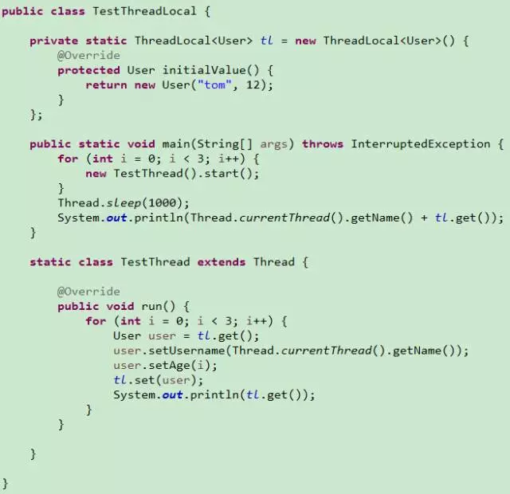

> **什么是ThreadLocal**

可以理解成线程本地变量，传统的线程对一个变量操作时操作的是同一个对象，也存在线程安全的问题。

ThreadLocal是一个变量的本地副本，线程对变量的操作不会影响其他线程。

首先看看ThreadLocal的类结构

其中可重写的方法有以下几个

initialValue()：ThreadLocal初始化的值，新建ThreadLocal的一般要重写给个初始的值。

get()：获取当前线程变量的副本值。

set(T value)：设置、更新当前线程上的变量副本值。

remove()：移除当前线程上的变量副本。

> **ThreadLocal使用**

新建ThreadLocal，类型为User，并初始化为tom,12岁，启动3个线程，每个线程循环3次，休眠1少，主线程再输出。

输出结果如下

从结果可见每个线程使用的是各自线程的变量副本，并没有影响其他线程和主线程，实现了线程隔离的效果。

> **使用场景**

一般用来解决数据库连接、用户session管理等。

> **内存泄露问题**

如果线程的执行周期过长可能导致内存泄露的风险，虽然线程执行完后会ThreadLocal也会随着销毁，但最好使用完后加上remove这样会加快内存的释放，一般来说线程周期不长是不太会引起内存泄露的。还有如果定义了ThreadLocal又不用也有问题，因为每次ThreadLocal的get/set/remove操作都会清理无效的key加快内存释放。ThreadLocal应用比较广泛，如果不是滥用，利是大于憋的。