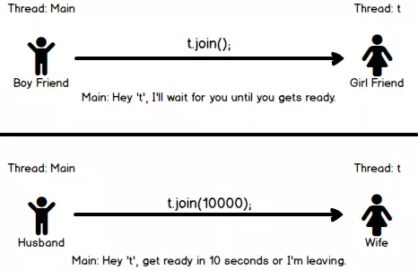

------


## join()

join()是线程类 `Thread`的方法，官方的说明是：

> Waits for this thread to die.

等待这个线程结束，也就是说当前线程等待这个线程结束后再继续执行，下面来看这个示例就明白了。

## 示例

```
public static void main(String[] args) throws Exception {    System.out.println("start");    Thread t = new Thread(() -> {        for (int i = 0; i < 5; i++) {            System.out.println(i);            try {                Thread.sleep(500);            } catch (InterruptedException e) {                e.printStackTrace();            }        }    });    t.start();    t.join();    System.out.println("end");}
```

结果输出：

```
start01234end
```

线程t开始后，接着加入t.join()方法，t线程里面程序在主线程end输出之前全部执行完了，说明t.join()阻塞了主线程直到t线程执行完毕。

如果没有t.join()，end可能会在0~5之间输出。

## join()原理

下面是join()的源码：

```java
public final synchronized void join(long millis)    throws InterruptedException {    
    long base = System.currentTimeMillis();    
    long now = 0;    
    if (millis < 0) {        
        throw new IllegalArgumentException("timeout value is negative");    
    }    
    if (millis == 0) {        
        while (isAlive()) {            
            wait(0);        
        }    
    } else {        
        while (isAlive()) {            
            long delay = millis - now;            
            if (delay <= 0) {                
                break;            
            }            
            wait(delay);            
            now = System.currentTimeMillis() - base;        
        }    
    }
}
```

可以看出它是利用wait方法来实现的，上面的例子当main方法主线程调用线程t的时候，main方法获取到了t的对象锁，而t调用自身wait方法进行阻塞，只要当t结束或者到时间后才会退出，接着唤醒主线程继续执行。millis为主线程等待t线程最长执行多久，0为永久直到t线程执行结束。