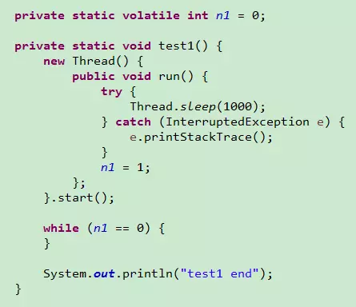
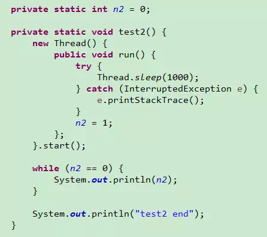
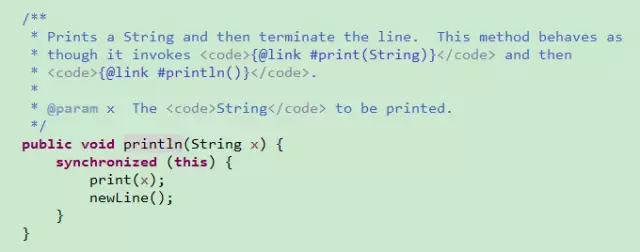
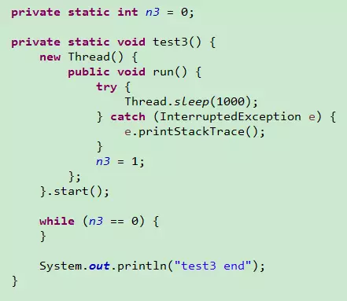

之前介绍过可见性的特性，最近做测试的时候发现了一个很诡异的问题，下面看看这三个例子。

test1：

test1这个例子加了volatile，所以程序正确退出输出test1 end

test2：

test2这个例子没有加volatile，程序也正常退出并输出一堆0并输出了test2 end，这是为什么呢？没有加volatile为什么也有可见性？看起来是很诡异的问题，问题是在while里面加了一行System..输出问题，打开源码看println方法里面加了synchronized同步块，正是因为这个同步块保证了里面变量x的可见性，这个诡异的问题也就解开了。

test3：

test3这个例子即没加volatile，也没有在while里面加System..输出语句，所以线程对变量n3的修改对主线程不可见，程序一直循环，没有输出结果。